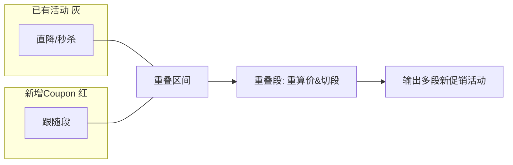
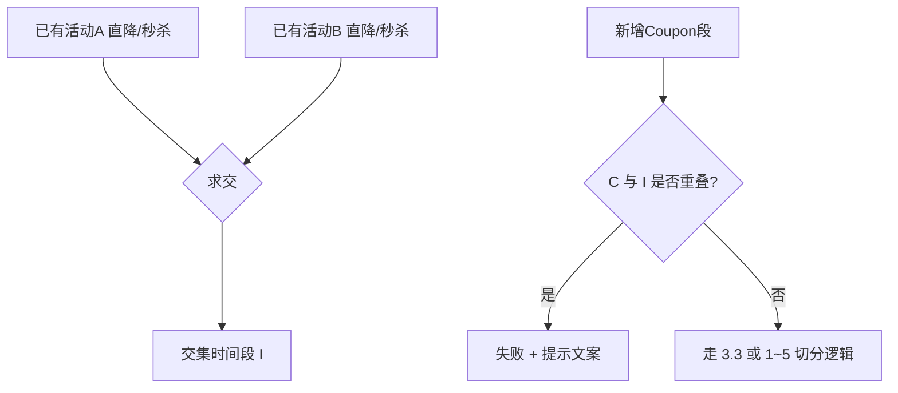
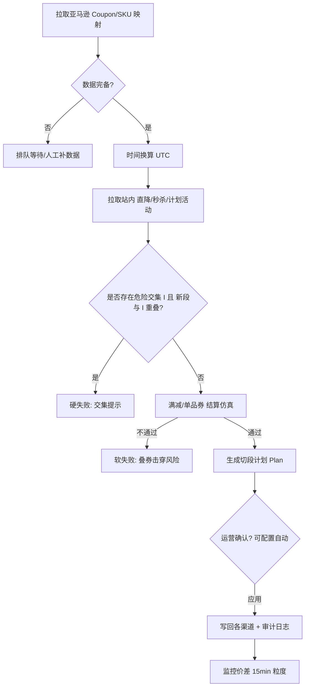
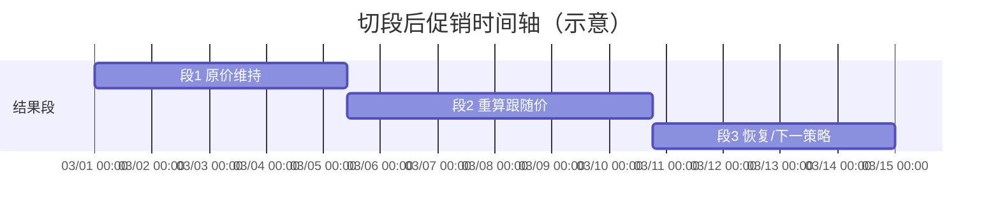

# 亚马逊 Coupon → 独立站（UK/EU/官网/APP）自动跟随：完整解决方案

> 目的：在**不叠加、不击穿底价**的前提下，使独立站「原价 + Coupon」的**到手价**与亚马逊「划线价 − Coupon」一致；本文在你给出的白板规则基础上做**定义收口、场景补全与流程固化**，便于产品、研发、运营对齐。

---

## 一、背景与目标（摘要）

| 维度 | 说明 |
|------|------|
| 业务 | 独立站（Shopify）、官网、APP 需与亚马逊成交价格一致 |
| 亚马逊表达 | 成交价 = **划线价（List/Strikethrough）** − **Coupon 面额** |
| 独立站表达 | **同原价（划线价）** + **等额 Coupon**，保证到手价一致 |
| 立项约定 | 系统应支持自动跟随 Coupon；减少人工创建/关闭 |
| 核心风险 | 时间差导致「直降/Coupon/秒杀」**叠加**；风控若不算 Coupon 会**误报/漏报** |

---

## 二、关键定义（必须先统一，否则规则无法落地）

### 2.1 「已有活动」范围（参与时间冲突与交集判定的活动）

以下类型视为**已有活动**（参与重叠切分、交集失败判定、进行中/已过期冲突判定）：

- **直降类**：划线价直降、自动跟价生成的直降等
- **秒杀类**：含明确秒杀时段的促销

**不视为「已有活动」**（**不参与**「活动间交集」失败模型；可与新 Coupon 跟随时**并行存在**，但需满足成交价不乱价）：

- **单品 Coupon**（站内自身的 Coupon 促销形态）
- **满赠 / 满减**（购物车级或门槛级，非单品直降/秒杀）

> 说明：新 Coupon 跟随在独立站侧会生成 **直降/划线价类** 表达（你文档中的「生成直降活动」）。它与「单品 Coupon / 满减」在**形态上可并存**，但系统必须在**成交价口径**上验算，避免「直降后价再叠券」导致击穿或低于亚马逊到手价（见 **§5.3**）。

### 2.2 时间模型

- 所有活动统一映射到 **UTC 存库 + 渠道本地时区展示**；比较区间时以**同一时区**换算后再判定。
- **区间重叠判定（建议默认）**：采用**半开区间** `[start, end)`，避免「结束时刻=另一开始时刻」被算作重叠；若业务坚持「首尾相接算重叠」，需在配置层二选一并全链路一致。

### 2.3 价格口径

- **原价 / 划线价**：与亚马逊对齐的展示划线价（同一基准 SKU/同一价格源版本）。
- **目标到手价**：\(P_{amz} = 划线价 - Coupon_{amz}\)。
- **独立站验算**：对用户在结算路径上，所有可自动生效的折扣（直降、可叠加券、满减门槛满足时）按**约定叠放顺序**计算，确保 \(\le\) 目标到手价的约束满足（见 §5）。

---

## 三、与你白板 seven 场景的对齐（图示化）

下列示意图与飞书白板一致：灰线=已有直降/秒杀；红线=本次新增 Coupon 跟随所对应的促销区间（在站内多以直降表达）。

### 3.1 场景 1～5：与单段已有活动重叠 → **切分 + 再生效**

**原则**：在重叠时间段内，按「新成交价」重算（你描述的：重新生成活动、计算价格、调整时间），形成**多段促销时间轴**。

**典型几何关系（与大图一致）**

1. 部分重叠（先开后关交错）  
2. 部分重叠（另一方向交错）  
3. Coupon 完全被包住  
4. Coupon 完全包住  
5. Coupon 横夸两段已有活动（左右各切一段）

> 实现侧要点：**切口闭合**、**无断档重叠**、**每段仅一种成交口径**；生成后提示运营关注时段变化（你写的「先取消平台活动再生成新跟随」可作为**运营 SOP**，系统侧用「预演 diff + 二次确认」承接）。

### 3.2 场景 6：**失败**——新 Coupon 与「已有活动交集」再相交

当存在**两段或以上已有活动（直降/秒杀）**时间交集 \(I = A \cap B\)，且新 Coupon 段 \(C\) 满足 \(C \cap I \neq \varnothing\)：

- **结果**：**创建失败（硬拦截）**
- **提示**：`当前新生成的促销与已有活动的交集部分有重合`

### 3.3 场景 7：**成功**——有交集 \(I\)，但 Coupon 与之不相交

- **结果**：允许继续按 1～5 的规则与各自活动做切段重算  
- **提示**：可做「信息级」说明：未触碰危险交集带

---

## 四、对你「1～7 条文字规则」的优化与补全

### 4.1 规则 1～2（与直降/秒杀重叠）

**优化建议**：

- 把动作拆成两步：**预演（Plan）** / **执行（Apply）**。预演输出：切段列表、每段价格、每段开始结束、是否触碰底价、是否触碰活动交集。
- 「**先取消平台活动**」建议改成：  
  - **系统**：自动生成待发布变更；  
  - **平台（Shopify 等）**：按集成能力执行 archive/end；若 API 不能原子改段，则**分段创建 + 明确回滚点**。

### 4.2 规则 3～4（与单品 Coupon / 满减重叠）

你原意：**已有单品 Coupon / 满减不变**；新 Coupon 生成**直降类**表达。

**需要补全的风险点（否则仍可能击穿）**：

1. **叠放顺序**：若结账路径是「直降价 × 再叠满减」，可能低于亚马逊仅 Coupon 的到手价。  
   - **补规则**：跟随生成后强制做一次 **结算仿真**：在默认券、默认门槛下是否**低于** \(P_{amz}\) 或 **baseline**。若会，进入 **拦截 / 要求调整满减门槛 / 临时禁用满减 SKU 维度开关**（按你们治理能力选档）。

2. **单品 Coupon 若与「跟随直降」作用于同一 SKU**：要明确**是否允许双券**。若不允许，需要「新跟随」覆盖展示与结算优先级；若允许，必须写入 **不可叠加白名单**。

### 4.3 规则 5（交集失败）

**补全场景**：

- **三者及以上**直降/秒杀同时有 pairwise 交集时，\(I\) 可能为多个区间的并集：应定义为  
  \[
  I = \bigcup_{k,l} (A_k \cap A_l)
  \]  
  其中 \(A_k\) 为各直降/秒杀区间（工程上可用区间合并简化）。

### 4.4 规则 6（与进行中、已过期活动有交集即失败）

**这是强约束，但需要澄清「已过期」的业务目的**，否则容易误杀：

| 细分 | 建议 |
|------|------|
| **进行中** | 若与时间轴重叠，本质是规则 1～5 可处理的「再生」；若你坚持失败，需定义：仅当**同类型且同价源**才失败？否则运营无法改价。**建议改为**：进行中 → **走切段重算**；若平台不允许并表，才失败并给替代 SOP。 |
| **已过期** | 技术上区间不与未来 Coupon 重叠；若指「历史记录」仍参与判定，会造成无意义失败。**建议**：**已过期不参与重叠**；仅 **已计划未开始（scheduled）** + **进行中**参与。 |

> 若你保留「进行中也不能叠」是为平台 API 限制，请把 **失败码细分**（不可变价 / 活动锁 / 库存锁），不要统一成一句话失败。

### 4.5 规则 7（Coupon 已进行中，是否再创建？）

**推荐（默认策略）**：

| 情况 | 行为 |
|------|------|
| 亚马逊 Coupon **已在生效**且独立站尚未跟随 | **需要创建/补齐**：从 **`max(当前时间, Coupon开始时间)`** 到 **`Coupon结束时间`** 生成对应促销；若开始时间已过去，**禁止**把开始时间写成过去去「追历史成交价」（除非有合规审计与价保例外流程）。 |
| 独立站**已存在**等价跟随 | **幂等**：检测到同 SKU、同目标价、同时间段 → **不重复创建**，仅刷新状态。 |
| Coupon **面额/结束时间变更** | 走 **增量 diff**：结束时间缩短则截断；面额变化则重算切段；必要时回收旧券实例。 |

**结论**：**要创建**；时间范围是 **「当前时刻起生效的剩余区间」**（与亚马逊仍有效的区间对齐），而不是「从零重演历史」。

---

## 五、必须把「不叠加、不击穿」算清楚的工程规则

### 5.1 叠加定义表

| 组合 | 是否允许同时生效 | 处理 |
|------|------------------|------|
| 直降 follow × 直降/秒杀（已有活动） | 以切分解决 | §3.1 |
| 直降 follow × 满减（可能触发） | 允许但要验算 | §5.3 |
| 直降 follow × 单品 Coupon | 默认不建议叠加 | 需配置：**二选一 or 验算通过才允许** |
| 秒杀 × 秒杀 ∩ 交集 | 禁止新 Coupon 触碰交 | §3.2 |

### 5.2 价格计算（示意）

记：

- \(L\)：对齐后划线价  
- \(c_{new}\)：本次亚马逊 Coupon（绝对额或比例，统一换算成 absolute）  
- 目标 \(P = L - c_{new}\)

对重叠段，生成**唯一有效直降价**使展示成交（含税/不含税与亚马逊口径一致）等于 \(P\)。

### 5.3 结算仿真（防击穿）

对每个 SKU，在跟随应用前计算：

\[
P_{checkout} = f(\text{直降}, \text{允许叠加的券}, \text{满减规则}, \text{会员价/品类折扣})
\]

要求：

1. \(P_{checkout} \ge baseline\_price\)（或你们定义的底价规则）  
2. \(|P_{checkout} - P_{amz}|\) 在容差 \(\epsilon\) 内（货币取整规则写死）

不满足 → **拦截**或 **降级为仅展示不启用**（按风险承受选择）。

---

## 六、建议保留的「端到端流程」（给业务看图）

---

## 七、抓取/规划类痛点（与规则层衔接）

| 问题 | 方案层建议 |
|------|------------|
| 只能抓近 ~7 天 | **分层**：短期自动；长期用运营排期表 + 「到时再拉」补全；或对接内部促销日历 |
| 亚马逊不提前 1.5 月 | 独立站活动用 **TBD 占位 + 临近开窗** 模式；或 **仅提前 N 天自动生成** |
| 时区差 | 统一 UTC；展示按渠道；**夏令时**单测 |

---

## 八、验收清单（业务可直接打勾）

1. SKU 级：到手价与亚马逊一致（容差定义写清楚）。  
2. 场景 1～5：任意交错几何关系切段正确，无双重成交。  
3. 场景 6：必拦截，文案一致。  
4. 场景 7：可放行且验算通过。  
5. 与单品 Coupon/满减：**不会静默击穿**。  
6. Coupon 变更：缩窗/改额可增量更新。  
7. 幂等：重复任务不堆券。  
8. 审计：每次变更可追踪到亚马逊 coupon id / 版本号。

---

## 九、附图：时间轴合并（多段输出示意）

---

## 十、仍需业务拍板的 4 个产品决策（一次性结论）

1. **区间端点**相接是否算重叠？（建议半开区间 `[start,end)`）  
2. **进行中活动**：统一走切段，还是部分渠道 API 失败时允许「仅中心价更新」？  
3. **单品 Coupon 与高亮直降**：允许并存还是强制互斥？默认建议 **互斥或强仿真**。  
4. **与亚马逊不一致时的优先级**：保毛利（抬高） vs 保一致（跟价） vs 暂停售卖？

---

**文档版本**：v1.0（与飞书白板 + 你的文字规则对齐并扩展）  
**路径**：`文件夹/Amazon-Coupon独立站跟随-完整方案.md`
