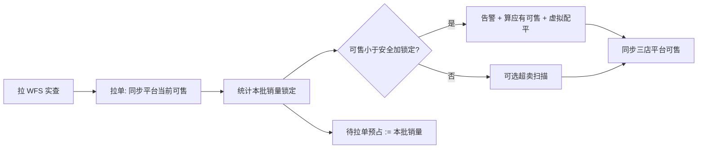

# WFS 共享库存与自动借货 · 方案 v2（易懂版）

| 属性 | 内容 |
|------|------|
| 文档版本 | **v2.2**（全文使用中文术语，不用字母简写） |
| 编写日期 | 2026-05-22 |
| 文档定位 | **业务与产品可读**；约束、接口、验收见文末附录；实现细节见 [详细方案 v1](./WFS共享库存与自动借货-详细方案.md) |
| 图形版（推荐） | [WFS共享库存与自动借货-方案说明-v2.html](./WFS共享库存与自动借货-方案说明-v2.html) |

---

## 1. 我们要解决什么问题？

**现状**：沃尔玛 WFS 仓里，同一 8 位 SKU 的货，被 **WM 3P-US、Best Buy 3P-US、Lowes 3P-US** 三家一起卖。

**痛点**：

- 实物只有 **一份**，但各店平台各显示各的「可售」，容易 **超卖** 或 **某店长期缺货**。
- BBY / Lowes 订单 **不是实时进 ERP**，约 **每 10 分钟拉一批**；拉单前系统 **不知道** 平台又卖了多少。
- 需要：**自动把「能卖的总数」按规则分给三店**，某店低于保底时 **虚拟借货（只改数字）**，并 **回写平台可售**。

**本方案不做**：WFS 仓间真调拨、库存调整单、替代人工借货模块的新建。

---

## 2. 先记住四句话

| # | 说法 | 含义 |
|---|------|------|
| ① | **实物一份** | 只信 WFS 接口查到的总数，不信三店库存相加 |
| ② | **三店卖的是份额** | 各店「当前可售库存」是逻辑数字，不是仓库里拆了三堆 |
| ③ | **先锁定、再分池** | 已卖出/占住的件数要从 WFS 实查里先扣掉，再算还能分多少 |
| ④ | **不够就虚拟配平** | 谁「当前可售 &lt; 安全库存 + 本批销量锁定」，就从富余店借数字 |

另：**同一 SKU 的 WFS 仓共享** 与 **谷仓共享** 只能开一种（配置互斥）。

---

## 3. 一张图：货在哪、数在哪

```text
                    ┌─────────────────────────────┐
                    │   WFS 仓库（实物只有这里）    │
                    │   WFS 实查库存 = 200 件      │
                    └──────────────┬──────────────┘
                                   │
         先扣「三店订单锁定合计」= 30
                                   ▼
                    ┌─────────────────────────────┐
                    │ 可分配基数 = 170             │
                    └──────────────┬──────────────┘
                                   │
         再扣「三店安全库存合计」= 100
                                   ▼
                    ┌─────────────────────────────┐
                    │ 可分配池 = 70（按比例分）     │
                    └──────────────┬──────────────┘
           ┌───────────────────────┼───────────────────────┐
           ▼                       ▼                       ▼
      WM 应有可售              BBY 应有可售           Lowes 应有可售
   （比例份额+安全+锁定）    （同上）              （同上）
```

**各店两个数要分清**：

| 名称 | 谁 | 干什么用 |
|------|-----|----------|
| **当前可售库存** | 每店 | **平台卖出即减少**；拉单时从店铺同步到 ERP |
| **订单锁定库存** | 每店 | **本 10 分钟销量**；拉单前用 **待拉单预占**（上轮销量）占池 |

---

## 4. 怎么算「各店应该卖多少」？

**输入**：WFS 实查库存、各店当前可售库存、各店安全库存、共享比例、各店锁定（见第 5 章）。

**步骤**（与 HTML 演算表一致）：

1. 汇总三店 **订单锁定库存合计**  
2. **可分配基数** = WFS 实查 − 锁定合计  
3. **可分配池** = 可分配基数 − 三店安全库存之和  
4. **应有可售** = 按共享比例分到的份额 + 本店安全库存 + **本批销量锁定**

**触发自动配平**（已定）：拉单并同步可售后，任一家满足：

> **当前可售库存 &lt; 安全库存 + 本批销量锁定**

→ 群告警 → 一次虚拟配平 → 平台同步为 **应有可售**（小于 1 则停售）。

**业务示例（BBY）**：上轮销量 10；本次拉单 **当前可售 80**、**安全库存 70**、**本批销量锁定 20** → 80 &lt; 70+20=90 → **触发**。

**池耗尽（极端）**：配平后三店仍都不达标 → BBY/Lowes 可售置 0；WM 不置 0；关闭该 SKU 的 WFS 仓共享。

---

## 5. 订单锁定与 10 分钟拉单（已定口径）

### 5.1 平台可售 vs ERP

| 事实 | 说明 |
|------|------|
| 平台 | 顾客下单 **当场** 减少店铺可售 |
| ERP | 约 **每 10 分钟拉单**；读到的 **当前可售已是平台扣过后** 的数，写入 ERP |
| **本批销量锁定** | **本 10 分钟销量**（订单合计，或可售差：上次 100、本次 80 → 销量 20） |

### 5.2 待拉单预占是什么？

**拉单前** ERP 还没有本批订单，但平台可能已在卖。  
**待拉单预占** = **上一轮 10 分钟销量**（与上轮写入的「本批销量锁定」相同）。

| 时段 | 当前可售库存 | 锁定相关 |
|------|--------------|----------|
| 拉单前（盲区） | ERP 可能仍是旧值 | 扣池用 **待拉单预占** |
| **拉单完成** | **同步平台可售** | 写入 **本批销量锁定**；判断 **当前可售 &lt; 安全 + 本批锁定** |
| 本批结束 | 已更新 | **待拉单预占 := 本批销量锁定**，供下一轮 |

**没有** 10:03、10:07 逐笔进 ERP——只有定时拉单知道本批合计。图解见 [HTML v2 §4](./WFS共享库存与自动借货-方案说明-v2.html#s4)。

### 5.3 确认示例（BBY）

| 时点 | 当前可售 | 安全库存 | 本批销量锁定 | 触发？ |
|------|----------|----------|--------------|--------|
| 上轮结束 | 100（上次同步） | 70 | 上轮销量 10（作预占） | — |
| **本次拉单** | **80** | 70 | **20** | **80 &lt; 90 → 是** |

### 5.4 应有与扣池

- **触发**：当前可售库存 &lt; 安全库存 + 本批销量锁定  
- **应有可售**：按共享比例分到的份额 + 安全库存 + 本批销量锁定  
- **扣池**：可分配基数 = WFS 实查 − 三店锁定合计（盲区计入待拉单预占，见 v1 §9）

---

## 6. 系统每次跑任务做什么？



**定时任务（BBY/Lowes）**：拉单 → 更新可售与锁定 → 判断是否触发 → 配平 → 同步；批末刷新待拉单预占。

---

## 7. 和周边能力的关系

| 能力 | 关系 |
|------|------|
| 需求 01 借调消耗追溯 | 本方案配平 **不产生** 调拨单 |
| 需求 02 超卖防控 | 锁定 + 预占 + 风险扫描；可叠加预测 |
| 需求 03 自助借货 | 人工借货保留；本方案是自动虚拟配平 |
| 墨刀「共享库存设置」 | 配置比例、安全、开关 |

---

## 8. 文档导航

| 你想… | 读什么 |
|--------|--------|
| **5 分钟懂逻辑** | 本文 + [HTML v2](./WFS共享库存与自动借货-方案说明-v2.html) |
| **改参数看数字** | HTML v2 §5 演算 |
| **接口 / 表 / 验收** | [详细方案 v1](./WFS共享库存与自动借货-详细方案.md) |

---

## 附录 A · 约束与边界（文字）

1. 参与店：WM / BBY / Lowes 3P-US（8 位 SKU）。  
2. WFS 实查以接口为准；失败不静默配平。  
3. WFS 仓共享与谷仓共享 **二选一**。  
4. 不真调拨。  
5. **触发（已定）**：当前可售 &lt; 安全库存 + 本批销量锁定；应有 = 比例份额 + 安全 + 本批锁定。  
6. 待拉单预占 = 上轮 10 分钟销量。  
7. 禁止按 10:03 等逐笔建账。  
8. 池耗尽：子店置 0，WM 不强制置 0，关 WFS 共享。  
9. 详见 v1 接口、验收、非功能章节。

---

## 附录 B · 术语表（实现对照用，正文不用字母）

| 中文术语 | 说明 |
|----------|------|
| WFS 实查库存 | 接口拉取的实物可用总量 |
| 当前可售库存 | 店铺后台可卖数量，拉单时同步 |
| 安全库存 | 配置的每店底线 |
| 本批销量锁定 | 本 10 分钟拉单统计的销量 |
| 待拉单预占 | 上一轮 10 分钟销量，拉单前占池 |
| 可分配基数 | WFS 实查 − 锁定合计 |
| 可分配池 | 可分配基数 − 安全库存合计 |
| 应有可售 | 配平目标 = 比例份额 + 安全 + 本批锁定 |

---

*本文档为 v2 易懂版；实现字段名可与 v1 技术附录对照。*
