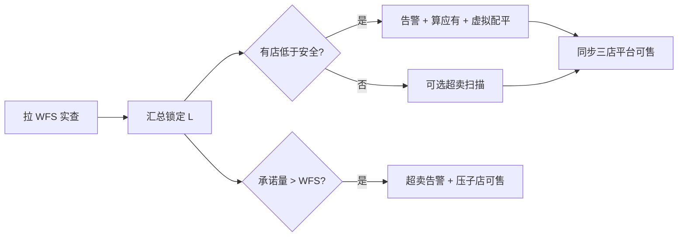

# WFS 共享库存与自动借货 · 方案 v2（易懂版）

| 属性 | 内容 |
|------|------|
| 文档版本 | **v2.0** |
| 编写日期 | 2026-05-22 |
| 文档定位 | **业务与产品可读**；约束、接口、验收见文末附录；实现细节见 [详细方案 v1](./WFS共享库存与自动借货-详细方案.md) |
| 图形版（推荐） | [WFS共享库存与自动借货-方案说明-v2.html](./WFS共享库存与自动借货-方案说明-v2.html) |

---

## 1. 我们要解决什么问题？

**现状**：沃尔玛 WFS 仓里，同一 8 位 SKU 的货，被 **WM 3P-US、Best Buy 3P-US、Lowes 3P-US** 三家一起卖。

**痛点**：

- 实物只有 **一份**，但各店平台各显示各的「可售」，容易 **超卖** 或 **某店长期缺货**。
- BBY / Lowes 订单 **不是实时进 ERP**，约 **每 10 分钟拉一批**；拉单前系统 **不知道** 平台又卖了多少。
- 需要：**自动把「能卖的总数」按规则分给三店**，某店低于保底时 **虚拟借货（只改数字）**，并 **回写平台可售**。

**本方案不做**：WFS 仓间真调拨、库存调整单、替代人工借货模块的新建。

---

## 2. 先记住四句话

| # | 说法 | 含义 |
|---|------|------|
| ① | **实物一份** | 只信 WFS 接口查到的总数，不信三店库存相加 |
| ② | **三店卖的是份额** | 各店「当前可售」是逻辑数字，不是仓库里拆了三堆 |
| ③ | **先锁定、再分池** | 已承诺给订单的件数要从 WFS 实查里先扣掉，再算还能分多少 |
| ④ | **不够就虚拟配平** | 谁低于安全库存，就从富余店「借」数字，不产生调拨单 |

另：**同一 SKU 的 WFS 仓共享** 与 **谷仓共享** 只能开一种（配置互斥）。

---

## 3. 一张图：货在哪、数在哪

```text
                    ┌─────────────────────────────┐
                    │   WFS 仓库（实物只有这里）    │
                    │   接口实查 Q_wfs = 200 件    │
                    └──────────────┬──────────────┘
                                   │
         先扣「三店订单锁定合计」L = 30
                                   ▼
                    ┌─────────────────────────────┐
                    │ 可分配基数 Q_eff = 170       │
                    └──────────────┬──────────────┘
                                   │
         再扣「三店安全库存合计」= 100
                                   ▼
                    ┌─────────────────────────────┐
                    │ 可分配池 P = 70（按比例分）   │
                    └──────────────┬──────────────┘
           ┌───────────────────────┼───────────────────────┐
           ▼                       ▼                       ▼
      WM 应有 ≈ 51           BBY 应有 ≈ 51          Lowes 应有 ≈ 68
   （30%×70+安全30）        （30%×70+安全30）       （40%×70+安全40）
```

**各店两个数要分清**：

| 名称 | 谁 | 干什么用 |
|------|-----|----------|
| **当前可售** | 每店 | 平台展示、新单能不能卖；进 ERP 锁单时会 **减** |
| **订单锁定库存** | 每店 | 已承诺、还没在 WFS 侧完全落地的件数；算池时 **从 Q_wfs 扣** |

---

## 4. 怎么算「各店应该卖多少」？

**输入**：WFS 实查、各店当前可售、各店安全库存、共享比例、各店锁定（见第 5 章）。

**步骤**（与 HTML 演算表一致）：

1. \(L = \sum\) 各店订单锁定库存  
2. \(Q_{eff} = Q_{wfs} - L\)  
3. \(P = Q_{eff} - \sum S_i\)（安全库存之和）  
4. 各店应有：\(T_i = \mathrm{round}(P \times 比例_i) + S_i\)

**触发自动配平**：任意一店 **当前可售 &lt; 安全库存** → 群告警 → 按 \(T_i\) **一次** 虚拟配平 → 三店平台同步为应有（&lt;1 停售）。

**池耗尽（极端）**：配平后 **三店仍都** 低于安全 → BBY/Lowes 可售置 **0**；**WM 不置 0**；该 SKU **关闭 WFS 仓共享**（整 SKU，WM 也不再与子店共享）。需人工恢复。

---

## 5. 订单锁定：为什么有两项、和 10 分钟有什么关系？

### 5.1 两项锁定

| 子项 | 什么时候有 | 含义 |
|------|------------|------|
| **待推 WFS 锁定** | 订单 **已进 ERP**，还没推 WFS 成功 | 真实锁定，按实际件数 |
| **待拉单预占** | **两次拉单之间**，ERP 还看不到新单 | 用 **上一批推 WFS 成功件数** 占位（α=1.0，严格相等） |
| **合计（列表展示）** | 全时 | 待推 + 预占 |

公式：\(L_i = L^{erp}_i + L^{proxy}_i\)

### 5.2 两个时间窗口（BBY / Lowes）

```text
窗口 A（拉单前）     平台在卖，ERP 不知道 → 只能靠「待拉单预占」
        │ 约 10 分钟定时拉单
        ▼
窗口 B（进 ERP～推 WFS）  ERP 已知 → 「待推 WFS 锁定」+ 当前可售减少
        │ 推 WFS 成功
        ▼
     释放待推；批末把「推成功件数」写入下一轮的预占
```

**重要**：没有 10:03、10:07 这种「逐笔进 ERP」——只有 **10:00、10:10** 等 **拉单时刻** 才知道 **本批一共多少件**。

### 5.3 10 分钟里每个时刻（BBY 示例）

| 时刻 | ERP 知道新单吗 | 待推 WFS | 待拉单预占 | 合计 |
|------|----------------|----------|------------|------|
| 09:50～09:59 | 否 | 0 | 25 | 25 |
| 10:00 拉单 | 是（本批 +25） | 25 | 0 | 25 |
| 10:00 推 WFS 成功 | 是 | 0 | 0 | 0 |
| 10:00 批末 | 否（下一窗口） | 0 | 25 | 25 |
| 现在 10:05 | 否 | 0～§7 | 25 | 25～30 |
| 10:10 下次拉单 | 是（新一批合计） | 循环 | 循环 | 循环 |

逐步图解见 [方案说明 v2 HTML · 第 4 章](./WFS共享库存与自动借货-方案说明-v2.html#s4)。

### 5.4 单笔订单一生

```text
进 ERP  →  待推 WFS +N，当前可售 −N
推 WFS 成功  →  待推 WFS −实际成功件数（以回执为准）
取消  →  回滚
```

WM 推单更频，待推锁定常为 0 或很小。

---

## 6. 系统每次跑任务做什么？



**与订单并行**：进 ERP 立即锁；推 WFS 成功立即释；定时任务负责拉单、推 WFS、刷新预占、配平、同步。

---

## 7. 和周边能力的关系

| 能力 | 关系 |
|------|------|
| 需求 01 借调消耗追溯 | 本方案配平 **不产生** 调拨单；消耗仍按订单/WFS 落账 |
| 需求 02 超卖防控 | 本方案提供 **锁定 + 预占 + 风险扫描** 基线；更强预测可叠加 |
| 需求 03 自助借货 | 人工借货保留；本方案是 **自动** 虚拟配平 |
| 墨刀「共享库存设置」 | 配置比例、安全、开关；本方案是运行逻辑 |

---

## 8. 文档导航

| 你想… | 读什么 |
|--------|--------|
| **5 分钟懂逻辑** | 本文 + [HTML v2](./WFS共享库存与自动借货-方案说明-v2.html) |
| **改参数看数字** | HTML v2 §5 演算 |
| **接口 / 表 / 验收** | [详细方案 v1](./WFS共享库存与自动借货-详细方案.md) |
| **拉单延迟专题** | [BBY拉单延迟与超卖优化-同步说明.md](../BBY拉单延迟与超卖优化-同步说明.md) |

---

## 附录 A · 约束与边界（文字）

1. **参与店**：WM / BBY / Lowes 3P-US（8 位生产 SKU）；扩展店需单独评审比例与安全。  
2. **WFS 实查**：以接口为准；拉取失败不静默用旧值配平（按 v1 §17 失败策略）。  
3. **共享二选一**：WFS 仓共享与谷仓共享 **不能同时** 开启同一 SKU。  
4. **不真调拨**：自动配平、借货均为 **逻辑份额**；实物只在 WFS 一处。  
5. **双扣禁止**：\(L\) 已在 \(Q_{eff}\) 中扣除；配平看 **当前可售 vs 安全**，不再对 \(L_i\) 做缺料扣减。  
6. **预占口径**：\(L^{proxy}\) = 上批 **推 WFS 成功** 件数；α=1.0；上批为 0 时见 v1 §23.3.1 冷启动。  
7. **数据可见性**：无 BBY/Lowes 实时订单流时，**禁止** 按逐笔时刻建台账。  
8. **WM 推单**：频率高于 BBY/Lowes 时，WM 锁定通常较小；池耗尽时 **WM 可售不强制置 0**。  
9. **超卖**：10 分钟窗口 **无法 100% 消除**；依赖预占 + 扫描 + 配平 +（可选）需求 02 预测。  
10. **恢复**：池耗尽关共享后 **不自动恢复**，需运营确认补货后手工开共享。  
11. **平台同步**：配平后回写应有；&lt;1 按各平台规则停售。  
12. **权限与审计**：共享开关、比例、安全库存变更需留痕（见 v1 §16）。

---

## 附录 B · 符号速查

| 符号 | 含义 |
|------|------|
| \(Q_{wfs}\) | WFS 实查 |
| \(L_i,\,L\) | 订单锁定（店 / 合计） |
| \(L^{erp},\,L^{proxy}\) | 待推 WFS / 待拉单预占 |
| \(C_i\) | 当前可售 |
| \(S_i\) | 安全库存 |
| \(Q_{eff},\,P\) | 可分配基数 / 可分配池 |
| \(T_i\) | 应有可售 |

---

## 附录 C · 待业务确认

| 项 | 说明 |
|----|------|
| 上批推成功 = 0 | \(L^{proxy}\) 是否严格为 0（不做 EMA） |
| 拉单与推 WFS | 是否同一 cron、间隔分钟数 |
| WM 池耗尽不置 0 | 沃尔玛侧最终展示以平台规则为准 |

---

*本文档为 v2 易懂版；与 v1 详细方案口径一致，冲突时以业务评审纪要为准。*
