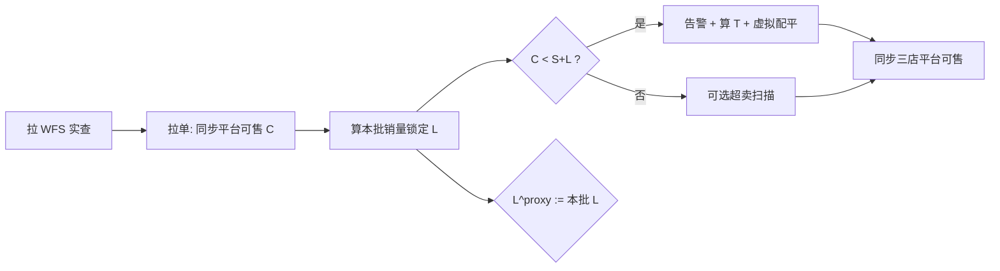

# WFS 共享库存与自动借货 · 方案 v2（易懂版）

| 属性 | 内容 |
|------|------|
| 文档版本 | **v2.1**（2026-05-22 业务确认：触发 \(C<S+L\)、应有含锁定） |
| 编写日期 | 2026-05-22 |
| 文档定位 | **业务与产品可读**；约束、接口、验收见文末附录；实现细节见 [详细方案 v1](./WFS共享库存与自动借货-详细方案.md) |
| 图形版（推荐） | [WFS共享库存与自动借货-方案说明-v2.html](./WFS共享库存与自动借货-方案说明-v2.html) |

---

## 1. 我们要解决什么问题？

**现状**：沃尔玛 WFS 仓里，同一 8 位 SKU 的货，被 **WM 3P-US、Best Buy 3P-US、Lowes 3P-US** 三家一起卖。

**痛点**：

- 实物只有 **一份**，但各店平台各显示各的「可售」，容易 **超卖** 或 **某店长期缺货**。
- BBY / Lowes 订单 **不是实时进 ERP**，约 **每 10 分钟拉一批**；拉单前系统 **不知道** 平台又卖了多少。
- 需要：**自动把「能卖的总数」按规则分给三店**，某店低于保底时 **虚拟借货（只改数字）**，并 **回写平台可售**。

**本方案不做**：WFS 仓间真调拨、库存调整单、替代人工借货模块的新建。

---

## 2. 先记住四句话

| # | 说法 | 含义 |
|---|------|------|
| ① | **实物一份** | 只信 WFS 接口查到的总数，不信三店库存相加 |
| ② | **三店卖的是份额** | 各店「当前可售」是逻辑数字，不是仓库里拆了三堆 |
| ③ | **先锁定、再分池** | 已承诺给订单的件数要从 WFS 实查里先扣掉，再算还能分多少 |
| ④ | **不够就虚拟配平** | 谁低于安全库存，就从富余店「借」数字，不产生调拨单 |

另：**同一 SKU 的 WFS 仓共享** 与 **谷仓共享** 只能开一种（配置互斥）。

---

## 3. 一张图：货在哪、数在哪

```text
                    ┌─────────────────────────────┐
                    │   WFS 仓库（实物只有这里）    │
                    │   接口实查 Q_wfs = 200 件    │
                    └──────────────┬──────────────┘
                                   │
         先扣「三店订单锁定合计」L = 30
                                   ▼
                    ┌─────────────────────────────┐
                    │ 可分配基数 Q_eff = 170       │
                    └──────────────┬──────────────┘
                                   │
         再扣「三店安全库存合计」= 100
                                   ▼
                    ┌─────────────────────────────┐
                    │ 可分配池 P = 70（按比例分）   │
                    └──────────────┬──────────────┘
           ┌───────────────────────┼───────────────────────┐
           ▼                       ▼                       ▼
      WM 应有 ≈ 51           BBY 应有 ≈ 51          Lowes 应有 ≈ 68
   （30%×70+安全30）        （30%×70+安全30）       （40%×70+安全40）
```

**各店两个数要分清**：

| 名称 | 谁 | 干什么用 |
|------|-----|----------|
| **当前可售** | 每店 | **平台卖出即减少**；拉单时从店铺同步到 ERP（已是扣过本段销量后的数） |
| **订单锁定库存** | 每店 | **本 10 分钟销量**（拉单由订单合计或前后可售差得出）；拉单前用上轮销量作 **待拉单预占** |

---

## 4. 怎么算「各店应该卖多少」？

**输入**：WFS 实查、各店当前可售、各店安全库存、共享比例、各店锁定（见第 5 章）。

**步骤**（与 HTML 演算表一致）：

1. \(L = \sum\) 各店订单锁定库存  
2. \(Q_{eff} = Q_{wfs} - L\)  
3. \(P = Q_{eff} - \sum S_i\)（安全库存之和）  
4. 各店应有：\(T_i = \mathrm{round}(P \times 比例_i) + S_i + L_i\)（\(L_i\) = 本批销量锁定，见 §5）

**触发自动配平**（**已定**）：拉单并同步可售后，任一家  
\[
C_i < S_i + L_i
\]
→ 群告警 → **一次** 虚拟配平 → 平台同步为 \(T_i\)（&lt;1 停售）。

**业务示例（BBY）**：上轮销量 10；本次拉单平台可售 **80**、安全 **70**、本批销量锁定 **20** → \(80 < 70+20=90\) → **触发**。

**池耗尽（极端）**：配平后 **三店仍都** 低于安全 → BBY/Lowes 可售置 **0**；**WM 不置 0**；该 SKU **关闭 WFS 仓共享**（整 SKU，WM 也不再与子店共享）。需人工恢复。

---

## 5. 订单锁定与 10 分钟拉单（已定口径）

### 5.1 平台可售 vs ERP

| 事实 | 说明 |
|------|------|
| 平台 | 顾客下单 **当场** 减少店铺可售 |
| ERP | 约 **每 10 分钟拉单**；拉单时读取的 **当前可售已是平台扣过后** 的数，**写入 ERP** |
| 本批锁定 \(L_i\) | **本 10 分钟销量**（拉单订单件数合计，或与上次 ERP 可售差核对，如 100→80 则销量 20） |

### 5.2 待拉单预占是什么？

**拉单前** ERP 还没有本批订单明细，但平台可能已在卖。  
**待拉单预占** \(L^{proxy}_i\) = **上一轮 10 分钟销量**（与上轮拉单写入的 \(L_i\) 相同，α=1.0）。

| 时段 | 当前可售 \(C\) | 锁定 |
|------|----------------|------|
| 拉单前（盲区） | ERP 可能仍是旧值 | 扣池用 \(L^{proxy}\) |
| **拉单完成** | **同步平台可售** | **\(L_i\) = 本批销量**；判断 **\(C_i < S_i + L_i\)** |
| 本批结束 | 已更新 | **\(L^{proxy}_i := L_i\)**，供下一轮盲区 |

**没有** 10:03、10:07 逐笔进 ERP——只有定时拉单知道本批合计。图解见 [HTML v2 §4](./WFS共享库存与自动借货-方案说明-v2.html#s4)。

### 5.3 确认示例（BBY）

| 时点 | 可售 \(C\) | 安全 \(S\) | 锁定 \(L\) | 触发？ |
|------|------------|------------|------------|--------|
| 上轮结束 | 100（上次同步） | 70 | 上轮销量 10（预占） | — |
| **本次拉单** | **80** | 70 | **本批 20** | **80 &lt; 90 → 是** |

### 5.4 应有与扣池

- **触发**：\(C_i < S_i + L_i\)（\(L_i\) = 本批销量锁定）。  
- **应有**：\(T_i = \mathrm{round}(P \times R_i) + S_i + L_i\)。  
- **扣池**：\(Q_{eff} = Q_{wfs} - \sum L_i\)（盲区用 \(L^{proxy}\)，拉单后用本批 \(L_i\) 参与汇总；实现见 v1 §9）。

---

## 6. 系统每次跑任务做什么？



**定时任务（BBY/Lowes）**：拉单 → 更新 \(C\)、\(L\) → 判断是否 **\(C<S+L\)** → 配平 → 同步；批末刷新 **待拉单预占**。

---

## 7. 和周边能力的关系

| 能力 | 关系 |
|------|------|
| 需求 01 借调消耗追溯 | 本方案配平 **不产生** 调拨单；消耗仍按订单/WFS 落账 |
| 需求 02 超卖防控 | 本方案提供 **锁定 + 预占 + 风险扫描** 基线；更强预测可叠加 |
| 需求 03 自助借货 | 人工借货保留；本方案是 **自动** 虚拟配平 |
| 墨刀「共享库存设置」 | 配置比例、安全、开关；本方案是运行逻辑 |

---

## 8. 文档导航

| 你想… | 读什么 |
|--------|--------|
| **5 分钟懂逻辑** | 本文 + [HTML v2](./WFS共享库存与自动借货-方案说明-v2.html) |
| **改参数看数字** | HTML v2 §5 演算 |
| **接口 / 表 / 验收** | [详细方案 v1](./WFS共享库存与自动借货-详细方案.md) |
| **拉单延迟专题** | [BBY拉单延迟与超卖优化-同步说明.md](../BBY拉单延迟与超卖优化-同步说明.md) |

---

## 附录 A · 约束与边界（文字）

1. **参与店**：WM / BBY / Lowes 3P-US（8 位生产 SKU）；扩展店需单独评审比例与安全。  
2. **WFS 实查**：以接口为准；拉取失败不静默用旧值配平（按 v1 §17 失败策略）。  
3. **共享二选一**：WFS 仓共享与谷仓共享 **不能同时** 开启同一 SKU。  
4. **不真调拨**：自动配平、借货均为 **逻辑份额**；实物只在 WFS 一处。  
5. **触发与应有（已定）**：触发 \(C_i < S_i + L_i\)；应有 \(T_i = \mathrm{round}(PR_i)+S_i+L_i\)；\(C\) 以**拉单时平台可售**为准。  
6. **预占口径**：\(L^{proxy}\) = **上轮 10 分钟销量**；本批 \(L_i\) = 拉单统计销量；α=1.0。  
7. **数据可见性**：无 BBY/Lowes 实时订单流时，**禁止** 按逐笔时刻建台账。  
8. **WM 推单**：频率高于 BBY/Lowes 时，WM 锁定通常较小；池耗尽时 **WM 可售不强制置 0**。  
9. **超卖**：10 分钟窗口 **无法 100% 消除**；依赖预占 + 扫描 + 配平 +（可选）需求 02 预测。  
10. **恢复**：池耗尽关共享后 **不自动恢复**，需运营确认补货后手工开共享。  
11. **平台同步**：配平后回写应有；&lt;1 按各平台规则停售。  
12. **权限与审计**：共享开关、比例、安全库存变更需留痕（见 v1 §16）。

---

## 附录 B · 符号速查

| 符号 | 含义 |
|------|------|
| \(Q_{wfs}\) | WFS 实查 |
| \(L_i,\,L\) | 订单锁定（店 / 合计） |
| \(L^{proxy}\) | 待拉单预占（上轮销量） |
| \(C_i\) | 当前可售 |
| \(S_i\) | 安全库存 |
| \(Q_{eff},\,P\) | 可分配基数 / 可分配池 |
| \(T_i\) | 应有可售 |

---

## 附录 C · 待业务确认

| 项 | 说明 |
|----|------|
| 上轮销量 = 0 | \(L^{proxy}\) 是否严格为 0（不做 EMA） |
| 拉单与推 WFS | 是否同一 cron、间隔分钟数 |
| WM 池耗尽不置 0 | 沃尔玛侧最终展示以平台规则为准 |

---

*本文档为 v2 易懂版；与 v1 详细方案口径一致，冲突时以业务评审纪要为准。*
