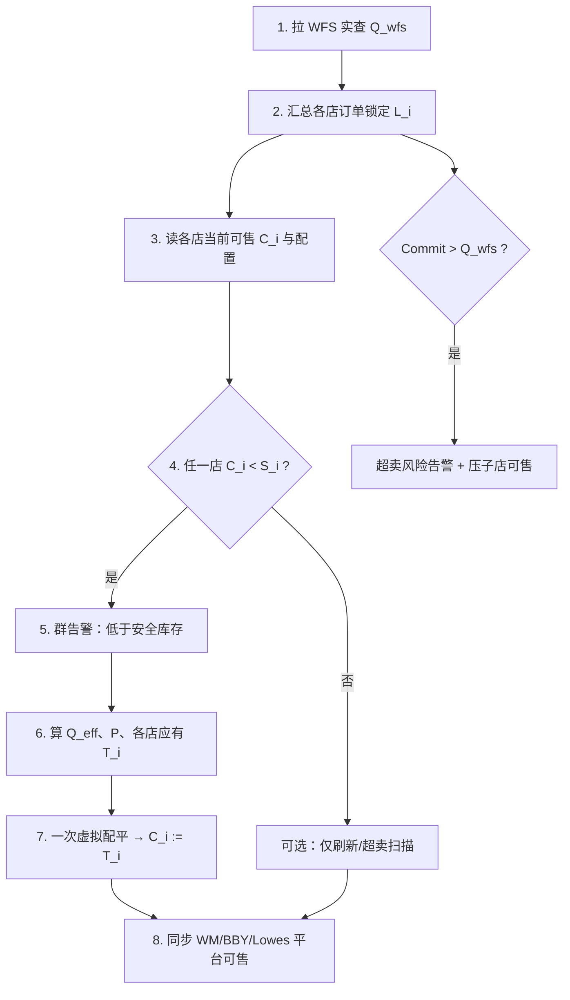
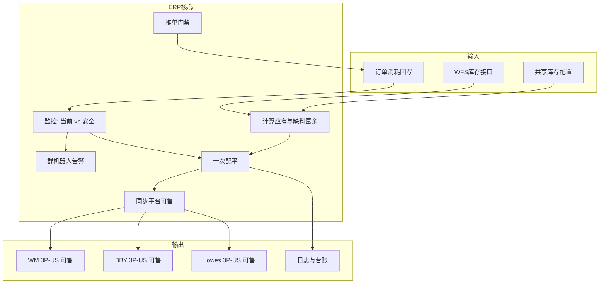
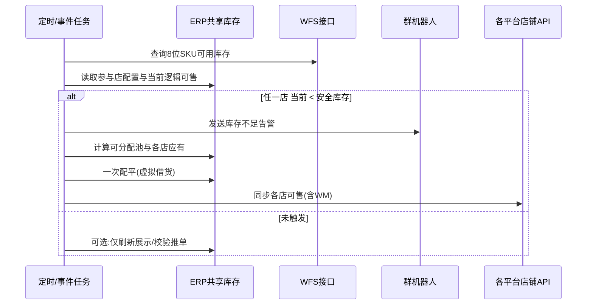
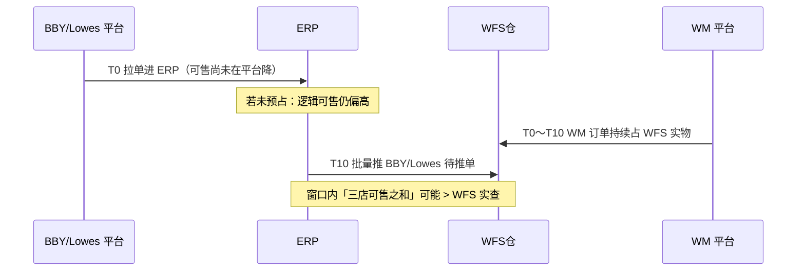
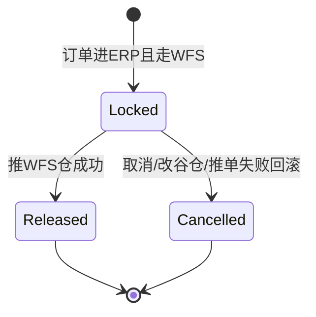

# WFS 共享库存与自动借货 · 详细产品方案

| 属性 | 内容 |
|------|------|
| 文档版本 | v2.0 |
| 编写日期 | 2026-05-22 |
| 文档状态 | 待评审 / 可供二次加工 |
| 所属需求 | 商超 3P · WFS 库存共享 |
| 关联目录 | `../方案/01`、`../方案/02`、`../方案/03` |
| 图形化原型 | [WFS共享库存与自动借货-方案说明.html](./WFS共享库存与自动借货-方案说明.html) |
| 原型来源 | 墨刀「借货管理、共享库存设置」+ 业务对齐会议 + 本方案扩写 |

---

## 目录

**推荐阅读顺序（不懂方案时按此读）**

| 顺序 | 章节 | 内容 |
|------|------|------|
| ① | **[第 0 章 方案导读](#0-方案导读请先读本章)** | 一张图、一条流程、演算表各列、五大机制（**含订单锁定库存**） |
| ② | 第 1～5 章 | 背景、范围、约束（含 WFS/谷仓二选一） |
| ③ | 第 9～13 章 | 公式、配平、同步、告警、订单 |
| ④ | 第 16～20 章 | 界面、任务、验收 |
| ⑤ | 第 23～24 章 | 10 分钟超卖、锁定库存 **专题展开**（与第 0 章重复处以此为准查细节） |

---

0. [方案导读（请先读本章）](#0-方案导读请先读本章)
1. [背景与动因](#1-背景与动因)
2. [术语与缩写](#2-术语与缩写)
3. [问题陈述与目标](#3-问题陈述与目标)
4. [范围边界](#4-范围边界)
5. [业务现状与约束](#5-业务现状与约束)
6. [整体方案概述](#6-整体方案概述)
7. [核心概念模型](#7-核心概念模型)
8. [功能模块详述](#8-功能模块详述)
9. [计算规则与算法（完整）](#9-计算规则与算法完整)
10. [一次配平与虚拟借货](#10-一次配平与虚拟借货)
11. [平台可售同步](#11-平台可售同步)
12. [群消息机器人告警](#12-群消息机器人告警)
13. [订单推单与消耗追溯](#13-订单推单与消耗追溯)
14. [数据模型与字段建议](#14-数据模型与字段建议)
15. [系统任务与触发时机](#15-系统任务与触发时机)
16. [界面与交互（ERP）](#16-界面与交互erp)
17. [异常、边界与失败处理](#17-异常边界与失败处理)
18. [与关联需求的关系](#18-与关联需求的关系)
19. [非功能需求](#19-非功能需求)
20. [验收标准与测试要点](#20-验收标准与测试要点)
21. [风险、依赖与待决事项](#21-风险依赖与待决事项)
22. [附录](#22-附录)
23. [10 分钟推单窗口超卖风险（展开）](#23-10-分钟推单窗口超卖风险与防控bby--lowes)
24. [订单锁定库存（展开）](#24-订单锁定库存预占完整逻辑)

---

## 0. 方案导读（请先读本章）

> 本章把全文揉成一条线：**WFS 实物只有一份 → 用「锁定 + 公式」算各店能卖多少 → 不够就虚拟配平并同步平台**。  
> 后文第 1～24 章是同一套逻辑的展开（配置、接口、表结构、验收等），**不引入第二套口径**。

### 0.1 一句话

在 **WM / BBY / Lowes** 共用 **同一 WFS 实物池** 的前提下，ERP 按 **WFS 实查** 和 **订单锁定库存** 算出各店 **应有可售**，在 **低于安全库存** 时 **一次虚拟配平** 并 **回写平台**；**WFS 共享与谷仓共享同一 SKU 只能二选一**；**不做** 仓间真调拨。

### 0.2 四个前提（先建立共识）

| # | 前提 | 含义 |
|---|------|------|
| P1 | **实物唯一** | 全店共用一个 WFS 池；总量 **只信 WFS 接口实查** \(Q_{wfs}\)，不信三店库存相加 |
| P2 | **销售是「份额」** | 各店看到的是 **逻辑可售**（份额），不是 WFS 里又拆了三堆货 |
| P3 | **不真调拨** | 自动借货只改 **数字分配** 和 **平台可售**，不产生调拨单、不搬实物 |
| P4 | **共享模式二选一** | 同一 8 位 SKU：**WFS 仓共享** 或 **谷仓共享**，不能同时开（§5.5） |

### 0.3 两类数量：分清就不会乱

```text
                    ┌─────────────────────────────────────┐
                    │  WFS 实查 Q_wfs（物理真相，接口拉）   │
                    └──────────────────┬──────────────────┘
                                       │
              先扣「订单锁定合计」L = Σ 各店订单锁定库存
                                       ▼
                    ┌─────────────────────────────────────┐
                    │  可分配基数 Q_eff = Q_wfs − L        │
                    └──────────────────┬──────────────────┘
                                       │
              再扣「安全库存合计」Σ S_i（各店保底，配置）
                                       ▼
                    ┌─────────────────────────────────────┐
                    │  可分配池 P（按比例分给各店）         │
                    └──────────────────┬──────────────────┘
                                       ▼
              各店「应有」T_i = P×比例_i + 安全库存_i
              各店「当前可售」C_i（已扣本店锁定，可卖给新单）
```

| 名称 | 符号 | 谁在用 | 典型展示位置 |
|------|------|--------|----------------|
| WFS 实查 | \(Q_{wfs}\) | 全 SKU | 紫色「WFS 实查」卡片、表头摘要 |
| **订单锁定库存** | \(L_i\) | **按店** | 演算表列、三店卡片、表头 **L** |
| 订单锁定合计 | \(L=\sum L_i\) | 算池时扣一次 | 表头摘要 |
| 当前可售 | \(C_i\) | 按店 | 演算表「当前」、三店卡片 |
| 安全库存 | \(S_i\) | 按店配置 | 演算表「安全」 |
| 应有 | \(T_i\) | 配平目标 | 演算表「应有」「配平后」「平台同步」 |

**关键**：\(L\) 在算 **P** 之前从 \(Q_{wfs}\) 扣掉；\(C_i\) 在 **进单锁定时已减少**，不要再对 \(L_i\) 做一次「缺料」扣减（避免双扣）。

### 0.4 订单锁定库存（预占）—— 解决 10 分钟推 WFS 窗口

**是什么**：BBY / Lowes（及按需 WM）订单 **已进 ERP、还没推 WFS 仓** 的件数，在界面上叫 **「订单锁定库存」**。

**为什么要有**：这两类店约 **每 10 分钟** 才批量推 WFS；若不锁定，这 10 分钟内平台仍按旧可售接单，而 WM 可能已卖掉实物 → **超卖**。

| 时点 | 订单锁定 \(L_i\) | 当前可售 \(C_i\) | WFS 实查 |
|------|------------------|------------------|----------|
| 订单进 ERP | **+qty（订单实际件数）** | **−qty** | 不变 |
| 批量推 WFS 成功 | **−qty（本批实际推单成功件数，逐单释放）** | 一般不变（进锁已扣） | 下次拉取减少 |
| 订单取消 | 回滚 | 回滚 | — |

**10 分钟周期（BBY / Lowes）**：`订单锁定库存` = 自**上次批量推单成功**起，本店待推 WFS 订单的**实际件数累加**；推单时按**实际推单数量**释放至 0，至**下次推单（约 10 分钟）**再重新累加。WM 推单更频时锁定常为 0 或很小。

**与分配池**：每次算 \(P\) 都用 **当时的** \(Q_{wfs}\) 和 **当时的** \(L\)，即 \(Q_{eff}=Q_{wfs}-L\)。

### 0.5 一条主流程（系统每次跑任务时）



并行：**订单进 ERP** 时立即 **锁定**（不等待定时任务）；**推 WFS 成功** 时 **释放锁定**。

### 0.6 自动配平（虚拟借货）在流程中的位置

**触发**：任意一店 **当前可售 &lt; 安全库存**（注意：看的是 \(C_i\)，不是 \(L_i\)）。

**做什么**（一次，不循环）：

1. 用 §0.3 公式算各店 **应有** \(T_i\)；  
2. **缺料** = \(T_i - C_i\)，**富余** = \(C_i - T_i\)；  
3. 缺料店按缺料 **从大到小**，从 **富余最多** 的店虚拟借入；  
4. 配平后 **当前 = 应有**，**平台同步 = 应有**（&lt;1 停售）。

**不做**：WFS 仓库调拨、库存调整单（与墨刀「真调库存」区别）。

### 0.7 演算表 / 三店卡片：列含义对照（与 UI 一致）

| 列/字段 | 公式或规则 |
|---------|------------|
| 当前 | \(C_i\)，已扣本店锁定 |
| **订单锁定库存** | \(L_i\)，待推 WFS 件数 |
| 安全 | \(S_i\)，配置固定件数 |
| 触发 | \(C_i < S_i\) → 是 |
| 应有 | \(T_i = \mathrm{round}(P \times R_i) + S_i\) |
| 缺料 | \(\max(0, T_i - C_i)\) |
| 富余 | \(\max(0, C_i - T_i)\) |
| 配平后 | \(T_i\) |
| 平台同步 | \(T_i\)（&lt;1 → 停售） |

**三店卡片（每店）**：当前可售 · **订单锁定库存** · 安全库存 · 共享比例 · 应有 · 同步平台。  
**紫色 WFS 区（SKU 级）**：WFS 实查 · 锁定合计 L · Q_eff · 可分配池 P。  
**演算表表头摘要**：同上 `Q_wfs` · `L` · `Q_eff` · `P`。

### 0.8 另外三件事（别和第 0.3 主公式混在一层）

| 事项 | 说明 | 展开章节 |
|------|------|----------|
| **WFS / 谷仓二选一** | 配置层互斥，保存时拦截 | §5.5 |
| **群告警** | ① 低于安全库存 ② 超卖风险（模板不同） | §12、§23.5 |
| **推单门禁** | 无足够份额不推 WFS/谷仓；≠ 谷仓共享配置 | §13 |
| **人工借货** | ERP 已有，本方案不新建 | — |

### 0.9 完整小例子（串起来读一遍）

**配置**：比例 WM/BBY/Lowes = 30%/30%/40%；安全 30/30/40。  
**时刻 T0**：\(Q_{wfs}=200\)，\(L=(0,0,0)\)，\(C=(60,60,80)\) → \(P=100\)，应有约 60/60/80。

**时刻 T1**：BBY 进 ERP 30 件 → \(L_{bby}=30\)，\(C_{bby}=30\)。  
→ \(L=30\)，\(Q_{eff}=170\)，\(P=70\) → 应有降至约 51/51/68（池子被锁定占掉）。

**时刻 T2**：WM 卖出后 \(Q_{wfs}=150\)；Lowes 再进 ERP 锁 20 → \(L=50\)，\(C_{wm}=10\) → **WM 当前 &lt; 安全** → 告警 + 配平。

**时刻 T3**：BBY+Lowes 批量推 WFS 成功 → \(L=0\)；下次用新 \(Q_{wfs}\) 再算。

### 0.10 后文章节怎么用

| 你想查… | 去第几章 |
|---------|----------|
| 配置页字段、互斥校验 | §8.2、§5.5、§16 |
| 公式推导、舍入、边界 | §9 |
| 配平算法步骤 | §10 |
| 锁定/释放、状态机、表结构 | §24（展开）、§14 |
| 10 分钟超卖、风险扫描 | §23（展开） |
| 验收用例 | §20 |
| 会议纪要定稿 | 附录 22.3 |

---

## 1. 背景与动因

### 1.1 公司业务背景

智岩科技商超 3P 业务向 **沃尔玛（Walmart）、Best Buy、Lowes** 等北美商超电商平台铺货。成本测算后 **WFS（Walmart Fulfillment Services）头程尾程综合成本最低**，备货策略逐步转向 **尽量将商超可售 SKU 备入 WFS 仓**，由 WFS 承担尾程履约（或与其它履约方式组合）。

截至方案编写时，业务已具备一定规模（会议提及：约 40+ SKU 上架、近 600 单量级），并计划继续扩 SKU、扩店铺（含 **Lowes 3P-US** 等）。多平台、多品牌、多店铺 **共用同一 WFS 实物库存池** 将成为常态。

### 1.2 WFS 的平台特性（为何不能只靠平台后台分货）

| 特性 | 说明 | 对方案的影响 |
|------|------|----------------|
| 库存账面集中 | WFS 实物与平台账面库存挂在 **沃尔玛 WFS 体系**下，不能像 FBA 一样按「品牌店铺」拆独立库存子账 | 必须在 **ERP 侧** 建逻辑分货 |
| 沃尔玛侧可售 | 沃尔玛店铺侧往往表现为 **WFS 池对该店几乎全量可见** | 仍须在 ERP 按规则 **计算并回写** 可售（业务已确认 WM 也回写） |
| Mirakl 子店 | Best Buy、Lowes 等需在后台维护 **可售库存**，与 WFS 共用实物 | 可售必须由 ERP **计算同步**，避免手工滞后 |
| 接口能力 | WFS 库存 **可查**；改库存能力有限 | **总量以 WFS 接口实查为准**；店铺间不做物理调拨 |
| 订单拉取 | ERP 约 **每 10 分钟** 拉单，非实时 push | 存在时间窗内超卖风险（见需求 02） |

### 1.3 运营现状痛点

1. **多店共池无逻辑配额**：WM、BBY、Lowes 等共用一个 WFS 池，无法回答「某店还能卖几件」。
2. **手工借货协调成本高**：历史上通过 IM 找同事借货（单次 10～20 件），无系统台账；规模放大后不可持续。
3. **安全库存无自动预警**：某店逻辑可售跌破安全线时，运营不能第一时间感知。
4. **平台可售与实物脱节**：子店可售若手工改，易与 WFS 实查、其它店销量不一致，导致超卖或断货。
5. **推单与库存未联动**：库存不足时仍可能推 WFS/谷仓，加剧超卖与客诉。
6. **10 分钟推单窗口**：BBY、Lowes 订单约 **每 10 分钟** 才批量推 WFS 仓，逻辑可售 **非实时扣减**；窗口内 WM 仍可快速卖货，存在 **承诺量 &gt; WFS 实物** 的超卖风险（见第 23 章）。

### 1.4 方案动因（本需求要解决的问题）

在 **沿用 ERP「共享库存设置 + 借货管理」产品形态** 的前提下，将能力 **适配为 WFS 实物池驱动的逻辑共享**：

- **配置**：按 8 位 SKU + 店铺定义共享比例、安全库存；
- **监控**：以 WFS 接口实查为唯一总量；
- **自动配平**：任参与店低于安全库存 → 一次虚拟借货 + 重算各店应有可售；
- **同步**：WM、BBY、Lowes **均** 回写平台可售，&lt;1 停售；
- **告警**：低于安全库存时 **群机器人消息** 通知运营；
- **门禁**：无有效分货/借货不足以发货时 **禁止推单** WFS/谷仓。
- **超卖防控**：针对 BBY/Lowes **10 分钟推 WFS** 延迟，增加 **预占、风险扫描、预警与自动压可售**（见第 23 章）。

### 1.5 与墨刀原型的关系

墨刀原型描述的是 **多店铺 MSKU 共享 + 自动借货 + 同步平台可售**，示例店铺含 Walmart Marketplace、Best Buy、TTS 等。经业务对齐后，本方案 **收敛为 WFS 场景**：

| 墨刀原型要素 | 本方案定稿 |
|--------------|------------|
| 汇总各店库存算池 | **改为仅 WFS 接口实查** |
| 真调库存 / 库存调整单 | **否**；虚拟分货 + 可售同步 |
| 参与店 | **WM 3P-US、BBY 3P-US、Lowes 3P-US**（可扩展） |
| 配置 SKU | **8 位 SKU + 店铺** → 映射 MSKU |
| 低于安全库存触发 | **保留** |
| 群消息提醒 | **新增明确**（见第 12 章） |

---

## 2. 术语与缩写

| 术语 | 定义 |
|------|------|
| WFS | Walmart Fulfillment Services，沃尔玛仓储履约 |
| 8 位 SKU | 生产 SKU（8 位），配置与运算的主键之一 |
| 店铺 | 渠道下的销售店铺，如 WM 3P-US、BBY 3P-US、Lowes 3P-US |
| MSKU | 店铺发货 SKU，由 8 位 SKU + 店铺规则映射，**配置层不直接维护** |
| WFS 实查可用 | 调用 WFS 库存接口返回的 **当前可用实物数量**（唯一总量来源） |
| 逻辑可售 / 当前库存 | 该店该 SKU 在 ERP 中的 **逻辑可售数量**，含已同步平台值及已虚拟借入部分 |
| 安全库存 | 每店每 SKU **固定件数** 底线；低于则触发配平 + 告警 |
| 共享比例 | 各参与店分摊 **可分配池** 的权重，**合计 100%** |
| 可分配池 P | `max(0, (Q_wfs − L) − Σ安全库存)`，见 §0.3、§9.2 |
| 应有库存 | 配平目标：`可分配池 × 共享比例 + 本店安全库存`（见公式章） |
| 虚拟借货 | 不改变 WFS 实物位置；仅调整各店 **逻辑可售** 与 **平台可售** 的分配关系 |
| 一次配平 | 单次触发内完成计算、虚拟调剂、同步，**不循环多轮** |
| 停售 | 平台可售同步值 **&lt; 1** 时，按 0 或可售 0 处理并停止售卖（以实现为准） |
| **订单锁定库存** | 已进 ERP、判定走 WFS 履约、**尚未推 WFS 仓** 的订单件数；按 **店铺** 汇总展示，按 **SKU** 汇总扣减分配池（**即预占**） |
| 待推 WFS 占用 | 与「订单锁定库存」**同义**（实现字段名，本文档界面统一用后者） |
| 有效可用 / WFS 可分配基数 | `WFS 实查 − Σ订单锁定库存（全店）− 可选 WM 缓冲`（见 §9.2、§24） |
| 超卖风险 | 预测「已承诺量」&gt; WFS 实查或有效可用 &lt; 0 的状态 |
| WFS 仓共享 | 以 **WFS 接口实查** 为总量、本方案描述的 WM/BBY/Lowes 逻辑分货与自动配平 |
| 谷仓共享 | ERP 既有 **谷仓库存共享** 能力：以谷仓实物为总量、按店铺/MSKU 做共享与借货（非 WFS 池） |
| 共享模式（互斥） | 同一 **8 位 SKU** 在 ERP 仅能启用 **WFS 仓共享** 或 **谷仓共享** 之一 |

---

## 3. 问题陈述与目标

### 3.1 问题陈述

当多个商超 3P 店铺共用 WFS 备货时，ERP 若不能 **以 WFS 实查为总量、按规则分配各店可售**，则会出现：某店显示可售虚高、某店断货仍不知、订单推单超卖、成本无法按店核算等问题。

### 3.2 业务目标

| 编号 | 目标 |
|------|------|
| G1 | 用 **一套可配置规则** 管理 WM/BBY/Lowes 等对同一 8 位 SKU 的 WFS 共享 |
| G2 | **自动** 在低于安全库存时配平各店逻辑可售至「应有」 |
| G3 | **自动同步** 各店平台可售，减少手工改 Mirakl/WM 后台 |
| G4 | **及时告警** 运营处理异常（群机器人） |
| G5 | **推单前校验**，避免无货推 WFS/谷仓 |
| G6 | 为需求 01 **消耗追溯** 提供逻辑库存与借货记录基础 |

### 3.3 非目标（明确不做）

| 编号 | 非目标 |
|------|--------|
| NG1 | 不改变 WFS 仓内 **实物库位** 或生成 **跨仓调拨单** |
| NG2 | 不替代 **现有人工借货申请/审批** 流程（继续沿用已有功能） |
| NG3 | 不在本方案内定义 **BBY 先 WFS 再谷仓** 的完整订单路由（与订单模块另对齐） |
| NG4 | **无法 100% 消除** 10 分钟窗口超卖；本方案提供 **可落地的基线防控**，更强预测砍量与切 FBM 与需求 02 合并 |
| NG5 | 不要求各店共用同一 MSKU 编码 |
| NG6 | 不在同一 SKU 上 **同时实现** WFS 共享与谷仓共享（产品规则为二选一，见 §5.5） |

---

## 4. 范围边界

### 4.1 在 scope 内

- 共享库存配置（8 位 SKU + 店铺、比例、安全库存）
- WFS 库存接口拉取与定时/事件刷新
- 触发检测、一次配平、虚拟借货记录
- WM / BBY / Lowes **平台可售回写**（含 WM）
- 低于安全库存的 **群消息机器人告警**
- 推单门禁（无货不推 WFS/谷仓）
- 配置日志、借货日志、告警日志（基础）
- 与需求 01/02/03 的接口与数据衔接说明
- **WFS 共享 vs 谷仓共享互斥** 的配置校验与切换规则（§5.5）

### 4.2 不在 scope 内（但需知会）

- 人工借货 UI 与审批流细节
- 促销、调价、Listing 维护
- **谷仓共享功能本身的算法与界面**（沿用 ERP 既有「谷仓共享库存设置」；本方案只定义与 WFS 共享的 **互斥关系**）
- FBA 等非 WFS/非谷仓货源的共享策略
- Mirakl 改供货模式（FBM/补仓）自动化——归属需求 02

### 4.3 参与店铺（当前与扩展）

| 阶段 | 店铺 | 说明 |
|------|------|------|
| 当前 | WM 3P-US | 沃尔玛 3P 美国店 |
| 当前 | BBY 3P-US | Best Buy 3P 美国店 |
| 当前 | Lowes 3P-US | Lowes 3P 美国店（示例与演算纳入） |
| 未来 | 更多商超 3P 店 | 同一配置模型扩展一行店铺 + 比例，重新校验 100% |

所有参与店须：**同 8 位 SKU、不同店铺 MSKU、同一 WFS 实物池、不跨仓**。

---

## 5. 业务现状与约束

### 5.1 备货与 MSKU 策略（何欣对齐口径）

- **不采用** 多平台共用一个 MSKU（金蝶辅助属性不一致，改动面大）。
- **采用**：每平台独立 MSKU；备货可先落在某一店铺 MSKU 对应库存上，再通过 **借货/共享** 让其它店铺获得可售份额。
- 本方案在 WFS 场景下升级为：**不以单店 MSKU 物理库存为总量**，而以 **WFS 实查** 为总量，按比例 **虚拟分配** 到各店 MSKU 的可售。

### 5.2 库存总量约束

```
∀ 时刻： Σ(各参与店逻辑可售的「未消耗承诺」) ≤ WFS实查可用 + 在途约定（若有）
```

配平后各店逻辑可售 = 应有，且 **Σ应有 ≤ WFS实查 + 舍入误差容忍**（见算法章）。

### 5.3 已借货与可售的关系

**已借货** 体现为 **借入店的逻辑可售 / 平台可售增加**，不单独维护第二套「借货余额」字段对外展示（内部台账可有借货明细行）。

### 5.4 推单约束

若配平后仍无法满足发货所需（逻辑可售不足、或未配置共享），则 **不允许** 向 WFS 或谷仓推单。

> **与 §5.5 区分**：订单履约在 WFS 不足时 **改推谷仓发货**（履约兜底）属于订单路由；**不等于** 在同一 SKU 上同时开启「谷仓共享库存配置」。共享模式仍二选一。

### 5.5 WFS 仓共享与谷仓共享互斥（硬性产品规则）

#### 5.5.1 规则陈述

对同一 **8 位 SKU**（及其下所有店铺 MSKU）：

| 规则 | 说明 |
|------|------|
| **二选一** | 只能启用 **WFS 仓共享**（本方案）**或** **谷仓共享**（ERP 既有能力），**禁止同时启用** |
| **启用 WFS 共享后** | 不可再为该 SKU 配置/保存 **谷仓共享**；谷仓共享相关配置入口对该 SKU **禁用或只读** |
| **启用谷仓共享后** | 不可再为该 SKU 配置/保存 **WFS 仓共享**；WFS 共享设置保存时 **拒绝** |
| **切换模式** | 须先 **停用/删除** 当前模式全部配置行，再启用另一模式（建议二次确认，写设置日志） |

**原因（业务/技术）**：

1. **实物池不同**：WFS 总量来自 **WFS 接口**；谷仓总量来自 **谷仓库存**，两套总量不可叠加到同一套「共享比例」公式。
2. **避免双配平**：若同时启用，自动配平、借货、可售同步会出现 **两套任务同时改同一 SKU 可售**，必然冲突。
3. **与会议口径一致**：谷仓共用与 WFS 共用是 **不同备货履约路径**，商超 3P 走 WFS 的 SKU 不应再挂谷仓共享。

#### 5.5.2 系统校验（保存时）

**保存 WFS 共享配置前**：

```
IF 该 sku_8 在「谷仓共享库存设置」中已存在启用配置 THEN
  拒绝保存，提示：「该 SKU 已启用谷仓共享，请先停用谷仓共享后再配置 WFS 仓共享。」
```

**保存谷仓共享配置前**（谷仓模块对称实现）：

```
IF 该 sku_8 在「WFS 共享库存设置」中已存在启用配置 THEN
  拒绝保存，提示：「该 SKU 已启用 WFS 仓共享，请先停用 WFS 仓共享后再配置谷仓共享。」
```

**实现建议**：

- 在 SKU 级增加 `share_inventory_mode` 枚举：`NONE` | `WFS` | `GC`（谷仓）；
- 或双向查询对方配置表是否存在 `enabled=1` 的记录；
- 列表页展示当前模式标签：**WFS 共享 / 谷仓共享 / 未配置**。

#### 5.5.3 界面与交互要点

| 场景 | 交互 |
|------|------|
| 共享库存设置 · 新增 WFS | 若检测到谷仓共享 → 弹窗说明互斥，引导跳转谷仓设置页停用 |
| 谷仓共享设置 · 新增 | 若检测到 WFS 共享 → 同上，反向引导 |
| SKU 列表 | 列「共享模式」：WFS / 谷仓 / — |
| 从谷仓切到 WFS | 向导：① 确认停用谷仓共享 ② 录入 WFS 比例/安全库存 ③ 启用 |

#### 5.5.4 与推单、履约的关系

| 概念 | 是否互斥 |
|------|----------|
| WFS 共享 **配置** vs 谷仓共享 **配置** | **互斥**（本章） |
| WFS 推单 vs 谷仓 **发货**（订单不够转谷仓） | **不互斥**，属订单履约策略，与共享模式配置无关 |
| 无货不推 WFS/谷仓 | 在 **已选共享模式** 下校验对应池子的逻辑可售；未配置共享的 SKU 走各自默认履约逻辑 |

#### 5.5.5 数据残留与迁移

- 切换模式时：**不自动迁移** 比例/安全库存数值（因总量来源不同）；运营需重新配置 WFS 或谷仓规则。
- 历史借货日志保留，按 `share_mode` 字段区分来源，报表筛选时不混算。

---

## 6. 整体方案概述

### 6.1 逻辑架构



### 6.2 主流程（时序）



---

## 7. 核心概念模型

### 7.1 虚拟共享池

```
                    ┌─────────────────────┐
                    │  WFS 实物（接口实查）  │
                    └──────────┬──────────┘
                               │
              ┌────────────────┼────────────────┐
              ▼                ▼                ▼
        ┌──────────┐    ┌──────────┐    ┌──────────┐
        │ WM 3P-US │    │ BBY 3P-US│    │Lowes 3P  │
        │ 逻辑可售  │    │ 逻辑可售  │    │ 逻辑可售  │
        │ 安全库存  │    │ 安全库存  │    │ 安全库存  │
        └──────────┘    └──────────┘    └──────────┘
```

- **实物只有一份**；三店数字是 **分配视图**。
- **出单**：例如 BBY 出单、WFS 发货，扣减 **BBY 份额**（或记借调来源，见需求 01）。

### 7.2 配置与实例关系

| 层级 | 说明 |
|------|------|
| 配置头 | 8 位 SKU（是否启用 WFS 共享） |
| 配置行 | 店铺 + 共享比例 + 安全库存 |
| 运行态 | 每店：当前逻辑可售、应有、上次同步可售、上次告警时间 |

---

## 8. 功能模块详述

### 8.1 模块清单

| 模块 ID | 名称 | 优先级 | 说明 |
|---------|------|--------|------|
| M1 | 共享库存设置 | P0 | 配置参与店、比例、安全库存 |
| M2 | WFS 库存同步 | P0 | 拉取实查写入共享池总量 |
| M3 | 触发与监控 | P0 | 比较当前与安全库存 |
| M4 | 自动配平 | P0 | 一次虚拟借货 |
| M5 | 平台可售同步 | P0 | WM/BBY/Lowes 回写 |
| M6 | 群机器人告警 | P0 | 低于安全库存通知 |
| M7 | 推单门禁 | P0 | 无货不推 |
| M8 | 日志与查询 | P1 | 配置日志、借货日志、告警记录 |
| M9 | 借货管理展示 | P1 | 展示自动配平结果（沿用借货管理页） |
| M10 | 人工借货 | — | **已有，本方案不展开** |
| M11 | 订单锁定库存（预占） | P0 | 进 ERP 锁定、推 WFS 释放；分配池扣减（§24） |
| M12 | 超卖风险扫描与处置 | P0 | 风险指数、群告警、自动压 BBY/Lowes 可售 |

### 8.2 M1 共享库存设置

**功能描述**：为指定 8 位 SKU 维护参与 WFS 共享的店铺及其规则。

**字段**：

| 字段 | 类型 | 必填 | 规则 |
|------|------|------|------|
| 8 位 SKU | string(8) | 是 | 已存在主数据 |
| 店铺 | enum | 是 | 当前可选：WM 3P-US、BBY 3P-US、Lowes 3P-US |
| 共享比例 | decimal | 是 | 0～100%，同一 SKU 下合计 **= 100%** |
| 安全库存 | int ≥0 | 是 | **固定件数**，非百分比 |
| 启用状态 | bool | 是 | 停用后不触发配平与告警 |

**操作**：新增行、编辑、删除（逻辑删除）、批量导入（可选 P2）。

**校验**：

1. 同一 8 位 SKU 下店铺不可重复；
2. 共享比例合计必须 100%（保存时拦截）；
3. 店铺须属于「新渠道商超 3P」渠道组（与主数据一致）；
4. 至少 2 个参与店才构成「共享」（建议校验，单店无需共享）。
5. **互斥（硬性）**：该 8 位 SKU **未启用谷仓共享**；若已启用 → **拒绝保存**（文案见 §5.5.2）。
6. 保存成功后，将该 SKU 的 `share_inventory_mode` 置为 **`WFS`**（或等价标记），并确保谷仓共享侧无法新增启用行。

**日志**：每次变更写入「设置日志」（操作人、时间、旧值、新值）；模式切换须单独记一条 **MODE_SWITCH**（从谷仓→WFS 或反向）。

**停用/删除**：删除该 SKU 全部 WFS 共享行且不再有启用行时，可将 `share_inventory_mode` 置回 `NONE`，此时才允许配置谷仓共享。

### 8.3 M2 WFS 库存同步

**功能描述**：按 SKU 从 WFS 接口获取可用库存，作为当日共享池计算的 **唯一实物总量**。

**要求**：

- 支持与配平任务同一事务或同一任务批次内读取，避免「先算后拉」时间差；
- 接口失败时：**不执行配平**，可发 **接口异常告警**（与库存不足告警区分）；
- 记录每次拉取值、时间、接口批次号。

**注意**：**禁止**用 `Σ各店当前逻辑可售` 或 `Σ各店平台可售` 代替 WFS 实查。

### 8.4 M3 触发与监控

**触发条件（充分条件）**：

```
∃ 参与店 i ： 当前逻辑可售_i < 安全库存_i
```

**当前逻辑可售** 定义：

- 该店该 SKU 在 ERP 的 **逻辑可售**；
- 与 **已同步至平台的可售** 一致或同源（若平台回写延迟，以 ERP 逻辑值为准触发，避免漏告警）。

**不触发**：

- 未配置共享或已停用；
- 当前 ≥ 安全库存（等于安全不触发「低于」）；
- WFS 实查拉取失败。

**监控频率**：建议与库存同步任务一致（如每 5～15 分钟，可配置）；订单扣减后可选 **事件触发** 增量检查（P1）。

### 8.5 M4 自动配平

见第 9、10 章。

### 8.6 M5 平台可售同步

见第 11 章。

### 8.7 M6 群机器人告警

见第 12 章。

### 8.8 M7 推单门禁

见第 13 章。

### 8.9 M8 日志

| 日志类型 | 内容 |
|----------|------|
| 设置日志 | 配置 CRUD |
| 借货日志 | 自动配平产生的虚拟借货行（借出店、借入店、数量、前后可售） |
| 告警日志 | 机器人消息发送结果、接收群、SKU、店铺 |
| 同步日志 | 平台 API 请求/响应、失败重试 |

---

## 9. 计算规则与算法（完整）

### 9.1 符号定义

| 符号 | 含义 |
|------|------|
| \(Q_{wfs}\) | WFS 接口实查可用 |
| \(S_i\) | 店 \(i\) 安全库存（固定件数） |
| \(R_i\) | 店 \(i\) 共享比例（0～1，\(\sum R_i = 1\)） |
| \(C_i\) | 店 \(i\) 当前逻辑可售 |
| \(P\) | 可分配池 |
| \(T_i\) | 店 \(i\) 应有库存 |
| \(D_i\) | 店 \(i\) 缺料量 |
| \(E_i\) | 店 \(i\) 富余量 |

### 9.2 可分配池（须扣减订单锁定库存）

**SKU 级订单锁定合计**：

\[
L = \sum_{i \in 参与店} L_i
\]

其中 \(L_i\) = 店 \(i\) 的 **订单锁定库存**（件，见 §24）。

**WFS 可分配基数**：

\[
Q_{wfs}^{eff} = \max\left(0,\; Q_{wfs} - L - O_{wm\_buf} \right)
\]

**可分配池**（再扣各店安全库存）：

\[
P = \max\left(0,\; Q_{wfs}^{eff} - \sum_{i \in 参与店} S_i \right)
\]

| 符号 | 含义 |
|------|------|
| \(Q_{wfs}\) | WFS 接口实查 |
| \(L_i\) | 店 \(i\) **订单锁定库存**（待推 WFS 的预占件数） |
| \(L\) | 全店锁定合计，**必须从分配池扣除** |
| \(O_{wm\_buf}\) | 可选：WM 近 Δt 销量缓冲（见 §23） |

**说明**：

1. 安全库存从 \(Q_{wfs}^{eff}\) 再预留，剩余 \(P\) 按比例分给各店得到 **应有**。  
2. **禁止** 用未扣 \(L\) 的 \(Q_{wfs}\) 直接算 \(P\)，否则 10 分钟内会高估可分配量。  
3. 列表/详情页须展示 **每店 \(L_i\)** 列（与截图演算表一致）。

### 9.3 应有库存

\[
T_i = \lfloor P \times R_i \rfloor + S_i \quad \text{（或四舍五入，需统一舍入规则）}
\]

**舍入策略（须全局统一）**：

- **建议**：先算精确值，按 **最大余数法** 将 \(\lfloor P \times R_i \rfloor\) 之和与 \(P\) 的差分配到各店，保证 \(\sum (T_i - S_i) = P\)（整数件场景）。
- 简易实现：四舍五入后若 \(\sum T_i > Q_{wfs}\)，从最大 \(T_i\) 店递减 1。

### 9.4 缺料与富余

\[
D_i = \max(0,\; T_i - C_i)
\]

\[
E_i = \max(0,\; C_i - T_i)
\]

其中 \(C_i\) = 该店 **当前可售**（**已扣除本店订单锁定**后的逻辑可售，与平台同步口径一致）。  
**缺料/富余不算在 \(L_i\) 上重复扣减**——锁定已在 \(Q_{wfs}^{eff}\) 与 \(C_i\) 两侧体现。

### 9.5 配平目标

配平完成后：

\[
C_i' = T_i
\]

平台同步可售 \(= T_i\)（若 \(T_i < 1\) 则停售）。

### 9.6 三店数值示例（标准演算）

**输入**：

| 店 | 当前 \(C_i\) | 安全 \(S_i\) | 比例 \(R_i\) |
|----|-------------|-------------|-------------|
| WM 3P-US | 10 | 30 | 30% |
| BBY 3P-US | 30 | 30 | 30% |
| Lowes 3P-US | 160 | 40 | 40% |

\(Q_{wfs} = 200\)（与 \(C_i\) 之和可不一致，**以 WFS 为准**）

**计算**：

1. \(P = 200 - 30 - 30 - 40 = 100\)
2. 按比例分池（未舍入）：WM \(100×0.3+30=60\)，BBY \(60\)，Lowes \(100×0.4+40=80\)
3. 触发：WM \(10<30\) ✓；BBY \(30 \not< 30\) 不触发单独；Lowes 不触发——但 **任一店触发即整 SKU 配平**
4. 缺料：WM \(D=50\)，BBY \(D=30\)，Lowes \(E=80\)
5. 配平排队：缺料 WM(50) &gt; BBY(30)；富余 Lowes(80)
6. 虚拟借货：Lowes → WM 50，Lowes → BBY 30；Lowes 剩余富余 0
7. 结果：\(C'_{WM}=60,\; C'_{BBY}=60,\; C'_{Lowes}=80\)

### 9.7 边界算例

| 场景 | 处理 |
|------|------|
| \(Q_{wfs} < \sum S_i\) | \(P=0\)，各店 \(T_i = S_i\)（仅保底） |
| 全部店 \(D_i > 0\) 且无富余店 | 无法店间调剂；各店 \(T_i\) 仍按公式算，**告警 WFS 总量不足** |
| 仅一家店参与 | 建议配置层禁止或退化为非共享 |
| 比例合计 ≠ 100% | 保存拒绝 |
| \(T_i < 1\) | 平台停售 |

---

## 10. 一次配平与虚拟借货

### 10.1 原则

- **一次触发只执行一轮**配平，不 while 循环至稳定。
- **不产生** 仓库调拨单、不修改 WFS 后台库存。
- **虚拟借货** 仅更新：逻辑可售、借货日志、平台可售同步任务。

### 10.2 配平步骤（算法）

```
输入: Q_wfs, {(S_i, R_i, C_i)}

1. 若不存在店 i 使 C_i < S_i → 退出
2. 计算 P, {T_i}, {D_i}, {E_i}
3. 将缺料店按 D_i 降序排队
4. 将富余店按 E_i 降序排队
5. 对缺料队列每个店 i:
     need = D_i
     从富余队列按序取店 j，transfer = min(need, E_j 剩余)
     记借货日志(j → i, transfer)
     need -= transfer
6. 设 C_i' = T_i  ∀i
7. 提交平台同步
```

### 10.3 借货日志行（自动）

| 字段 | 示例 |
|------|------|
| 类型 | 自动借货 |
| 8 位 SKU | B6062A01 |
| 借出店铺 | Lowes 3P-US |
| 借入店铺 | WM 3P-US |
| 数量 | 50 |
| 调整前/后 | 借入店可售前 10 → 后 60 |
| 备注 | （自动借货）Lowes 3P-US 向 WM 3P-US 调剂 50 |

### 10.4 与「人工借货」区别

| 维度 | 人工借货（已有） | 自动配平 |
|------|------------------|----------|
| 触发 | 人发起 | 系统检测低于安全库存 |
| 总量依据 | 既有规则 | **WFS 实查** |
| 审批 | 可有 | 无 |
| 实物 | 不移动 WFS | 不移动 WFS |

---

## 11. 平台可售同步

### 11.1 规则

| 店 | 是否回写 | 写入值 |
|----|----------|--------|
| WM 3P-US | **是** | 配平后 \(T_i\) |
| BBY 3P-US | **是** | 同上 |
| Lowes 3P-US | **是** | 同上 |

**停售**：若 \(T_i < 1\)，同步为 **0** 并触发平台停售逻辑（以实现对接为准）。

### 11.2 同步时机

- 自动配平完成后 **异步批量** 调用各平台库存 API；
- 失败 **重试 N 次** 后记入同步日志并告警（可与库存不足告警不同模板）。

### 11.3 与需求 02 的关系

- 本方案解决 **常态分配与低于安全库存的配平**；
- 需求 02 的 **销量激增预测砍量、切 FBM** 可在配平之后叠加或并行，需统一 **最终可售 = min(配平结果, 风控上限)**（实现阶段合并规则）。

---

## 12. 群消息机器人告警

### 12.1 场景

当 **任一参与店** 满足 `当前逻辑可售 < 安全库存` 时，在触发自动配平 **之前或同时**（建议：**检测到时立即告警**，配平完成后可发第二条「已配平」可选），向运营群发送消息。

### 12.2 消息样式（与现网「业务告警」机器人一致）

**发送方**：业务告警（机器人）

**标题**：

```
共享库存店铺库存不足
```

**正文模板**：

```
{8位SKU}-{店铺名称} 的店铺库存低于安全库存！
```

**示例**（与用户截图一致结构）：

```
共享库存店铺库存不足

B6062A01-WM 3P-US 的店铺库存低于安全库存！
```

**多店同时触发**：可合并一条或按店多条（建议 **每个 SKU 每个触发店 1 条**，避免漏读；同一任务批次 BBY、Lowes 同时低于则发多条）。

### 12.3 消息扩展字段（建议写入正文或卡片）

| 字段 | 说明 |
|------|------|
| 8 位 SKU | B6062A01 |
| 店铺 | WM 3P-US |
| 当前逻辑可售 | 10 |
| 安全库存 | 30 |
| 缺口 | 20 |
| WFS 实查 | 200 |
| 是否已执行配平 | 是/否 |
| 配平后应有 | 60 |

（扩展字段便于运营决策，**不改变标题模板合规性**）

### 12.4 发送通道

- 对接企业现有 **群消息机器人**（飞书/钉钉/企微，与「业务告警」同通道）；
- 配置：**告警群 ID**、@值班角色（可选）。

### 12.5 防刷屏策略（建议）

| 策略 | 说明 |
|------|------|
| 去重键 | `{8位SKU}-{店铺}-{告警类型}` |
| 冷却时间 | 如 4 小时内同一键只发 1 次（可配置） |
| 恢复通知 | 配平后当前 ≥ 安全，可选发「已恢复」 |
| 失败重发 | 机器人 API 失败重试 3 次 |

### 12.6 告警与配平顺序（推荐）

```
检测低于安全 → 发送告警 → 执行配平 → 同步平台 → （可选）配平结果通知
```

运营即使未及时看群，系统仍 **自动配平**；告警用于 **人工介入异常**（如 WFS 实查骤降、同步失败）。

---

## 13. 订单推单与消耗追溯

### 13.1 推单门禁

**规则**：订单行拟推 WFS 或谷仓前，校验：

```
可用发货量 = 该店该 SKU 当前逻辑可售（配平后）
若 可用发货量 < 本行需发数量 → 拦截推单，提示「共享库存不足，请先借货/配平」
```

**说明**：

- 「无借货不能推」= **无足够逻辑可售份额**；
- 自动配平后若仍不足，继续拦截。

### 13.2 消耗时点（与需求 01 对齐建议）

| 时点 | 店铺 | 建议 |
|------|------|------|
| **订单进入 ERP（拉单成功）** | BBY、Lowes | **订单锁定库存** \(L_i\) += qty，**当前可售** \(C_i\) -= qty（§24） |
| 订单进入 ERP | WM | 按平台节奏预占或按 WM 成交流速单独缓冲 |
| 推 WFS 仓成功 | BBY、Lowes | **释放锁定** \(L_i\) -= qty；与 WFS 实查扣减对账（§24.6） |
| 推单成功 | 全店 | 二次校验逻辑可售 |
| 发货/WFS 确认 | 全店 | 实扣并写消耗来源 |
| 取消订单 | 全店 | 回滚预占与逻辑可售 |

订单行扩展字段（需求 01）：

- `库存来源类型`：本店份额 / 共享借调-{借出店}
- `履约方`：WFS / 自发货 等

### 13.3 BBY 先 WFS 再谷仓

业务背景 **待与订单模块对齐**；本方案仅保证 **WFS 份额不足时不推 WFS**，不定义谷仓切换完整状态机。

---

## 14. 数据模型与字段建议

### 14.1 表：wfs_share_sku_mode（SKU 级共享模式，建议）

| 字段 | 类型 | 说明 |
|------|------|------|
| sku_8 | char(8) PK | |
| share_mode | enum | `NONE` / `WFS` / `GC`（谷仓） |
| updated_at / updated_by | | 与互斥切换审计 |

> 亦可并入主数据扩展表；**关键约束**：`share_mode` 同一时间最多一个非 `NONE` 值，且与谷仓共享表双向一致。

### 14.2 表：wfs_share_config（配置行）

| 字段 | 类型 | 说明 |
|------|------|------|
| id | bigint PK | |
| sku_8 | char(8) | 8 位 SKU |
| shop_code | varchar | WM_3P_US 等 |
| share_ratio | decimal(5,2) | 百分比 |
| safety_stock | int | 固定件数 |
| enabled | tinyint | |
| created_at / updated_at | datetime | |
| updated_by | varchar | |

唯一索引：`(sku_8, shop_code)`

### 14.3 表：wfs_share_runtime（运行态，可按 SKU+店）

| 字段 | 说明 |
|------|------|
| sku_8, shop_code | |
| current_sellable | 当前逻辑可售 |
| target_sellable | 最近应有 |
| last_wfs_qty | 最近 WFS 实查 |
| last_sync_qty | 最近同步平台值 |
| last_alert_at | 最近告警时间 |
| last_balance_at | 最近配平时间 |
| order_locked_qty | **订单锁定库存** \(L_i\)（该店待推 WFS 件数） |
| risk_flag | 最近是否超卖风险 |

### 14.4 表：wfs_share_order_lock（订单锁定库存明细，建议）

> 界面名：**订单锁定库存**；表名可实现为 `wfs_share_order_lock` 或沿用 `wfs_share_pending_order`。

| 字段 | 说明 |
|------|------|
| order_id / line_id | 订单行 |
| sku_8 | |
| shop_code | BBY / Lowes |
| qty | 件数 |
| status | `LOCKED`（锁定）/ `RELEASED`（已推 WFS 释放）/ `CANCELLED` |
| captured_at | 进 ERP、写入锁定时间 |
| pushed_at | 推 WFS 仓成功、释放锁定时间 |
| lock_qty | 本行锁定件数 |

### 14.5 表：wfs_share_balance_log（配平/借货）

| 字段 | 说明 |
|------|------|
| batch_id | 一次配平批次 |
| sku_8 | |
| from_shop / to_shop | |
| qty | |
| before_to / after_to | 借入店前后 |
| remark | 自动借货说明 |

### 14.6 表：wfs_share_alert_log（告警）

| 字段 | 说明 |
|------|------|
| sku_8, shop_code | |
| alert_type | BELOW_SAFETY / OVERSell_RISK / PENDING_PUSH_HIGH 等 |
| message_body | |
| sent_status | success/fail |
| sent_at | |

---

## 15. 系统任务与触发时机

| 任务 | 频率 | 动作 |
|------|------|------|
| WFS 库存拉取 | 5～15 min | 更新 \(Q_{wfs}\) |
| 订单锁定库存维护 | **实时/≤10 min** | 进单锁定、推 WFS 释放；汇总 \(L=\sum L_i\) |
| **超卖风险扫描** | **≤10 min** | 算风险指数 → 告警 → 自动处置（§23） |
| 共享监控配平 | 同上或事件 | 检测 → 告警 → 配平 → 同步（可用 \(Q_{wfs}^{eff}\)） |
| 平台同步重试 | 失败队列 | 重试 |
| 对账任务 | 日 | \(Q_{wfs}\) vs 承诺量 vs \(\sum C_i\) |

**事件触发（P1）**：订单进 ERP、推 WFS 成功/失败、配置变更后立即跑该 SKU 的预占 + 风险 + 配平。

---

## 16. 界面与交互（ERP）

### 16.1 共享库存设置 / SKU 共享看板

- 列表：8 位 SKU、**共享模式（WFS/谷仓/未配置）**、店铺、比例、安全库存、启用、操作；
- **SKU 共享演算表**（运营看板，按店一行，与你提供的列表一致）：

| 列名 | 字段 | 说明 |
|------|------|------|
| 店铺 | shop | WM / BBY / Lowes 3P-US |
| 当前 | current_sellable | 当前逻辑可售（**已扣本店锁定**） |
| **订单锁定库存** | order_locked_qty | 待推 WFS 预占件数 \(L_i\) |
| 安全 | safety_stock | 固定件数 |
| 触发 | computed | 当前 &lt; 安全 → 是 |
| 应有 | target | 由 §9.2～9.3 公式计算 |
| 缺料 | shortage | 应有 − 当前 |
| 富余 | surplus | 当前 − 应有 |
| 配平后 | after_balance | = 应有 |
| 平台同步 | platform_sync | = 应有（&lt;1 停售） |

- 表头上方摘要：**WFS 实查**、**订单锁定合计 L**、**可分配池 P**、**Q_wfs^eff**。
- 筛选：SKU、店铺、共享模式；
- 新增/编辑弹窗：店铺下拉（WM/BBY/Lowes）、比例、安全库存；
- 保存校验：比例 100%；**未启用谷仓共享**（§5.5）；
- 若该 SKU 已在谷仓共享：新增按钮禁用 + Tooltip「已启用谷仓共享，须先停用后方可配置 WFS 仓共享」。

### 16.2 借货管理页

- 展示 **自动配平** 产生的记录（类型=自动）；
- 人工借货 **沿用现有**，不重复开发。

### 16.3 方案说明 HTML

见同目录 `WFS共享库存与自动借货-方案说明.html`（图形化、交互演算、机器人样式预览）。

---

## 17. 异常、边界与失败处理

| 异常 | 处理 |
|------|------|
| WFS 接口超时 | 跳过配平；发「接口异常」告警；保留上次 \(Q_{wfs}\) 仅展示 |
| 平台同步失败 | 重试；仍失败则日志 + 告警，逻辑可售已更新但平台滞后 |
| 配平后仍 \(C_i < S_i\) | 说明 \(Q_{wfs}\) 严重不足；告警「配平后仍低于安全」 |
| 配置比例 100% 但店数变化 | 增删店必须重算比例 |
| 并发配平 | 同 SKU 分布式锁 |
| 误同时配 WFS+谷仓 | 保存互斥校验；列表展示当前模式 |

---

## 18. 与关联需求的关系

| 文档 | 关系 |
|------|------|
| 01 区分与追溯 | 本方案提供逻辑可售与借货日志；订单消耗归因在 01 落地 |
| 02 超卖防控 | 02 的 WM 销量激增预测、切 FBM；与本方案 **可售 = min(配平应有, 风控上限)** 合并；**10 分钟窗口基线在本方案 §23** |
| 03 借调自助 | 人工借调审批独立；WFS 实查与已借未消耗在 03 可借上限中扣除 |

---

## 19. 非功能需求

| 项 | 要求 |
|----|------|
| 性能 | 单 SKU 配平 &lt; 2s；批量 500 SKU &lt; 10min |
| 可用性 | 任务失败可手动重跑 |
| 审计 | 配置、配平、告警、同步全留痕 |
| 权限 | 配置修改与手动重跑分权 |

---

## 20. 验收标准与测试要点

### 20.1 验收标准

1. 配置 WM/BBY/Lowes 三店比例 30/30/40、安全库存 30/30/40，WFS=200，能算出应有 60/60/80。
2. WM 当前 10 触发告警，群消息正文含 `B6062A01-WM 3P-US 的店铺库存低于安全库存！`。
3. 一次配平后三店逻辑可售 = 应有，借货日志有 Lowes→WM、Lowes→BBY。
4. 三店平台可售同步为 60/60/80；某店应有 0 时停售。
5. 逻辑可售不足时推单拦截。
6. WFS 接口仅用实查，不用店库存相加。
7. 演算表展示 **订单锁定库存** 列；BBY 进 ERP 锁定增加、当前减少；推 WFS 后锁定释放；\(P\) 使用 \(Q_{wfs}-\sum L\)。
8. 模拟「10 分钟内 WM 卖光配额 + BBY/Lowes 仍可售虚高」：风险扫描触发 **超卖风险告警**，并自动压低 BBY/Lowes 平台可售（或停售）。
9. 风险处置后 \(\sum 承诺量 \leq Q_{wfs}\)（允许配置容差）。
10. 某 SKU 已配置谷仓共享时，保存 WFS 共享 **被拒绝** 并提示互斥文案；反之亦然。
11. 停用 WFS 全部配置行后，方可成功保存谷仓共享。

### 20.2 测试用例编号（摘录）

| ID | 场景 | 预期 |
|----|------|------|
| TC01 | 单店低于安全 | 告警 + 整 SKU 配平 |
| TC02 | 多店同时低于 | 多告警或合并 + 配平 |
| TC03 | 无富余店 | 告警总量不足 |
| TC04 | WFS 接口失败 | 不配平 + 异常告警 |
| TC05 | 同步失败重试 | 日志 + 重试成功 |
| TC06 | 冷却期重复检测 | 不刷屏 |
| TC07 | 比例≠100% 保存 | 拒绝 |
| TC08 | 推单不足 | 拦截 |
| TC09 | 拉单后待推占用 | 可售降、风险不升 |
| TC10 | 10min 内 WM 激增 | 超卖告警 + BBY/Lowes 压可售 |
| TC11 | 推 WFS 成功 | 待推占用释放、与实扣一致 |
| TC12 | 取消待推单 | 预占回滚 |
| TC13 | 已启用谷仓共享 | 保存 WFS 配置失败 |
| TC14 | 已启用 WFS 共享 | 保存谷仓配置失败 |
| TC15 | WFS 全部停用后 | 可配置谷仓共享 |
| TC16 | 进 ERP 锁定 30 | 锁定列=30，P 扣减 30 |
| TC17 | 推 WFS 释放 | 锁定=0，明细 RELEASED |
| TC18 | 取消锁定单 | L、C 回滚 |

---

## 21. 风险、依赖与待决事项

### 21.1 风险

| 风险 | 缓解 |
|------|------|
| 10 分钟推 WFS 窗口超卖 | **§23**：订单预占 + 风险扫描 + 自动压可售 + 群告警；叠加需求 02 预测 |
| WM 回写 API 不稳定 | 重试 + 人工兜底 SOP |
| 舍入导致 ΣT_i ≠ Q_wfs | 统一最大余数法 |

### 21.2 依赖

- WFS 库存查询接口稳定；
- 各店平台改可售 API（Mirakl / WM）；
- 群机器人「业务告警」通道与模板审批。

### 21.3 待决事项

| 编号 | 事项 | 状态 |
|------|------|------|
| O1 | BBY 先 WFS 再谷仓完整路由 | 待订单模块对齐 |
| O2 | 配平后是否第二条「已配平」通知 | 待产品确认 |
| O3 | 告警冷却时间具体小时数 | 待运营确认 |
| O4 | 整数舍入具体算法代码级 | 开发统一 |
| O5 | WM 近期缓冲 \(O_{wm\_buf}\) 是否启用及 Δt | 待与订单/WFS 回传对齐 |
| O6 | 风险自动压可售是否覆盖 WM | 默认仅 BBY/Lowes，WM 用实查+缓冲 |
| O7 | `share_inventory_mode` 落库表 vs 双向查询 | 开发选型 |

---

## 23. 10 分钟推单窗口超卖风险与防控（BBY / Lowes）

> **阅读提示**：整体逻辑见 **第 0 章 §0.4～0.5、§0.8**；本章为超卖专题展开（风险扫描、告警模板、自动压可售等级）。

> **本章回答**：BBY、Lowes 订单约每 10 分钟才推一次 WFS 仓，库存非实时扣减，如何在本方案内 **预警 + 处理**，并与共享配平、平台可售同步协同。

### 23.1 风险机理（时间线）



| 对比项 | WM 3P-US | BBY / Lowes 3P-US |
|--------|----------|-------------------|
| 订单进 ERP | 拉单周期约 10 min | 同左 |
| 推 WFS 仓 | 相对更快 / 平台占 WFS 更直接 | **约每 10 分钟批量推一次** |
| 逻辑可售扣减 | 若仅推单后扣减，窗口内滞后 | **滞后更明显** |
| 超卖典型场景 | 10 min 内 WM 卖光本店配额，BBY/Lowes 平台仍可售未降 | 同左 |

**结论**：仅依赖「配平后同步可售」**不能**在 10 分钟窗口内防止超卖；必须增加 **承诺量（预占）** 与 **风险态下的主动压可售**。

### 23.2 承诺量模型

定义某 8 位 SKU 在时刻 t 的 **总承诺量**：

\[
Commit = \sum_i C_i^{展示} + O_{pending} + O_{wm\_buf} - O_{released}
\]

| 项 | 说明 |
|----|------|
| \(C_i^{展示}\) | 各店 **平台已展示可售** 或逻辑可售（取配置） |
| \(O_{pending}\) | BBY+Lowes **已进 ERP、状态=待推 WFS** 的件数 |
| \(O_{wm\_buf}\) | 可选：WM 近 Δt 销量或待履约量 |
| \(O_{released}\) | 已取消/已转谷仓等释放量 |

**超卖风险判定（基线）**：

\[
Risk = Commit - Q_{wfs} > \theta
\]

\(\theta\) 为容差（默认 0，可配置 1～2 件防抖）。

### 23.3 处理方式一：订单锁定库存（P0）

与 **§24** 同一能力；本章从「10 分钟窗口」角度简述，**字段与列表以「订单锁定库存」为准**。

- 进 ERP → **锁定**（\(L_i\) 增加、当前可售减少）；
- 推 WFS 成功 → **释放锁定**（\(L_i\) 减少，WFS 实查由平台扣减）；
- 可分配池使用 \(Q_{wfs} - \sum L_i\) 计算（§9.2）。

### 23.4 处理方式二：超卖风险扫描任务（P0）

**频率**：≤10 分钟，与 **拉单 / 推 WFS 批次** 对齐（建议同一 cron 链路）。

**步骤**：

1. 拉 \(Q_{wfs}\)；
2. 汇总 \(O_{pending}\)、各店 \(C_i\)、可选 \(O_{wm\_buf}\)；
3. 计算 \(Risk\) 与 **有效可用** \(Q_{wfs}^{eff}\)；
4. 若 \(Risk > \theta\) → 进入处置。

### 23.5 处理方式三：风险预警（群机器人）

**告警类型**：`OVERSell_RISK`（与 `BELOW_SAFETY` 区分）

**标题建议**：

```
WFS 共享库存超卖风险预警
```

**正文模板（示例）**：

```
{8位SKU} 在 {Δt} 分钟内存在超卖风险：WFS实查 {Q_wfs}，已承诺 {Commit}（待推WFS {O_pending}，三店可售合计 {sum_C}）。请检查 WM 销量或手动停售子店。
```

**可选**：@运营值班；附链接 ERP 共享库存详情页。

**防刷屏**：同 SKU 冷却 2～4 小时；**风险解除**（\(Commit \leq Q_{wfs}\)）可发恢复通知。

### 23.6 处理方式四：自动处置（P0，与需求 02 协同）

当 \(Risk > \theta\) 时，按 **梯度** 执行（可配置开关）：

| 等级 | 条件（示例） | 自动动作 |
|------|----------------|----------|
| L1 预警 | \(Commit - Q_{wfs} \leq 5\) | 仅群告警 |
| L2 压可售 | 5 &lt; 缺口 ≤ 20 | **BBY、Lowes** 平台可售 = `min(当前同步值, Q_wfs^eff × R_i + S_i)` 或直接 **同步值 − 缺口按店分摊** |
| L3 停售 | 缺口 &gt; 20 或连续 2 个周期 Risk | BBY/Lowes 可售 **置 0（停售）**；WM 是否压测由 O6 决定 |
| L4 人工 | 自动后仍 Risk | 告警升级 + 工单 |

**与配平关系**：

- 风险处置 **优先** 压 BBY/Lowes（会议：子店做闸门）；
- 随后可 **触发一次配平**（用 \(Q_{wfs}^{eff}\) 重算应有），避免与安全库存告警冲突时，配平任务 **合并为单批次**。

**与需求 02 增强**：

- L2/L3 可与「WM 销量激增预测」合并：连续 N 个 10 分钟窗口 WM 销量 &gt; 阈值 → **提前** 执行 L2，不必等 \(Commit &gt; Q_{wfs}\)。

### 23.7 处理方式五：运营与配置手段（P1）

| 手段 | 说明 |
|------|------|
| 提高 BBY/Lowes 安全库存 | 配平时多预留，降低触发后仍窗口超卖概率 |
| 降低 BBY/Lowes 共享比例 | 旺季收紧子店配额 |
| 缩短推 WFS 批次间隔 | 需订单模块支持，非本模块单独能改 |
| 旺季人工停售 | 大促前 BBY/Lowes 可售置 0，仅 WM 卖 WFS |

### 23.8 数值示例（10 分钟窗口）

**初始**（配平后）：\(Q_{wfs}=200\)，WM/BBY/Lowes 可售 = 60/60/80。

**T0～T10 事件**：

- WM 卖出 **50** 件（WFS 实查降至 150，WM 可售若未及时同步仍显示 60）；
- BBY 拉单 **30** 件进 ERP，**未预占** 时 BBY 可售仍 60；
- Lowes 拉单 **20** 件。

**无防控时**：承诺 ≈ 60+60+80 + 待推 50 = **250** &gt; 150 → 超卖。

**有预占 + 风险扫描时**：

- BBY 进 ERP：预占 30，BBY 可售 → 30；
- Lowes 进 ERP：预占 20，Lowes 可售 → 60；
- 扫描：\(Commit\) 用 \(Q_{wfs}=150\) 重算，若仍 Risk → 压 BBY/Lowes 或告警。

### 23.9 模块与界面补充

| 界面 | 新增展示 |
|------|----------|
| 共享库存 SKU 详情 | WFS 实查、待推占用、有效可用、风险状态、最近告警 |
| 借货/配平日志 | 风险触发的自动压可售记录 |
| 配置页 | 风险阈值 θ、L2/L3 开关、WM 缓冲 Δt |

### 23.10 验收补充（本章）

1. BBY 订单进 ERP 后 1 分钟内 `pending_wfs_qty` 增加、可售减少。  
2. 构造 Commit &gt; Q_wfs，收到 **超卖风险** 群消息（标题/正文符合 §23.5）。  
3. 自动处置后 BBY/Lowes 平台可售下降或停售，且不再接受超额推 WFS。  
4. 文档与运营 SLA 写明：**无法 100% 消除**，但预占+扫描可将概率降至可运营范围。

### 23.11 SLA 与运营说明（对外口径）

- 在 **10 分钟推 WFS** 且 **无预占** 的极端情况下，仍可能发生超卖；上线后 **必须** 开启预占与风险扫描。  
- 大促前建议：提高安全库存、启用需求 02 预测、必要时子店停售。  
- 与平台/Mirakl 可售 API 延迟相关的客诉，以同步日志为准追溯。

---

## 24. 订单锁定库存（预占）完整逻辑

> **阅读提示**：整体逻辑见 **第 0 章 §0.3～0.4**；本章为锁定/释放、状态机、表字段的 **开发展开**。

> **产品名称**：订单锁定库存（界面列名）  
> **本质**：对「已进 ERP、待推 WFS 仓」订单的 **预占**；在推 WFS 成功前占用 WFS 分配池份额，避免 BBY/Lowes 约 10 分钟推单窗口内超卖。

### 24.1 要解决什么问题

| 问题 | 无锁定时 | 有锁定后 |
|------|----------|----------|
| BBY 拉单 30 件 | 平台仍显示可售 60，池子仍按 200 算 | 锁定 30，当前可售 30，池子按 200−30 算 |
| 10 分钟内 WM 又卖 50 | WFS 实查 150，但三店可售合计仍偏高 | 锁定已占 50 件份额，配平/风险用 150−L |
| 推 WFS 后 | — | 释放 30 锁定，WFS 实物扣减与台账一致 |

### 24.2 状态机（单订单行）



| 状态 | 订单锁定库存 | 当前可售 | WFS 可分配池 |
|------|----------------|----------|----------------|
| 进 ERP 锁定 | \(L_i += qty\) | \(C_i -= qty\) | 用 \(Q_{wfs} - \sum L\) |
| 推 WFS 释放 | \(L_i -= qty\) | 一般 **不变**（进锁时已扣） | 随 WFS 实查下降 |
| 取消 | 回滚锁定与可售 | 回滚 | 回滚 |

**适用店铺**：**BBY、Lowes** 为必须（10 分钟批量推 WFS）；**WM** 可按订单模块策略选择是否走同一套锁定（若 WM 推仓近实时，\(L_{wm}\) 可为 0 或很短暂）。

### 24.3 列表字段定义（与演算表一致）

对同一 8 位 SKU，**每店一行**：

| 列 | 符号 | 计算/来源 |
|----|------|-----------|
| 当前 | \(C_i\) | ERP 逻辑可售（**已扣除本店** \(L_i\)） |
| **订单锁定库存** | \(L_i\) | `SUM(锁定状态订单行.qty)`，按店过滤 |
| 安全 | \(S_i\) | 配置 |
| 触发 | — | \(C_i < S_i\) → 是 |
| 应有 | \(T_i\) | §9.2～9.3，其中 \(P\) 用 \(Q_{wfs}^{eff}\) |
| 缺料 | \(D_i\) | \(\max(0, T_i - C_i)\) |
| 富余 | \(E_i\) | \(\max(0, C_i - T_i)\) |
| 配平后 | — | \(C_i' = T_i\) |
| 平台同步 | — | \(T_i\)（&lt;1 停售） |

**表头摘要（SKU 级）**：

```
WFS实查 Q_wfs = 200
订单锁定合计 L = L_wm + L_bby + L_low = 50
WFS可分配基数 Q_eff = Q_wfs - L = 150
可分配池 P = Q_eff - Σ安全 = 150 - 100 = 50  （示例：安全合计100）
```

### 24.4 与可分配池、配平的关系（完整公式链）

```
① 拉 WFS 实查 → Q_wfs
② 汇总各店锁定 → L = Σ L_i
③ Q_eff = max(0, Q_wfs - L - O_wm_buf)
④ P = max(0, Q_eff - Σ S_i)
⑤ T_i = round(P × R_i) + S_i
⑥ 若 ∃i: C_i < S_i → 告警 + 一次配平 → C_i' = T_i
⑦ 平台同步可售 = T_i
```

**要点**：\(L\) 在 **④ 之前** 从 WFS 总量扣除；**不要** 在 ⑤ 之后对每店再减一次 \(L_i\)（避免双扣）。

### 24.5 进单锁定规则（BBY / Lowes）

**触发锁定**（须同时满足）：

1. 该 SKU 已启用 **WFS 仓共享**；
2. 订单行履约方式为 **WFS**（非纯谷仓发货）；
3. 订单已 **进入 ERP**（拉单成功）；
4. 行状态 = **待推 WFS 仓**（未推送成功）。

**动作**：

```
L_shop += line_qty
C_shop  -= line_qty   // 当前可售立即减少
若 C_shop < 0 → 拒绝进入待推队列，告警，不推 WFS
写 order_lock 明细（LOCKED）
```

**可选 P1**：锁定同时 **下调平台可售**，使前台与 ERP 一致（减少平台继续接单）。

### 24.6 推 WFS 仓成功 → 释放锁定

**触发**：订单模块回调「推 WFS 仓成功」或 WFS 出库单创建成功（以实现订单侧事件为准）。

**动作**：

```
order_lock.status = RELEASED
L_shop -= line_qty
// 当前可售：进锁时已扣，释放时通常不再加回（实物由 WFS 扣减，Q_wfs 下次拉取会降）
下次任务：用新 Q_wfs 与剩余 L 重算 P、T_i，必要时触发配平或风险扫描
```

**若推 WFS 失败**：

- 保持 `LOCKED` 或转 `CANCELLED` 并回滚 \(L_i\)、\(C_i\)；
- 告警，避免僵尸锁定（建议 **超时自动释放** 任务，P1，如 24h 人工复核）。

### 24.7 取消 / 改履约

| 事件 | 处理 |
|------|------|
| 订单取消 | \(L_i -= qty\)，\(C_i += qty\)（回滚） |
| 改发谷仓 | 释放 WFS 锁定，改走谷仓履约（不与谷仓**共享配置**混淆） |
| 拆单 | 按子行分别锁定/释放 |

### 24.8 完整数值示例（含锁定列）

**配置**：安全 WM30 / BBY30 / Lowes40；比例 30% / 30% / 40%。

**时刻 T0**（配平后）：\(Q_{wfs}=200\)，\(L=(0,0,0)\)，\(C=(60,60,80)\)。

**时刻 T1**（BBY 拉单 30，进 ERP 锁定）：

| 店 | 当前 | **订单锁定** | 安全 | 触发 |
|----|------|-------------|------|------|
| WM | 60 | 0 | 30 | 否 |
| BBY | **30** | **30** | 30 | 否（30 不&lt; 30） |
| Lowes | 80 | 0 | 40 | 否 |

- \(L=30\)，\(Q_{eff}=170\)，\(P=170-100=70\) → 应有变为约 51/51/68（较 T0 下降，反映锁定占池）。

**时刻 T2**（WM 卖出 50，WFS 实查 150；Lowes 拉单 20 锁定）：

| 店 | 当前 | **订单锁定** |
|----|------|-------------|
| WM | 10 | 0 |
| BBY | 30 | 30 |
| Lowes | **60** | **20** |

- \(L=50\)，\(Q_{eff}=100\)，\(P=0\) → 应接近仅保底安全库存；**触发 WM 低于安全** → 配平 + 告警。

**时刻 T3**（批量推 WFS：BBY 30 + Lowes 20 释放）：

- \(L \to 0\)（释放 50）；
- \(Q_{wfs}\) 下次拉取 ≈ 100（150−50 实物出库）；
- 再跑配平/风险扫描，同步三店可售。

### 24.9 与 §23 超卖风险扫描的关系

\[
Commit = \sum_i C_i + L + O_{wm\_buf}
\]

因 \(C_i\) 已为扣锁后值，**不应** 再加 \(\sum L_i\) 重复计；风险扫描实现二选一：

- **推荐**：`Commit = Q_wfs - Q_eff` 的缺口 + \(\sum C_i\) 展示；或  
- `Risk = (\sum_i C_i + \sum_i L_i) - Q_wfs` 当 \(C_i\) 为**毛可售**（未扣锁）时。

**本方案统一**：\(C_i\) **已扣锁**，则：

\[
Risk = Q_{wfs} < \sum_i C_i + \sum_i L_i + O_{wm\_buf}
\quad \Leftrightarrow \quad
Q_{wfs} < \sum_i C_i^{毛} + O_{wm\_buf}
\]

其中 \(C_i^{毛} = C_i + L_i\)。实现时用 **`Q_eff = Q_wfs - L`** 与 **`Σ C_i`** 对比即可。

### 24.10 验收要点（订单锁定库存）

1. 演算表含 **订单锁定库存** 列，且 SKU 摘要展示 \(L\)、\(Q_{eff}\)、\(P\)。  
2. BBY 进 ERP 30 件：BBY 锁定=30，当前减少 30，\(P\) 计算用 \(Q_{wfs}-30\)。  
3. 推 WFS 成功后：BBY 锁定=0，明细状态 RELEASED。  
4. 取消待推单：锁定与当前可售回滚。  
5. 无锁定时不应高估 \(P\)（回归测试 TC09/TC11 仍有效）。

---

## 22. 附录

### 22.1 修订记录

| 版本 | 日期 | 说明 |
|------|------|------|
| v1.0 | 2026-05-22 | 首版：含 WM/BBY/Lowes、机器人告警、WFS 实查、业务对齐口径 |
| v1.1 | 2026-05-22 | 新增 §23：BBY/Lowes 10 分钟推 WFS 超卖风险、预占、风险告警与自动压可售 |
| v1.2 | 2026-05-22 | 新增 §5.5：WFS 仓共享与谷仓共享二选一互斥及保存校验 |
| v1.3 | 2026-05-22 | 新增 §24：订单锁定库存（列表列、分配池扣减、锁定/释放状态机） |
| v2.0 | 2026-05-22 | 新增 **第 0 章方案导读**；统一叙述顺序；明确与 §23/§24 阅读关系 |
| v2.1 | 2026-05-22 | §0.4 补充：批量推单按**实际推单件数**释放锁定；10 分钟周期累加口径 |

### 22.2 参考文档

- `../方案/01-WFS多品牌库存区分与借调消耗追溯.md`
- `../方案/02-WFS跨平台共享库存与超卖防控.md`
- `../方案/03-WFS库存借调自助与校验.md`
- `../原始需求/会议1`

### 22.3 业务对齐纪要（摘要）

| # | 结论 |
|---|------|
| 1 | 总量仅用 **WFS 实查** |
| 2 | 配置：**8 位 SKU + 店铺** → MSKU |
| 3 | 参与店：**WM、BBY、Lowes**（可扩展） |
| 4 | 安全库存：**固定件数** |
| 5 | 触发：**当前 < 安全库存**；补货量按 **应有 − 当前** |
| 6 | **一次配平**；缺料 **从大到小** |
| 7 | 配平后 **= 应有** |
| 8 | **虚拟借货**，非真调拨 |
| 9 | **WM、BBY、Lowes 均回写** 可售；**&lt;1 停售** |
| 10 | **无货不推** WFS/谷仓 |
| 11 | **低于安全 → 群机器人告警**（本版补充） |
| 12 | 人工借货：**已有，忽略** |
| 13 | BBY/Lowes **约 10 分钟推 WFS** → **订单预占 + 超卖风险扫描 + 群告警 + 自动压子店可售**（§23） |
| 14 | **WFS 仓共享与谷仓共享二选一**：已配 WFS 则不可再配谷仓共享（§5.5） |
| 15 | **订单锁定库存**：进 ERP 锁定、推 WFS 释放；**WFS 分配池扣减 ΣL**（§24） |

---

*本文档为二次加工底稿，实施前请与研发、运营、财务联合评审。*
