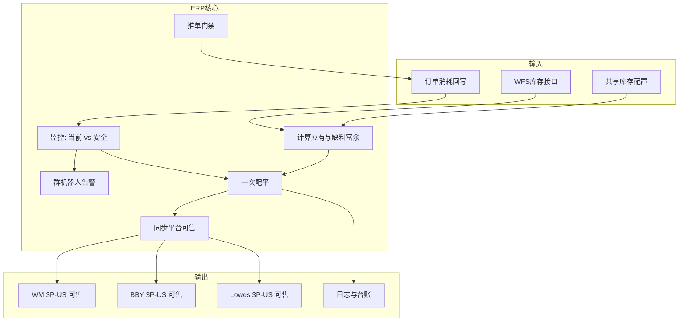
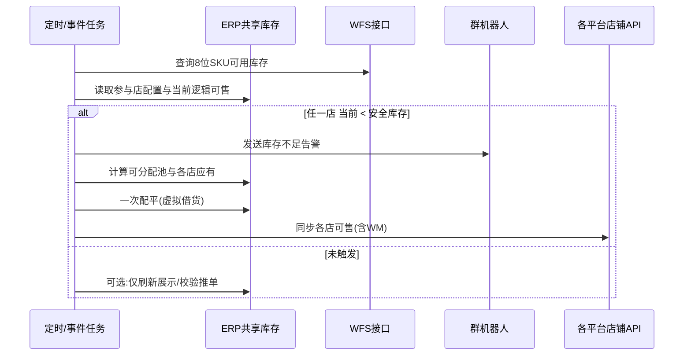

# WFS 共享库存与自动借货 · 详细产品方案

| 属性 | 内容 |
|------|------|
| 文档版本 | v1.0 |
| 编写日期 | 2026-05-22 |
| 文档状态 | 待评审 / 可供二次加工 |
| 所属需求 | 商超 3P · WFS 库存共享 |
| 关联目录 | `../方案/01`、`../方案/02`、`../方案/03` |
| 图形化原型 | [WFS共享库存与自动借货-方案说明.html](./WFS共享库存与自动借货-方案说明.html) |
| 原型来源 | 墨刀「借货管理、共享库存设置」+ 业务对齐会议 + 本方案扩写 |

---

## 目录

1. [背景与动因](#1-背景与动因)
2. [术语与缩写](#2-术语与缩写)
3. [问题陈述与目标](#3-问题陈述与目标)
4. [范围边界](#4-范围边界)
5. [业务现状与约束](#5-业务现状与约束)
6. [整体方案概述](#6-整体方案概述)
7. [核心概念模型](#7-核心概念模型)
8. [功能模块详述](#8-功能模块详述)
9. [计算规则与算法（完整）](#9-计算规则与算法完整)
10. [一次配平与虚拟借货](#10-一次配平与虚拟借货)
11. [平台可售同步](#11-平台可售同步)
12. [群消息机器人告警](#12-群消息机器人告警)
13. [订单推单与消耗追溯](#13-订单推单与消耗追溯)
14. [数据模型与字段建议](#14-数据模型与字段建议)
15. [系统任务与触发时机](#15-系统任务与触发时机)
16. [界面与交互（ERP）](#16-界面与交互erp)
17. [异常、边界与失败处理](#17-异常边界与失败处理)
18. [与关联需求的关系](#18-与关联需求的关系)
19. [非功能需求](#19-非功能需求)
20. [验收标准与测试要点](#20-验收标准与测试要点)
21. [风险、依赖与待决事项](#21-风险依赖与待决事项)
22. [附录](#22-附录)

---

## 1. 背景与动因

### 1.1 公司业务背景

智岩科技商超 3P 业务向 **沃尔玛（Walmart）、Best Buy、Lowes** 等北美商超电商平台铺货。成本测算后 **WFS（Walmart Fulfillment Services）头程尾程综合成本最低**，备货策略逐步转向 **尽量将商超可售 SKU 备入 WFS 仓**，由 WFS 承担尾程履约（或与其它履约方式组合）。

截至方案编写时，业务已具备一定规模（会议提及：约 40+ SKU 上架、近 600 单量级），并计划继续扩 SKU、扩店铺（含 **Lowes 3P-US** 等）。多平台、多品牌、多店铺 **共用同一 WFS 实物库存池** 将成为常态。

### 1.2 WFS 的平台特性（为何不能只靠平台后台分货）

| 特性 | 说明 | 对方案的影响 |
|------|------|----------------|
| 库存账面集中 | WFS 实物与平台账面库存挂在 **沃尔玛 WFS 体系**下，不能像 FBA 一样按「品牌店铺」拆独立库存子账 | 必须在 **ERP 侧** 建逻辑分货 |
| 沃尔玛侧可售 | 沃尔玛店铺侧往往表现为 **WFS 池对该店几乎全量可见** | 仍须在 ERP 按规则 **计算并回写** 可售（业务已确认 WM 也回写） |
| Mirakl 子店 | Best Buy、Lowes 等需在后台维护 **可售库存**，与 WFS 共用实物 | 可售必须由 ERP **计算同步**，避免手工滞后 |
| 接口能力 | WFS 库存 **可查**；改库存能力有限 | **总量以 WFS 接口实查为准**；店铺间不做物理调拨 |
| 订单拉取 | ERP 约 **每 10 分钟** 拉单，非实时 push | 存在时间窗内超卖风险（见需求 02） |

### 1.3 运营现状痛点

1. **多店共池无逻辑配额**：WM、BBY、Lowes 等共用一个 WFS 池，无法回答「某店还能卖几件」。
2. **手工借货协调成本高**：历史上通过 IM 找同事借货（单次 10～20 件），无系统台账；规模放大后不可持续。
3. **安全库存无自动预警**：某店逻辑可售跌破安全线时，运营不能第一时间感知。
4. **平台可售与实物脱节**：子店可售若手工改，易与 WFS 实查、其它店销量不一致，导致超卖或断货。
5. **推单与库存未联动**：库存不足时仍可能推 WFS/谷仓，加剧超卖与客诉。

### 1.4 方案动因（本需求要解决的问题）

在 **沿用 ERP「共享库存设置 + 借货管理」产品形态** 的前提下，将能力 **适配为 WFS 实物池驱动的逻辑共享**：

- **配置**：按 8 位 SKU + 店铺定义共享比例、安全库存；
- **监控**：以 WFS 接口实查为唯一总量；
- **自动配平**：任参与店低于安全库存 → 一次虚拟借货 + 重算各店应有可售；
- **同步**：WM、BBY、Lowes **均** 回写平台可售，&lt;1 停售；
- **告警**：低于安全库存时 **群机器人消息** 通知运营；
- **门禁**：无有效分货/借货不足以发货时 **禁止推单** WFS/谷仓。

### 1.5 与墨刀原型的关系

墨刀原型描述的是 **多店铺 MSKU 共享 + 自动借货 + 同步平台可售**，示例店铺含 Walmart Marketplace、Best Buy、TTS 等。经业务对齐后，本方案 **收敛为 WFS 场景**：

| 墨刀原型要素 | 本方案定稿 |
|--------------|------------|
| 汇总各店库存算池 | **改为仅 WFS 接口实查** |
| 真调库存 / 库存调整单 | **否**；虚拟分货 + 可售同步 |
| 参与店 | **WM 3P-US、BBY 3P-US、Lowes 3P-US**（可扩展） |
| 配置 SKU | **8 位 SKU + 店铺** → 映射 MSKU |
| 低于安全库存触发 | **保留** |
| 群消息提醒 | **新增明确**（见第 12 章） |

---

## 2. 术语与缩写

| 术语 | 定义 |
|------|------|
| WFS | Walmart Fulfillment Services，沃尔玛仓储履约 |
| 8 位 SKU | 生产 SKU（8 位），配置与运算的主键之一 |
| 店铺 | 渠道下的销售店铺，如 WM 3P-US、BBY 3P-US、Lowes 3P-US |
| MSKU | 店铺发货 SKU，由 8 位 SKU + 店铺规则映射，**配置层不直接维护** |
| WFS 实查可用 | 调用 WFS 库存接口返回的 **当前可用实物数量**（唯一总量来源） |
| 逻辑可售 / 当前库存 | 该店该 SKU 在 ERP 中的 **逻辑可售数量**，含已同步平台值及已虚拟借入部分 |
| 安全库存 | 每店每 SKU **固定件数** 底线；低于则触发配平 + 告警 |
| 共享比例 | 各参与店分摊 **可分配池** 的权重，**合计 100%** |
| 可分配池 | `WFS 实查可用 − Σ(参与店安全库存)`，小于 0 时按 0 处理 |
| 应有库存 | 配平目标：`可分配池 × 共享比例 + 本店安全库存`（见公式章） |
| 虚拟借货 | 不改变 WFS 实物位置；仅调整各店 **逻辑可售** 与 **平台可售** 的分配关系 |
| 一次配平 | 单次触发内完成计算、虚拟调剂、同步，**不循环多轮** |
| 停售 | 平台可售同步值 **&lt; 1** 时，按 0 或可售 0 处理并停止售卖（以实现为准） |

---

## 3. 问题陈述与目标

### 3.1 问题陈述

当多个商超 3P 店铺共用 WFS 备货时，ERP 若不能 **以 WFS 实查为总量、按规则分配各店可售**，则会出现：某店显示可售虚高、某店断货仍不知、订单推单超卖、成本无法按店核算等问题。

### 3.2 业务目标

| 编号 | 目标 |
|------|------|
| G1 | 用 **一套可配置规则** 管理 WM/BBY/Lowes 等对同一 8 位 SKU 的 WFS 共享 |
| G2 | **自动** 在低于安全库存时配平各店逻辑可售至「应有」 |
| G3 | **自动同步** 各店平台可售，减少手工改 Mirakl/WM 后台 |
| G4 | **及时告警** 运营处理异常（群机器人） |
| G5 | **推单前校验**，避免无货推 WFS/谷仓 |
| G6 | 为需求 01 **消耗追溯** 提供逻辑库存与借货记录基础 |

### 3.3 非目标（明确不做）

| 编号 | 非目标 |
|------|--------|
| NG1 | 不改变 WFS 仓内 **实物库位** 或生成 **跨仓调拨单** |
| NG2 | 不替代 **现有人工借货申请/审批** 流程（继续沿用已有功能） |
| NG3 | 不在本方案内定义 **BBY 先 WFS 再谷仓** 的完整订单路由（与订单模块另对齐） |
| NG4 | 不解决 **100% 消除 10 分钟拉单窗口超卖**（属需求 02 增强范畴） |
| NG5 | 不要求各店共用同一 MSKU 编码 |

---

## 4. 范围边界

### 4.1 在 scope 内

- 共享库存配置（8 位 SKU + 店铺、比例、安全库存）
- WFS 库存接口拉取与定时/事件刷新
- 触发检测、一次配平、虚拟借货记录
- WM / BBY / Lowes **平台可售回写**（含 WM）
- 低于安全库存的 **群消息机器人告警**
- 推单门禁（无货不推 WFS/谷仓）
- 配置日志、借货日志、告警日志（基础）
- 与需求 01/02/03 的接口与数据衔接说明

### 4.2 不在 scope 内（但需知会）

- 人工借货 UI 与审批流细节
- 促销、调价、Listing 维护
- 谷仓/FBA 独立库存池的共享（非 WFS 池）
- Mirakl 改供货模式（FBM/补仓）自动化——归属需求 02

### 4.3 参与店铺（当前与扩展）

| 阶段 | 店铺 | 说明 |
|------|------|------|
| 当前 | WM 3P-US | 沃尔玛 3P 美国店 |
| 当前 | BBY 3P-US | Best Buy 3P 美国店 |
| 当前 | Lowes 3P-US | Lowes 3P 美国店（示例与演算纳入） |
| 未来 | 更多商超 3P 店 | 同一配置模型扩展一行店铺 + 比例，重新校验 100% |

所有参与店须：**同 8 位 SKU、不同店铺 MSKU、同一 WFS 实物池、不跨仓**。

---

## 5. 业务现状与约束

### 5.1 备货与 MSKU 策略（何欣对齐口径）

- **不采用** 多平台共用一个 MSKU（金蝶辅助属性不一致，改动面大）。
- **采用**：每平台独立 MSKU；备货可先落在某一店铺 MSKU 对应库存上，再通过 **借货/共享** 让其它店铺获得可售份额。
- 本方案在 WFS 场景下升级为：**不以单店 MSKU 物理库存为总量**，而以 **WFS 实查** 为总量，按比例 **虚拟分配** 到各店 MSKU 的可售。

### 5.2 库存总量约束

```
∀ 时刻： Σ(各参与店逻辑可售的「未消耗承诺」) ≤ WFS实查可用 + 在途约定（若有）
```

配平后各店逻辑可售 = 应有，且 **Σ应有 ≤ WFS实查 + 舍入误差容忍**（见算法章）。

### 5.3 已借货与可售的关系

**已借货** 体现为 **借入店的逻辑可售 / 平台可售增加**，不单独维护第二套「借货余额」字段对外展示（内部台账可有借货明细行）。

### 5.4 推单约束

若配平后仍无法满足发货所需（逻辑可售不足、或未配置共享），则 **不允许** 向 WFS 或谷仓推单。

---

## 6. 整体方案概述

### 6.1 逻辑架构



### 6.2 主流程（时序）



---

## 7. 核心概念模型

### 7.1 虚拟共享池

```
                    ┌─────────────────────┐
                    │  WFS 实物（接口实查）  │
                    └──────────┬──────────┘
                               │
              ┌────────────────┼────────────────┐
              ▼                ▼                ▼
        ┌──────────┐    ┌──────────┐    ┌──────────┐
        │ WM 3P-US │    │ BBY 3P-US│    │Lowes 3P  │
        │ 逻辑可售  │    │ 逻辑可售  │    │ 逻辑可售  │
        │ 安全库存  │    │ 安全库存  │    │ 安全库存  │
        └──────────┘    └──────────┘    └──────────┘
```

- **实物只有一份**；三店数字是 **分配视图**。
- **出单**：例如 BBY 出单、WFS 发货，扣减 **BBY 份额**（或记借调来源，见需求 01）。

### 7.2 配置与实例关系

| 层级 | 说明 |
|------|------|
| 配置头 | 8 位 SKU（是否启用 WFS 共享） |
| 配置行 | 店铺 + 共享比例 + 安全库存 |
| 运行态 | 每店：当前逻辑可售、应有、上次同步可售、上次告警时间 |

---

## 8. 功能模块详述

### 8.1 模块清单

| 模块 ID | 名称 | 优先级 | 说明 |
|---------|------|--------|------|
| M1 | 共享库存设置 | P0 | 配置参与店、比例、安全库存 |
| M2 | WFS 库存同步 | P0 | 拉取实查写入共享池总量 |
| M3 | 触发与监控 | P0 | 比较当前与安全库存 |
| M4 | 自动配平 | P0 | 一次虚拟借货 |
| M5 | 平台可售同步 | P0 | WM/BBY/Lowes 回写 |
| M6 | 群机器人告警 | P0 | 低于安全库存通知 |
| M7 | 推单门禁 | P0 | 无货不推 |
| M8 | 日志与查询 | P1 | 配置日志、借货日志、告警记录 |
| M9 | 借货管理展示 | P1 | 展示自动配平结果（沿用借货管理页） |
| M10 | 人工借货 | — | **已有，本方案不展开** |

### 8.2 M1 共享库存设置

**功能描述**：为指定 8 位 SKU 维护参与 WFS 共享的店铺及其规则。

**字段**：

| 字段 | 类型 | 必填 | 规则 |
|------|------|------|------|
| 8 位 SKU | string(8) | 是 | 已存在主数据 |
| 店铺 | enum | 是 | 当前可选：WM 3P-US、BBY 3P-US、Lowes 3P-US |
| 共享比例 | decimal | 是 | 0～100%，同一 SKU 下合计 **= 100%** |
| 安全库存 | int ≥0 | 是 | **固定件数**，非百分比 |
| 启用状态 | bool | 是 | 停用后不触发配平与告警 |

**操作**：新增行、编辑、删除（逻辑删除）、批量导入（可选 P2）。

**校验**：

1. 同一 8 位 SKU 下店铺不可重复；
2. 共享比例合计必须 100%（保存时拦截）；
3. 店铺须属于「新渠道商超 3P」渠道组（与主数据一致）；
4. 至少 2 个参与店才构成「共享」（建议校验，单店无需共享）。

**日志**：每次变更写入「设置日志」（操作人、时间、旧值、新值）。

### 8.3 M2 WFS 库存同步

**功能描述**：按 SKU 从 WFS 接口获取可用库存，作为当日共享池计算的 **唯一实物总量**。

**要求**：

- 支持与配平任务同一事务或同一任务批次内读取，避免「先算后拉」时间差；
- 接口失败时：**不执行配平**，可发 **接口异常告警**（与库存不足告警区分）；
- 记录每次拉取值、时间、接口批次号。

**注意**：**禁止**用 `Σ各店当前逻辑可售` 或 `Σ各店平台可售` 代替 WFS 实查。

### 8.4 M3 触发与监控

**触发条件（充分条件）**：

```
∃ 参与店 i ： 当前逻辑可售_i < 安全库存_i
```

**当前逻辑可售** 定义：

- 该店该 SKU 在 ERP 的 **逻辑可售**；
- 与 **已同步至平台的可售** 一致或同源（若平台回写延迟，以 ERP 逻辑值为准触发，避免漏告警）。

**不触发**：

- 未配置共享或已停用；
- 当前 ≥ 安全库存（等于安全不触发「低于」）；
- WFS 实查拉取失败。

**监控频率**：建议与库存同步任务一致（如每 5～15 分钟，可配置）；订单扣减后可选 **事件触发** 增量检查（P1）。

### 8.5 M4 自动配平

见第 9、10 章。

### 8.6 M5 平台可售同步

见第 11 章。

### 8.7 M6 群机器人告警

见第 12 章。

### 8.8 M7 推单门禁

见第 13 章。

### 8.9 M8 日志

| 日志类型 | 内容 |
|----------|------|
| 设置日志 | 配置 CRUD |
| 借货日志 | 自动配平产生的虚拟借货行（借出店、借入店、数量、前后可售） |
| 告警日志 | 机器人消息发送结果、接收群、SKU、店铺 |
| 同步日志 | 平台 API 请求/响应、失败重试 |

---

## 9. 计算规则与算法（完整）

### 9.1 符号定义

| 符号 | 含义 |
|------|------|
| \(Q_{wfs}\) | WFS 接口实查可用 |
| \(S_i\) | 店 \(i\) 安全库存（固定件数） |
| \(R_i\) | 店 \(i\) 共享比例（0～1，\(\sum R_i = 1\)） |
| \(C_i\) | 店 \(i\) 当前逻辑可售 |
| \(P\) | 可分配池 |
| \(T_i\) | 店 \(i\) 应有库存 |
| \(D_i\) | 店 \(i\) 缺料量 |
| \(E_i\) | 店 \(i\) 富余量 |

### 9.2 可分配池

\[
P = \max\left(0,\; Q_{wfs} - \sum_{i \in 参与店} S_i \right)
\]

**说明**：安全库存先从 WFS 总量中「预留」，剩余部分按比例分给各店（再加回各店安全库存形成应有）。

### 9.3 应有库存

\[
T_i = \lfloor P \times R_i \rfloor + S_i \quad \text{（或四舍五入，需统一舍入规则）}
\]

**舍入策略（须全局统一）**：

- **建议**：先算精确值，按 **最大余数法** 将 \(\lfloor P \times R_i \rfloor\) 之和与 \(P\) 的差分配到各店，保证 \(\sum (T_i - S_i) = P\)（整数件场景）。
- 简易实现：四舍五入后若 \(\sum T_i > Q_{wfs}\)，从最大 \(T_i\) 店递减 1。

### 9.4 缺料与富余

\[
D_i = \max(0,\; T_i - C_i)
\]

\[
E_i = \max(0,\; C_i - T_i)
\]

### 9.5 配平目标

配平完成后：

\[
C_i' = T_i
\]

平台同步可售 \(= T_i\)（若 \(T_i < 1\) 则停售）。

### 9.6 三店数值示例（标准演算）

**输入**：

| 店 | 当前 \(C_i\) | 安全 \(S_i\) | 比例 \(R_i\) |
|----|-------------|-------------|-------------|
| WM 3P-US | 10 | 30 | 30% |
| BBY 3P-US | 30 | 30 | 30% |
| Lowes 3P-US | 160 | 40 | 40% |

\(Q_{wfs} = 200\)（与 \(C_i\) 之和可不一致，**以 WFS 为准**）

**计算**：

1. \(P = 200 - 30 - 30 - 40 = 100\)
2. 按比例分池（未舍入）：WM \(100×0.3+30=60\)，BBY \(60\)，Lowes \(100×0.4+40=80\)
3. 触发：WM \(10<30\) ✓；BBY \(30 \not< 30\) 不触发单独；Lowes 不触发——但 **任一店触发即整 SKU 配平**
4. 缺料：WM \(D=50\)，BBY \(D=30\)，Lowes \(E=80\)
5. 配平排队：缺料 WM(50) &gt; BBY(30)；富余 Lowes(80)
6. 虚拟借货：Lowes → WM 50，Lowes → BBY 30；Lowes 剩余富余 0
7. 结果：\(C'_{WM}=60,\; C'_{BBY}=60,\; C'_{Lowes}=80\)

### 9.7 边界算例

| 场景 | 处理 |
|------|------|
| \(Q_{wfs} < \sum S_i\) | \(P=0\)，各店 \(T_i = S_i\)（仅保底） |
| 全部店 \(D_i > 0\) 且无富余店 | 无法店间调剂；各店 \(T_i\) 仍按公式算，**告警 WFS 总量不足** |
| 仅一家店参与 | 建议配置层禁止或退化为非共享 |
| 比例合计 ≠ 100% | 保存拒绝 |
| \(T_i < 1\) | 平台停售 |

---

## 10. 一次配平与虚拟借货

### 10.1 原则

- **一次触发只执行一轮**配平，不 while 循环至稳定。
- **不产生** 仓库调拨单、不修改 WFS 后台库存。
- **虚拟借货** 仅更新：逻辑可售、借货日志、平台可售同步任务。

### 10.2 配平步骤（算法）

```
输入: Q_wfs, {(S_i, R_i, C_i)}

1. 若不存在店 i 使 C_i < S_i → 退出
2. 计算 P, {T_i}, {D_i}, {E_i}
3. 将缺料店按 D_i 降序排队
4. 将富余店按 E_i 降序排队
5. 对缺料队列每个店 i:
     need = D_i
     从富余队列按序取店 j，transfer = min(need, E_j 剩余)
     记借货日志(j → i, transfer)
     need -= transfer
6. 设 C_i' = T_i  ∀i
7. 提交平台同步
```

### 10.3 借货日志行（自动）

| 字段 | 示例 |
|------|------|
| 类型 | 自动借货 |
| 8 位 SKU | B6062A01 |
| 借出店铺 | Lowes 3P-US |
| 借入店铺 | WM 3P-US |
| 数量 | 50 |
| 调整前/后 | 借入店可售前 10 → 后 60 |
| 备注 | （自动借货）Lowes 3P-US 向 WM 3P-US 调剂 50 |

### 10.4 与「人工借货」区别

| 维度 | 人工借货（已有） | 自动配平 |
|------|------------------|----------|
| 触发 | 人发起 | 系统检测低于安全库存 |
| 总量依据 | 既有规则 | **WFS 实查** |
| 审批 | 可有 | 无 |
| 实物 | 不移动 WFS | 不移动 WFS |

---

## 11. 平台可售同步

### 11.1 规则

| 店 | 是否回写 | 写入值 |
|----|----------|--------|
| WM 3P-US | **是** | 配平后 \(T_i\) |
| BBY 3P-US | **是** | 同上 |
| Lowes 3P-US | **是** | 同上 |

**停售**：若 \(T_i < 1\)，同步为 **0** 并触发平台停售逻辑（以实现对接为准）。

### 11.2 同步时机

- 自动配平完成后 **异步批量** 调用各平台库存 API；
- 失败 **重试 N 次** 后记入同步日志并告警（可与库存不足告警不同模板）。

### 11.3 与需求 02 的关系

- 本方案解决 **常态分配与低于安全库存的配平**；
- 需求 02 的 **销量激增预测砍量、切 FBM** 可在配平之后叠加或并行，需统一 **最终可售 = min(配平结果, 风控上限)**（实现阶段合并规则）。

---

## 12. 群消息机器人告警

### 12.1 场景

当 **任一参与店** 满足 `当前逻辑可售 < 安全库存` 时，在触发自动配平 **之前或同时**（建议：**检测到时立即告警**，配平完成后可发第二条「已配平」可选），向运营群发送消息。

### 12.2 消息样式（与现网「业务告警」机器人一致）

**发送方**：业务告警（机器人）

**标题**：

```
共享库存店铺库存不足
```

**正文模板**：

```
{8位SKU}-{店铺名称} 的店铺库存低于安全库存！
```

**示例**（与用户截图一致结构）：

```
共享库存店铺库存不足

B6062A01-WM 3P-US 的店铺库存低于安全库存！
```

**多店同时触发**：可合并一条或按店多条（建议 **每个 SKU 每个触发店 1 条**，避免漏读；同一任务批次 BBY、Lowes 同时低于则发多条）。

### 12.3 消息扩展字段（建议写入正文或卡片）

| 字段 | 说明 |
|------|------|
| 8 位 SKU | B6062A01 |
| 店铺 | WM 3P-US |
| 当前逻辑可售 | 10 |
| 安全库存 | 30 |
| 缺口 | 20 |
| WFS 实查 | 200 |
| 是否已执行配平 | 是/否 |
| 配平后应有 | 60 |

（扩展字段便于运营决策，**不改变标题模板合规性**）

### 12.4 发送通道

- 对接企业现有 **群消息机器人**（飞书/钉钉/企微，与「业务告警」同通道）；
- 配置：**告警群 ID**、@值班角色（可选）。

### 12.5 防刷屏策略（建议）

| 策略 | 说明 |
|------|------|
| 去重键 | `{8位SKU}-{店铺}-{告警类型}` |
| 冷却时间 | 如 4 小时内同一键只发 1 次（可配置） |
| 恢复通知 | 配平后当前 ≥ 安全，可选发「已恢复」 |
| 失败重发 | 机器人 API 失败重试 3 次 |

### 12.6 告警与配平顺序（推荐）

```
检测低于安全 → 发送告警 → 执行配平 → 同步平台 → （可选）配平结果通知
```

运营即使未及时看群，系统仍 **自动配平**；告警用于 **人工介入异常**（如 WFS 实查骤降、同步失败）。

---

## 13. 订单推单与消耗追溯

### 13.1 推单门禁

**规则**：订单行拟推 WFS 或谷仓前，校验：

```
可用发货量 = 该店该 SKU 当前逻辑可售（配平后）
若 可用发货量 < 本行需发数量 → 拦截推单，提示「共享库存不足，请先借货/配平」
```

**说明**：

- 「无借货不能推」= **无足够逻辑可售份额**；
- 自动配平后若仍不足，继续拦截。

### 13.2 消耗时点（与需求 01 对齐建议）

| 时点 | 建议 |
|------|------|
| 推单成功 | 预扣逻辑可售 |
| 发货/WFS 确认 | 实扣并写消耗来源 |
| 取消订单 | 回滚预扣 |

订单行扩展字段（需求 01）：

- `库存来源类型`：本店份额 / 共享借调-{借出店}
- `履约方`：WFS / 自发货 等

### 13.3 BBY 先 WFS 再谷仓

业务背景 **待与订单模块对齐**；本方案仅保证 **WFS 份额不足时不推 WFS**，不定义谷仓切换完整状态机。

---

## 14. 数据模型与字段建议

### 14.1 表：wfs_share_config（配置行）

| 字段 | 类型 | 说明 |
|------|------|------|
| id | bigint PK | |
| sku_8 | char(8) | 8 位 SKU |
| shop_code | varchar | WM_3P_US 等 |
| share_ratio | decimal(5,2) | 百分比 |
| safety_stock | int | 固定件数 |
| enabled | tinyint | |
| created_at / updated_at | datetime | |
| updated_by | varchar | |

唯一索引：`(sku_8, shop_code)`

### 14.2 表：wfs_share_runtime（运行态，可按 SKU+店）

| 字段 | 说明 |
|------|------|
| sku_8, shop_code | |
| current_sellable | 当前逻辑可售 |
| target_sellable | 最近应有 |
| last_wfs_qty | 最近 WFS 实查 |
| last_sync_qty | 最近同步平台值 |
| last_alert_at | 最近告警时间 |
| last_balance_at | 最近配平时间 |

### 14.3 表：wfs_share_balance_log（配平/借货）

| 字段 | 说明 |
|------|------|
| batch_id | 一次配平批次 |
| sku_8 | |
| from_shop / to_shop | |
| qty | |
| before_to / after_to | 借入店前后 |
| remark | 自动借货说明 |

### 14.4 表：wfs_share_alert_log（告警）

| 字段 | 说明 |
|------|------|
| sku_8, shop_code | |
| alert_type | BELOW_SAFETY |
| message_body | |
| sent_status | success/fail |
| sent_at | |

---

## 15. 系统任务与触发时机

| 任务 | 频率 | 动作 |
|------|------|------|
| WFS 库存拉取 | 5～15 min | 更新 \(Q_{wfs}\) |
| 共享监控配平 | 同上或事件 | 检测 → 告警 → 配平 → 同步 |
| 平台同步重试 | 失败队列 | 重试 |
| 对账任务 | 日 | \(Q_{wfs}\) vs \(\sum C_i\) 偏差报表 |

**事件触发（P1）**：订单扣减、配置变更后立即跑一次该 SKU。

---

## 16. 界面与交互（ERP）

### 16.1 共享库存设置页

- 列表：8 位 SKU、店铺、比例、安全库存、启用、操作；
- 筛选：SKU、店铺；
- 新增/编辑弹窗：店铺下拉（WM/BBY/Lowes）、比例、安全库存；
- 保存校验：比例 100%。

### 16.2 借货管理页

- 展示 **自动配平** 产生的记录（类型=自动）；
- 人工借货 **沿用现有**，不重复开发。

### 16.3 方案说明 HTML

见同目录 `WFS共享库存与自动借货-方案说明.html`（图形化、交互演算、机器人样式预览）。

---

## 17. 异常、边界与失败处理

| 异常 | 处理 |
|------|------|
| WFS 接口超时 | 跳过配平；发「接口异常」告警；保留上次 \(Q_{wfs}\) 仅展示 |
| 平台同步失败 | 重试；仍失败则日志 + 告警，逻辑可售已更新但平台滞后 |
| 配平后仍 \(C_i < S_i\) | 说明 \(Q_{wfs}\) 严重不足；告警「配平后仍低于安全」 |
| 配置比例 100% 但店数变化 | 增删店必须重算比例 |
| 并发配平 | 同 SKU 分布式锁 |

---

## 18. 与关联需求的关系

| 文档 | 关系 |
|------|------|
| 01 区分与追溯 | 本方案提供逻辑可售与借货日志；订单消耗归因在 01 落地 |
| 02 超卖防控 | 02 的预测砍量、切 FBM 与本方案 **可售取 min** 合并 |
| 03 借调自助 | 人工借调审批独立；WFS 实查与已借未消耗在 03 可借上限中扣除 |

---

## 19. 非功能需求

| 项 | 要求 |
|----|------|
| 性能 | 单 SKU 配平 &lt; 2s；批量 500 SKU &lt; 10min |
| 可用性 | 任务失败可手动重跑 |
| 审计 | 配置、配平、告警、同步全留痕 |
| 权限 | 配置修改与手动重跑分权 |

---

## 20. 验收标准与测试要点

### 20.1 验收标准

1. 配置 WM/BBY/Lowes 三店比例 30/30/40、安全库存 30/30/40，WFS=200，能算出应有 60/60/80。
2. WM 当前 10 触发告警，群消息正文含 `B6062A01-WM 3P-US 的店铺库存低于安全库存！`。
3. 一次配平后三店逻辑可售 = 应有，借货日志有 Lowes→WM、Lowes→BBY。
4. 三店平台可售同步为 60/60/80；某店应有 0 时停售。
5. 逻辑可售不足时推单拦截。
6. WFS 接口仅用实查，不用店库存相加。

### 20.2 测试用例编号（摘录）

| ID | 场景 | 预期 |
|----|------|------|
| TC01 | 单店低于安全 | 告警 + 整 SKU 配平 |
| TC02 | 多店同时低于 | 多告警或合并 + 配平 |
| TC03 | 无富余店 | 告警总量不足 |
| TC04 | WFS 接口失败 | 不配平 + 异常告警 |
| TC05 | 同步失败重试 | 日志 + 重试成功 |
| TC06 | 冷却期重复检测 | 不刷屏 |
| TC07 | 比例≠100% 保存 | 拒绝 |
| TC08 | 推单不足 | 拦截 |

---

## 21. 风险、依赖与待决事项

### 21.1 风险

| 风险 | 缓解 |
|------|------|
| 10 分钟拉单超卖 | 需求 02 风控 + 提高安全库存 |
| WM 回写 API 不稳定 | 重试 + 人工兜底 SOP |
| 舍入导致 ΣT_i ≠ Q_wfs | 统一最大余数法 |

### 21.2 依赖

- WFS 库存查询接口稳定；
- 各店平台改可售 API（Mirakl / WM）；
- 群机器人「业务告警」通道与模板审批。

### 21.3 待决事项

| 编号 | 事项 | 状态 |
|------|------|------|
| O1 | BBY 先 WFS 再谷仓完整路由 | 待订单模块对齐 |
| O2 | 配平后是否第二条「已配平」通知 | 待产品确认 |
| O3 | 告警冷却时间具体小时数 | 待运营确认 |
| O4 | 整数舍入具体算法代码级 | 开发统一 |

---

## 22. 附录

### 22.1 修订记录

| 版本 | 日期 | 说明 |
|------|------|------|
| v1.0 | 2026-05-22 | 首版：含 WM/BBY/Lowes、机器人告警、WFS 实查、业务对齐口径 |

### 22.2 参考文档

- `../方案/01-WFS多品牌库存区分与借调消耗追溯.md`
- `../方案/02-WFS跨平台共享库存与超卖防控.md`
- `../方案/03-WFS库存借调自助与校验.md`
- `../原始需求/会议1`

### 22.3 业务对齐纪要（摘要）

| # | 结论 |
|---|------|
| 1 | 总量仅用 **WFS 实查** |
| 2 | 配置：**8 位 SKU + 店铺** → MSKU |
| 3 | 参与店：**WM、BBY、Lowes**（可扩展） |
| 4 | 安全库存：**固定件数** |
| 5 | 触发：**当前 < 安全库存**；补货量按 **应有 − 当前** |
| 6 | **一次配平**；缺料 **从大到小** |
| 7 | 配平后 **= 应有** |
| 8 | **虚拟借货**，非真调拨 |
| 9 | **WM、BBY、Lowes 均回写** 可售；**&lt;1 停售** |
| 10 | **无货不推** WFS/谷仓 |
| 11 | **低于安全 → 群机器人告警**（本版补充） |
| 12 | 人工借货：**已有，忽略** |

---

*本文档为二次加工底稿，实施前请与研发、运营、财务联合评审。*
