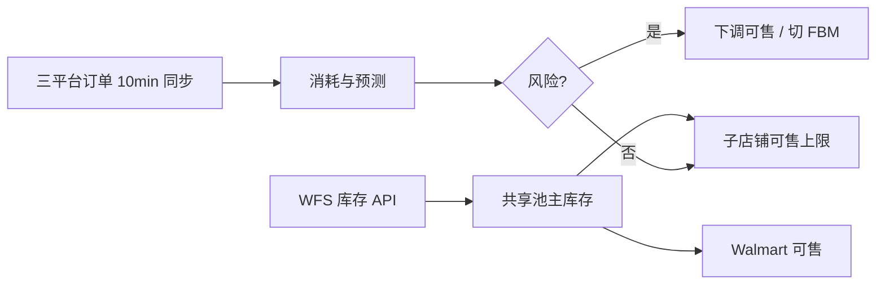

# 需求 02：WFS 跨平台共享库存与超卖防控

> **来源**：`原始需求/会议1`

---

## 一、原始需求（用户表述提炼）

### 1.1 背景

- 向 WFS 备货的 SKU（例：1000 台），在 **沃尔玛侧 WFS 库存全部表现为可售**；Best Buy、Lowes 等 **Mirakl 店铺只能在后台手动配置可售数**，且与 WFS 共用同一实物池。
- 订单由 ERP **约每 10 分钟拉取**（非平台实时 push）；沃尔玛下单会 **较快占用 WFS**，Best Buy/Lowes 往往 **推单后才扣减**，存在 **时间差超卖** 风险。
- 会议结论：短期内订单量不大，但旺季或大促时「10 分钟内卖光分配量」理论上可能发生。

### 1.2 需求要点

| 编号 | 原始诉求 | 会议原话要点 |
|------|----------|--------------|
| R2-1 | **多平台共用 WFS 时控制可售**，避免 Best Buy/Lowes 与沃尔玛抢库存导致超卖 | 「WFS 这个数对于沃尔玛来讲是全部可售……另外两个可以手动去配」 |
| R2-2 | **承认拉单间隔风险**，希望系统侧有机制降低超卖概率 | 「10 分钟拉一次……沃尔玛 10 分钟之内可能把 200 台全卖光」 |
| R2-3 | **优先动子店铺可售/供货模式**，不动沃尔玛 WFS 配置 | 「改不了沃尔玛，你只能去卡另外两个」 |
| R2-4 | **风险时自动减量或切补仓/自发货** | 「识别到有风险，就把另外店铺库存调小或切掉」「WFS 没货自动切补仓」 |
| R2-5 | **复用现有共享库存能力**，主库存=沃尔玛 WFS | 「直接配共享库存……主库存就是沃尔玛」 |

### 1.3 提出方关注点

- **沃尔玛不超卖**（平台侧占满 WFS 时由沃尔玛自己控）。  
- **Best Buy / Lowes 等不超卖**：在无法改 WFS 的前提下，通过 **可售库存下调、停售、切 FBM/补仓** 保护。  
- **可预测、可恢复**：风险过后可补货、再放开子平台可售。

---

## 二、问题与痛点

| 痛点 | 说明 |
|------|------|
| 平台库存不同步 | 子平台卖 WFS 货，后台 WFS 扣减非实时，ERP 10 分钟拉单进一步放大窗口 |
| 手工配可售费时且滞后 | 靠人盯沃尔玛销量再改 Mirakl 可售数 |
| 无法改 WFS 总量分配 | 沃尔玛占满 WFS 可售，只能在其他店铺做「闸门」 |

---

## 三、解决方案

### 3.1 业务方案

1. **共享库存配置（沿用 ERP 共享库存）**  
   - **主库存**：沃尔玛 WFS（接口实时查 WFS 可用量）。  
   - **子店铺**：Best Buy、Lowes、Notes 等，配置 **可售上限或比例**（例：各 100，总量仍受 WFS 约束）。  
   - 谷仓等非 WFS 货源单独管理（会议：谷仓共用可自行在 ERP 分货）。

2. **消耗监控与预算**  
   - 每 10 分钟（与订单同步节奏一致）汇总 **三平台成交/待发货量**。  
   - 计算：`WFS 可用 ≈ 接口实查 − 已分配子店可售占用 − 在途借调`（与需求 01、03 一致）。

3. **超卖防控规则（可配置）**  
   - **阈值**：WFS 剩余低于 X 或子店已借+已售超过预算 → 触发。  
   - **动作梯度**：  
     - 一级：下调 Best Buy/Lowes **可售库存**；  
     - 二级：可售置 0；  
     - 三级：**切换供货模式**为补仓/自发货（若平台支持且企业有补仓库存）。  
   - **预测（可选增强）**：连续 N 个 10 分钟窗口统计沃尔玛 **销量加速度**；若激增，提前锁子店可售（会议「连续 3～5 个 10 分钟从 10 单到 50 单到 100 单」场景）。

4. **运营手册**  
   - 明确：**不能 100% 消除** 极端 10 分钟_burst_，但优于纯人工。  
   - 旺季前提高安全库存、收紧子店比例。

### 3.2 系统方案

| 环节 | 说明 |
|------|------|
| 库存同步 | WFS 实时查询 + 共享库存主从关系 |
| 任务 | 定时任务：拉单、算剩余、评估风险、调用 Mirakl 改可售/供货模式（API 能力需验证） |
| 告警 | 风险触发、子店被清零、切 FBM 时通知运营 |
| 与需求 01 | 逻辑池扣减与共享池物理量定期对账 |

### 3.3 待澄清项

1. Best Buy/Lowes **改可售、改供货模式** 的 Mirakl API 是否齐全、是否可自动化。  
2. WFS 对 **非沃尔玛订单** 的扣减时点（推单 vs 出库）——需业务再核实。  
3. 子店可售为 0 后，**补仓库存** 是否保证有货、切换是否全自动。  
4. 「Seller Fulfilled + 自行推 WFS」方案因 **损害 WFS 权重** 被否决，不再作为默认方案。

### 3.4 验收要点（建议）

1. 共享库存主仓配置为 WFS，子店可售 **不超过** 配置上限且 **总和策略** 可说明。  
2. 模拟沃尔玛销量激增或 WFS 骤降时，系统能在约定时间内 **下调或清零** 子店可售（或告警）。  
3. 支持配置 **预测规则** 开关及参数（N 窗口、销量阈值）。  
4. 操作与结果有 **日志** 可追溯。

---

## 四、风险与依赖

- **平台 API 与延迟**：自动化改可售失败时需人工兜底流程。  
- **10 分钟窗口不可消除**：需在需求文档与 SLA 中写清。  
- **依赖订单同步频率**：若改为 5 分钟，规则需重评。  
- **与需求 03 借调**：借调未入账会高估可借量，需统一库存模型。
