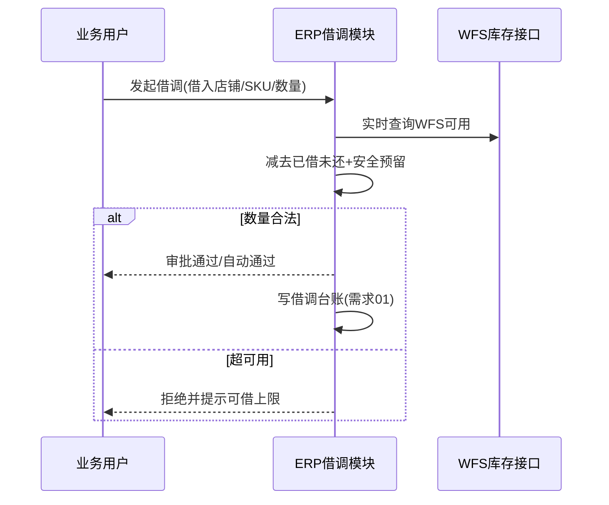

# 需求 03：WFS 库存借调自助与校验

> **来源**：商超 3P 需求沟通会议  
> **记录文件**：`../原始需求/会议1`  
> **关联**：需求 01（借调台账）、需求 02（超卖防控）

---

## 一、原始需求（用户表述提炼）

### 1.1 现状

- 日常 **手动找同事（如魏超）借调** WFS 库存，单次 **10～20 件** 小批量。  
- 名义上各平台从沃尔玛池借货，存在 **超卖风险**，但量小尚可人工盯。  
- 平台侧 **无法校验** 借调是否合理；ERP 现有 **店铺间借调** 基于自发货扣减，与 **WFS 不动账** 场景不匹配。

### 1.2 需求要点

| 编号 | 诉求 |
|------|------|
| R3-1 | 为商超 3P **专门增加借调功能**，业务 **自助申请**，减少找人协调 |
| R3-2 | 借调时 **系统校验**：实时查 WFS 库存，扣除 **已借未消耗**，给出 **还可借数量** |
| R3-3 | 规则示例：可借量不超过 WFS 库存的 **一定比例（如 30%）**（会议提出，待业务确认） |
| R3-4 | 明确：**不能替代** 超卖根本解决，仅 **提升借调效率** |

### 1.3 约束

- WFS 仓库 **接口可查、难改**；借调 **不改变沃尔玛账面**，仅 ERP **逻辑分配 + 台账**。  
- 人工借调 **系统无法强校验** 平台侧真实占用，需在界面 **提示风险**。

---

## 二、解决方案

### 3.1 流程设计

### 3.2 功能清单

| 功能 | 说明 |
|------|------|
| **借调申请单** | 借出方（沃尔玛池）、借入方（BBY/Lowes 等）、SKU、数量、原因 |
| **可借上限计算** | `min( WFS实时 × 比例上限, WFS实时 − 已借 − 安全库存 − 其他平台已分配 )` |
| **审批策略** | 默认小额自动通过；超额走审批（可选） |
| **与订单联动** | 借入方后续 WFS 订单消耗时回写台账（同需求 01） |
| **操作记录** | 替代 IM 找人中台 |

### 3.3 与现有「店铺借调」差异

| 维度 | 现有店铺借调 | WFS 3P 借调 |
|------|--------------|-------------|
| 库存来源 | 自发货店铺库存扣减 | **不扣沃尔玛账**，仅 ERP 虚拟分配 |
| 校验 | 店铺库存够不够 | **WFS 接口 + 已借汇总** |
| 适用 | 传统电商店铺 | 商超 3P 共用 WFS |

建议：**新建单据类型**「WFS 借调」，避免复用错误逻辑。

### 3.4 待澄清项

1. 借调 **比例上限**、**单笔上限** 最终值。  
2. 谁有 **审批权限**；是否需 **双品牌负责人** 确认。  
3. 借调后是否在 Mirakl **同步增加借入方可售**（人工还是 API）。  
4. 与需求 02 自动 **砍库存** 的优先级（借调增加 vs 风控减少）。

### 3.5 验收要点

1. 业务可在 ERP 完成借调申请，**无需线下找人**。  
2. 申请时展示 **WFS 实时、已借、可借上限** 三项数字。  
3. 超额申请被拒绝且原因可读。  
4. 借调记录可在需求 01 面板查询并关联消耗。
