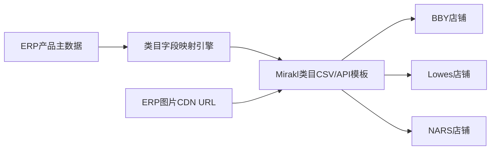

# 需求 04：多平台 Listing 集中维护与跨平台复用

> **来源**：商超 3P 需求沟通会议  
> **记录文件**：`../原始需求/会议1`

---

## 一、原始需求（用户表述提炼）

### 1.1 背景

- **BVI** 由 Reason 迁回 **Mirakl（MySQL 平台）**，需 **全部 Listing 重上**。  
- 后续将开 **Lowes、NARS、Target** 等，若每个平台 **重复手工建品**，效率极低。  
- 商超客户要求 **全品上架**，已有 **100+ SKU** 多在 Mirakl 后台 **逐个创建**，历史 **无统一 Excel 主数据**。  
- Mirakl **店铺级独立**：每个店铺需单独上传；BBY 与 NARS 由对方出资买 Mirakl，**店铺拷贝/克隆服务需另付费**，业务侧判断 **大概率不会采购**。

### 1.2 需求要点

| 编号 | 诉求 |
|------|------|
| R4-1 | **跨平台映射/复用**：BBY 已上品，其他品牌能否 **复用资料** 减少人工（「映射的方式」） |
| R4-2 | **ERP 作为产品主数据源**：长宽高、描述、认证、图片等 **集中维护**，改一次 **多平台同步** |
| R4-3 | 通过 **Mirakl API** 创建产品/offer，避免在 Mirakl 页面 **逐个填** |
| R4-4 | 支持 **按类目模板** 导出/导入：不同类目 **必填字段不同**（约 **7～8 个类目**），需 **字段映射** |
| R4-5 | **图片**：CSV 导入仅文字，图片需 **可访问 URL**；希望 ERP 存图并传 **链接或文件流**（待验证 Mirakl API） |
| R4-6 | 可与 **亚马逊资料** 对齐整理（size、description），但 ERP 目前 **无完整亚马逊 listing 细项** |

### 1.3 会议结论倾向

- Mirakl **有 CSV 导入/导出**，导出多为 **维护记录**，图片 URL **易失败**。  
- **短期**：维护 **一份主 Excel/ERP 主数据**，新平台按模板导入。  
- **中期**：ERP 维护 + **按 Mirakl 类目模板映射** + API 推送；需调研 **产品创建、图片上传** API。  
- **Connect/Vision 类托管模式**：成本高、模式重，**不作为首选**。

---

## 二、问题与痛点

1. **重复劳动**：每开一店重复 add offer、填类目参数。  
2. **字段不一致**：平台间 item/name 等 **列名与必填项不同**。  
3. **主数据分散**：尺寸描述现靠 **翻亚马逊** 或后台手填。  
4. **无法从 BBY 导出再导入 NARS**：平台 **不支持跨店复制**（除非付费服务）。

---

## 三、解决方案

### 3.1 目标架构

### 3.2 分阶段方案

#### 阶段 A：主数据与模板（1～2 迭代）

| 项 | 内容 |
|----|------|
| **ERP 产品资料库** | SKU 维度：model、长宽高重、描述、认证、主图/附图 URL、类目（内部） |
| **历史迁移** | 从 Mirakl **CSV 导出** 已建品 + 人工补全 100+ SKU 一次性入库 |
| **类目映射表** | 内部类目 ↔ Mirakl 类目；每 Mirakl 类目一份 **必填字段清单**（来自官方模板） |
| **线下导入验证** | 选一 **SKU 多的类目** 试 CSV 导入 Mirakl，确认图片 URL 规则 |

#### 阶段 B：ERP → Mirakl API（依赖调研）

| 项 | 内容 |
|----|------|
| **API 能力清单** | 创建 product/offer、更新库存价格、**图片**（链接拉取 vs 文件上传） |
| **推送任务** | 选择店铺 + SKU 列表 → 生成 payload → 调用 API → 回写 **平台 item id** |
| **跨店复用** | 非「Mirakl 克隆店」，而是 **同一 ERP 主记录** 向多店铺 **各推一次**（字段按店映射） |
| **增量同步** | 主数据变更 → 勾选同步范围 → 队列推送 |

#### 阶段 C：运营工具

- **批量 Excel 导入 ERP**（比直接导入 Mirakl 可控）  
- **新品流程**：新品在主数据立项 → 审核 → 一键多店上架  
- 与 **全渠道 Connect** 能力边界对齐，避免重复建设

### 3.3 「跨品牌复用」的业务含义（澄清后实现）

- **不是** Mirakl 把 BBY 店复制到 NARS 店。  
- **是** Govee 在 ERP 维护 **一份标准资料**，向 **BVI / NARS / Lowes** 各自店铺 **按映射规则发布**。  
- 不同品牌若 **前台品牌名、厂商字段** 不同，在映射层做 **默认值/品牌表** 替换。

### 3.4 依赖与分工

| 依赖 | 负责 |
|------|------|
| Mirakl API 文档与沙箱 | 研发 + 平台对接人 |
| 类目模板下载 | 业务提供已用类目列表 |
| 图片 CDN | 基础设施/ERP 附件服务 |
| 是否采购 Mirakl 克隆服务 | **业务决策**（会议倾向不采购） |

### 3.5 待澄清项

1. Lowes 开店时间表与 **字段差异** 样本。  
2. 各店 **价格/库存** 是否同一接口维护，还是仅本需求管 **listing 资料**。  
3. A+ / PP 图等 **富内容** 是否纳入一期。  
4. 与 **亚马逊 listing** 同步是否单列项目。

### 3.6 验收要点

1. ERP 可维护 ≥ 会议涉及字段集，并支持 **批量导入**。  
2. 至少 **1 个 Mirakl 类目** 完成「ERP → 平台新建 offer」闭环（API 或经校验的 CSV）。  
3. 新开第二店铺时，**同一 SKU 上架人天** 显著低于纯手工（业务定义）。  
4. 主数据变更后，可 **勾选店铺** 触发同步且有失败重试日志。

---

## 四、风险

- Mirakl **API 不支持图片或创建 offer** 时，仅能半自动（CSV + 手工图）。  
- 类目多、字段差异大，**映射配置** 维护成本不低。  
- 平台 **导入图片 URL** 必须公网可达，需统一图床策略。
