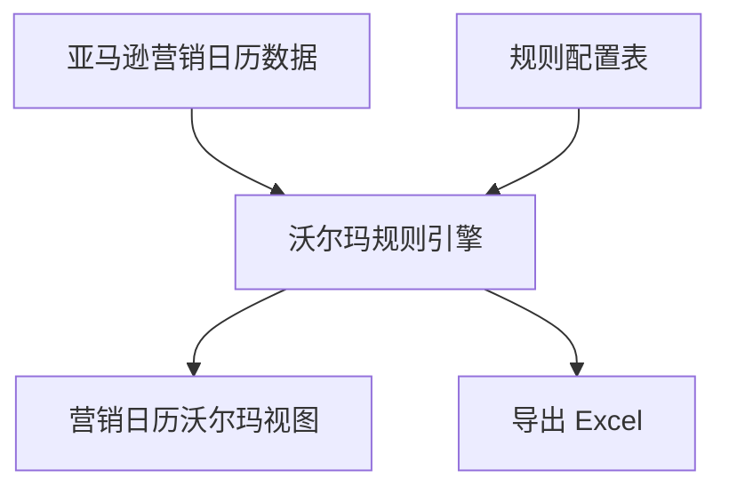

# 需求 07：沃尔玛促销规划试算与营销日历面板

> **来源**：`原始需求/会议1`

---

## 一、原始需求（用户表述提炼）

### 1.1 背景

- 沃尔玛促销类型相对固定：**Coupon（discount）**、**划线价**、**Promotion（灵活时段）**、**Flash / Best Deal（每月固定窗口，做划线）**。
- 运营需把亚马逊月度计划 **翻译** 成「沃尔玛这几天报 Promotion / Coupon / Flash」，目前 **全靠人工对比日历**，每月 **排期 + 后台维护** 耗时可到 **一两天**。
- **全渠道资源计划/营销日历系统已上线**，源数据具备，适合加 **沃尔玛试算** 能力。
- 若面板做得好，**可替代单纯导出** 作为主工作界面，但 **导出仍要保留**（需求 06）。

### 1.2 需求要点

| 编号 | 原始诉求 | 会议原话要点 |
|------|----------|--------------|
| R7-1 | **成文的沃尔玛规则** + 系统按规则 **高亮可报项** | 「成文的告诉他……Flash deal 只能在这个时间段……highlight 出来」 |
| R7-2 | 输入 SKU，展示 **月视图**（类似现有 Excel），标出建议报 **Promotion/Coupon/Flash** | 「输入 SKU……无脑报就可以」 |
| R7-3 | 依托 **亚马逊促销计划** 为输入，输出沃尔玛 **可执行建议**（非自动跟价） | 「依据亚马逊……在沃尔玛那边我可以做什么」 |
| R7-4 | 集成 **全渠道营销日历**，加渠道筛选「沃尔玛」 | 「资源计划上……加一个渠道筛选……沃尔玛计划试算」 |
| R7-5 | 视觉：黄块 Flash、绿块 Coupon 等 **团队约定色** | 「Flash deal 黄色块……discount 绿色块」 |
| R7-6 | 业务 **本周整理规则文档** 供研发实现 | 「这周会把逻辑跟你们对好」 |

### 1.3 沃尔玛规则（会议口述摘要，以实现时业务文档为准）

| 类型 | 规则摘要 |
|------|----------|
| Coupon | 对应亚马逊 Coupon/复控时段，灵活 |
| 划线价 | 非 Coupon 的降价展示 |
| Promotion | 灵活报名日期 |
| Flash / Best Deal | **固定月内窗口**，仅窗口内可报 Flash，且多为划线逻辑 |

示例逻辑（会议举例）：亚马逊某段卖 239.99，若同期 **落在 Walmart Flash 窗口**，则高亮「可报 Flash」；窗口外则提示无意义或改报 Promotion。

---

## 二、解决方案

### 2.1 业务方案

1. **规则引擎（配置化）**  
   - 维护：`促销类型 × 适用条件（日期窗口、价格条件、与亚马逊类型映射）× 输出标签`。  
   - 输入：SKU + 月、亚马逊侧 **按日促销类型+价格**（来自营销日历）。  
   - 输出：每日 **建议沃尔玛动作** + 原因码（可选）。

2. **交互**  
   - 路径：**全渠道管报/资源计划 → 营销日历 → 渠道=沃尔玛（或商超3P-沃尔玛）**。  
   - 视图：月历格，**背景色/角标** 表示 Flash/Coupon/Promotion/仅维护价格。  
   - 支持 **导出 Excel**（与需求 06 相同字段 + **沃尔玛建议列**）。

3. **执行边界**  
   - 默认 **试算 + 高亮**，运营 **仍到 Mirakl/沃尔玛后台报名**（除非需求 08 API 可自动创建 Promotion）。  
   - **不**默认开启沃尔玛「自动跟亚马逊价」（曾丢购物车，业务否决）。

### 2.2 系统方案

| 模块 | 说明 |
|------|------|
| 规则配置 | 后台可配 Flash 窗口、映射表；版本管理 |
| 试算服务 | 按 SKU+月批量计算，缓存 |
| 前端 | 复用全渠道营销日历组件，扩展列/色 |
| 权限 | 商超运营只读/可导出 |

### 2.3 待澄清项

1. 业务 **成文规则 v1**（含 Best Deal 具体日期、与 Notes/BVI 差异）。  
2. 亚马逊 **叠加促销** 时沃尔玛建议优先级。  
3. 是否与 **30 天锁价** 临时变动联动（会议称小范围，可二期）。  
4. 面板与 **6 月促销导出** 的发布顺序。

### 2.4 验收要点（建议）

1. 给定业务样例 SKU+月，系统高亮 **与人工表一致率** ≥ 约定阈值（如 95%）。  
2. Flash 窗口外日期 **不出现** Flash 建议。  
3. 可导出带 **沃尔玛建议列** 的 Excel 供复核。  
4. 规则变更后 **无需发版** 或仅需配置发布（以实现为准）。

---

## 四、风险与依赖

- **强依赖业务规则文档** 质量；规则错误直接导致误报促销。  
- **依赖需求 06** 亚马逊侧类型数据准确。  
- **不解决 Mirakl 改价耗时** 本身，仅缩短 **决策** 时间；改价自动化见需求 08。
