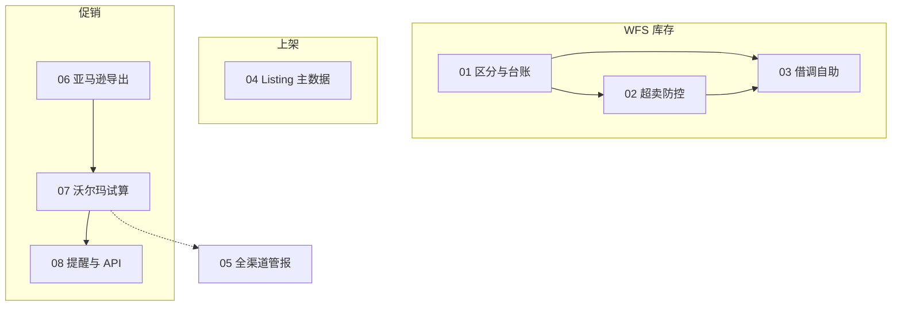

# 商超 3P 需求方案索引

**会议来源**：`../原始需求/会议1`  
**会议主题**：WFS 库存管理、产品上架及促销规划  
**整理说明**：按「一个需求一个文档」拆分；每篇含 **原始需求提炼** + **解决方案**。

**场景梳理（PRD 前）**：[商超3P-场景梳理.html](./商超3P-场景梳理.html) — 框架梳理001 产出，单页对齐背景 / 痛点 / 方案轮廓 / 待确认。

---

## 需求清单

| 编号 | 文档 | 主题 | 优先级（会议隐含） |
|------|------|------|-------------------|
| 01 | [01-WFS多品牌库存区分与借调消耗追溯.md](./01-WFS多品牌库存区分与借调消耗追溯.md) | 品牌逻辑库存、借调台账、订单消耗追溯 | 高（备货策略已转向 WFS） |
| 02 | [02-WFS跨平台共享库存与超卖防控.md](./02-WFS跨平台共享库存与超卖防控.md) | 共享库存主从、预测砍量、切 FBM/补仓 | 高 |
| 03 | [03-WFS库存借调自助与额度校验.md](./03-WFS库存借调自助与额度校验.md) | 借调自助、WFS 实查与比例上限 | 中（效率） |
| 04 | [04-商超3P多平台Listing集中维护与跨平台复用.md](./04-商超3P多平台Listing集中维护与跨平台复用.md) | ERP 主数据、类目映射、Mirakl 导入/API | 高（Lowes 开店） |
| 05 | [05-商超3P销售成本纳入全渠道管报.md](./05-商超3P销售成本纳入全渠道管报.md) | 纳入全渠道管报，不单独立项 | 中（跟随管报） |
| 06 | [06-亚马逊促销日历导出与Coupon划线价区分.md](./06-亚马逊促销日历导出与Coupon划线价区分.md) | 促销类型可识别的导出 | 中（约 6 月营销日历） |
| 07 | [07-沃尔玛促销规划试算与营销日历面板.md](./07-沃尔玛促销规划试算与营销日历面板.md) | 沃尔玛规则试算、全渠道日历高亮 | 高（省 1～2 天/月） |
| 08 | [08-促销分段维护提醒与Mirakl促销API调研.md](./08-促销分段维护提醒与Mirakl促销API调研.md) | 促销结束提醒 + API 调研/可选自动化 | 中 |

---

## 需求依赖关系

---

## 会议中已明确「不做 / 暂缓 / 外部依赖」

| 项 | 说明 |
|----|------|
| Mirakl 付费拷店 | 由 BBY/NARS 采购，商超团队默认不依赖 |
| 沃尔玛自动跟亚马逊价 | 曾丢购物车，业务坚持自维护 |
| WFS 改沃尔玛可售分配 | 平台侧动不了，只能动其他店铺 |
| Seller Fulfilled 替代 WFS | 损害权重，否决 |
| 30 天锁价临时变动 | 会议称小范围，暂不讨论 |

---

## 建议实施顺序（供排期参考）

1. **P0**：04 Listing（Lowes 开店）+ 02 共享库存基础配置 + 06 促销导出（若在研则对齐验收）  
2. **P1**：01 台账 + 03 借调自助 + 07 沃尔玛试算（待业务规则文档）  
3. **P2**：02 预测砍量、08 提醒与 API 自动化、05 管报渠道验收  

---

## 业务待交付物（会议承诺）

- [ ] 沃尔玛促销 **成文规则**（Flash 窗口、与亚马逊映射）— 用于需求 07、08  
- [ ] 促销排期 **Excel 模板样例** — 用于需求 06、07  
- [ ] WFS 扣减时点 **复核结论** — 用于需求 02  
- [ ] Mirakl **API 能力矩阵**（技术调研）— 用于需求 04、08
