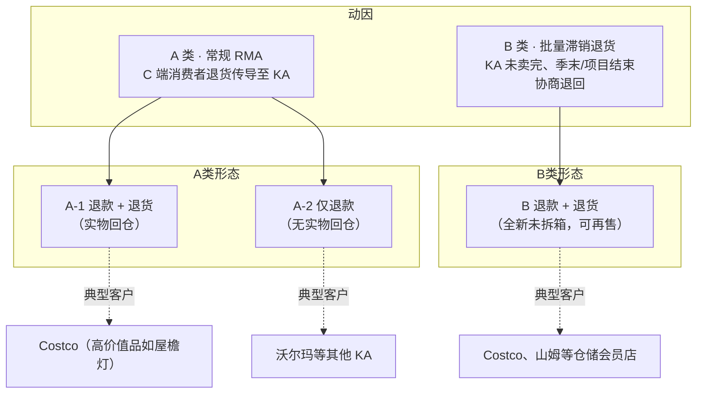
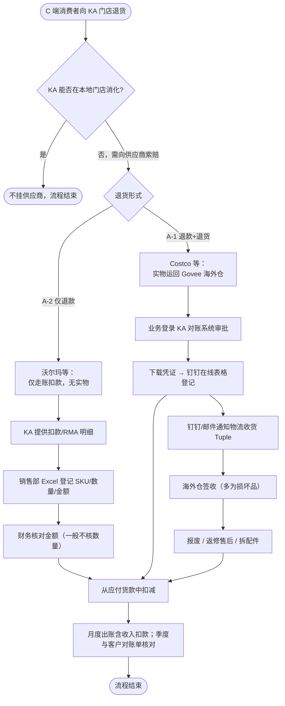
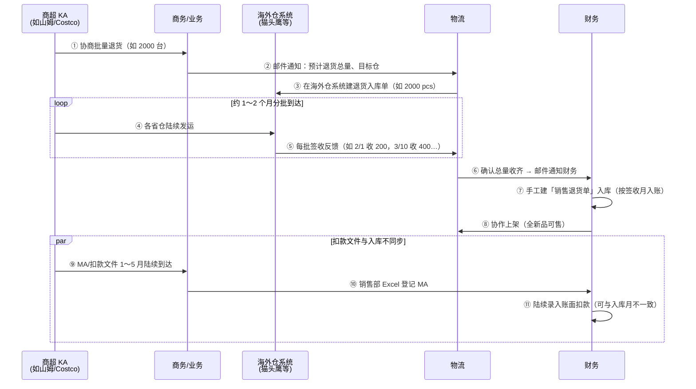
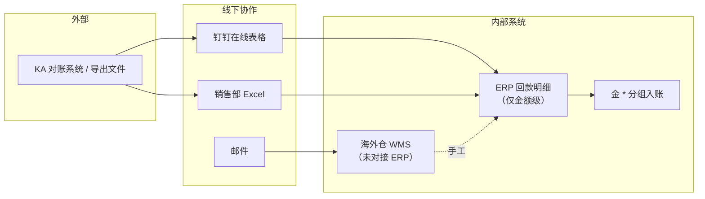

# 线下商超退货 · 完整流程梳理

| 属性 | 内容 |
|------|------|
| 文档版本 | **v1.0** |
| 编写日期 | 2026-05-26 |
| 信息来源 | [会议1](../会议/会议1)（全渠道管报调研 · 商超线下退货专题） |
| 文档定位 | 基于会议原文梳理的业务流程说明，供产品、财务、物流及管报团队对齐认知 |
| **图形版（推荐预览）** | [线下商超退货-完整流程说明.html](./线下商超退货-完整流程说明.html) |

---

## 1. 背景：为什么要梳理这条链路？

当前在做**全渠道管报**时发现：商超渠道存在**线下大批量退货**，但 ERP 侧**几乎没有完整记录**——系统里看到的销量是「卖出去的」，**没有扣减退货**，导致收入与毛利口径失真。

**本次范围界定：**

| 纳入 | 不纳入 |
|------|--------|
| 商超客户（KA）退给供应商（智岩/Govee）的**大批量退货** | C 端消费者零星退 1～2 件的小额场景 |
| 影响**收入计算**的扣款 / 退款 | 仅扣 MA 费用、与退货无关的小额调整 |
| CRM / 商超**退收入**类业务 | — |

---

## 2. 一张总览图：两大退货类型

商超线下退货按**业务动因**分为 **A 类** 与 **B 类**，二者都影响收入，但**货物流**与**协作方式**差异很大。



### 2.1 三类场景速查对比

| 维度 | A-1 退款 + 退货 | A-2 仅退款 | B 批量滞销退货 |
|------|-----------------|------------|----------------|
| **业务动因** | C 端消费者退货，KA 向供应商索赔 | C 端消费者退货，KA 本地处理或走账 | KA 备货过多、季末卖不动 |
| **典型客户** | Costco（高价值 SKU） | 沃尔玛等多数 KA | Costco、山姆 |
| **是否有实物回仓** | ✅ 有（退至指定海外仓） | ❌ 无（仅退款走账） | ✅ 有（整批退回） |
| **货物状态** | 多为损坏，报废/返修/拆配件 | — | **全新未拆箱**，可上架再售 |
| **退款方式** | 从应付货款中扣减 | 从应付货款中扣减 | 从应付货款中扣减（MA 文件陆续到达） |
| **ERP 入库** | ❌ 目前无规范销售退货单 | ❌ 无 | ✅ 财务手工建**销售退货单** |
| **主要协作渠道** | 客户对账系统 + 钉钉表格/群 | Excel 登记 + 钉钉 | 邮件 + 海外仓系统建单 |

---

## 3. 参与角色与职责

```text
┌─────────────┐     ┌─────────────┐     ┌─────────────┐     ┌─────────────┐
│  商超 KA     │     │  商务/业务   │     │    物流      │     │    财务      │
│ Costco/沃尔玛│────▶│ 对接协商     │────▶│ 收发货协调   │────▶│ 扣款/入库   │
│ 山姆等       │     │ 客户系统操作 │     │ 海外仓建单   │     │ 对账/上架    │
└─────────────┘     └─────────────┘     └──────┬──────┘     └─────────────┘
                                               │
                                               ▼
                                    ┌─────────────────────┐
                                    │ 海外仓（如加州猫头鹰仓）│
                                    │ 签收 / 质检 / 上架    │
                                    └─────────────────────┘
```

| 角色 | 核心职责 |
|------|----------|
| **商超 KA** | 发起退货/扣款；提供 RMA 凭证、对账明细或 MA 文件；安排实物发运（若有） |
| **商务/业务** | 登录客户对账系统审批；下载凭证；在钉钉在线表格登记；通知物流 |
| **物流** | 对接海外仓建单、跟踪分批签收；确认收齐后邮件通知财务 |
| **财务** | 核对扣款金额；录入回款明细/MA；建销售退货单（B 类）；与物流协作上架；季度对账 |
| **海外仓** | 实物签收；反馈每批到货数量；B 类全新品配合上架 |

---

## 4. A 类退货 · 常规 RMA 完整流程

> **定义**：由 **C 端消费者退货行为**引发，KA 将成本/退款**转嫁到供应商（Govee）**头上。  
> 货权在销售时已转移至 KA；若 KA 在门店本地消化则**不会**挂到供应商。

### 4.1 A 类总流程（分岔：有无实物）



### 4.2 A-1 退款 + 退货（以 Costco 为例）

**适用**：高价值产品（如屋檐灯），消费者强制退货退款且因**产品本身原因**（非渠道原因）。

```text
  Costco 对账系统                业务人员                    物流 / 海外仓              财务
       │                            │                            │                      │
  ① 汇总 C 端 RMA 凭证              │                            │                      │
  ② 系统弹出扣款通知  ──────────▶  ③ 登录系统审批同意            │                      │
       │                            │                            │                      │
       │                       ④ 下载凭证/明细                    │                      │
       │                            ├──────────────────────────▶ ⑤ 钉钉/邮件：将有货退回  │
       │                            │                            │                      │
       │                            │                       ⑥ 猫头鹰仓签收               │
       │                            │                       ⑦ 损坏→报废/返修/拆配件       │
       │                            │                            │                      │
       │                       ⑧ 钉钉在线表格登记  ──────────────────────────────────▶ ⑨ 核对扣款
       │                            │                            │                 ⑩ 货款中抵扣
       │                            │                            │                 ⑪ 季度对账核实
```

**要点：**

- 实物退回 **加州猫头鹰海外仓**（历史上也有返修仓）。
- **目前 A-1 入库数量未走 ERP 销售退货单**，物流侧有操作但 ERP 无单据。
- 退回品**通常无法直接上架**——报废，或返修作售后，或拆成配件（如灯带类）。

### 4.3 A-2 仅退款（以沃尔玛等 KA 为例）

**适用**：除 Costco 高价值特殊约定外的多数 KA——**仅退款不退货**，纯走账。

```text
  KA 后台 / 对账文件              销售部 Excel               财务
       │                            │                      │
  ① 导出 RMA 明细                   │                      │
     （SKU/数量/单价/金额）  ──────▶ ② 钉钉在线表格登记      │
       │                            │                      │
       │                       ③ 统一在「消息 push」合并计数 │
       │                            ├─────────────────────▶ ④ 只核对金额
       │                            │                      ⑤ 录入回款明细（扣款行）
       │                            │                      ⑥ 货款结算时抵扣
       │                            │                      ⑦ 季度与客户对账单核对
```

**要点：**

- **无实物退回**，财务一般**只核对金额**，不核进入库数量。
- 数据源可来自客户后台导出；需 **Item Number → 内部 SKU** 映射（依赖商超产品基础信息维护）。
- 沃尔玛 RMA 常有 **10% 手续费**（在退款总额之上再加 10%），财务将手续费**分摊到对应 SKU**。
- 系统现有「RMA 导入」功能针对 A 类，但**维护不完整**，上传量大时难以整体维护。

### 4.4 A 类 · 财务与数据细节

| 环节 | 说明 |
|------|------|
| **扣款时机** | 一般**不需要单独打款**，在 KA **应付货款中直接扣除** |
| **对账频率** | 每月出账含扣款；财务**按季度**拿客户实际对账单核对 Excel 登记是否准确 |
| **SKU 明细** | 业务侧 Excel / 客户导出**可提供 SKU 和数量**；但 ERP 回款明细录入**目前只有金额**，无 SKU 级拆分 |
| **单价取值** | 优先取**客户导出表中的单价**（含历史成本）；若系统自动取价可能取到最新成本导致对不上 |
| **手续费** | 如沃尔玛 10%：按扣款行金额 × 10%，**分摊到该行下各 SKU** |
| **Costco 栈板** | 出货按栈板，退货可能只能定位到 **PN** 无法区分颜色 SKU → 成本相同，可按**销售比例**人工分摊数量 |
| **尾差** | 分摊后若有 0.0x 元差异，可手动调整到某一 SKU |

---

## 5. B 类退货 · 批量滞销退货完整流程

> **定义**：KA 为仓储型会员店，**一次性备满**后在项目周期结束（如圣诞灯串到 1 月）仍有大宗未售出，与供应商协商**整批退回**。  
> 货物**未经渠道二次销售行为**，退回时多为**全新未拆箱**，**可重新上架再售**。

### 5.1 B 类端到端流程



### 5.2 B 类 · 分阶段说明

#### 阶段一：商务协商与预告

```text
  KA                          商务                         物流
   │                            │                            │
   │  「我们要退 2000 台」        │                            │
   │ ────────────────────────▶ │                            │
   │                            │  邮件：预计 2000 台退至猫头鹰仓 │
   │                            │ ─────────────────────────▶ │
   │                            │                            │
   │  （KA 只有总量，无分仓明细）  │                            │
```

- KA **只能提供总数量**，无法提供各门店/各省仓对应明细。
- 退货周期通常 **1～2 个月**（如 2 月开始退，4 月底才收齐 2000 台）。

#### 阶段二：物流跟踪与海外
签收

```text
  海外仓系统                     物流                          财务
       │                          │                            │
  建单：预期 2000 pcs  ────────▶  跟踪进度                      │
       │                          │                            │
  2/1  签收 200  ──────────────▶  记录                          │
  3/10 签收 400  ──────────────▶  记录                          │
  …    直至累计 2000  ─────────▶  确认收齐 ──────────────────▶  可建入库单
```

- **以仓库实际接收为准**，不是一次性 2000 全部到齐才通知。
- 跟踪记录在**海外仓 WMS 系统**中，**未与 ERP 对接**。
- 目前**无 ERP 侧退货跟踪单**，靠邮件 + 仓内系统 + 沟通记录。

#### 阶段三：财务入库与上架

| 步骤 | 说明 |
|------|------|
| **销售退货单** | 物流确认签收完成后，财务**手工新建**销售退货单 |
| **挂账维度** | 信息充分则挂**具体客户**；否则只挂**渠道** |
| **入账月份** | 按**确认签收的月份**（当月若无正向销售，该月可能出现**负数**） |
| **货物处理** | 与物流协作**上架**——全新未拆箱，可再次销售 |
| **后续销售** | 再售出时产生新的销售收入，货权回到己方 |

#### 阶段四：扣款（与入库存在时间差）

```text
  时间轴 ──────────────────────────────────────────────────────────────▶

  MA/扣款文件：  ●──●────●─────────●──●  （1～5 月陆续到达，财务陆续入账）
  实物入库：              ████████████     （如 5 月集中签收完毕，一次性建退货单）
```

- **扣款文件（MA）** 可能在 **1～5 月陆续**到达，财务按销售部 Excel **陆续录入账面**。
- **实物入库** 可能在某一月（如 5 月）**集中完成**。
- 二者**不必同月**，目前靠人工 Excel + 邮件协调。

### 5.3 B 类 · 管报与标签建议（会议待决）

- 财务上 B 类扣款目前也**计入 MA**。
- 业务担忧：若某 SKU 全年只卖 1 万台却退回 1 万台，**RMA 率会失真（50% 水分）**。
- **建议**：与 GPM / 管报团队确认是否对「批量滞销退货」**单独打标签**，与常规 A 类 RMA 区分展示。

---

## 6. 三条链路并排对比（一图读懂差异）

```text
┌──────────────────────────────────────────────────────────────────────────────┐
│                        线下商超退货 · 三条业务链路对比                          │
├──────────────┬─────────────────┬─────────────────┬───────────────────────────┤
│              │ A-1 退款+退货    │ A-2 仅退款       │ B 批量滞销退货             │
├──────────────┼─────────────────┼─────────────────┼───────────────────────────┤
│ 触发         │ C 端 RMA→Costco │ C 端 RMA→其他KA │ KA 季末卖不动协商退回      │
├──────────────┼─────────────────┼─────────────────┼───────────────────────────┤
│ 实物         │ ✅ 回猫头鹰仓    │ ❌ 无            │ ✅ 回指定海外仓            │
├──────────────┼─────────────────┼─────────────────┼───────────────────────────┤
│ 货况         │ 损坏为主         │ —               │ 全新未拆箱                 │
├──────────────┼─────────────────┼─────────────────┼───────────────────────────┤
│ 信息入口     │ KA 对账系统      │ KA 导出+Excel   │ 邮件预告总量               │
├──────────────┼─────────────────┼─────────────────┼───────────────────────────┤
│ 物流协作     │ 钉钉/邮件        │ 无              │ 邮件+海外仓 WMS 建单       │
├──────────────┼─────────────────┼─────────────────┼───────────────────────────┤
│ ERP 入库单   │ ❌ 无规范单据    │ ❌ 无            │ ✅ 销售退货单（手工）       │
├──────────────┼─────────────────┼─────────────────┼───────────────────────────┤
│ 财务核对     │ 金额+凭证        │ 主要核金额       │ 金额（MA）+ 入库数量       │
├──────────────┼─────────────────┼─────────────────┼───────────────────────────┤
│ 扣款方式     │ 货款抵扣         │ 货款抵扣         │ 货款抵扣（MA 陆续）        │
├──────────────┼─────────────────┼─────────────────┼───────────────────────────┤
│ 能否再售     │ ❌ 报废/返修     │ —               │ ✅ 上架再售                 │
└──────────────┴─────────────────┴─────────────────┴───────────────────────────┘
```

---

## 7. 当前线下协作方式汇总

会议明确：**三类场景目前均高度依赖线下工具**，尚未形成 ERP 闭环。

| 协作内容 | A-1 | A-2 | B |
|----------|-----|-----|---|
| **账/扣款登记** | 钉钉在线 Excel 表格 | 钉钉在线 Excel 表格 | 销售部 Excel 登记 MA |
| **货/物流** | 钉钉 / 邮件 | — | 邮件 + 海外仓系统 |
| **客户系统** | Costco 等对账系统（业务登录审批） | KA 后台导出 RMA | — |
| **财务入账** | 回款明细（仅金额） | 回款明细（仅金额） | 销售退货单 + 回款明细 |
| **对账** | 季度与客户对账单核对 | 季度与客户对账单核对 | 季度核对 |



---

## 8. 系统现状与缺口（管报视角）

| 缺口 | 现状 | 影响 |
|------|------|------|
| **销量未扣退货** | 管报按「卖出」统计，线下退货未体现 | 收入、RMA 率偏高 |
| **扣款无 SKU 明细** | ERP 回款明细一行一个金额，无 SKU/数量 | 无法按 SKU 做毛利与 RMA 分析 |
| **A 类无入库单** | A-1 实物回仓未规范进 ERP | 库存与退货数量不可见 |
| **RMA 导入未维护** | 有导入入口但上传量大、未整体维护 | 数据不完整 |
| **海外仓未对接** | 猫头鹰等仓在 WMS 独立建单 | 签收进度无法自动同步 ERP |
| **扣款与入库不同步** | B 类 MA 陆续、入库集中 | 同一批退货跨月难关联 |
| **Item Number 映射** | 依赖商超产品基础信息 | 未维护则无法映射沃尔玛等 SKU |
| **批量退货无标签** | B 类也进 MA | 常规 RMA 指标被批量退货拉高 |

### 8.1 会议提及的系统化方向（待产品方案）

```text
  理想态（讨论中，未落地）：

  ① 业务上传客户后台导出的 RMA / MA 明细（含 SKU、数量、单价）
  ② 系统自动映射 Item Number → 内部 SKU；计算总额 + 手续费分摊
  ③ 财务确认 / 对账状态流转
  ④ 与星罗对账项目、SPS 订单数据衔接——预计收款 100 万，扣退货后变 80 万
  ⑤ B 类：物流签收 → 自动生成或半自动生成销售退货单
  ⑥ 批量滞销退货打标签，与 A 类 RMA 分开展示
```

---

## 9. 关键业务规则备忘

### 9.1 退款 vs 打款

- **一般不单独向客户打款**；在**尚未付清的货款**中**直接抵扣**。
- 若货款已结清或有超期情况，需另行处理（会议未展开）。

### 9.2 沃尔玛 RMA 手续费示例

```text
  退货 100 pcs × $1 = $100
  手续费 10% = $10（加在总额之上）
  财务处理：$10 分摊到该扣款行下各 SKU
  金蝶入账：按 SKU 对应物料分组汇总金额（非 SKU 级单价录入）
```

### 9.3 成本不一致

- 同一 SKU 在不同时期采购价不同（如 1 月发货 vs 5 月调价后 6 月收到 1 月 RMA）。
- **应以客户导出表中的单价为准**，而非系统自动取最新成本。

### 9.4 Costco PN 无法区分 SKU

- 栈板混装多颜色 SKU，退货只能到 PN。
- 成本相同 → 可按**销售比例**（如 3:6）分摊数量，允许人工修改。

### 9.5 B 类再售对财务的影响

- 退款 + 入库后货权回归，**后续再售产生新收入**。
- 管报上可能某月 RMA 率异常高，后续月份销量恢复——属正常现象，但批量退货建议打标区分。

---

## 10. 附录：术语对照

| 术语 | 含义 |
|------|------|
| **RMA** | Return Merchandise Authorization，退货授权；此处指 C 端传导的常规退货扣款 |
| **MA** | 会议中泛指扣款/费用调整文件（含 B 类批量退货扣款） |
| **A 类** | C 端消费者行为引发的常规 RMA |
| **B 类** | KA 端未卖完的大批量退货 |
| **仅退款** | 走账扣款，无实物退回仓库 |
| **销售退货单** | 财务在 ERP 中手工创建的退货入库单据（目前主要用于 B 类） |
| **猫头鹰仓** | 美国加州海外仓，A-1 / B 类实物退回目的地之一 |
| **货款抵扣** | 在应付 KA 的货款结算中直接减去退货金额 |

---

## 11. 待补充材料（会议约定）

以下材料后续由业务/财务提供，可用于下一版方案细化或系统设计：

- [ ] Costco 对账系统操作截图与导出样例
- [ ] 沃尔玛 RMA 后台导出文件样例
- [ ] 钉钉在线表格登记模板
- [ ] B 类退货：邮件样例 + 海外仓 WMS 建单截图
- [ ] 财务金蝶分组入账操作步骤截图
- [ ] 海外仓清单（已对接 / 未对接 ERP）

---

*本文档依据会议原文整理，若与客户合同或后续业务规则冲突，以正式商务/财务制度为准。*
