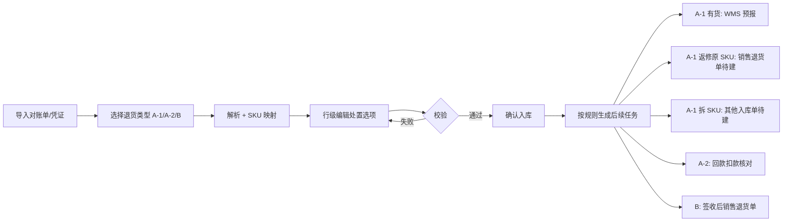

# 线下商超退货 · 退货单管理解决方案

| 属性 | 内容 |
|------|------|
| 文档版本 | v1.0 |
| 编写日期 | 2026-05-26 |
| 关联流程 | [完整流程梳理](./线下商超退货-完整流程梳理.md) · [流程说明 HTML](./线下商超退货-完整流程说明.html) |
| 交互原型 | [退货单管理-原型.html](./线下商超退货-退货单管理-原型.html) |

---

## 1. 要解决什么问题？

当前 A-1 / A-2 / B 三类退货信息分散在 **KA 对账系统、Excel、钉钉表格、邮件** 中，财务与物流靠人工对齐 MSKU、金额、是否实物回仓及后续 **销售退货单 / 其他入库单 / 海外仓预报**。目标是：

1. **统一入口**：导入客户对账单或原始 RMA 凭证，一次登记。
2. **自动解析**：MSKU、数量、手续费、退款金额、退货类型等结构化落库。
3. **分流指引**：按退货类型 + 行级处置选项，提示后续 ERP / WMS 动作（预报、销售退货单、其他入库单、仅扣款）。

---

## 2. 产品定位

| 模块 | 说明 |
|------|------|
| **退货单管理（本方案）** | 业务侧「退货批次 + 明细行」主数据；导入、校验、处置选项、状态跟踪 |
| **下游单据（二期对接）** | 猫头鹰 WMS 入库预报、ERP 销售退货单、其他入库单、回款明细 — 可由本模块「生成任务」或半自动跳转 |

---

## 3. 核心流程

---

## 4. 退货类型与字段规则

### 4.1 退货类型（批次级，导入前必选）

| 类型 | 含义 | 实物 | 默认处置 |
|------|------|------|----------|
| **A-1** | 退款 + 退货（如 Costco C 端 RMA） | ✅ 回猫头鹰仓 | 需选**处理方式** |
| **A-2** | 仅退款（如沃尔玛等） | ❌ | 处理方式不适用（—） |
| **B** | 批量滞销退货 | ✅ 指定海外仓 | 默认「**原箱上架**」 |

### 4.2 行级字段「处理方式」（单选下拉）

原三个互斥字段（是否返修上架 / 是否原箱上架 / 是否拆其他 SKU 上架）合并为 **一个「处理方式」**，四选一：

| 选项 | 说明 | 建议 ERP 动作 |
|------|------|----------------|
| **返修上架** | 返修后按原 SKU 可正常使用并入库 | WMS 预报 → 签收 → **销售退货单** |
| **原箱上架** | 按原 SKU / 原箱直接入库（B 类全新未拆箱典型） | A-1：同上；B 类：签收后 **销售退货单** |
| **拆其他 SKU 上架** | 拆配件等按其他 SKU 入库 | **其他入库单**（物流建单） |
| **报废** | 无法返修或不再入库 | **无** ERP 入库单 |

**规则**：

- A-2 行：**不展示**处理方式（无实物）。
- A-1 / B 行：必选一项；导入时可按退货类型给默认值（A-1 待业务确认时可先空，B 默认原箱上架）。
- 四选项**天然互斥**，无需再做「是/否」组合校验。

### 4.3 自动解析字段（来自导入文件）

| 字段 | 来源示例 | 说明 |
|------|----------|------|
| **MSKU** | Excel 导入或销售主数据 | 下拉可改；未维护/空值行标黄 |
| 数量 | 对账单列 | **可编辑** |
| 单价 | 客户导出优先 | **可编辑**；避免 ERP 取最新成本对不上 |
| **手续费单价** | 如沃尔玛 10% 分摊到 SKU | **可编辑**；行手续费合计 = 数量 × 手续费单价 |
| 退款金额 | 数量 × 单价 + 数量 × 手续费单价 | 自动计算，可与扣款行核对 |
| **币种** | MSKU 主销国家 → 销售主数据 | 选 MSKU 后自动带出（如 US→USD、CA→CAD）；**可手动改**；改 MSKU 时若未手动改过币种则重新带出 |
| **退货月份范围** | 用户选择 | 表示该行退货对应**哪几个月的货**（`YYYY-MM - YYYY-MM`）；行内月份范围选择器，支持清空 |
| 退货类型 | 用户导入前选择 + 可批量覆盖 | 决定后续模板与校验规则 |

---

## 5. 页面功能清单（退货单管理）

### 5.1 列表页

- **筛选**：客户 KA、退货类型、批次状态、**退货批次**、MSKU。
- **操作**：导入对账单、导出、批量「提交物流预报」（A-1/B 有货行）。
- **明细列**：行号、退货批次、客户、**MSKU（下拉）**、数量（可编辑）、单价（可编辑）、**手续费单价（可编辑）**、退款金额、**币种（可编辑，MSKU 自动带出）**、**退货月份范围（可编辑）**、退货类型、处理方式、操作、建议 ERP 动作、行状态。

### 5.2 导入向导（三步）

1. **选择类型 + 上传**：支持 Costco 对账导出、沃尔玛 RMA Excel、通用 CSV 模板。
2. **解析预览**：展示解析结果，标红映射失败行；可改 MSKU、数量、金额、**处理方式**。
3. **确认生成**：写入退货单批次 + 明细；A-1 有货自动生成「待预报」任务。

### 5.3 明细行编辑

- 行状态：待确认 → 已确认 → 已预报 / 已签收 / 已制单 / 已核销。
- **系统建议 ERP 动作**（只读，规则见下表）。
- **操作栏**（按处理方式状态机，已完成步骤显示绿色 ✓，当前步骤为可点按钮）：

| 处理方式 | 操作流转 |
|----------|----------|
| **报废** | 已确认 → 已财务核对 |
| **返修上架** | 已WMS预报 → 已上架 → 推金蝶退货单 → 已财务核对 |
| **原箱上架** | 已WMS预报 → 已上架 → 推金蝶退货单 → 已财务核对 |
| **拆其他 SKU 上架** | 已WMS预报 → 已上架 → 已建其他入库单 → 已财务核对 |
| **A-2 仅退款** | 已财务核对 |

| 条件 | 建议动作 |
|------|----------|
| A-2 | 仅回款扣款核对 |
| 处理方式 = **报废** | 无 ERP 入库单 |
| 处理方式 = **拆其他 SKU 上架** | 其他入库单（待物流） |
| 处理方式 = **返修上架 / 原箱上架**（A-1，有货未签收） | 猫头鹰 WMS 入库预报 → 签收 → 销售退货单 |
| 处理方式 = **原箱上架**（B 类） | 签收完成后 → 销售退货单 |

---

## 6. 与现有线下流程的对齐

| 流程环节 | 本系统承接 |
|----------|------------|
| 商务下载凭证 / 钉钉登记 | 导入批次替代重复录入 Excel |
| 物流邮件通知 + 猫头鹰预报 | 列表「提交预报」+ WMS API（二期） |
| 签收 → 返修/报废判定 | 行级**处理方式** + 状态回写 |
| 财务销售退货单 / 其他入库单 | 由建议动作驱动待办，减少漏单 |

---

## 7. 分期实施建议

| 阶段 | 范围 |
|------|------|
| **P0** | 退货单管理页 + 导入解析 + 手工处置下拉 + 建议动作展示（原型已覆盖） |
| **P1** | 商超 SKU 映射表、沃尔玛 10% 手续费分摊、批次状态机、**角色待办通知（钉钉/站内信）** |
| **P2** | 对接猫头鹰 WMS 预报、ERP 销售退货单/其他入库单生成接口 |
| **P3** | 与管报收入扣减、月度对账报表联动 |

---

## 9. 角色通知与待办流转

导入批次确认后，系统按每行**当前待办操作**向对应角色推送通知；该角色在本页完成操作后，自动通知**下一角色**，直至该行全流程结束。

### 9.1 操作步骤 → 责任角色

| 操作步骤 | 责任角色 |
|----------|----------|
| 已确认 | **商务** |
| 已WMS预报 | **物流** |
| 已上架 | **物流** |
| 推金蝶退货单 | **财务** |
| 已建其他入库单 | **物流** |
| 已财务核对 | **财务** |

不同**处理方式**的首步通知对象不同，例如：

- **报废**：首步通知 **商务**（已确认）→ 完成后通知 **财务**（已财务核对）
- **返修上架 / 原箱上架**：首步通知 **物流**（已WMS预报）→ … → **财务**
- **拆其他 SKU 上架**：首步 **物流** → 第三步 **物流**（已建其他入库单）→ **财务**
- **A-2 仅退款**：首步直接通知 **财务**（已财务核对）

### 9.2 通知内容与触达（设计）

| 时机 | 行为 |
|------|------|
| **导入完成** | 按各行首步操作，向商务/物流/财务发送待办（站内信 + 钉钉/邮件，P1） |
| **某步操作完成** | 关闭当前待办；若仍有后续步骤，通知下一角色：「批次 RT-xxx 行 n，请操作 xxx」 |
| **全流程完成** | 关闭该行全部待办；可选通知导入人/商务归档 |

通知文案示例：

> 批次 RT-20260526-001 · 行 4（H70503）请前往【退货单管理】操作「已WMS预报」

### 9.3 列表展示

- 列 **待办角色**：当前待谁操作、待办动作名称
- 顶部 **待办通知面板**：按角色筛选；点击通知定位到对应行

---

## 10. 开放问题

1. Costco **PN 无法区分颜色 SKU** 时，是否仍按销售比例分摊数量（会议口径）— 需在导入预览提供「分摊助手」。
2. A-1 与 A-2 **同文件混合** 是否允许：建议 **不允许**，按批次单类型导入。
3. B 类 **分批签收** 是否一行拆多行子签收记录：P1 用子表或多次数量回写。
