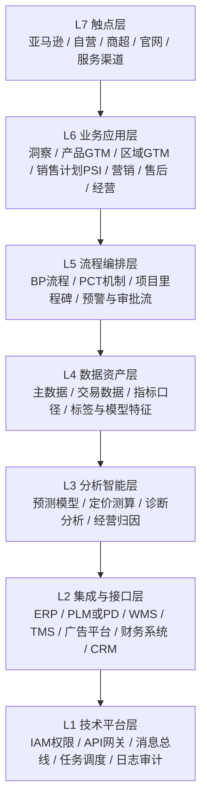

# GTM 系统架构（全渠道协作视角）

## 1. 目标与范围

本架构基于现有资料（GTM 职责、GTM 流程、会议纪要、PCT 机制）梳理，目标是把 GTM 从“岗位职责集合”升级为“可落地的系统能力地图”，明确：

- 架构层次：系统按什么层次建设；
- 功能模块：每个层次包含哪些业务模块；
- 协同关系：PD 与 GTM、GTM 与销售/供应/财务如何双向协同；
- 建设优先级：先做什么才能形成最小闭环。

适用范围：产品规划到退市、区域与渠道经营、价格策略、销售计划与供应协同、营销投放、售后回流、经营复盘的全链路。

---

## 2. 架构总览（分层）

### 分层说明

- `L7 触点层`：承接真实业务动作和用户反馈，是数据产生端；
- `L6 业务应用层`：GTM 核心能力载体，按职责分为多个业务域；
- `L5 流程编排层`：保障跨部门协同节奏（PCT、里程碑、审批、预警）；
- `L4 数据资产层`：统一口径，解决“各看各的数据”问题；
- `L3 分析智能层`：把数据变成预测、策略和经营判断；
- `L2 集成与接口层`：连接现有系统，避免重复造系统；
- `L1 技术平台层`：提供权限、安全、稳定性和可运维基础。

---

## 3. 功能模块（L6 业务应用层）

## 3.1 战略与规划域

- `BP 目标管理`
  - 年度/季度目标分解（销售、营销、经营三类指标）
  - 目标版本与冻结机制
- `新品商业判定`
  - 商业判定模板、评审记录、结论归档
- `Baseline 管控`
  - 月度基线定义、偏差监控、滚动调整

## 3.2 商业洞察域

- `市场扫描`
  - 行业、竞争、用户、渠道信息采集
- `趋势预测`
  - 市场体量、需求变化、机会判断
- `SWOT 与机会池`
  - 战略议题、机会优先级、风险清单
- `洞察输出中心`
  - 输出给产品 GTM、区域 GTM、销售计划的结构化输入

## 3.3 产品 GTM 域

- `路标与产品规划承接`
  - 产品路标、上市窗口、优先级管理
- `GTM 项目管理`
  - 里程碑、责任人、交付件、延期预警
- `产品信息库（主数据）`
  - SKU、类目、场景、生命周期状态、卖点口径
- `上市准备中心`
  - 样机、KV、素材、POS、渠道资料齐套管理
- `生命周期管理`
  - 上市、稳定售卖、退市全流程状态管理

## 3.4 区域 GTM 域

- `区域策略管理`
  - 国家/区域/城市/渠道策略配置
- `渠道政策中心`
  - 授权、返利、特商、促销规则
- `价格管理平台`
  - 定价管理、FOB 管理、RRP 管理、调价流程
  - 渠道点位与利润空间测算
- `区域达成管理`
  - 目标拆解、执行跟踪、策略调整闭环

## 3.5 销售计划与 PSI 域

- `需求预测`
  - 分渠道/分 SKU/分周期预测
- `要货计划`
  - 首批备货、补货策略、滚动计划
- `PSI 中枢`
  - Sell In、Sell Out、库存、在途、发运一体化
- `供需平衡`
  - 缺口识别、情景模拟、风险预警

## 3.6 渠道销售协同域

- `亚马逊经营台`
  - Listing、活动、转化、评价反馈
- `自营渠道经营台`
  - 页面、活动、订单、客服协同
- `商超/KA 经营台`
  - 客户 SO、铺货进店、门店动销反馈
- `渠道反馈回流`
  - 渠道问题回传 GTM/产品/售后

## 3.7 营销与广告域

- `营销战役管理`
  - 品牌传播节奏、活动计划、素材排期
- `广告投放管理`
  - 渠道投放、预算执行、效果追踪
- `投放与库存联动`
  - 投放前库存校验，避免“投放拉爆但断货”

## 3.8 供应与履约协同域

- `计划员工作台`
  - 物料计划、补货计划、库存策略
- `PMC 排产协同`
  - 产能、排程、插单与异常处理
- `NPI 导入协同`
  - 试产到量产导入闭环
- `仓配履约协同`
  - 仓储、物流、发运状态、异常追踪

## 3.9 售后与质量闭环域

- `售后工单与退换修`
  - 退换修、故障分类、处理时效
- `质量问题回流`
  - 批次问题预警、产品与研发回流机制
- `服务知识库`
  - FAQ、服务策略、渠道服务口径一致化

## 3.10 经营分析与管报域

- `经营看板`
  - 销售、费用、利润、周转指标
- `管理报表（管报）`
  - 按区域/渠道/SKU/时间维度汇总
- `诊断与归因`
  - 目标偏差归因：价格、渠道、供给、投放、产品

---

## 4. 流程编排层（L5）设计重点

## 4.1 PCT 机制

- 建立 `PCT（Product Commercial Team）` 作战单元；
- 通过 PCT 例会实现“信息同步 + 共同决策”；
- 固化 `四快一慢` 节奏：
  - 上市热度快、销量起量快、策略调整快、产品收尾快；
  - 上市准备要慢（前置准备充分）。

## 4.2 PD ↔ GTM 双向接口

- `PD → GTM`：输出产品规格、样机、版本、BOM、节点状态、上市条件；
- `GTM → PD`：输出市场目标、价格带、渠道需求、供应窗口和商业优先级；
- 系统上通过 `接口事件 + 状态机` 管理，不依赖线下口头同步。

## 4.3 核心审批与预警流

- 价格审批流（定价/调价/特商）；
- 上市齐套审批流（素材、样机、渠道资料）；
- 供需异常预警流（缺货、积压、延误、成本异常）；
- 经营偏差预警流（未达成、利润偏离、周转异常）。

---

## 5. 数据资产层（L4）核心对象

- `主数据`：产品、SKU、渠道、客户、区域、价格规则、活动；
- `交易与执行数据`：订单、发货、库存、SO/Sell Out、广告投放、售后工单；
- `流程数据`：里程碑、审批、变更、例会结论、责任人；
- `指标层`：销售指标、营销指标、经营指标、项目指标；
- `口径层`：统一计算口径与维度映射（解决多系统口径不一致）。

---

## 6. 角色与模块映射（核心）

| 角色 | 核心模块 | 主要系统责任 |
|---|---|---|
| 商业洞察 | 市场扫描、趋势预测、机会池 | 生成策略输入与预测参数 |
| 产品 GTM | 路标承接、项目管理、产品信息库、上市准备 | 管控上市节奏与生命周期 |
| 区域 GTM | 区域策略、渠道政策、价格管理、达成管理 | 负责渠道+价格落地 |
| 销售计划 | 预测、要货、PSI、供需平衡 | 连接需求与供应 |
| 亚马逊/自营/商超销售 | 渠道经营台、SO 回流 | 真实销售执行与反馈 |
| 计划员/PMC/NPI | 物料、排产、导入 | 交付可达成性保障 |
| 仓库/物流 | 仓配履约、发运状态 | 订单履约与异常闭环 |
| 品牌/广告 | 战役管理、投放管理 | 流量与转化协同 |
| 售后 | 工单、质量回流 | 问题闭环和产品改进输入 |
| 财务/经营 | 管报、经营分析 | 经营指标权威输出 |

---

## 7. 建设优先级（建议）

## P0：先形成“能跑起来”的最小闭环

- `PSI 中枢（预测 + 要货 + Sell Out + 库存）`
- `价格管理平台（定价 + 调价 + 特商 + 点位）`
- `产品信息库（SKU / 生命周期 / 上市状态）`
- `经营看板与管报基础版`

## P1：补齐流程机制与跨部门联动

- `PCT 例会与交付件数字化`
- `项目管理与上市齐套流`
- `PD ↔ GTM 双向接口事件化`
- `渠道 SO 自动接入`

## P2：增强智能与经营优化

- 预测模型优化、价格弹性与利润模拟；
- 经营归因分析与策略推荐；
- 售后问题自动回流产品迭代。

---

## 8. 输出结论

GTM 系统不应做成单一“GTM 工具”，而应是一个以 `PSI + 价格 + 产品信息 + 经营管报` 为核心中枢，向上支撑策略与流程、向下连接渠道与供应、向外联动 PD/财务/广告/售后的业务架构。

如果必须一句话定义：  
`GTM 系统 = 以商业成功为目标的跨部门运营系统，而不是某一个岗位的管理系统。`
