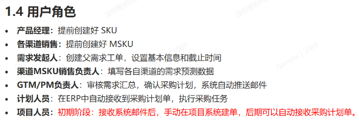
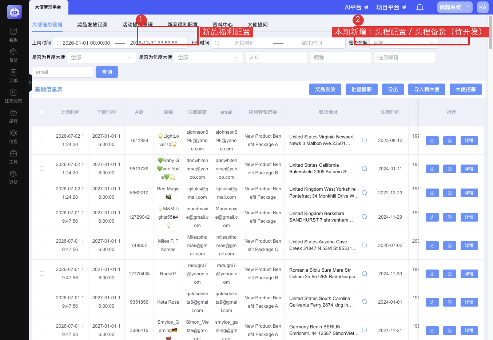
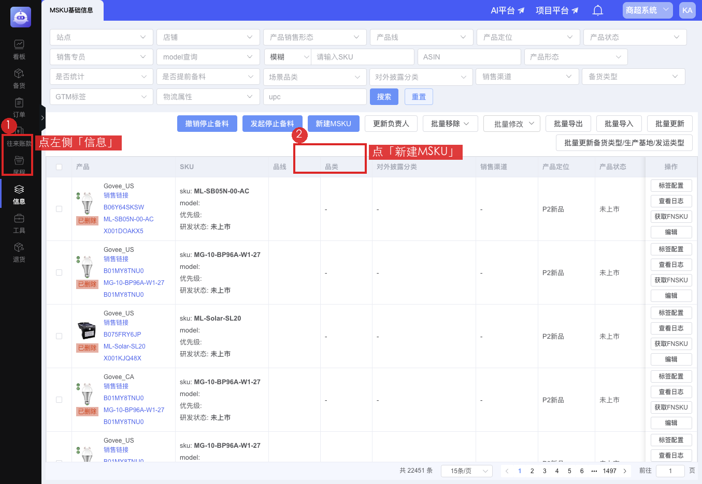
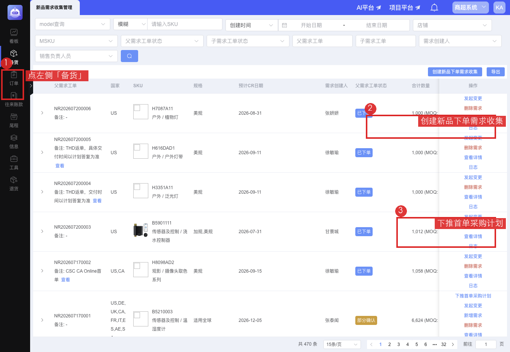
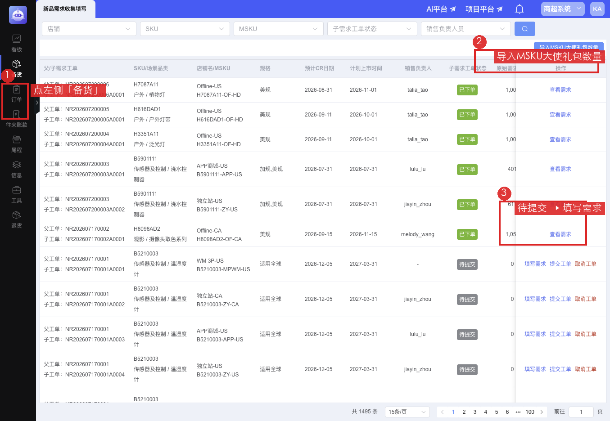
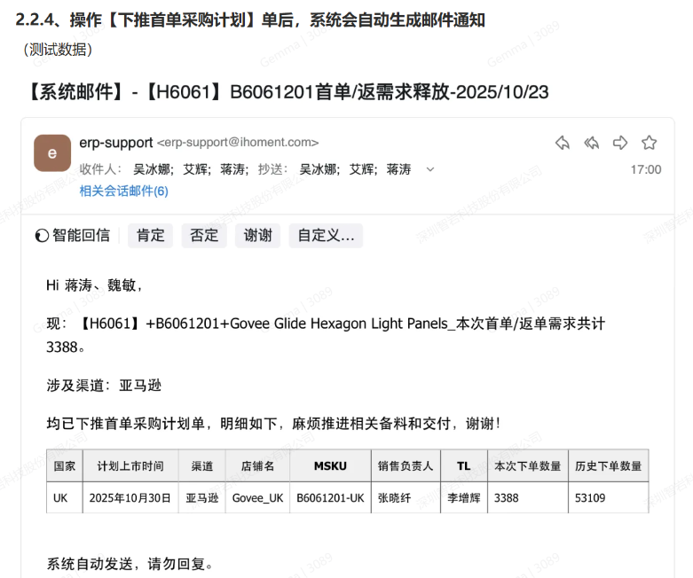
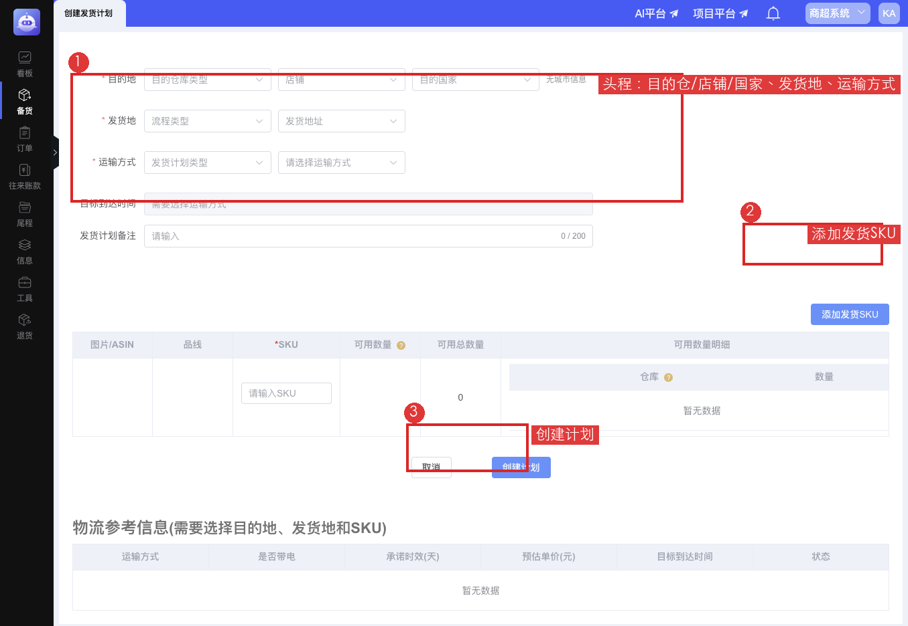
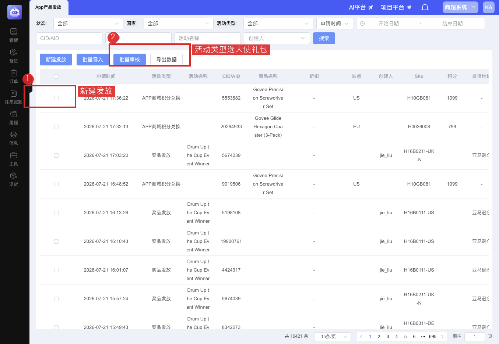

# 大使新品福利 · 用户操作手册

> 面向：App 运营、GTM/PM、计划协同人员  
> 版本：用户版 v1.0｜2026-07-21  
> 说明：本文只写「点哪里、做什么」，不写系统内部路径。截图来自现网；标「待开发」的能力上线前请用对照页操作。

---

## 你会用到哪些系统页面

| 步骤 | 谁操作 | 去哪里 | 做什么 |
|------|--------|--------|--------|
| 准备店铺/权限 | 管理员协助 | 店铺授权相关配置 | 确保 App 运营能看到大使专用店铺 |
| 维护大使与套餐 | App 运营 | **用户系统 → 大使管理平台** | 导入大使、配新品福利套餐；后期在此做头程配置 |
| 建 MSKU | App 运营 | **信息 → MSKU基础信息 → 新建MSKU** | 把产品挂到大使店铺 |
| 建首单父单 | GTM/PM | **备货 → 新品需求收集管理** | 创建父需求工单 |
| 填子单 | App 运营 | **备货 → 新品需求收集填写** | 找到大使店铺，填写需求 |
| 下推首单 | GTM/PM | 父单上点「下推首单采购计划」 | 系统发邮件通知计划 |
| 头程发到海外仓 | App 运营 | **备货 → 创建发货计划**（后期从大使平台一键跳入） | 国内仓发海外仓 |
| 尾程发给大使 | App 运营 | **App产品发放** | 活动类型选「大使礼包」，按 AID 发放 |

---

## 整体流程（一张图看懂）

```text
选品 / 套餐
    ↓
PM 建 SKU  →  App运营 建 MSKU
    ↓
GTM/PM 建父单  →  App运营 填子单  →  下推采购（邮件）
    ↓
国内仓入库（钉钉提醒）  →  头程发海外仓  →  海外仓上架（钉钉提醒）
    ↓
App产品发放 · 大使礼包（尾程快递到大使地址）
```

---

## 角色一览



| 角色 | 你主要负责 |
|------|------------|
| 产品经理（PM） | 提前创建 SKU |
| App 运营 | 建 MSKU、填子单、头程备货、尾程发放 |
| GTM/PM（需求发起人） | 建父单、确认后下推首单采购计划 |
| 计划 | 按采购计划排产、入库 |
| 物流 | 执行头程运输与海外仓上架；承接尾程物流 |

---

## 第 0 步：平台与店铺准备（一次性）

**目标：** 有一个「大使奖品发放」专用店铺，且你的账号能操作它。

### 怎么理解「平台」和「店铺」

- **平台/渠道**：一般已有，不用你天天新建；确认大使礼包走哪条渠道即可。  
- **店铺**：真正干活的是店铺。大使业务用**专用店铺**（奖品发放），不要和常规销售店铺混用。  
- 一个店铺可以对应多个国家；头程发货时再选国家/海外仓。

### 你需要确认的事

1. 管理员已建好大使店铺（或启用既有运营店）。  
2. 你的账号已开通该店铺权限，以及：  
   - MSKU基础信息（新建）  
   - 新品需求收集填写  
   - 创建发货计划  
   - 大使管理平台、App产品发放  
3. 海外仓约定清楚（例如美国补仓、其他站点按物流指定仓）。

> 店铺开通过程由管理员在「店铺授权」侧完成；你这边只要能在下拉框里选到大使店铺即可。

---

## 第 1 步：维护大使信息与新品福利套餐

**入口：** 切换到相关系统后，打开 **大使管理平台**。



**你可以做的：**

1. **大使信息管理**：导入新大使（AID、上岗/下岗时间、地址等）；大使也可在 App 侧自助维护地址。  
2. **新品福利配置**：按站点配置任期内可选套餐（产品组合）。  
3. **（本期开发）头程配置 / 大使头程备货**：上线后会出现在本页；未上线前，头程请直接去「创建发货计划」（见第 7 步）。

---

## 第 2 步：PM 创建 SKU

由产品经理在产品主数据中提前建好 SKU。  
App 运营开始建 MSKU 前，确认目标产品的 SKU 已存在。

---

## 第 3 步：App 运营创建 MSKU（必做）

**路径：** 左侧 **信息** → **MSKU基础信息** → **新建MSKU**



**操作要点：**

1. 点左侧「信息」，进入「MSKU基础信息」。  
2. 点「新建MSKU」。  
3. 选择已有 SKU / Model，**店铺选大使专用店**，补齐后缀、渠道等信息后保存。  

做完后，该 MSKU 才能用于填子单和发货计划。

---

## 第 4 步：GTM/PM 创建首单父工单

**路径：** 左侧 **备货** → **新品需求收集管理** → **创建新品下单需求收集**



**操作要点：**

1. 创建父需求工单，维护基础信息与截止时间。  
2. 按店铺/渠道拆出子工单（其中包含大使店铺对应子单）。  
3. 子单都确认后，可在父单上点 **「下推首单采购计划」**。

父单常见状态：收集中 → 部分确认 → 全部确认 → 已下单。

---

## 第 5 步：App 运营填写子单（必做）

**路径：** 左侧 **备货** → **新品需求收集填写** → 找到大使店铺行 → **填写需求**



**操作要点：**

1. 用「店铺」筛出大使店，或直接在列表里找。  
2. 状态为「待提交」时，点 **「填写需求」**，录入数量与时间。  
3. 点 **「提交工单」**，等待 GTM/PM 确认。  
4. 也可使用 **「导入MSKU大使礼包数量」** 批量导入。

子单常见状态：待提交 → 已提交 → 待下单 → 已下单。

---

## 第 6 步：下推首单后的系统邮件

GTM/PM 执行 **「下推首单采购计划」** 后，系统会自动发邮件通知计划等相关人员备料、交付。



邮件里通常会看到：国家、计划上市时间、渠道、店铺、MSKU、本次下单数量等。  
之后由计划排产；你这边主要等 **国内仓入库提醒**。

---

## 第 7 步：国内仓入库（收货感知）与头程发运

### 7.1 国内仓「收货」你怎么感知

实物收货在仓库完成。你侧关注：

- **（本期开发）钉钉提醒**：每天上午约 10 点，若昨天到今天有大使相关 MSKU 入库，会推送店铺、MSKU、本次入库数量、国内可用总量。  
- 没有入库则不发。优先发给 MSKU 负责人；未维护则按店铺对接人兜底。

**原则：** 提醒只告诉你「货到了」；**何时发头程、发多少、发哪国，由你确认后操作。**

### 7.2 头程配置（待开发）

上线后在 **大使管理平台** 维护一份「头程配置信息」：

- 与「创建发货计划」字段基本一致，但**配置时不选国家**（发货时再选）。  
- 通常只维护一份；选空运时会带出空运原因等。

### 7.3 现在怎么做头程（对照页）

在头程配置 /「大使头程备货」上线前，请直接打开：

**备货 → 创建发货计划**



**操作要点：**

1. **目的地**：目的仓库类型选海外仓相关；选大使店铺；选目的国家。  
2. **发货地**：流程类型选「国内发海外仓」一类；发货地址按约定（如深圳仓）。  
3. **运输方式**：大使场景多为空运，按实际选择并填原因。  
4. **添加发货 SKU / MSKU**，按可用数量填写本次发运数量。  
5. 点 **「创建计划」**，后续由物流在「发货计划管理」继续执行。

> 上线「大使头程备货」后：在大使平台一点，会自动带入配置，你只需补选国家/仓、确认 MSKU 与数量。

### 7.4 海外仓上架提醒（待开发）

头程到仓上架后，钉钉规则与国内类似，内容会多一列 **具体海外仓库**。  
收到提醒后，即可去做尾程发放。

---

## 第 8 步：尾程 · 发给大使（已有）

**路径：** **App产品发放** → **新建发放**



**操作要点：**

1. 点「新建发放」。  
2. **活动类型**选「大使礼包」。  
3. 发货地选 **海外仓**（该类型不走国内仓直发模式）。  
4. 录入要发的 SKU，粘贴对应大使 AID（可多行），先 **审核 AID**。  
5. 地址来自大使管理平台已维护信息。  
6. 提交后走审核/物流，快递到大使地址。

**注意：**

- 必须先保证海外仓有库存。  
- 大使平台里的「奖品发放」偏优惠券/礼品券；**实物新品礼包请走 App产品发放**。

---

## 日常操作速查

| 我想… | 去哪点 |
|--------|--------|
| 看大使名单 / 地址 / 套餐 | 大使管理平台 |
| 新建大使用的 MSKU | 信息 → MSKU基础信息 → 新建MSKU |
| 填礼包需求数量 | 备货 → 新品需求收集填写 → 填写需求 |
| 下推采购让计划备货 | 备货 → 新品需求收集管理 → 下推首单采购计划 |
| 货发到海外仓（头程） | 备货 → 创建发货计划（后期：大使平台「头程备货」） |
| 从海外仓发给大使（尾程） | App产品发放 → 新建发放 → 大使礼包 |

---

## 本期会新增什么（给你预期）

| 能力 | 状态 | 你怎么用 |
|------|------|----------|
| 头程配置信息 | 待开发 | 在大使平台提前固定店铺、运输方式、发货地址等 |
| 大使头程备货 | 待开发 | 一键跳到创建发货计划并自动带入配置 |
| 国内仓入库钉钉 | 待开发 | 有入库才提醒，不用每天刷库存 |
| 海外仓上架钉钉 | 待开发 | 提醒含具体仓库 |
| MSKU / 子单权限打通 | 配置中 | 开权限后按本手册第 3、5 步自助操作 |

---

## 常见问题

**Q：一个店铺能发多个国家吗？**  
可以。头程时再选国家/海外仓。是否拆多店由业务约定。

**Q：货分批入库，能不能分批发头程？**  
可以。以创建发货计划时的可用库存为准；也可以等全部入库后再发。

**Q：头程和尾程能一步做完吗？**  
不能揉成一页。先头程到海外仓，再尾程发大使；尾程能力已有。

**Q：没有销售负责人谁收钉钉？**  
优先 MSKU 负责人；没有则按店铺对接人兜底（上线时会定名单）。

---

## 附录：截图目录

所有配图在同级文件夹 `截图/`：

| 文件 | 用途 |
|------|------|
| `标注-01-新建MSKU.png` | 建 MSKU |
| `标注-02-大使管理平台.png` | 大使平台入口 |
| `标注-03-创建父单.png` | 建父单 / 下推 |
| `标注-04-填写子单.png` | 填子单 |
| `标注-08-头程发货计划.png` | 头程对照（待开发前使用） |
| `标注-09-尾程发放.png` | App产品发放 |
| `06-下推首单邮件-用户提供.png` | 系统邮件示例 |

---

*若某菜单你看不到，请找管理员开权限或确认是否切到正确的业务系统。*
