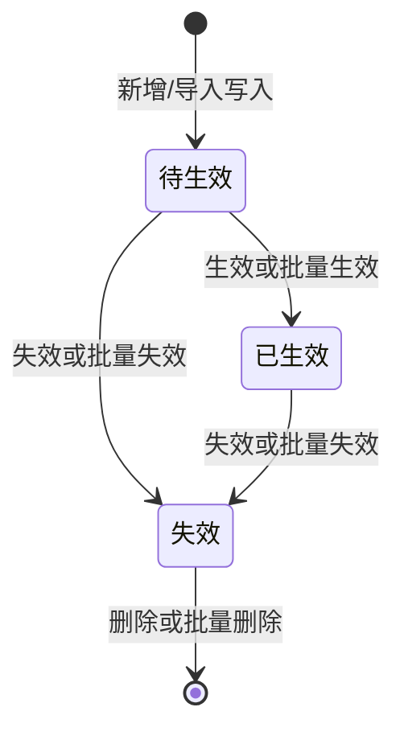

# 补充费用导入与分摊 · 页面逻辑说明

> 面向开发与测试：描述本页业务规则、状态机、筛选与批量操作、与管报计算的关系。交互以同目录原型 **`补充费用导入与分摊-系统原型.html`** 为准；正式环境在字段校验、权限、审计日志、并发控制上会更严格。

---

## 1. 页面目标

- 维护「补充费用」的**导入批次**（含手工新增与文件导入解析结果）。
- 通过**状态**控制批次是否参与**全渠道管报**中的补充费用分摊与汇总。
- 支持按条件筛选历史、查看分摊**明细**、对批次进行**生效 / 失效 / 删除**（含批量）。

---

## 2. 状态定义与默认值

| 状态   | 含义简述 |
|--------|----------|
| **待生效** | 新建或导入解析成功后写入的初始状态；**不参与**管报计算。 |
| **已生效** | 经人工确认后生效；**参与**管报补充费用分摊与汇总。 |
| **失效**   | 已明确不再使用该批次（业务作废）；**不参与**管报计算。 |

- **新增导入费用**（弹窗内配置店铺 ∩ MSKU 等并确认写入）：默认 **待生效**。
- **批量导入**（CSV 解析成功，正式环境）：每条成功解析记录对应一个批次，默认 **待生效**。原型中可用「模拟：生成一条待生效批次」演示该路径。

---

## 3. 状态迁移（状态机）

说明：

- **生效**：仅允许从 **待生效** → **已生效**。
- **失效**：允许从 **待生效** 或 **已生效** → **失效**（已生效批次作废后不再参与计算）。
- **删除**：仅允许删除 **失效** 状态的批次（物理删除或逻辑删除由后端设计；原型为从列表移除并清除本地明细缓存）。

不允许在说明中强制的非法迁移（如「已生效」直接物理删除而不先失效）应由后端校验；原型仅做前端示意。

---

## 4. 纳入管报计算规则

- **只有「已生效」** 的批次参与管报中的补充费用池、按 MSKU 分摊及后续汇总。
- **「待生效」「失效」** 均不参与计算。
- 分摊**明细**弹窗中展示「**纳入管报计算：是/否**」，与当前列表行状态一致。

---

## 5. 列表与操作列（单行）

| 当前状态 | 可用操作（原型） |
|----------|------------------|
| 待生效   | 明细、**生效**、**失效** |
| 已生效   | 明细、**失效** |
| 失效     | 明细、**删除** |

---

## 6. 批量操作与校验

| 按钮       | 允许的勾选行状态 | 行为 |
|------------|------------------|------|
| **批量生效** | 全部为 **待生效** | 全部改为 **已生效**。若混入其他状态，提示错误且不修改。 |
| **批量失效** | 全部为 **待生效** 或 **已生效**（可混合） | 全部改为 **失效**。若包含 **失效**，提示错误且不修改。 |
| **批量删除** | 全部为 **失效** | 删除所选批次。若混入非失效，提示错误且不删除。 |

列表首列支持 **勾选**；表头 **全选** 作用于**当前筛选结果**中的可见行。

---

## 7. 筛选区与列表刷新

- **状态**下拉：全部 / 待生效 / 已生效 / 失效；变更后立即刷新列表（与原型一致）。
- **费用项**下拉：全部或具体费用项；变更后立即刷新列表。
- **查询**按钮：原型中在刷新列表（状态 + 费用项）后，仍会弹出提示说明「其他筛选项（渠道、店铺、场景、品类、SKU、MSKU、零售商等）仍为示意」，正式环境应对齐接口参数。

归属月等范围筛选规则以 PRD / 数据模块为准；本说明不展开枚举与接口字段映射。

---

## 8. 与弹窗的关系

| 入口 | 说明 |
|------|------|
| **新增导入费用** | 配置费用项、归属月、金额、店铺范围、MSKU 范围、可选零售商等；预览后可「确认写入」→ 列表新增一条 **待生效** 批次，并写入明细占位数据供「明细」打开。 |
| **导入** | 下载模版、查看填写要求；正式环境上传解析后批量生成 **待生效** 批次。原型「模拟：生成一条待生效批次」用于联调展示。 |

---

## 9. 测试建议清单

1. 筛选「待生效」仅看到待生效行；筛选「已生效」仅已生效；筛选「失效」仅失效；「全部」显示全部。
2. 待生效行点击「生效」→ 状态变为已生效，明细中「纳入管报计算」为是。
3. 已生效行点击「失效」→ 变为失效，明细中纳入计算为否。
4. 失效行点击「删除」→ 确认后从列表消失，明细不可再打开（或提示无数据）。
5. 批量生效：勾选一条待生效 + 一条已生效 → 应提示错误；仅勾选待生效 → 全部已生效。
6. 批量失效：勾选待生效与已生效混合 → 应全部变为失效；勾选含已失效 → 应提示错误。
7. 批量删除：仅勾选失效 → 删除成功；混入待生效 → 应提示错误。
8. 全选后执行批量操作，仅处理当前筛选结果内的行。

---

## 10. 原型与正式环境差异（摘要）

| 项目 | 原型 | 正式环境（预期） |
|------|------|-------------------|
| 权限 | 未区分角色 | 按角色控制生效/失效/删除/导入 |
| 审计 | 无 | 记录操作人、时间、前后状态 |
| 并发 | 无锁 | 乐观锁或版本号防止覆盖 |
| 筛选 | 部分条件为示意 | 全量条件走后端查询与分页 |
| 导入 | 模拟按钮 | 真实解析、校验、错误文件回传 |

---

文档版本：v1.0 · 与原型页面说明链接一致维护。
