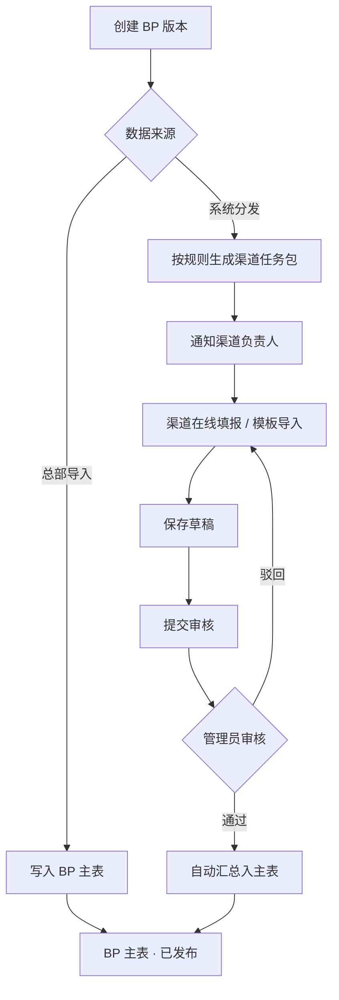

# BP 管理 · 渠道分发与填报 · 页面设计

- 文档日期：2026-06-05
- 状态：原型已输出 → `原型/BP管理/`
- 依据：当前 GTM「BP 管理」页面（总部导入模式）+ `需求/会议沟通文件` 分发机制要求 + `方案/全渠道管报-功能点与描述-v1.0.md` §6
- 关联痛点：P07（下载—填表—上传）、P08（缺少系统级分发—回收—汇总）

---

## 1. 背景与目标

### 1.1 现状

当前 BP 管理以 **总部统一导入 Excel** 为主路径：GTM 汇总各渠道表格后一次性写入系统。存在：

- 渠道无系统入口，反复线下传表，版本难控；
- SKU 级责任难追溯，合并易错；
- 提交/审核状态分散在 Excel 与 IM，无法过程管理。

### 1.2 目标

在保留 **总部导入** 能力的前提下，新增 **系统分发 → 渠道在线填报/导入 → 审核汇总** 闭环：

| 原则 | 说明 |
| --- | --- |
| 分发优先 | 系统按组织/渠道/负责人推送 SKU 级任务，替代「下载模板—填表—上传」主路径 |
| 双路径并存 | 在线填报 + 模板导入均支持；总部导入作为兜底与初始化 |
| SKU 最小颗粒 | 填报维度与现有 BP 表一致：区域/店铺/SKU/月 ×（销量、销售额、毛利） |
| 版本可追溯 | 草稿、提交、审核、汇总各留版本与操作日志 |
| 与管报同源 | 字段口径与管报维度对齐，为后续 BP 达成分析打基础 |

---

## 2. 角色与权限

| 角色 | 典型用户 | 权限摘要 |
| --- | --- | --- |
| 预算管理员 | GTM 预算牵头 | 创建 BP 版本、配置分发、总部导入、审核/驳回、汇总发布、催办 |
| 渠道负责人 | 各渠道运营负责人 | 查看「我的任务」、在线填报、模板导入、保存草稿、提交审核 |
| 产品线/GPM | 产品侧协同 | 只读本产品线相关 BP；可被指定为联合审核人（二期） |
| 财务 | 财务 BP 对接 | 只读已发布版本、导出 |

---

## 3. 业务流程

### 3.1 任务状态

| 状态 | 说明 | 可操作方 |
| --- | --- | --- |
| 待分发 | 版本已建，尚未推送任务 | 管理员：分发 |
| 待填报 | 已分发，渠道未开始 | 渠道：填报；管理员：催办、撤回 |
| 填报中 | 有草稿或未提交数据 | 渠道：保存/提交；管理员：查看 |
| 已提交 | 渠道已提交，待审 | 管理员：通过/驳回 |
| 已通过 | 审核通过，已汇总 | 只读 |
| 已驳回 | 审核驳回，需修改重提 | 渠道：修改后重提 |
| 已逾期 | 超过截止日期未提交 | 渠道：仍可提交（需说明）；管理员：催办 |

### 3.2 BP 主表行来源

| 来源 | 标识 | 说明 |
| --- | --- | --- |
| 总部导入 | `总部导入` | 历史路径，批量写入 |
| 渠道填报 | `渠道填报` | 经分发任务审核汇总 |
| 系统预填 | `历史预填` | 基于去年同期或规则预填，渠道确认后提交 |

---

## 4. 页面总览

| 序号 | 页面 | 路径 | 主要用户 | 说明 |
| --- | --- | --- | --- | --- |
| P1 | BP 管理总览 | `BP管理总览.html` | 预算管理员 | 现有列表增强：来源列、分发入口、汇总 KPI |
| P2 | BP 分发任务 | `BP分发任务.html` | 预算管理员 | 创建分发、任务进度、审核、催办 |
| P3 | 渠道 BP 填报 | `渠道BP填报.html` | 渠道负责人 | 我的任务、在线编辑、模板导入、提交 |

导航关系：`P1` ↔ `P2`；渠道用户默认进入 `P3`（菜单「我的 BP 填报」）。

---

## 5. P1 · BP 管理总览

### 5.1 页面目标

保留现有 BP 明细查看与总部操作能力，并暴露 **分发进度** 与 **数据来源**，作为管理员工作台。

### 5.2 筛选区

与现网对齐，遵守《列表页顶部筛选区》《产品信息筛选区》：

- 年份、区域、国家、渠道/店铺（联动）
- 销售人员、部门、场景品类、品线（多选 Tag）、model、SKU 组合
- GTM 标签、**数据来源**（全部 / 总部导入 / 渠道填报 / 历史预填）、**行状态**（草稿/已提交/已发布…）

### 5.3 汇总卡

- 计划总销售额、计划总销量、计划总毛利（USD，同比箭头）
- 新增：**渠道填报完成率**、**待审核任务数**

### 5.4 工具栏

| 按钮 | 说明 |
| --- | --- |
| 导入 | 总部 Excel 导入（保留） |
| 导出 | 按筛选导出 |
| 批量删除 / 批量提交 / 批量变更 | 保留现网能力 |
| **创建分发任务** | 跳转 P2 或打开向导 |
| **分发任务中心** | 跳转 P2 |
| 生成 BP 数据 | 保留现网 |

### 5.5 列表字段（在现网基础上）

| 字段 | 说明 |
| --- | --- |
| 区域、店铺、场景品类、部门、SKU、GTM 标签 | 与现网一致 |
| **数据来源** | 总部导入 / 渠道填报 / 历史预填 |
| **关联任务** | 可点击跳转 P2 对应任务 |
| 全年合计、1–12 月（销量/销售额/毛利） | 与现网一致，单元格含同比箭头 |
| 操作 | 删除、提交、日志 |

### 5.6 布局

- 宽表横向滚动 + 右侧操作列固定（见《列表布局全局规范》）
- 表头 sticky（见《数据表格-表头固定》）

---

## 6. P2 · BP 分发任务

### 6.1 页面目标

管理员 **创建分发批次**、跟踪各渠道填报进度、执行审核与汇总。

### 6.2 筛选

- BP 版本（如 2025 年度 BP v3）
- 年份、区域、渠道/店铺
- 任务状态、负责人、截止日期范围

### 6.3 汇总卡

- 任务总数 / 已完成 / 待审核 / 已逾期
- 整体填报进度（已填 SKU 数 / 应填 SKU 数）

### 6.4 工具栏

| 按钮 | 说明 |
| --- | --- |
| 新建分发 | 打开创建向导 |
| 批量催办 | 向选中任务的负责人发通知 |
| 批量通过 | 已提交且校验通过的任务 |
| 导出任务清单 | |
| 撤回分发 | 未提交任务可撤回（需确认） |

### 6.5 任务列表字段

| 字段 | 说明 |
| --- | --- |
| 任务编号 | 如 BP-DIST-2025-0042 |
| BP 版本 | |
| 渠道/店铺 | |
| 负责人 | |
| SKU 范围 | 摘要，如「灯带品线 128 SKU」 |
| 应填 / 已填 / 已提交 | 进度 |
| 截止日期 | |
| 状态 | 待填报/填报中/已提交/已通过/已驳回/已逾期 |
| 最近更新 | |
| 操作 | 查看明细、审核、催办、日志 |

### 6.6 新建分发向导（弹窗 · 四步）

1. **基础信息**：BP 版本、填报周期（年度/季度）、截止日期、说明
2. **范围选择**：区域、渠道/店铺、品线、场景品类、GTM 标签（与主数据联动）
3. **负责人映射**：按店铺默认负责人，可批量调整；支持按品线拆分子任务
4. **预填策略**：不预填 / 按去年同期 / 按上版 BP；预览将生成的 SKU 数

确认后生成任务包并通知负责人。

### 6.7 审核抽屉

- 左侧：任务信息与渠道提交摘要
- 右侧：SKU 明细对比（预填 vs 提交），异常高亮（如同比波动 > 阈值）
- 操作：通过并汇总、驳回（必填原因）、退回修改

---

## 7. P3 · 渠道 BP 填报

### 7.1 页面目标

渠道负责人在 **被分配的任务包** 内完成 SKU 级 BP 填报，支持在线编辑与 Excel 导入。

### 7.2 任务卡片（首屏）

每张卡片：任务编号、店铺、SKU 数、截止日期、状态、进度条。  
操作：**开始填报** / **继续填报** / **查看驳回原因**。

### 7.3 填报页布局

- **顶栏**：任务信息 + 状态 + 截止日期倒计时
- **工具栏**：下载模板、导入 Excel、保存草稿、提交审核、查看变更日志
- **筛选**：SKU、model、场景品类、GTM 标签（仅本任务范围内）
- **表格**：与 P1 月列结构一致；可编辑列（销量/销售额/毛利）在「草稿/驳回」态可改

### 7.4 导入规则

- 模板列与线上一致；导入前校验 SKU 是否属于本任务
- 支持 **覆盖** 或 **仅填空项** 两种模式
- 导入结果：成功 N 行、失败 M 行（可下载错误明细）

### 7.5 提交校验

- 必填：任务内全部 SKU 的 12 个月三项指标（允许为 0，不可空）
- 软校验：同比波动超阈值时提示确认，不阻断
- 提交后状态 → 已提交，管理员在 P2 审核

---

## 8. 与现网能力关系

| 现网能力 | 本设计 |
| --- | --- |
| 总部导入 | 保留，写入来源=总部导入 |
| 批量提交/变更 | 保留；渠道任务提交走独立审核流，汇总后行状态与现网一致 |
| 生成 BP 数据 | 保留；可在「全部任务已通过」后触发 |
| 日志 | 扩展：分发、填报、审核、汇总各记一条 |

---

## 9. 非本期（占位）

- BP 与管报费用项同源填报（销量/销售额/毛利以外的费用 BP）
- 联合审核（GPM + 渠道双签）
- 移动端填报
- 与 PSI/价格系统联动自动带出 SKU 清单

---

## 10. 验收要点

1. 管理员可创建分发任务，渠道负责人仅能看到被分配任务。
2. 渠道可在线改数并导入 Excel，提交后管理员可审核汇总至主表。
3. 主表可区分数据来源，并可追溯到分发任务编号。
4. 宽表横向滚动、表头固定、操作列右侧固定符合全渠道管报列表规范。
