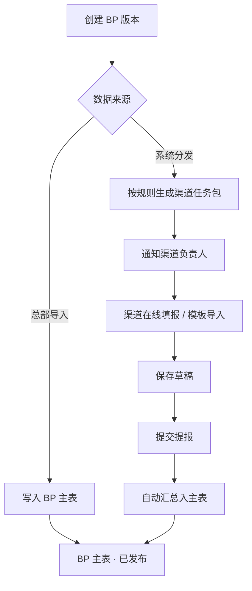

# BP 管理 · 渠道分发与填报 · 页面设计

- 文档日期：2026-06-05
- 状态：原型已输出 → `原型/BP管理/`
- 依据：当前 GTM「BP 管理」页面（总部导入模式）+ `需求/会议沟通文件` 分发机制要求 + `方案/全渠道管报-功能点与描述-v1.0.md` §6
- 关联痛点：P07（下载—填表—上传）、P08（缺少系统级分发—回收—汇总）

---

## 1. 背景与目标

### 1.1 现状

当前 BP 管理以 **总部统一导入 Excel** 为主路径：GTM 汇总各渠道表格后一次性写入系统。存在：

- 渠道无系统入口，反复线下传表，版本难控；
- SKU 级责任难追溯，合并易错；
- 提交/审核状态分散在 Excel 与 IM，无法过程管理。

### 1.2 目标

在保留 **总部导入** 与 **现网 BP 管理页布局** 的前提下，以 **GTM 一键通知渠道** 为核心，让渠道在系统中自行填报或导入：

| 原则 | 说明 |
| --- | --- |
| 原页增强 | 不另起复杂流程页；在现网 BP 管理页增加「通知渠道填报」与轻量「渠道填报进度」 |
| 一键通知 | GTM 按筛选/未提交/全部店铺一键发送填报通知，替代线下 Excel 收集 |
| 渠道自填 | 渠道在「我的 BP 填报」在线编辑或导入模板，提交后汇总回本页 |
| 总部导入兜底 | 保留导入能力，用于初始化或少数渠道代填 |
| SKU 最小颗粒 | 填报维度与现网一致：区域/店铺/SKU/月 ×（销量、销售额、毛利） |

---

## 2. 角色与权限

| 角色 | 典型用户 | 权限摘要 |
| --- | --- | --- |
| 预算管理员 | GTM 预算牵头 | 创建 BP 版本、配置分发、总部导入、审核/驳回、汇总发布、催办 |
| 渠道负责人 | 各渠道运营负责人 | 查看「我的提报」、在线填报、模版导入、保存草稿、**提交提报**（无审核） |
| 产品线/GPM | 产品侧协同 | 只读本产品线相关 BP；可被指定为联合审核人（二期） |
| 财务 | 财务 BP 对接 | 只读已发布版本、导出 |

---

## 3. 业务流程

> **无审核环节**：渠道提交提报后直接写入 BP 主表；GTM 仅负责通知与进度查看。

### 3.1 状态流转

| 动作 | 结果状态 |
| --- | --- |
| 生成 BP 数据 | **待填写**（指标为空，显示「—」） |
| 填写 / 导入 / 保存草稿 | **草稿** |
| 提交（提报） | **定版** |
| 定版后点击「变更」 | **草稿**（可再次编辑并提交） |

### 3.2 行内操作（按状态）

| 状态 | 可用操作 |
| --- | --- |
| 待填写 | 通知、删除、日志 |
| 草稿 | 通知、删除、提交、日志 |
| 定版 | 变更、日志 |

### 3.3 通知范围

- 已勾选 SKU / 按当前筛选结果 / **仅待填写 SKU**
- **不含**「按 Sales 筛选」

### 3.2 BP 主表行来源

| 来源 | 标识 | 说明 |
| --- | --- | --- |
| 总部导入 | `总部导入` | 历史路径，批量写入 |
| 渠道填报 | `渠道填报` | 经分发任务审核汇总 |
| 系统预填 | `历史预填` | 基于去年同期或规则预填，渠道确认后提交 |

---

## 4. 页面总览

| 序号 | 页面 | 路径 | 主要用户 | 说明 |
| --- | --- | --- | --- | --- |
| P1 | BP 管理（现网增强） | `BP管理总览.html` | GTM 专员 | **主页面**：布局对齐现网；新增「通知渠道填报」弹窗 + 轻量进度条/抽屉 |
| P2 | 渠道 BP 填报 | `渠道BP填报.html` | 渠道负责人 | 收到通知后在线填写或导入 Excel |
| P3 | 分发任务（可选） | `BP分发任务.html` | GTM 专员 | 历史稿/进阶场景；日常以 P1 一键通知为主 |

导航关系：GTM 日常使用 **P1**；渠道使用 **P2**。P1 工具栏「通知渠道填报」→ 弹窗确认 → 系统通知负责人。

---

## 5. P1 · BP 管理（现网增强）

### 5.1 设计原则

- **视觉与图二一致**：三卡 KPI、每月**单列**堆叠指标（销售额/销量/毛利）、备注/状态/操作列
- **增量功能**：① 通知填报（按 SKU 的 Sales 负责人）② 填报进度（按 Sales）

### 5.2 筛选区

与图二对齐，**新增 Sales 下拉**（SKU 负责人）：

年份、区域、国家、渠道、品类、部门、**Sales**、主体、model、SKU、GTM 标签、状态。

### 5.3 汇总卡

与现网一致，仅三张：计划总销售额、计划总销量、计划总毛利。

### 5.4 填报进度（新增 · 轻量）

位于 KPI 下方一行：

- 文案：`186 / 268 SKU 已提交 · 69%`
- 「按 Sales 查看」打开抽屉：按 Sales 展示负责 SKU 数、已提交、进度
- 抽屉内可「通知未提交 SKU」

### 5.5 工具栏

| 按钮 | 说明 |
| --- | --- |
| **通知提报** | **新增 · 主操作**：按 SKU 的**通知人**发送提报任务（见 5.6） |
| 导入 / 导出 / 批量删除 / 批量提交 / 批量变更 / 生成 BP 数据 | 保留现网 |

### 5.6 通知提报（弹窗 · 通知人唯一）

| 字段 | 说明 |
| --- | --- |
| BP 版本 | 如 2025 年度 BP |
| 截止日期 | 必填 |
| 通知范围 | 已勾选 SKU / 当前筛选 / 仅待填写 SKU |
| **通知人规则** | **默认**：各行取 **Sales 第一位** 为通知人；**指定**：统一指定一人，**仅被指定人**可在渠道侧看到数据 |
| 指定通知人 | 规则为「指定」时必填，单选 |
| 通知说明 | 可选 |

确认后：写入通知队列，渠道 **我的提报** 仅对 **通知人** 可见；行内「通知」可单条催办，「转发」变更通知人（唯一）。渠道 **提交提报** 后直接汇总至 P1 列表，**无审核环节**。

### 5.7 列表字段

与图二一致：每月**单列**（单元格内堆叠三指标 + 同比箭头）。

| 列 | 说明 |
| --- | --- |
| 勾选、区域、渠道、品类、部门、SKU | 与现网一致 |
| **Sales** | 多选，SKU 负责人列表 |
| **通知人** | **新增**，唯一；默认同 Sales 第一位，可点击修改或行内转发 |
| GTM 标签、全年合计、1–12 月、备注、状态、操作 | 与现网一致；操作含 **通知 / 转发** |

### 5.8 生成 BP 数据（弹窗）

点击 **生成 BP 数据** → 弹窗：

| 项 | 说明 |
| --- | --- |
| 年份 | **必填、无默认值** |
| 下载模版 | 与导入模版列一致；含常规行与「新品待上市」样例行（店铺列留空） |
| 规则说明 | 弹窗内展示生成逻辑摘要（见《销售主数据》§6.3） |

**生成逻辑（增量）**

1. MSKU×店铺：产品定位 ∈ P0/P1/P2 稳定+新品；剔除研发状态=EOL 行。  
2. 仅 **产品类型=成品** 的 8 位 SKU；**SKU+店铺** 去重。  
3. **GTM 标签**：同 SKU+店铺 多 MSKU 取标签名**年份最早**；无则「—」。  
4. **Sales**：合并 MSKU 负责人；通知默认**第一位**，支持**转发**。  
5. **新品待上市行**（排 Excel/列表最前）：model 研发状态 ∈ {未研发, 研发中}；店铺列 **「新品待上市」**；场景品类从 SKU 主数据带出；可与常规行并存。  
6. 主键：常规 `年份+SKU+店铺`；新品 `年份+SKU+prelaunch`；已存在则跳过。  
7. 新行状态 **待填写**，指标为空。

**行类型与操作**

| 行类型 | 填报 | 操作 |
| --- | --- | --- |
| 新品待上市 | 产品侧 SKU 级预填 | 通知 / 转发 / 产品预填 / 删除 |
| 常规 | 渠道店铺提报 | 通知 / 转发 / 删除 / 提交… |

---

## 6. P2 · 渠道 BP 填报

### 7.1 页面目标

渠道负责人在 **被分配的任务包** 内完成 SKU 级 BP 填报，支持在线编辑与 Excel 导入。

### 7.2 任务卡片（首屏）

每张卡片：任务编号、店铺、SKU 数、截止日期、状态、进度条。  
任务来源：**通知队列**中 `通知人 = 当前登录账号` 的 SKU 聚合。  
操作：**开始填报** / **继续填报** / **查看**。

### 7.3 填报页布局

- **顶栏**：任务信息 + 状态 + 截止日期倒计时
- **工具栏**：下载模版、导入、**通知提报（转发）**、**新增 SKU**、保存草稿、**提交提报**
- **筛选**：SKU、model、场景品类、GTM 标签（仅本任务范围内）
- **表格**：与 P1 月列结构一致；可编辑列（销量/销售额/毛利）在「草稿/驳回」态可改
- **行操作**：每行右侧 **删除**（定版只读时隐藏）

**通知提报（渠道侧）**：将已勾选或全部 SKU 的**通知人**转发给他人（单选、唯一）；转发后**从当前账号列表移除**，仅新通知人可见。

### 7.3.1 待填写与 SKU 清单

| 状态 | 数据表现 | 渠道操作 |
| --- | --- | --- |
| **待填写** | 任务内 **无 SKU 行**（指标全空，主表同步显示「—」） | **新增 SKU** 或 **导入** 追加行 |
| **草稿** | 已有 SKU 行，可部分未填完 | 继续编辑、新增/删除行、**批量删除**、保存草稿 |
| **定版** | 只读 | 查看；变更回草稿后恢复编辑 |

**新增 SKU 弹窗**（对齐全局规范）：

| 字段 | 控件 | 数据源 |
| --- | --- | --- |
| 店铺 | 下拉 + 可清除 | `规范/基础数据/渠道店铺基础数据_v1.json` |
| GTM 标签 | 下拉 + 可清除 | `规范/基础数据/新品标签基础数据_v1.json`（与新品标签同源） |
| SKU | 下拉（先选店铺后联动） | `销售基础信息_原型子集_v1.json`，按店铺过滤 8 位生产 SKU |
| 场景品类 | 只读 | 选定 SKU 后从主数据自动带出 |
| Sales | 只读 | **当前登录账号**；业务规则：**SKU + 店铺 → Sales = 填报人** |

- 列表增加 **勾选列** + **批量删除**；单行仍保留删除
- 保存草稿 / 提交提报后，通过同步队列将 **Sales + 指标** 反填至 P1「BP 管理」对应 **店铺 + SKU** 行（原型以 `localStorage` 演示）

### 7.4 导入规则

- 模板列与线上一致；导入前校验 SKU 是否属于本任务
- 支持 **覆盖** 或 **仅填空项** 两种模式
- 导入结果：成功 N 行、失败 M 行（可下载错误明细）

### 7.5 提交校验

- 必填：任务内全部 SKU 的 12 个月三项指标（允许为 0，不可空）
- 软校验：同比波动超阈值时提示确认，不阻断
- 提交后状态 → **定版**；定版行可「变更」回草稿

---

## 8. 与现网能力关系

| 现网能力 | 本设计 |
| --- | --- |
| 总部导入 | 保留，写入来源=总部导入 |
| 批量提交/变更 | 保留；渠道任务提交走独立审核流，汇总后行状态与现网一致 |
| 生成 BP 数据 | 保留；可在「全部任务已通过」后触发 |
| 日志 | 扩展：分发、填报、审核、汇总各记一条 |

---

## 9. 非本期（占位）

- BP 与管报费用项同源填报（销量/销售额/毛利以外的费用 BP）
- 联合审核（GPM + 渠道双签）
- 移动端填报
- 与 PSI/价格系统联动自动带出 SKU 清单

---

## 10. 验收要点

1. 管理员可创建分发任务，渠道负责人仅能看到被分配任务。
2. 渠道可在线改数并按规范导入模版，**提交提报** 后直接汇总至主表。
3. 主表可区分数据来源，并可追溯到分发任务编号。
4. 宽表横向滚动、表头固定、操作列右侧固定符合全渠道管报列表规范。
