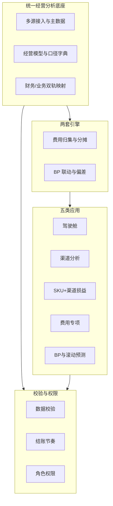

# 全渠道管报 — 功能点清单

> 本文档依据《全渠道管报解决方案》（`全渠道管报解决方案.md`）提炼功能点，供需求拆分、排期与验收对照。  
> 方案原文中的章节引用以「§」表示，便于回溯。

---

## 文档说明

| 字段 | 说明 |
| --- | --- |
| 功能编码 | 便于引用与追踪的临时编码（可按项目规范调整） |
| 功能名称 | 产品/能力简称 |
| 功能描述 | 做什么、解决什么问题、与谁相关 |
| 方案依据 | 解决方案中的对应章节 |

---

## 一、统一经营分析底座（数据与模型）

| 功能编码 | 功能名称 | 功能描述 | 方案依据 |
| --- | --- | --- | --- |
| F-BASE-01 | 多源数据接入 | 打通平台、订单、广告、仓储、物流、费控、预算等来源，为管报提供可加工的统一入湖/入仓数据。 | §4.1、§2.2 |
| F-BASE-02 | 统一主数据管理 | 维护品牌、品类、SPU、SKU、渠道、店铺、国家、组织、负责人等主数据，保证全链路分析对象一致。 | §4.1、§5.1 |
| F-BASE-03 | 统一经营分析模型 | 沉淀标准指标与标准利润结构（收入—调整—费用—利润），支撑各应用同源输出。 | §4.1、§6 |
| F-BASE-04 | 核心维度分析能力 | 支持时间、产品、渠道、市场、组织、履约、预算版本等维度的切片、下钻与上卷（如 SKU+渠道 为核心颗粒度，可上卷至品牌/品类/平台等）。 | §2.1、§5.1 |
| F-BASE-05 | 关键业务映射维护 | 维护 SKU↔SPU↔产品线、SKU↔渠道商品编码、订单↔店铺↔站点↔渠道、广告活动↔渠道↔商品/SKU、费用单据↔预算科目↔管报费用科目、预算对象↔实际对象等映射，缺失则利润与费用不稳定。 | §5.2 |
| F-BASE-06 | 口径字典（指标字典） | 维护销量、营收、净销售额、毛利、渠道贡献利润、经营利润、费用分类、分摊基数、BP 对齐逻辑等定义；指标变更走评审，关键指标指定唯一口径负责人。 | §5.3、§10.1 |
| F-BASE-07 | 财务轨 + 业务轨双轨维护 | 在《财务各渠道逻辑.xlsx》及同步后的正式附录中，分别维护财务系统字段与业务费用项，均采用「现状 / 目标取值」双段描述，并登记差异治理项。 | §1.4、§5.4、附录 A |
| F-BASE-08 | 标准利润结构展示与计算 | 按收入主项、营收调整项、平台直接费用、商品与履约成本、渠道营销费用、共享管理费用、利润结果分层呈现并计算（含毛利、渠道贡献利润、经营利润）。 | §6.1、§6.3、§7.3.6 |
| F-BASE-09 | 净销售额与营收调整项口径落地 | 统一 GMV、买家运费、其它收入、退款、折扣、税金调整、放款差异等项的归属对象、取值逻辑与是否含税等，并与财务勾稽。 | §6.2、§7.3.1 |
| F-BASE-10 | 全量费用项清单维护 | 按 §7.3 维护费用项全集（含利润层级、归属层级、取值逻辑、归集方式、分摊规则）；新增渠道或费种须先评审增补再开发，禁止仅线下 Excel 约定。 | §7.3、§7.3 末维护要求 |

---

## 二、费用归集与分摊引擎

| 功能编码 | 功能名称 | 功能描述 | 方案依据 |
| --- | --- | --- | --- |
| F-COST-01 | 费用归属层级判定 | 支持订单级、SKU 级、渠道/店铺级、品类/品牌级、公司共享级五层归属，先定层级再决定是否分摊。 | §7.2 |
| F-COST-02 | 直接归属池处理 | 对订单级平台费、订单级物流、可映射商品的广告费、可映射 SKU 的样机等费用直接落单，不参与二次分摊。 | §7.4 |
| F-COST-03 | 渠道费用池与内部分摊 | 将渠道推广、线下活动、店铺订阅、渠道内无法直归 SKU 的广告、返利与陈列费等先归到渠道/店铺/客户，再在渠道内按统一基数分摊至 SKU。 | §7.4 |
| F-COST-04 | 公司共享池与全渠道分摊 | 对品牌共投、公共 PR、总部共享团队、公共系统费等按公司唯一规则在全渠道分摊，禁止各业务线自行处理。 | §7.4 |
| F-COST-05 | 分摊基数引擎 | 按优先级使用实际归属对象、活动/合同对象、渠道内销售额、出货额/销量、全渠道销售额或毛利等作为分摊基数；支持广告/推广/样机、仓储、总部共享等类别的策略配置。 | §7.5 |
| F-COST-06 | 平台直接费用归集 | 覆盖佣金、支付手续费、订阅费、站内广告（SP/SD/SB 等）、Deal/活动费、FBA 配送与仓储、入库配置、退货处理费、移除/弃置、库存调整赔偿、其它平台杂费等接入与计算。 | §7.3.2 |
| F-COST-07 | 商品与履约成本归集 | 覆盖采购成本与 PPV、头程、关税/增值税（计入成本部分）、海外仓操作与仓储、尾程（FBM）、包材、退货物流与质检、残次报废等。 | §7.3.3 |
| F-COST-08 | 渠道营销费用归集 | 覆盖站外投流、达人/联盟、内容制作、PR/传播、样机（市场/研发口径区分）、线下推广与陈列、返利、自有渠道券、展会物料等；与站内广告、平台促销折扣避免重复计量。 | §7.3.4、§7.3 对齐说明 |
| F-COST-09 | 共享管理费用归集与分摊 | 覆盖品牌联合投放、总部人力分摊（若纳入）、公共软件工具、其它总部管理费（扩展口径）等，按财务既定规则执行。 | §7.3.5 |
| F-COST-10 | 费用归集方式支持 | 支持直连、台账、分摊引擎、手工调整等归集形态的组合落地。 | §7.3 表列「归集方式」 |
| F-COST-11 | 财务差异改造任务化 | 将《财务各渠道逻辑》中「现状 ≠ 目标」的差异转化为数据源改造、ETL、分摊或主数据映射条目，并进入测试与财务勾稽验收。 | §1.4、§7.6 |

---

## 三、BP 联动与偏差分析引擎

| 功能编码 | 功能名称 | 功能描述 | 方案依据 |
| --- | --- | --- | --- |
| F-BP-01 | BP 与管报同源配置 | 保证预算与实际使用相同维度、费用科目、利润结构与分析颗粒度（四同源）。 | §8.1 |
| F-BP-02 | BP 管理对象维护 | 支持渠道、品类/产品线、核心 SKU、关键费用项、组织/负责人等预算对象的维护与版本管理。 | §8.2 |
| F-BP-03 | 多场景预算对比分析 | 支持渠道、SKU 销量、广告、物流仓储、PR/内容/样机、利润等维度的预算 vs 实际对比。 | §8.3 |
| F-BP-04 | 偏差归因分析 | 将偏差分解为销量、价格、费用、履约成本、渠道结构等五类原因，支撑经营复盘。 | §8.4 |
| F-BP-05 | 滚动预测（规划能力） | 在第三阶段目标中，支持滚动预测结果与资源调整建议的呈现（与 BP 闭环联动）。 | §9.5、§11.3 |

---

## 四、五类应用（报表与产品模块）

| 功能编码 | 功能名称 | 功能描述 | 方案依据 |
| --- | --- | --- | --- |
| F-APP-01 | 管理层驾驶舱 | 展示总营收、净销售额、毛利、经营利润；各渠道销售与利润贡献；费用结构占比；预算执行偏差；关键异常预警。 | §9.1、§2.3 |
| F-APP-02 | 渠道经营分析 | 展示各渠道营收、利润、费用结构、投产比、增长质量与预算执行情况。 | §9.2 |
| F-APP-03 | SKU + 渠道损益分析 | 展示 SKU 分渠道收入、费用负担、单品利润与渠道适配性。 | §9.3 |
| F-APP-04 | 费用结构与投入产出分析 | 专项展示广告、内容/PR/样机、线下推广与返利、平台费、物流与仓储及其变化，以及费用归集与分摊结果的可解释性。 | §9.4 |
| F-APP-05 | BP 与滚动预测分析 | 展示月度预算执行进度、偏差原因、滚动预测与资源调整建议。 | §9.5 |

---

## 五、数据校验、治理与权限

| 功能编码 | 功能名称 | 功能描述 | 方案依据 |
| --- | --- | --- | --- |
| F-GOV-01 | 三类数据校验 | 平台数据与订单数据、经营数据与财务数据、预算数据与实际数据的校验机制；以及《财务各渠道逻辑》字段级校验（目标取值与指标字典一致、差异有登记审批）。 | §10.2 |
| F-GOV-02 | 结账节奏与数据时效 | 支持日级预估经营利润、月级正式结账利润、月度预算偏差复盘的节奏定义与任务调度（按实施落地）。 | §10.3 |
| F-GOV-03 | 角色化权限与敏感字段控制 | 管理层看汇总口径；财务看完整成本与分摊细节；业务看负责范围；敏感字段按角色控制。 | §10.4 |
| F-GOV-04 | 实施期勾稽与 UAT 支持 | 支持渠道/公司汇总与财务试算或结账报表勾稽；UAT 可按 xlsx 行号或字段编码对比现状版与目标版，并做业务 Sheet 与财务 Sheet 交叉验证。 | §7.6、§12 |

---

## 六、实施与价值相关（可作为项目能力/非功能需求）

| 功能编码 | 功能名称 | 功能描述 | 方案依据 |
| --- | --- | --- | --- |
| F-IMP-01 | 分阶段交付包（一期基础损益） | 核心主数据统一；收入、退款、平台费、采购、物流等基础损益模型；渠道级与 SKU 级基础利润；口径字典与初版报表。 | §11.1 |
| F-IMP-02 | 分阶段交付包（二期费用深化） | 广告、内容、PR、样机、线下费用系统化；三类分摊池与可回溯分摊规则；费用专项分析报表。 | §11.2 |
| F-IMP-03 | 分阶段交付包（三期 BP 闭环） | 预算与实际打通；偏差归因与滚动预测；经营管理升级。 | §11.3 |
| F-VAL-01 | 验证标准配置 | 口径一致性、核心渠道/SKU 损益稳定性、关键费用可归集可回溯、BP 同口径可比与偏差可归因等验证项的配置与检查清单。 | §12 |

---

## 附录：功能域总览（便于路线图沟通）

---

## 修订记录

| 版本 | 日期 | 说明 |
| --- | --- | --- |
| v1.0 | 2026-04-20 | 初版：自《全渠道管报解决方案》全文提炼功能点 |
