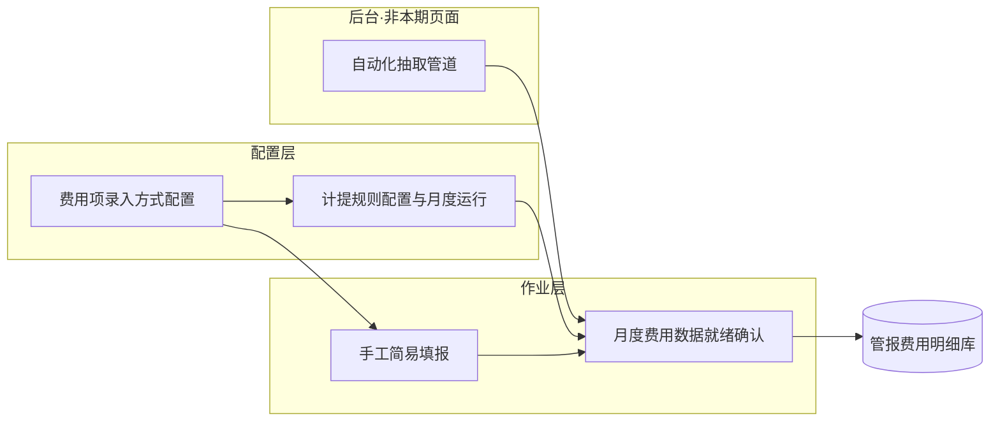

# 全渠道管报 · 费用录入「三选一」页面设计

- 文档日期：2026-06-04
- 状态：原型已输出 → `原型/费用管理/`
- 依据：`需求/立项会议` + 2026-06-04 产品对齐结论
- 关联 SSOT：`需求/财务各渠道逻辑.xlsx`、`方案/全渠道管报解决方案.md` §7.3

---

## 1. 设计原则（已对齐）

| 原则 | 说明 |
| --- | --- |
| 三选一 | 每项销售费用在配置中心绑定一种录入方式：**自动化提取 / 定额·定比例计提 / 手工简易填报** |
| 真实值优先 | 多数费用项能取真实值 → 走 **①**；取不到真实值 → **②**；偶发零散 → **③** |
| 立项平台 | 仅作后台取数源，**不在本期页面范围** |
| BP | **本期不做**；② 定比例分母用实际营收或历史统计，不用 BP |
| 财务核算 | **本期不管**；不做财务回写、差异勾稽 |
| 角色 | **GTM 专员**维护 ② 规则、操作 ③ 填报、在就绪台**代业务确认** |
| 数据不可改 | **① 同步结果只读**；就绪台不允许覆盖自动数；异常走重新同步或改配置，不能行级改数 |
| 归档原型 | `暂时不需要/` 下旧稿保留；**本设计为全新页面**，不复用改造 |

---

## 2. 页面总览



| 序号 | 页面 | 主要用户 | 一期必做 |
| --- | --- | --- | --- |
| P1 | 费用项录入方式配置 | GTM 专员（只读：财务/研发） | 是 |
| P2 | 计提规则配置与月度运行 | GTM 专员 | 是 |
| P3 | 手工简易填报 | GTM 专员 | 是 |
| P4 | 月度费用数据就绪确认 | GTM 专员 | 是 |

---

## 3. P1 · 费用项录入方式配置

### 3.1 页面目标

为 **§7.3 全量费用项**（约 20+ 销售费用项）逐项指定录入方式及默认分摊策略，作为 P2/P3/P4 的路由依据。

### 3.2 列表字段

| 字段 | 说明 |
| --- | --- |
| 费用项编码 | 与指标字典 / 财务各渠道逻辑一致 |
| 费用项名称 | 如：FBA 仓储月费、退货运费、站外投流… |
| 利润层级 | 平台直接费用 / 渠道营销 / 商品履约 / 共享管理 |
| **录入方式** | `自动化提取` / `定额·定比例计提` / `手工简易填报`（三选一，必填） |
| 默认分摊规则 | 引用分摊引擎规则 ID 或摘要（直接归属 / 渠道池 / 公司池 + 基数） |
| 数据源说明 | ① 项：接口/系统名（只读展示）；②③ 项：可空 |
| 关联计提规则 | ② 项：跳转 P2 规则；其它为空 |
| 最近变更人/时间 | 审计 |

### 3.3 编辑弹窗

- **录入方式**切换时展示不同提示：
  - ①：说明由后台管道同步，本页不可改数
  - ②：须先在 P2 配置规则
  - ③：说明通过 P3 按月登记
- **分摊规则**：下拉选择已发布规则（与解决方案 §7.4 三类池对齐）
- 保存后写入版本号；**已确认月份**的历史不因配置变更回溯（新月份生效）

### 3.4 权限

| 角色 | 权限 |
| --- | --- |
| GTM 专员 | 查看、编辑录入方式（②③ 项）、编辑分摊默认值 |
| 财务 | 只读 |
| 研发/数据 | 只读 + 维护 ① 数据源映射（后台，非本页） |

---

## 4. P2 · 计提规则配置与月度运行

### 4.1 页面目标

对 P1 中标记为 **「定额·定比例计提」** 的费用项，配置计提规则；**每月自动生成草稿**，由 GTM 专员确认后进库。

### 4.2 规则配置区（上半屏 · Tab 或左侧树）

按 **费用项** 维护规则，每个费用项 **二选一**：

| 规则类型 | 适用 | 配置字段 |
| --- | --- | --- |
| **定额** | 固定月度/期间金额 | 金额、币种、适用月份范围（可长期有效）、渠道/产品范围（可选收窄） |
| **定比例** | 随经营量波动 | 比例类型（见下表）、比例值或公式参数、分母口径、渠道/产品范围 |

**定比例 · 比例类型**（单选）：

| 类型 | 说明 | 典型参数 |
| --- | --- | --- |
| 固定比例 | 人工维护常数 | 如退货率 15% |
| 滚动历史占比 | 近 N 月（默认 12）费用÷销售额 | N、销售额口径、渠道范围 |
| 上月比例 | 上月实际占比延续 | — |

> 分母默认：**当月累计实际营收**（至运行日）；BP 本期不用。

**规则状态**：草稿 → 已发布 → 已停用

### 4.3 月度运行区（下半屏）

| 字段 | 说明 |
| --- | --- |
| 会计月份 | YYYY-MM |
| 费用项 | 仅 ② 类 |
| 运行状态 | 未运行 / 已生成草稿 / 已确认 / 已进库 |
| 计提金额（汇总） | 系统计算 |
| 分摊预览 | 跳转明细：MSKU×渠道 分摊结果 |
| 操作 | **运行计提** / **确认** / **重新运行**（仅草稿态） |

### 4.4 状态流

```text
[未运行] --运行计提--> [已生成草稿] --GTM确认--> [已确认] --就绪台汇总进库--> [已进库]
                              ↑
                         重新运行（覆盖草稿）
```

- **已进库**后不可在本页修改；下月重新运行
- 确认人：GTM 专员（代业务确认）
- 无财务复核节点

### 4.5 与 P1 关系

- P1 录入方式 ≠ ② 的费用项 **不可** 在本页配置规则
- P1 改为 ② 时，须至少有一条 **已发布** 规则才能在下月运行

---

## 5. P3 · 手工简易填报

### 5.1 页面目标

对 P1 中标记为 **「手工简易填报」** 的费用项，提供 **低字段量、可批量** 的登记入口；适用于无法自动取数、也不适合写固定计提规则的零散费用。

### 5.2 列表 + 筛选

| 筛选项 | 说明 |
| --- | --- |
| 会计月份 | YYYY-MM |
| 费用项 | 仅 ③ 类 |
| 状态 | 草稿 / 已确认 / 已进库 |

| 列表列 | 说明 |
| --- | --- |
| 批次号 | 系统生成 |
| 费用项 | |
| 会计月份 | |
| 金额 | |
| 渠道/产品范围摘要 | 如「北美·亚马逊·场景Outdoor·MSKU×3」 |
| 状态 | |
| 操作 | 编辑（草稿）/ 确认 / 明细 / 作废 |

### 5.3 新增/编辑表单（极简）

| 字段 | 必填 | 说明 |
| --- | --- | --- |
| 费用项 | 是 | 下拉，仅 ③ 类 |
| 会计月份 | 是 | 单选月 |
| 金额 | 是 | |
| 币种 | 是 | |
| 渠道范围 | 否 | 区域/国家/渠道/店铺/客户（与全局筛选规范一致，取交） |
| 产品范围 | 否 | 场景品类 / 品线 / model / MSKU 等（取交） |
| 备注 | 否 | |

**交互**：

1. 填写后 **预览分摊**（按 P1 默认分摊规则 + 上月或当月营收权重）
2. **保存草稿** 或 **确认**（确认后不可编辑，只可作废）
3. 可选 **模板导入**（CSV），解析后仍为草稿批次

### 5.4 状态流

```text
[草稿] --确认--> [已确认] --就绪台进库--> [已进库]
  |                    |
 作废                  作废（已进库前）
```

- 与归档稿「补充费用导入与分摊」类似交互，但 **费用项范围限定为 ③**，且状态命名与 P4 对齐

---

## 6. P4 · 月度费用数据就绪确认

### 6.1 页面目标

每月 **GTM 专员** 统一查看全部费用项就绪情况，**只读预览** ① 同步结果，确认 ②③ 已确认数据，**一键汇总进管报库**。本期验收核心页。

### 6.2 就绪看板（主表）

| 列 | 说明 |
| --- | --- |
| 费用项 | |
| 录入方式 | ① / ② / ③ 标签 |
| 就绪状态 | 见下表 |
| 本月金额（汇总） | 只读 |
| 分摊颗粒度 | 如 MSKU×渠道×月 |
| 最后更新时间 | |
| 操作 | 查看明细 / 跳转来源页 |

**就绪状态枚举**：

| 状态 | ① 自动化 | ② 计提 | ③ 手工 |
| --- | --- | --- | --- |
| 未就绪 | 同步未完成或失败 | 未运行或未确认 | 无已确认批次 |
| 已就绪 | 同步成功 | 已确认 | 已确认 |
| 已进库 | 本月已汇总 | 本月已汇总 | 本月已汇总 |

### 6.3 页面级操作

| 按钮 | 条件 | 行为 |
| --- | --- | --- |
| 刷新同步状态 | 任意 | 拉取 ① 最新同步结果（只读） |
| 确认并进库 | 全部费用项 = 已就绪 | 写入管报费用明细库，状态 → 已进库 |
| 导出就绪报告 | 任意 | Excel：项级金额 + 状态 |

**硬性规则**：

- **① 数据不可在本页修改**；同步失败 → 展示错误原因 + 「联系数据/研发」，或跳转 P1 查看数据源
- **部分就绪不可进库**（整月全项就绪才允许）
- 进库后当月锁定；若要更正 ②③ → 在来源页作废重提；① → 重新同步后 **下月** 或 **解锁流程（二期）**

### 6.4 明细抽屉

- 展示该费用项本月 MSKU×渠道 分摊明细（只读）
- 标注数据来源：自动同步 / 计提批次号 / 手工批次号

---

## 7. 跨页数据流（一期）

```text
月初 D+1～D+5（示例）：
  ① 后台管道自动同步上月完整月数据
  ② GTM 在 P2「运行计提」→ 确认草稿
  ③ GTM 在 P3 补录并确认
  P4 检查全项就绪 → 「确认并进库」
  经营分析明细 / 看板读取管报库
```

| 环节 | 时间粒度 | 说明 |
| --- | --- | --- |
| 费用归属月 | 月 | 到不了日则记 **当月最后一天** |
| 确认角色 | GTM 专员 | 代业务确认，不分费用项拆确认人 |
| 进库 | 全项就绪 | 一次性写入 |

---

## 8. 与现有能力边界

| 已有 | 关系 |
| --- | --- |
| 经营分析明细 / 看板 | **下游消费** P4 进库结果 |
| 财务字段映射维护（归档） | 后台 SSOT，**不替代** P1 录入方式 |
| 营销费用规划 / 使用看板（归档） | 本期不启用；BP 二期再议 |
| 补充费用导入与分摊（归档） | P3 交互可参考，独立新页 |

---

## 9. 原型交付顺序建议

1. **P4 月度就绪确认** — 定验收口径与状态机
2. **P1 费用项配置** — 定三选一路由
3. **P2 计提规则与运行** — 定比例/定额表单
4. **P3 手工简易填报** — 极简表单 + 分摊预览

---

## 10. 修订记录

| 版本 | 日期 | 说明 |
| --- | --- | --- |
| v1.0 | 2026-06-04 | 立项会议对齐 + 产品确认 8 项原则 |
