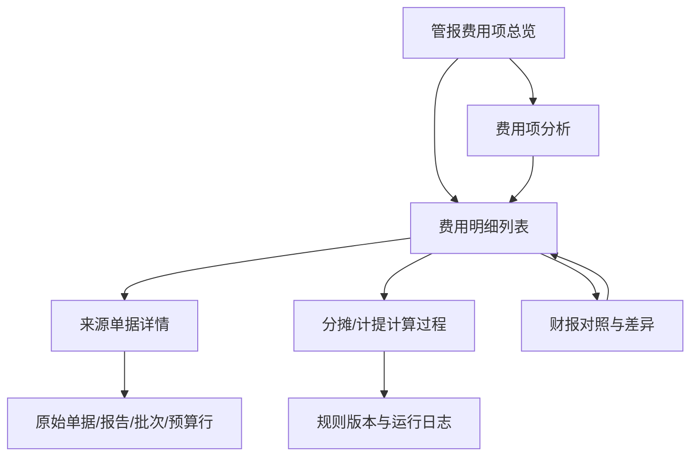

# 管报二期产品规划

## 1. 二期目标

二期建设目标是形成“费用项管报展示 + 数据分析 + 明细追溯 + 来源单据查看 + 对账差异处理”的完整闭环。

用户在管报费用项页面看到一个金额后，应能回答四个问题：

1. 这笔费用属于哪个费用项、哪个期间、哪个渠道/店铺/MSKU、哪个费用部门。
2. 这个金额来自哪些明细。
3. 每条明细来自哪张单据、哪个导入批次、哪个预算行或哪个规则运行结果。
4. 这个金额和财务口径是否一致，不一致时差异是什么、如何处理。

## 2. 用户角色

| 角色 | 核心诉求 |
| --- | --- |
| 管报分析人员 | 看费用结构、趋势、异常，定位金额来源 |
| 财务运营 | 核对费用项、部门归属、财报差异、定稿状态 |
| 业务负责人 | 查看渠道/店铺/MSKU 费用投入与利润影响 |
| 系统管理员 | 维护费用项、费用部门、来源定义、权限 |
| 审计/复核人员 | 查看来源单据、计算过程、操作日志和定稿快照 |

## 3. 功能地图

## 4. 页面规划

### 4.1 管报费用项总览

用途：从管理报表视角看费用项汇总。

核心能力：

- 费用项树：支持大类、子类、场景、末级费用项展开。
- 汇总维度：月份、日期、渠道、店铺、国家、MSKU、SKU、费用部门、币种。
- 指标：金额、金额 USD、占净收入比、环比、同比、预算差异、财报差异。
- 状态：未定稿、业务预估、财务定稿、已锁定。
- 操作：查看明细、查看分析、导出、查看差异。

### 4.2 费用项分析

用途：对某个费用项或费用项组合做分析。

核心能力：

- 趋势图：按月/按日看金额趋势。
- 结构图：按渠道、店铺、费用部门、MSKU、来源类型拆分。
- Top 明细：金额 Top 渠道、Top 店铺、Top MSKU、Top 费用部门。
- 异常提示：环比异常、负数异常、未分摊异常、无来源单据异常、财报差异异常。
- 贡献利润影响：展示该费用项对贡献利润、营业利润的影响。

### 4.3 费用明细列表

用途：解释汇总金额的构成。

核心字段：

| 字段组 | 字段 |
| --- | --- |
| 基础维度 | 月份、日期、渠道、店铺、国家、MSKU、SKU、产品名称、SKU归属部门、费用部门 |
| 费用维度 | 费用大类、费用子类、场景L1、场景L2、场景L3、费用项、正/负数 |
| 金额 | 原币金额、币种、汇率、金额USD |
| 分摊 | 是否分摊、分摊规则、分摊基数、分摊前金额、分摊比例 |
| 来源 | 主取值模式、取值来源、来源单据类型、单据号、来源行号、导入批次号、规则运行编号、项目预算编号 |
| 管理 | 数据批次、定稿状态、是否财务定稿覆盖、是否历史过渡口径、备注 |

### 4.4 来源单据详情

用途：从费用明细回看原始来源。

按来源类型展示不同内容：

| 来源类型 | 详情展示 |
| --- | --- |
| 业务系统单据 | 单据头、单据行、物料、客户、部门、金额、币种、审核状态 |
| 金蝶销售出库单 | 单据号、日期、客户、物料、数量、单价、金额、税额、价税合计、部门 |
| 金蝶销售退货单 | 退货单号、退货类型、退货收入、退款金额、关联销售单 |
| 平台报告 | 报告名称、报告期间、订单号、交易类型、费用字段、原始金额 |
| 费用导入批次 | 批次号、导入人、导入时间、费用项、归属月、金额、范围、分摊模式、状态 |
| 项目预算 | 项目编号、预算行号、收益日期、营销类型、渠道/店铺/MSKU、预算金额 |
| 计提/扣款规则 | 客户、费用项、计提方式、比例/固定金额、销售收入、实际扣款、计提扣款、期初/期末余额 |
| 退款规则 | 客户、期间、实际退款、滚动率、目标窗口、期初/期末计提退款余额、当月计提退款 |
| 财务同口径取数 | 标记为无明细来源；仅展示来源类型、期间、金额、币种/汇率、取值口径，不展示凭证号、科目、核算维度、账簿 |

### 4.5 计算过程页面或弹窗

用途：解释导入分摊、计提扣款、退款滚动、比例/参数类费用的计算。

必须展示：

- 输入数据：收入、退款、扣款、比例、固定金额、参数、费用部门、适用范围。
- 规则版本：规则编号、版本号、生效月、失效月、配置人、配置时间。
- 计算公式：可读公式和字段解释。
- 计算明细：每个参与计算的来源行。
- 计算结果：分摊前金额、分摊比例、分摊后金额。
- 重算信息：运行批次、运行时间、是否关账冻结。

### 4.6 财报对照与差异

用途：解释管报金额与财报金额的差异。

核心能力：

- 按月份、渠道、店铺、MSKU、费用项查看管报金额、财务金额、差异金额、差异率。
- 展示对照公式/说明、差异处理、是否可对账验平。
- 支持差异下钻到管报明细和财务来源。
- 对财务定稿覆盖的费用项标记覆盖来源和覆盖原因。

## 5. 优先级

### P0 必做

- 管报费用项总览。
- 费用明细列表。
- 来源单据追溯字段落库。
- 导入批次、项目预算、计提/扣款/退款规则的来源详情。
- 分摊计算过程。
- 定稿状态与数据批次展示。

### P1 应做

- 费用项趋势分析。
- 费用结构分析。
- 财报对照与差异。
- 异常提醒。
- 导出明细。

### P2 可迭代

- 预算差异分析。
- 自动异常归因。
- 费用项影响贡献利润的桥接分析。
- 审计视图和跨期间变更追踪。

## 6. 二期不建议纳入的范围

- 不在二期直接重做一期取值逻辑。
- 不在二期直接改写费用来源定义、费用导入、项目预算、退款/扣款台账的原始业务数据。
- 不在二期先做复杂预测模型，优先把已发生费用解释清楚。
- 不在二期绕过关账规则修改已锁定月份数据。
