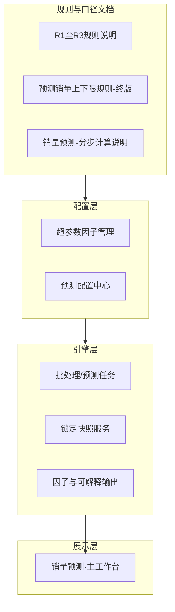

# 产品需求文档（PRD）：销量预测（方案级 · 含主工作台详设）

> **产品名称**：**销量预测**（对外统一名称）。本 PRD 以 **主工作台** 为详设核心，并串联 **预测配置中心**、**超参数因子管理**、引擎与规则文档，形成可交付、可验收的完整方案说明。  
> **原型（主工作台）**：[../原型/销量预测管理-原型说明.html](../原型/销量预测管理-原型说明.html)  
> **红点与导出/字段字典（验收对照）**：[../原型/prototype-anno-data-销量预测管理.js](../原型/prototype-anno-data-销量预测管理.js)  
> **文档版本**：**v5.2**  
> **状态**：草案（v5.0 全文重构；v5.1 文档索引精简为可点击核心四条；v5.2 KPI/主图/ASIN 口径与规则文档对齐）

---

## 1. 项目背景与价值

### 1.1 背景

1. **行业阶段**：跨境电商从流量红利进入**精细化运营**阶段，库存与资金周转成为核心抓手；**销量预测**是补货、调仓、促销排期的共同输入。  
2. **现状痛点**：大量依赖人工经验或简单外推，预测质量波动大；大促、调价、竞品冲击等**非稳态**场景下难以及时对齐；计划与渠道对「用哪一版预测、如何复盘」**口径不一**。  
3. **纯算法或纯规则局限**：纯 ML 可解释性与冷启动成本高；纯规则僵化、难刻画多因子交互。本方案采用 **规则可解释 + 算法可调优** 的混合路线，并以 **客观上下限带 + R1～R3 阶梯锁定** 统一「展示与复盘」语言。  
4. **决策语境**：计划、运营、销售需要在**同一时间切片**下对照 **多提前期锁定目标（R1～R3）**、**客观区间（下限～上限）**、**实际关账销量** 与 **预测达成率**，减少争议、提升协同效率。  
5. **范围边界（立项收敛）**：本阶段聚焦**单店/单 Listing 粒度**的预测辅助与展示，**不嵌入**跨部门 SOP、不与 PSI 等外部流程强绑定（详见 [../会议/立项会要点.md](../会议/立项会要点.md)）；**forecast** 语义上兼含「客观潜力」与「目标分配」，产品不将「事后准确率」作为唯一成功标准。

### 1.2 价值

| 维度 | 价值说明 |
|------|----------|
| **计划 / 供应链** | 提前 12 个月滚动视图 + 三档锁定目标，支撑安全库存与备货节奏；异常备注留痕支撑大促/断供等特殊复盘。 |
| **渠道运营** | 按区域/店铺/SKU 下钻，结合**达成率筛选**快速定位「预测与执行偏差大」的货号。 |
| **销售 / forecast** | 系统预测与 forecast 轨并列展示（受权限控制），便于对照填写与沟通。 |
| **管理只读** | KPI 卡 + 趋势图一览区域健康度，无需进入明细即可把握方向。 |
| **数据与算法** | 因子、弹性、锁定快照字段与文档公式对齐，便于联调、回归与迭代。 |

### 1.3 本 PRD 读者与用途

- **产品 / 业务**：评审范围、交互与口径。  
- **研发 / 测试**：实现筛选、列表、图表、弹窗、导出及与接口字段映射；按本文 **第 5 章** 与红点 JS **双向验收**。  
- **运营计划**：理解「双预测选择」、达成率聚合与异常备注对 KPI 的影响。

---

## 2. 整体方案

### 2.1 能力分层（自上而下）

1. **规则与口径文档**：定义 **R1/R2/R3** 锁定语义、**预测达成率** 单月/聚合公式、**上下限** 五类因子情景合成、**点预测与系数** 分步计算（含范围：如 **同源 ASIN 多 MSKU 合并**、**Q_pred=0** 不计达成率等）。  
2. **配置层**：维护因子库、超参区间与绑定；维护各 MSKU/维度上的**弹性**及与因子关系；支持导入导出与版本留痕（详见各子页 PRD/原型）。  
3. **引擎层**：按配置与原始数据计算滚动预测、**上下限**、写入 **锁定快照**；输出明细因子供主工作台「详情」使用。  
4. **展示层（主工作台）**：在统一筛选时间窗下，聚合展示 **KPI、主图、SKU/MSKU 明细表**；支持 **达成率阈值筛选**、**详情下钻**、**异常备注**、**导出**。

### 2.2 关键业务对象

- **预测对象**：默认 **MSKU × 自然月**（渠道以亚马逊为主；对象范围见 [销量预测-分步计算说明.md](./销量预测-分步计算说明.md) **第一节、1.1**）。  
- **三档目标**：**目标 R1 / R2 / R3** — 相对目标月 1 号剩余天数进入各档**可配置阈值**（默认 **30 / 60 / 90 天**）时锁定的预测件数。  
- **区间带**：与点预测同源销量合成公式在悲观/乐观情景下的 **下限～上限**（见《预测销量上下限规则-终版》）。  
- **预测达成率**：已关账月，由 **锁定预测 P** 与 **实际 A** 计算；支持**窗口聚合**用于列表与 KPI（见《R1至R3规则说明》及本文 **5.5、5.8**）。

---

## 3. 方案文档体系与维护约定

### 3.1 文档索引（核心推导与规则；路径可点击预览）

| 文档 | 路径（点击打开） | 主要内容 | 维护建议 |
|------|------------------|----------|----------|
| **本 PRD** | [销量预测管理-PRD.md](./销量预测管理-PRD.md) | 背景价值、整体方案、文档索引、**各页面职责**、**主工作台详设** | 产品主导；**交互/口径变更先改本文与原型红点，再排开发** |
| **销量预测-分步计算说明** | [销量预测-分步计算说明.md](./销量预测-分步计算说明.md) | 系数公式、符号约定、数值示例、范围（含 **1.1 ASIN 合并**） | 算法/因子规则变更时**先改此文档**，再同步 PRD 与配置红点 |
| **R1至R3规则说明** | [R1至R3规则说明.md](./R1至R3规则说明.md) | 锁定提前量、单月/窗口达成率、**5.3 Q_pred=0 排除** | 与主工作台筛选、KPI、列表列强一致 |
| **预测销量上下限规则-终版** | [预测销量上下限规则-终版.md](./预测销量上下限规则-终版.md) | 五类因子情景合成；**竞争力与《分步计算说明》§3.5 `G_comp` 同源**；非承载 MSKU **客观三线全 0 须展示** | 主图区间带、详情上下限列强一致 |

### 3.2 变更顺序（建议）

1. **业务改口径** → 更新《分步计算说明》或《R1～R3》/《上下限终版》等**推导文档**。  
2. **产品** → 更新 **本 PRD** 对应章节 + **原型红点 JS** 文案。  
3. **研发** → 接口字段、任务调度、前端展示；**测试** → 按 **第 10 章 UAT** + 红点验收。

---

## 4. 方案页面（模块）与解决的问题

| 页面/模块 | 解决什么问题 | 主要用户 |
|-----------|----------------|----------|
| **销量预测 · 主工作台** | 统一时间窗下 **看** 三档目标+区间+实际+达成率；**筛** 出达成率异常行；**下钻** 因子与备注；**导出** 对账 | 计划、运营、销售、管理只读 |
| **预测配置中心** | 维护各因子 **弹性**、与 MSKU/维度绑定；保证与引擎 **系数口径** 一致 | 计划、数据、管理员 |
| **超参数因子管理** | 维护 **超参因子字典**（编码、含义、取值区间），供配置中心引用 | 计划、数据、管理员 |
| **批处理/预测任务（无独立 UI）** | 定时或手动重算预测、生成锁定快照、写可解释因子 | 系统、运维 |

---

## 5. 销量预测 · 主工作台 — 详细需求

> 下列描述与 **HTML 原型控件 id**、**`prototype-anno-data-销量预测管理.js`** 红点一致处，以**二者同时满足**为验收标准。

### 5.1 页面目标与信息架构

**目标**：用户在**单一页面**完成「筛选 → 看 KPI/主图 → 查表 → 详情/备注 → 导出」，且图表、KPI、列表在**同一时间切片、同一套口径**下自洽。

**布局（自上而下）**

1. **顶栏**：系统壳占位（非本需求核心）。  
2. **全局筛选栅格**：区域、国家、店铺、场景品类、品线、产品定位、model、SKU 组合、TL、Sales、可售状态、**#fltPredR 预测选择（R1/R2/R3）**、达成率比较符、阈值(%)、**月份范围**、**搜索**、**重置**。  
3. **预测方式**：`#predModeMl` 机器学习 / `#predModeSys` 系统预测。  
4. **KPI 条 `#kpiStrip`**：R1、R2、R3 三张「预测达成率」卡。  
5. **主图 `#chartMainWrap`**：销量预测与达成（双 Y 轴）。  
6. **明细表区**：工具栏 **#tablePredR**、开关 `#chkSysRuleForecast` / `#chkForecastFill`、**导出** `#btnExport`、**批量异常备注** `#btnAddRemarkBatch`、表格 `#dataTable`。  
7. **弹层 `#dlgBox`**：详情、异常备注（单条/批量/历史）、趋势图 `#trendPop` 等。

---

### 5.2 全局筛选 — 通用规则

| 规则项 | 说明 |
|--------|------|
| **生效方式** | 各筛选项与主数据、权限服务为 **AND**；变更后须点击 **`#btnSearch` 搜索** 才刷新主图/KPI/表（避免大数据量下每次变更都打接口）。 |
| **数据来源** | 区域/国家/店铺/品类/品线/定位/model/Sales/TL/可售状态等来自 **ERP 主数据与权限裁剪**；预测与达成率来自 **预测结果服务 + 锁定快照 + 实际销量服务**；月份范围与滚动预测业务月对齐。 |
| **重置** | 恢复默认筛选条件并刷新（具体默认值由产品配置表给出，原型可为「全部 + 默认近 N 月」）。 |

---

### 5.3 筛选控件逐项说明

以下 **「取值来源」** 指正式环境接口/主数据域；原型为演示数。

| # | 控件/区域 | id 或定位 | 类型 | 取值来源 | 逻辑说明 |
|---|-----------|-----------|------|----------|----------|
| 1 | 区域 | 筛选栅格第 1 列 `select` | 下拉 | 组织树-大区 | 选「全部」不按区域过滤；与国家、店铺逐级收窄。 |
| 2 | 国家 | 第 2 列 | 下拉 | 站点国家主数据 | 在区域下进一步限定；影响列表「区域/国家/店铺」列。 |
| 3 | 店铺 | 第 3 列 | 下拉 | 渠道店铺账号 | 与订单、预测结果 **店铺主键** 对齐，防串店。 |
| 4 | 场景品类 | `#filterScenarioCategory` | 下拉 | 品类/场景树 | 与运营活动、负责人权限可联动裁剪选项。 |
| 5 | 品线 | `#filterProductLine` | 下拉 | 企划分组 | 与场景品类为 AND。 |
| 6 | 产品定位 | 第 6 列 | 下拉 | 主数据标签 | 与《分步计算说明》**渠道与对象**（P0～P2 等）可交叉校验。 |
| 7 | model | `#modelQuery` | 下拉 | 产品型号主数据 | 与 SKU 关键字 AND；空=不限制 model。 |
| 8 | SKU | `#skuSearchMode` + `#skuKeyword` | 模式+输入 | Listing/SKU 主数据 | **模糊**：子串；**精确**：全等；**8 位**：内部短码规则（以主数据为准）。 |
| 9 | TL | 第 9 列 | 下拉 | 组织-销售线 | 权限裁剪可见 TL。 |
| 10 | Sales | 第 10 列 | 下拉 | 销售人员主数据 | 常配合 TL 只看名下货号。 |
| 11 | 可售状态 | 第 11 列 | 下拉 | Listing 状态 | 过滤停售等，减少无效对比。 |
| 12 | **预测选择（筛选用）** | **`#fltPredR`** | 下拉 R1/R2/R3 | 无独立数据源 | **仅**与「达成率比较符」「阈值」组合，决定**行级窗口聚合达成率**用哪档 **P** 与阈值比较；**不改变**表头「R*预测达成率」列（由 `#tablePredR` 控制）。 |
| 13 | 达成率比较符 | 紧邻阈值 | 下拉 | 无 | 大于 / 大于等于 / 等于 / 小于 / 小于等于。 |
| 14 | 阈值 | 数值框 | 用户输入 % | 与第 12 项所选 R 档下行级聚合达成率比较。 |
| 15 | 月份范围 | `#monthRangeDrpWrap` | 月份范围控件 | 业务日历 | 控制 **主图横轴**、**表体动态月列**、详情行数；格式 `YYYY-MM ~ YYYY-MM`。 |
| 16 | 搜索 | `#btnSearch` | 按钮 | — | 触发全页数据刷新；应含 loading/防抖/失败提示。 |
| 17 | 重置 | （与搜索同区） | 按钮 | — | 恢复默认条件并刷新。 |

**计算逻辑（行是否展示）**  

对表格每一行 `i`：

1. 取当前 **月份范围** 内所有 **已关账** 且 **未被异常备注排除** 且 **不满足「Q_pred=0 整月排除」**（若有）的月份集合 **`Mi`**（详见《R1至R3》**5.3** 与《分步计算说明》**1.1**）。  
2. 令 **Rk** = **`#fltPredR`** 所选档；对 **`Mi`** 中每月 **`m`** 取锁定预测 **`P[i,m]`**、实际 **`A[i,m]`**（**P** 为所选 **Rk** 档快照）。  
3. 行级窗口聚合达成率 **`Ach_flt[i]`**（用于与阈值比较；**注意**：列表「R*预测达成率」列若用 **`#tablePredR`** 另一档，则列内用 **`Ach_table[i]`**，公式同形但 **P 取档不同**）：  

   `Ach_flt[i] = 100% − (Σ_m |A[i,m] − P[i,m]|) / (Σ_m max(A[i,m], P[i,m]))`，其中 **`m`** 遍历 **`Mi`**。  

   若分母为 **0** 或 **`Mi`** 为空 → 本行**不参与阈值比较**（隐藏或展示「—」由产品二选一，须全页一致）。  
4. 将 **`Ach_flt[i]`** 与 **比较符 + 阈值** 比较，不满足则 **整行隐藏**（筛选语义）。

**示例（阈值筛选）**

- **`#fltPredR`** = **R2**；比较符 **≥**；阈值 **40%**。  
- 某行两月关账：月1 **`A=500`，`P_R2=2000`**；月2 **`A=400`，`P_R2=380`**。  
- **`Σ|A−P| = 1500+20 = 1520`**，**`Σmax(A,P) = 2000+400 = 2400`** → **`Ach_flt = 100% − 1520/2400 ≈ 36.7%`** → **小于 40%** → **该行隐藏**。  
- 将阈值改为 **30%** 则该行 **显示**。

---

### 5.4 「双预测选择」与易混点（强制读）

| 控件 | id | 作用 | 不改变什么 |
|------|-----|------|------------|
| **筛选栏预测选择** | `#fltPredR` | 只服务 **达成率阈值筛选** 用哪档 **P** | **不改变**表头「R1/R2/R3 预测达成率」列名、单元格数值、详情列集 |
| **表格工具栏预测选择** | `#tablePredR` | 控制列表/详情/导出中 **R*预测达成率** 与 **目标Rk/下限/上限/Rk预测达成率** 用哪档 **P** | **不改变** `#fltPredR` 阈值筛选使用的档（二者可故意选不同，用于「用 R3 筛行，但表上展示 R1」等场景） |

**联调自检**：切换 `#fltPredR` 仅改变「哪些行被阈值刷掉」；切换 `#tablePredR` 改变表头「R*」前缀与详情弹窗列组。

---

### 5.5 预测方式（`#predModeMl` / `#predModeSys`）

| 选项 | 含义 | 数据来源 | 影响范围 |
|------|------|----------|----------|
| **机器学习** | 以算法管线输出为主预测轨 | ML 预测任务结果表 | 表体主数字行、主图目标柱序列、详情中点预测相关列 |
| **系统预测** | 规则/基线预测轨 | 规则引擎输出表 | 同上 |

切换后须 **重新拉数**；与「系统规则销量预测」展开行（`#chkSysRuleForecast`）关系：**主轨**由 radio 决定，**勾选展开**为对比第二轨（演示逻辑见红点）。

---

### 5.6 KPI 区（`#kpiStrip`）

| 卡片 | 展示内容 | 计算逻辑 | 数据来源 |
|------|----------|----------|----------|
| **R1 预测达成率** | 汇总百分比 | 在 **当前筛选结果集**（应用 `#fltPredR` + 比较符 + 阈值后仍可见的行）上：先对 **每一行** 按《R1至R3》**5.2** 计算该行窗口聚合达成率（**P 取 R1**），再对各行结果做 **等权算术平均**（**不加权**销量或 GMV）。 | 各 MSKU 的 R1 锁定预测 + 实际关账 |
| **R2 / R3** | 同上 | **P 分别取 R2、R3**；聚合方式同为 **等权算术平均** | 同上 |

**与列表一致性**：KPI 所用公式与 **《R1至R3》5.2 窗口聚合** 一致；**排除月**、**Q_pred=0 排除** 与列表行级计算一致。

---

### 5.7 主图区（`#chartPanelHead` / `#chartMainWrap`）

| 序列 | 类型 | Y 轴 | 数据来源 | 说明 |
|------|------|------|----------|------|
| **目标 R1 / R2 / R3** | 分组柱 + 各档 **下限～上限** 浅色带 | 左轴 件数 | 锁定快照 + 上下限服务 | 三档柱并列；带为《终版》情景合成 |
| **实际销量** | **柱状**（非折线） | 左轴 | 财务/运营约定出库或结算口径 | **已关账且有实际 A 的月份照常绘制**，与 **R*预测达成率** 是否可算 **解耦**：某月若因 **`Q_pred=0`**（见 **5.13**、《R1至R3》**5.3**）或异常备注等 **不参与**达成率聚合，**达成率折线在该月断点**，但 **实际销量柱仍绘制**（避免「有实销却看不见」）。未关账月可空。 |
| **R1/R2/R3 预测达成率** | 折线 | **右轴 0%～100%** | 单月公式 `100% − |A−P| / max(A,P)`（**P** 分别取 R1/R2/R3 当月锁定预测） | 未关账月断点；**《R1至R3》5.3**（**Q_pred=0** 等）排除月断点 |

**Tooltip**：目标柱展示当月 **点预测 + 下限 + 上限**；达成率线展示单月百分比。

---

### 5.8 明细表工具栏与开关

| 元素 | id | 逻辑 |
|------|-----|------|
| **预测选择（列表口径）** | `#tablePredR` | R1/R2/R3；控制 **表头 `#thPredAch`** 文案、行内 **R*预测达成率**、**详情** 弹窗目标/上下限/达成率列组、**导出** 中对应列名与数值。 |
| **系统规则销量预测** | `#chkSysRuleForecast` | 勾选后在行内展开/附加 **规则基线** 对比轨（与主预测轨可并存）。 |
| **forecast 填写销量** | `#chkForecastFill` | 勾选后展示 forecast 行；是否可编辑由权限与流程状态决定；与详情 `#detailThFc` 列同源。 |
| **全选** | `#chkSelectAll` | 仅当前页；与批量备注联动。 |
| **导出** | `#btnExport` | 无需勾选行；导出列与 **当前可见表头** 一致；字段顺序与含义以 **红点「导出」** 及钉钉模板链接为验收对照。 |
| **新增异常备注（批量）** | `#btnAddRemarkBatch` | 默认 disabled；**至少勾选一行**才可点；打开 `#dlgBox` 批量表单。 |

---

### 5.9 表格 `#dataTable` — 列与数据

| 列（逻辑顺序） | 说明 | 数据来源 |
|----------------|------|----------|
| 勾选列 | 行选择 | 本地 UI |
| **区域/国家/店铺** | 维度展示 | 与筛选同源 |
| **场景/品类/品线** | 路径缩写 | 商品主数据 |
| **销售团队** | `#thColSales` 可拖拽列宽 | 组织与归属关系 |
| **SKU 信息** | sku、定位摘要 | 主数据 |
| **MSKU 信息** | 平台+MSKU | Listing；**同源 ASIN 多 MSKU** 拆行策略见引擎与《分步计算说明》1.1 |
| **动态月份列** `#monthHeadRow` | 每月主行：当前预测方式下 **系统/ML 点预测**；可展开规则行、forecast 行 | 预测任务输出；**P 展示不随 `#fltPredR` 变化** |
| **历史销量趋势** | Sparkline | 历史实际或预测序列 |
| **R*预测达成率** `#thPredAch` | **随 `#tablePredR`**；窗口聚合，**P 取对应档** | 锁定快照 + 实际 + 备注排除 + **5.3 Q_pred=0 排除** |
| **操作** | 详情、异常备注、趋势入口等 | — |

**行级「R*预测达成率」计算示例**（与 **5.3** 同公式，但 **P 取 `#tablePredR`** 所选档，记 **`P_table`**）：

- 若 **`#tablePredR`=R1**，则列内 **`Ach_table[i]`** 用 **R1 锁定预测** 代入窗口聚合式（**`Mi`**、排除规则同 **5.3**）。  
- 与 **`#fltPredR`** 可不同：例如用 **R3** 筛行，但列表展示 **R1** 达成率。

---

### 5.10 详情弹窗（行内「详情」）

| 项 | 说明 |
|----|------|
| **触发** | 点击行操作「详情」。 |
| **列规则** | **仅展示**与 `#tablePredR` 一致的一档：**目标Rk、Rk下限、Rk上限、Rk预测达成率**；**不**与另两档并列。 |
| **固定列** | 月份、基准销量、弹性系数（rowspan）、影响因子系数（rowspan）、forecast 列等 — 口径见红点 **FORECAST_DETAIL_ANNOS**。 |
| **数据** | 与列表同一 MSKU、同一月份范围；因子列与引擎可解释输出字段映射。 |

---

### 5.11 异常备注（单条 / 批量 / 历史）

| 项 | 说明 |
|----|------|
| **入口** | 行内「异常备注」任意行可点；批量需先勾选。 |
| **表单字段** | 生效时间范围、备注内容、**`#chkRemarkExcludeAchieve` 生效区间内月份不参与预测达成率计算**（默认**不勾选**）。 |
| **勾选后逻辑** | 生效区间内**每个自然月**整月从该行窗口聚合达成率的 **分子、分母同时剔除**（与《R1至R3》第 7 节一致）。 |
| **历史列表** | 展示修改人、时间、内容、生效区间、是否排除达成率；正式字段以接口为准。 |

**演示脚本注意**：`remarkDemoData`、`isMonthExcludedByRemarks` 等函数行为见红点 **REMARK_FORM_ANNOS**。

---

### 5.12 趋势图弹窗 `#trendPop`

- 点击 Sparkline 或等价入口打开；展示该行放大趋势；关闭时正式版应 **dispose** ECharts 实例防泄漏（见红点）。

---

### 5.13 与 ASIN 合并、Q_pred=0 的交叉口径

- **训练/预测合并**：同站点、同 ASIN、多 MSKU（`-1`、`-2`…）合并规则见 [销量预测-分步计算说明.md](./销量预测-分步计算说明.md) **§1.1**。  
- **承载 MSKU** 独占非零 **Q_pred**；其余同源行 **Q_pred = 0**。  
- **客观下限 / 客观中值 / 客观上限（非承载）**：与《预测销量上下限规则-终版》一致，**三线均为 0**（件）；主工作台 **仍展示** 该区间的柱/带（与 **1.1**、终版 **v1.1** 一致），**不得**因无点预测而隐藏。  
- **达成率**：**Q_pred=0** 的月份/行不参与达成率聚合（见 [R1至R3规则说明.md](./R1至R3规则说明.md) **§5.3**）；**与主图「实际销量柱」是否绘制无关**（见 **§5.7**）。列表/KPI/主图达成率折线须与之一致。

---

## 6. 预测配置中心 — 需求概要

> 详设以原型红点为准：[../原型/销量预测配置中心-原型说明.html](../原型/销量预测配置中心-原型说明.html)、[../原型/prototype-anno-data-销量预测配置中心.js](../原型/prototype-anno-data-销量预测配置中心.js)。

| 模块 | 解决的问题 | 要点 |
|------|------------|------|
| 因子矩阵表 | 维护 MSKU（或维度）× 各因子 **弹性**、系数预览 | 与《分步计算说明》第三节各 **E_***、**C_*** 口径对齐 |
| 导入/导出 | 批量改配置、留痕 | 模板与校验规则见红点 |
| 列逻辑说明 | 流量/价格/转化/广告/竞争力等列计算说明 | 例：**价格基准（P_base）** 为近一年成交均价；**M_pri=P_est/P_base** 等 |

**数据取值**：主数据 MSKU、Listing、近一年销量/金额、流量、广告花费、品类排名等 — 与数仓表映射由数据架构文档维护（超出本 PRD 可写接口清单另附）。

---

## 7. 超参数因子管理 — 需求概要

> 原型：[../原型/超参数因子管理-原型说明.html](../原型/超参数因子管理-原型说明.html)、[../原型/prototype-anno-data-超参数因子管理.js](../原型/prototype-anno-data-超参数因子管理.js)。

| 模块 | 解决的问题 | 要点 |
|------|------------|------|
| 因子库 | 统一 **超参编码**、名称、说明、取值区间 | 被配置中心 **超参系数（C_hyp）** 绑定引用 |
| 版本/状态 | 启用停用、防误删 | 与线上回测任务联动约束由研发定 |

---

## 8. 数据服务与接口（概要）

| 服务 | 提供内容 |
|------|----------|
| 预测结果服务 | 滚动点预测、下限上限、分轨 ML/规则 |
| 锁定快照服务 | R1/R2/R3 按目标月与锁定日写入/读取 |
| 实际销量服务 | 关账实际 A |
| 可解释因子服务 | 详情弹窗因子分解字段 |
| 异常备注服务 | CRUD、排除达成率标记 |
| 主数据服务 | 筛选域、组织权限 |

---

## 9. 非功能需求

| 类别 | 要求 |
|------|------|
| **性能** | 常规筛选首屏可交互；大表虚拟滚动；导出走异步任务。 |
| **权限** | 组织/渠道/国家行级；备注编辑单独授权。 |
| **审计** | 备注写入审计日志。 |
| **一致性** | 主图/表/KPI 同一请求批次或同一版本号防串数据。 |

---

## 10. 验收标准（UAT 摘要）

1. 任意合法筛选下，主图与表 **目标 R1/R2/R3、下限/上限、实际** 同源一致。  
2. **手算达成率**：抽 1 行按窗口聚合公式；抽 1 月详情按单月公式；与 UI 一致。  
3. **双预测选择**：改 `#fltPredR` 只变行集合与 KPI；改 `#tablePredR` 只变表头 R* 与详情列组。  
4. **异常备注勾选** 后该行达成率与 KPI 变化符合排除规则；与 **Q_pred=0** 排除可同时回归。  
5. **导出** 列与可见表头一致，对照红点「导出」无矛盾。  
6. 无权限用户看不到未授权数据。

---

## 11. 修订记录

| 版本 | 日期 | 说明 |
|------|------|------|
| v1.0～v4.3 | 2026-04-02～04-23 | 历史：主工作台迭代、双预测选择、导出验收并入红点等（见各条） |
| **v5.0** | **2026-04-24** | **全文重构**：①背景与价值独立成章；②整体方案与文档索引及维护约定；③各页面职责表；④**主工作台**按筛选/KPI/图/表/弹窗/导出**逐项**描述数据来源与计算逻辑并附算例；⑤配置中心/超参概要；⑥与 ASIN 合并及 **Q_pred=0** 达成率排除交叉引用 |
| **v5.1** | **2026-04-24** | **§3.1 文档索引** 仅保留本 PRD、分步计算说明、R1～R3、上下限终版四条；路径列为 **可点击 Markdown 链接** |
| **v5.2** | **2026-04-24** | **§5.6** KPI 三卡汇总定为 **等权算术平均**；**§5.7** 明确 **`Q_pred=0` 等排除达成率之月仍绘制实际销量柱**；**§5.13** 非承载 MSKU **客观三线全 0 且展示**；**§3.1** 终版索引补充竞争力与 **G_comp** 同源 |

---

*本文档随迭代更新；口径变更须同步 **§3.1 文档索引** 中各核心 Markdown 与原型红点。*
