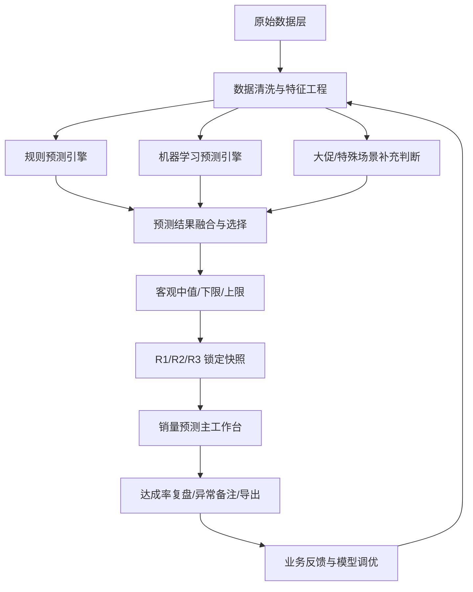
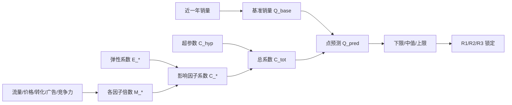

# 销量预测系统一期当前完整逻辑说明

> 来源：销量预测项目既有 PRD、规则说明、原型说明，以及 2026-07-21 销量预测一期复盘会议纪要。  
> 文档定位：用于让业务、产品、研发快速理解销量预测一期当前已经具备的完整逻辑，包括规则预测、机器学习预测、大模型替换、R1/R2/R3 锁定、达成率复盘和字段处理口径。  
> 当前状态：整理稿，待补充亚马逊上线后真实使用反馈、模型回测明细和最终模型字段版本。

---

## 1. 会议结论摘要

### 1.1 本次会议要求

本次会议不是单纯演示页面，而是要求重新讲清楚销量预测当前已有的底层方案框架，让用户先理解“系统现在到底怎么预测、怎么替换、怎么展示、怎么复盘”。会议中明确需要补充：

1. **背景与底层逻辑**：先说明为什么做销量预测、当前用什么逻辑做预测，再讲页面操作。
2. **规则预测框架**：梳理规则预测的输入、计算关系和可视化架构图。
3. **机器学习框架**：梳理机器学习输入字段、字段取舍、衍生特征、不可直接使用的泄漏字段。
4. **一期复盘口径**：亚马逊一期刚上线，当前需要先推动亚马逊业务真实使用，追踪没有用起来的原因和准确率表现。
5. **字段分类规则**：把机器学习字段按主键维度、过滤范围、核心输入、辅助特征、结果泄漏、成本费用、数据质量问题等分类，避免用户误以为所有字段都会进入模型。

### 1.2 关键判断

- **方向坚定要做**：销量预测不是一次性项目，而是提升销售预测准确率、备货协同、库存周转和供应链交付稳定性的长期能力。
- **规则与机器学习都保留**：规则预测准确率低于机器学习，但具备可解释性；后续以机器学习为主，规则预测作为基线、解释和对照。
- **亚马逊需先跑起来**：一期上周才上线，亚马逊当前还没有充分使用。需要凯伟侧持续推动销售使用、收集反馈、处理阻塞点。
- **生命周期分层评估**：后续准确率不能只看整体均值，应按产品生命周期拆分：新品、上市 6 个月内、1 年以上、1.5 年以上、成熟稳定品分别评估。
- **大模型只做指定月份替换**：当前不是全量大模型预测，而是仅用 7/10/11/12 月达成率更高的大模型结果替换对应月份机器学习结果，其它月份不动。

---

## 2. 一期方案定位

### 2.1 业务目标

销量预测一期面向亚马逊在售商品，给销售、运营、计划提供未来销量参考，降低完全依赖人工经验填 forecast 的成本。其核心不是单一页面，而是一套从历史数据、影响因子、规则/模型预测，到 R1/R2/R3 锁定、达成率复盘的完整链路。

一期需要解决的问题：

1. **销售预测效率低**：销售需要手工查看历史销量、广告、价格、活动、竞品等数据，SKU 多时维护成本高。
2. **预测质量波动大**：人工经验水平不一，旺季、大促、新品、断货等场景下波动明显。
3. **计划与业务口径不统一**：同一个 SKU 需要同时看系统推荐、人工 forecast、实际销量和多提前期达成率。
4. **供应链协同前置输入不足**：销量预测不稳定会影响备货、库存、周转和交付。

### 2.2 能力边界

本方案承接现有一期边界：

- **先做预测辅助，不强绑定业务流程**：不直接嵌入 PSI、不做跨部门 SOP 审批，不把系统预测作为强制约束。
- **当前对象聚焦亚马逊主力稳定品**：一期对象以亚马逊在售成品、P0/P1/P2 主力稳定品为主；当前机器学习预测范围按「产品定位 ∈ [1, 3, 5]、月均销量 ≥ 100、历史天数 ≥ 365 天」过滤。
- **预测粒度以 MSKU/自然月为主**：页面按 MSKU 展示，预测到自然月，滚动未来 12 个月。
- **系统结果用于参考与复盘**：不替代销售判断，但通过机器输出提高基础预测质量和执行效率。

---

## 3. 产品方案总架构



### 3.1 分层说明

| 层级 | 当前内容 | 当前说明 |
| --- | --- | --- |
| 原始数据层 | 销量、订单、广告、价格、流量、转化、商品主数据、开售时间、品类、库存、评价、排名等 | 亚马逊已有较多字段，但部分字段是当前快照或低方差字段，不能直接当作时间序列输入 |
| 数据清洗与特征工程 | 缺失处理、常量字段剔除、异常 SKU 剔除、日期特征、生命周期、促销标识、移动平均等 | 先按主力稳定品过滤，再按字段分类决定是否进入模型 |
| 规则预测引擎 | 基准销量 × 流量/价格/转化/广告/竞争力/超参等系数 | 作为可解释基线，准确率低于机器学习 |
| 机器学习预测引擎 | 历史样本学习字段权重并预测未来销量 | 当前主预测轨，覆盖产品定位 1/3/5、月均销量 ≥100、历史天数 ≥365 天的主力稳定品 |
| 大模型替换层 | 仅替换 7/10/11/12 月机器学习结果 | 替换依据是这些月份大模型达成率更高；其它月份保持机器学习结果 |
| R1/R2/R3 锁定 | 按目标月最后一天剩余天数锁定预测版本 | 默认 30/60/90 天，可配置 |
| 主工作台 | KPI、趋势图、明细、达成率、异常备注、导出 | 用于查看预测、切换预测方式、查看达成率和做复盘 |

---

## 4. 规则预测方案

### 4.1 规则预测定位

规则预测用于提供可解释的基础预测链路。它不依赖模型自动学习全部关系，而是将业务可理解的影响因子转化为系数，再与基准销量相乘，得到目标月预测值。

规则预测适合：

- 数据不足、模型暂未稳定时作为冷启动基线。
- 需要向业务解释“为什么这个月预测上升/下降”的场景。
- 与机器学习结果做对照，发现模型偏离业务常识的情况。

规则预测不适合：

- 独立承担全部预测准确率目标。
- 大促、竞品剧烈变化、断货、异常促销等非稳态场景。
- 未建立完整未来计划输入时直接预测远期销量。

### 4.2 规则预测输入

| 输入类别 | 主要字段/变量 | 作用 | 取数或维护方式 |
| --- | --- | --- | --- |
| 基准销量 | `Q_base` | 近一年月均销量，是预测起点 | 近一年总销量 / 12；近一年总销量为 0 时不出预测 |
| 流量 | `T_est`、`T_base`、`M_flow`、`E_flow` | 判断预计访问量变化对销量的影响 | 历史同比、去年同月、近一年均值；弹性由配置/算法给出 |
| 价格 | `P_est`、`P_base`、`M_pri`、`E_pri` | 判断价格计划或均价变化对销量的影响 | 有价格计划用计划价，否则近 30 天外推；价格弹性可为负 |
| 转化率 | `CR_est`、`CR_ref`、`M_cvr`、`E_cvr` | 直接刻画访问转订单能力 | 近 30 天转化、近两月环比、近一年基准转化 |
| 广告 | `A_est`、`A_ref`、`M_ad`、`E_ad` | 反映未来广告投入计划或延续水平 | 有计划用计划值，否则近 30 天或近 3 月均值 |
| 竞争力 | `G_comp`、`E_comp` | 反映类目/小类排名变化 | 近两月小类/大类排名环比，缺数时系数回到 1 |
| 超参数 | `C_hyp` | 承载特殊事件、业务策略、五类因子覆盖不到的变量 | 由超参数因子管理和配置中心维护 |

### 4.3 规则预测计算链路



核心公式：

```text
C_tot = C_flow * C_pri * C_cvr * C_ad * C_comp * C_hyp
Q_pred = Q_base * C_tot
```

### 4.4 规则预测上下限

上下限用于表达客观潜力区间，而不是销售目标。当前口径：

| 因子 | 下限路径 | 上限路径 |
| --- | --- | --- |
| 流量 | 预测流量 × 0.5 | 预测流量 × 2 |
| 转化率 | 近 3 个月代表值 min | 近 3 个月代表值 max |
| 价格 | 近 1 年月均价 max，价高偏悲观 | 近 1 年月均价 min，价低偏乐观 |
| 广告花费 | 近 3 个月代表值 min | 近 3 个月代表值 max |
| 竞争力 | 与中值路径一致 | 与中值路径一致 |

---

## 5. 机器学习预测方案

### 5.1 机器学习定位

机器学习是当前主预测轨。它基于日级销量 `quantity` 构建时间序列特征，并在存在外部字段时引入流量、价格、广告、库存、排名、口碑等协变量，学习销量与历史趋势、季节性、活动窗口、外部信号之间的关系，再输出未来预测。

当前机器学习逻辑以 `step2_build_features.py` 的 v11 特征工程为准：

- **基础输入**：日级销量 `quantity`，以及部分外部字段（流量、价格、广告、库存、排名、口碑等）。
- **条件生成**：外部字段在源数据存在时才生成对应特征，缺失则自动跳过。
- **前视安全**：所有 lag、rolling、EWM 特征均从 `.shift(1)` 起算，不含当天，不使用未来结果。
- **模型输入形态**：Time-LLM 单变量 `features=S` 只使用 `quantity`；若使用多变量 `features=M/MS`，可选入外部信号作为协变量。

### 5.2 训练与验证口径

建议沿用会议中说明的“用过去预测已发生未来”的回测方法：

1. 以历史某一时点作为预测时点。
2. 只使用该时点之前可获得的数据训练或生成特征。
3. 预测该时点之后的目标月销量。
4. 用目标月实际销量对比预测值，计算准确率或达成率。

示例：预测 2025 年数据时，只使用 2024 年及以前数据，不把 2025 年实际结果泄漏给模型。

### 5.3 当前机器学习预测产品范围

当前机器学习预测优先覆盖**主力稳定品**，先把历史样本充足、销量相对稳定、业务价值较高的产品预测效果做稳，再逐步扩展到新品、长尾品和特殊场景。当前数据过滤规则如下：

| 过滤项 | 条件 | 说明 |
| --- | --- | --- |
| 产品定位 | `product_position ∈ [1, 3, 5]` | 对应 P0/P1/P2 主力稳定品；当前用于范围过滤，不作为历史每日状态特征 |
| 月均销量 | `月均销量 ≥ 100` | 过滤低销量长尾 SKU，降低随机波动对模型训练的影响 |
| 历史天数 | `历史天数 ≥ 365 天` | 确保至少有一年历史，支持同比、季节性、生命周期等特征学习 |

上述过滤规则属于**当前机器学习数据集范围**，不是页面永久展示边界。页面仍可保留其它 SKU 的查询与空态展示，但模型预测结果应明确标识是否来自当前有效预测范围，避免业务误以为新品、长尾品与主力稳定品具备同等预测可信度。特别说明：`product_position` 单个 SKU 的值可能随时间变化，但当前字段不是每日快照，因此只适合做当前范围过滤，不适合直接还原历史任一日期的实际产品定位。

### 5.4 特征分类总览

| 分类 | 作用 | 前视安全说明 |
| --- | --- | --- |
| Base / target | 定义预测目标、缺失标记、SKU 年龄和产品年龄 | `quantity` 是目标；年龄类字段按日期计算 |
| Calendar | 提供星期、月份、季度、年内周等日历信息 | 日历未来已知，可安全用于未来预测 |
| Holiday & Event | 标记节假日、大促窗口和距活动天数 | 节假日/大促日历属于未来已知信息，可作为未来协变量 |
| Lag | 提供历史销量点值 | 全部 `.shift(1)`，不含当天 |
| Rolling | 提供历史销量窗口均值、标准差、指数均值、求和 | 全部基于历史窗口并 `.shift(1)` |
| Trend & Momentum | 提供短长周期趋势、动量、加速度 | 来自历史 rolling/EWM，不含当天 |
| Volatility | 提供波动和稳定性判断 | 来自历史 rolling std/mean |
| YoY & Seasonality | 提供去年同期、同比、季节指数 | 仅使用历史同期和当前预测点之前数据 |
| External | 使用流量、转化、价格、广告、库存、排名、评论等外部信号 | 源字段存在才生成；预测期需区分已知计划、历史滞后或不可用 |
| Missing & Interaction | 描述缺失比例和关键交互关系 | 基于历史缺失和已生成特征计算 |

## 6. 机器学习特征工程明细（v11）

### 6.1 目标与基础 Base / Target

| 字段 | 英文含义 | 中文说明 |
| --- | --- | --- |
| `quantity` | daily sales qty (target) | 日销量，预测目标 |
| `is_missing_day` | missing-day flag | 当天是否缺失，来自原始 `NaN` |
| `sku_age_days` | days since first record | 距该 SKU 首条记录天数 |
| `product_age_days` | days since listing | 距上架时间天数；无上架时间则使用 `sku_age_days` |

### 6.2 时间/日历 Calendar

| 字段 | 英文 | 中文 |
| --- | --- | --- |
| `dayofweek` | day of week (0-6) | 星期几 |
| `month` | month | 月份 |
| `weekofyear` | ISO week | 年内第几周 |
| `is_weekend` | weekend flag | 是否周末 |
| `quarter` | quarter | 季度 |
| `woy_sin` / `woy_cos` | week-of-year cyclical | 周序周期编码，正弦/余弦 |

### 6.3 节假日/大促 Holiday & Event

| 字段 | 英文 | 中文 |
| --- | --- | --- |
| `is_holiday_public` | public holiday flag | 是否法定节假日 |
| `holiday_name` | holiday name | 节假日名称 |
| `baseline_qty_hist` | non-holiday baseline median | 非节假日历史基线销量，中位数 |
| `holiday_avg_qty_hist` | per-holiday avg qty | 该节假日历史均销 |
| `holiday_lift_sku` | holiday lift (log ratio) | 该 SKU 节假日提升倍数，对数 |
| `is_event` | promo-window flag | 是否大促窗口内，如 Prime Day、黑五等 |
| `days_to_nearest_event` | days to nearest event | 距最近大促天数，带符号 |
| `event_type` | event type (1-5) | 大促类型编码 |
| `future_event_ratio_14` / `future_event_ratio_30` | future promo-day ratio | 未来 14/30 天中大促天数占比 |
| `days_to_bf` | days to Black Friday | 距黑五天数 |

### 6.4 滞后 Lag（历史销量点值）

| 字段 | 英文 | 中文 |
| --- | --- | --- |
| `qty_lag1` / `qty_lag2` / `qty_lag3` / `qty_lag5` / `qty_lag7` / `qty_lag14` / `qty_lag21` / `qty_lag28` | qty lag N days | N 天前销量 |
| `qty_diff1` / `qty_diff7` | 1/7-day difference | 1 天/7 天环比差分 |

### 6.5 滚动统计 Rolling

| 字段 | 英文 | 中文 |
| --- | --- | --- |
| `qty_rm7` / `qty_rm14` / `qty_rm28` / `qty_rm60` / `qty_rm90` | rolling mean | N 天滚动均值 |
| `qty_rs7` / `qty_rs14` / `qty_rs28` / `qty_rs90` | rolling std | N 天滚动标准差 |
| `qty_ewm7` / `qty_ewm14` / `qty_ewm28` | exp-weighted mean | N 天指数加权均值 |
| `qty_rsum14` / `qty_rsum30` / `qty_rsum60` | rolling sum | N 天滚动求和 |

### 6.6 趋势/动量 Trend & Momentum

| 字段 | 英文 | 中文 |
| --- | --- | --- |
| `trend_7_14` / `trend_7_28` / `trend_14_28` / `trend_7_60` / `trend_28_90` | short/long MA ratio | 短/长期均值比，表示趋势方向 |
| `trend_accel` | trend acceleration | 趋势加速度 |
| `trend_ewm7_28` | ewm/ma ratio | 指数均值 vs 月均比 |
| `qty_momentum` / `qty_momentum_7_14` | momentum | 动量，近 7 天 vs 月均 |
| `qty_accel` | ewm7 - ewm14 | 短期加速 |
| `lag1_vs_rm7` / `qty_lag1_vs_rm28` / `qty_lag7_vs_rm28` | last vs MA | 昨日/上周 vs 均值 |

### 6.7 波动/稳定性 Volatility

| 字段 | 英文 | 中文 |
| --- | --- | --- |
| `qty_cv7` / `qty_cv28` / `qty_cv90` | coefficient of variation | 变异系数，std/mean |
| `qty_stability` | stability score | 稳定性，1/cv |

### 6.8 同比/季节 YoY & Seasonality

| 字段 | 英文 | 中文 |
| --- | --- | --- |
| `qty_ly` / `qty_last_year_same_day` | last-year same day | 去年同一天销量 |
| `qty_r28_now` / `qty_r28_ly` | recent/last-year 28d mean | 近 28 天/去年同期 28 天均值 |
| `yoy_ratio_28d` | YoY ratio (28d) | 28 天同比 |
| `ly_vs_recent` | last-year vs recent | 去年同期 vs 近期 |
| `qty_season_idx` | seasonal index | 季节指数，去年同期/近 90 天 |
| `qty_season_strength` | seasonal strength | 季节性强度 |
| `yoy_uplift_ratio` | YoY uplift | 去年同期环比抬升 |

### 6.9 外部信号 External（有则用，缺则跳过）

#### 6.9.1 流量/转化 Traffic

| 字段 | 英文 | 中文 |
| --- | --- | --- |
| `sessions` / `sess_r7` / `sess_r28` / `sess_trend` / `sess_yoy` / `sess_mom` | sessions & derivatives | 访问量及其滚动/同比/环比 |
| `conversion_rate` / `cr_r7` / `cr_r28` / `cr_yoy` / `cr_mom` | conversion rate | 转化率及衍生 |
| `expected_orders` | sess x cr | 预期订单，流量 × 转化 |

#### 6.9.2 价格 Price

| 字段 | 英文 | 中文 |
| --- | --- | --- |
| `auth_price` / `auth_price_r14` / `auth_price_r28` / `price_yoy` / `price_mom` | authorized price | 授权价及滚动/同比/环比 |
| `discount_rate` / `discount_rate_r28` | discount rate | 折扣率及 28 天滚动 |

#### 6.9.3 广告 Ad (PPC)

| 字段 | 英文 | 中文 |
| --- | --- | --- |
| `ppc_fee` / `ppc_r7` / `ppc_r28` / `ppc_yoy` / `ppc_mom` | ad spend | 广告花费及衍生 |
| `ppc_clicks` / `click_r7` / `click_r28` / `click_trend` | ad clicks | 广告点击及衍生 |
| `ppc_impression` / `impr_r7` / `impr_r28` / `impr_trend` | impressions | 广告曝光及衍生 |
| `ppc_ad_order_quantity` / `adord_r7` / `adord_r28` / `adord_trend` | ad orders | 广告订单量及衍生 |
| `ctr_r28` | click-through rate | 点击率 |
| `ad_cvr_r28` | ad conversion rate | 广告转化率 |
| `{ppc,click,impr,adord}_per_qty` | per-unit ad intensity | 单位销量广告强度 |

#### 6.9.4 库存 Inventory

| 字段 | 英文 | 中文 |
| --- | --- | --- |
| `fba_available_inventory` / `inv_r7` / `inv_r28` / `inv_trend` / `inv_yoy` / `inv_mom` | FBA available stock | FBA 可售库存及衍生 |
| `inv_turnover_days` | inventory turnover days | 库存周转天数 |
| `stockout_flag` / `stockout_ratio_14` / `stockout_ratio_28` | stockout | 断货标记/断货比例 |

#### 6.9.5 排名/口碑 Rank & Review

| 字段 | 英文 | 中文 |
| --- | --- | --- |
| `subcategory_rank` / `sub_rank_r28` / `sub_rank_log` / `sub_rank_yoy` | subcategory rank | 小类排名及衍生 |
| `review_number` / `review_r28` | review count | 评论数及 28 天滚动 |
| `profit_rate` / `profit_rate_r28` | profit rate | 利润率及 28 天滚动 |
| `avg_deal_fee` / `deal_fee_r28` | avg deal fee | 平均成交费用及 28 天滚动 |

### 6.10 缺失/交互 Missing & Interaction

| 字段 | 英文 | 中文 |
| --- | --- | --- |
| `missing_ratio_14` / `missing_ratio_28` | missing ratio | 近 N 天缺失比例 |
| `trend_x_stability` | trend x stability | 趋势 × 稳定性 |
| `ewm_x_yoy` | ewm x yoy | 指数均值 × 同比 |
| `rm7_x_sess` / `rm28_x_cr` | qty x traffic/cr | 销量 × 流量/转化交互 |

### 6.11 关键说明

1. **前视安全**：所有 lag、rolling、EWM 均 `.shift(1)` 起算，不含当天，无未来泄露。
2. **外部字段条件性**：流量、价格、广告、库存、排名、口碑等仅在源数据存在对应列时生成，缺失自动跳过。
3. **已知未来信息**：大促相关字段，如 `is_event`、`holiday_lift_sku`、`days_to_bf`，属于日历或历史活动规律，可安全作为未来协变量。
4. **Time-LLM 输入差异**：单变量 `features=S` 只用 `quantity`；多变量 `features=M/MS` 可选入外部信号作协变量。

---

## 7. 大促与大模型补充方案

会议中提到，机器学习在部分旺季和大促月份表现不高，原因是机器学习很难准确识别具体大促日期和活动强度。当前融合规则已明确：**仅将 7 月、10 月、11 月、12 月的机器学习预测值，用这些月份达成率更高的大模型预测值替换；其它月份仍保留机器学习预测值不变**。

### 7.1 当前替换规则

| 月份 | 结果来源 | 处理规则 |
| --- | --- | --- |
| 7 月 | 大模型预测 | 用达成率更高的大模型结果替换机器学习结果 |
| 10 月 | 大模型预测 | 用达成率更高的大模型结果替换机器学习结果 |
| 11 月 | 大模型预测 | 用达成率更高的大模型结果替换机器学习结果 |
| 12 月 | 大模型预测 | 用达成率更高的大模型结果替换机器学习结果 |
| 其它月份 | 机器学习预测 | 不替换，继续使用机器学习结果 |

该规则的产品含义是：机器学习仍是主预测轨，大模型只作为特定月份的结果修正层；替换依据是这些月份历史回测或验证中大模型达成率更高。后续若要扩大替换月份，应先补充对应月份的达成率对比证据，不能默认所有旺季或大促月份都由大模型覆盖。

### 7.2 分场景策略

因此建议采用分场景策略：

| 场景 | 主预测方式 | 补充策略 |
| --- | --- | --- |
| 平日稳定销售 | 机器学习为主 | 规则预测作为解释和对照 |
| 指定替换月（7/10/11/12） | 大模型修正结果 | 已按达成率更高原则替换机器学习结果 |
| 其它旺季/大促月 | 机器学习 + 大促修正 | 暂不直接替换；需补充大促日历、促销计划和达成率对比后再判断 |
| 新品/短历史 SKU | 规则/同品类冷启动 | 不承诺高准确率，按生命周期单独评估 |
| 断货/库存约束 | 预测结果加异常标识 | 不能简单用低销量训练成低需求 |
| 强人工策略调整 | 超参数或备注 | 由业务维护特殊事件和策略因素 |

### 7.3 大促相关输入

大促相关应补充的输入：

1. 大促日期：Prime Day、黑五、网一、站点活动、店铺活动。
2. 促销类型：Deal、Coupon、秒杀、折扣、组合促销。
3. 折扣强度：折扣率、计划成交价、活动前后价格。
4. 广告计划：活动前预热、活动日、活动后承接的广告预算。
5. 库存约束：活动期是否可能断货或主动控量。

---

## 8. 亚马逊一期复盘计划

### 8.1 当前状态

| 项目 | 当前结论 |
| --- | --- |
| 上线状态 | 会议提到亚马逊一期上周上线，使用时间短 |
| 使用情况 | 亚马逊还没有真正充分用起来 |
| 反馈情况 | 曾提供反馈表，但业务反馈不多，且主要是影响使用的问题 |
| 准确率情况 | 历史回测存在 70%+ 表现，但不同 SKU、旺季、大促波动明显 |
| 规则预测 | 准确率低于机器学习，但可解释性更强 |
| 业务预期 | 亚马逊可能人工经验可达到 80%～90%，因此对系统 70%+ 仍可能觉得低 |

### 8.2 复盘动作

| 动作 | 说明 | 负责人建议 |
| --- | --- | --- |
| 推动亚马逊真实使用 | 让业务进入系统看预测、导出、做对比 | 产品/业务负责人 |
| 收集未使用原因 | 区分页面问题、数据口径问题、准确率问题、流程习惯问题 | 产品 |
| 按 SKU 分层看准确率 | 找出高达成率、低达成率、波动大的 SKU | 数据/算法 |
| 按生命周期拆分 | 新品、6 个月内、1 年以上、1.5 年以上分开评估 | 数据/业务 |
| 按场景拆分 | 平日、旺季、大促、断货、调价分别评估 | 数据/业务 |
| 与人工预测对比 | 判断系统结果是否能优于销售当前人工预测基线 | 业务/数据 |
| 梳理字段问题 | 检查开售时间、促销日、广告、流量、转化、竞品等字段质量 | 数据/研发 |

### 8.3 复盘指标

建议至少保留两套指标：

1. **业务达成率口径**：沿用系统当前 `100% - |A-P| / max(A,P)`，便于页面和业务理解。
2. **模型误差口径**：如 MAPE、RMSE、SMAPE 等，用于数据团队内部调优。

对业务沟通时建议优先使用达成率，对算法调优时保留模型误差指标。

---

## 9. 当前逻辑风险与待确认事项

### 9.1 风险

| 风险 | 影响 | 应对建议 |
| --- | --- | --- |
| 亚马逊业务未真正使用 | 无法判断一期真实价值 | 指定业务负责人推动使用，按周收集反馈 |
| 准确率均值掩盖结构问题 | 整体达标但部分生命周期或品类不可用 | 按生命周期、品类、促销/非促销拆分 |
| 未来计划字段不可获得 | 广告、价格、促销等特征无法用于预测期 | 区分“历史特征”和“未来已知计划特征” |
| 数据泄漏 | 回测准确率虚高，上线失效 | 严格剔除目标期结果字段 |
| 大促识别不足 | 旺季月份预测波动大 | 建立促销日历、大促标识和人工修正机制 |
| 当前快照字段误用 | 产品定位、星级、评论数、排名等若无历史快照，可能把未来状态带入历史样本 | 没有日期快照的字段只做当前维度或辅助分析，不直接作为时序输入 |
| 库存字段质量异常 | 存在库存为 0 仍有销量的样本，可能误导模型判断缺货 | 库存先做异常解释和数据质量校验，不直接作为强预测输入 |
| 广告字段重复 | `ppc_fee`、`actual_costs`、广告子项可能表达相近含义 | 建模前做去重和相关性检查 |

### 9.2 待确认事项

1. 亚马逊一期当前各 SKU、各月份的真实回测明细。
2. 机器学习当前使用的最终字段清单、特征重要性排序和模型版本。
3. 大模型在 7/10/11/12 月的输入、输出、达成率对比和替换版本。
4. 亚马逊销售反馈表内容和未使用原因。
5. 促销计划、广告计划、价格计划是否能在预测期前结构化提供。
6. 开售时间、产品定位、生命周期字段的准确性。
7. 星级、评论数、大类排名、小类排名是否存在历史日/月快照。
8. FBA 可售库存与销量冲突样本的口径原因。
9. `target_costs`、`actual_costs` 与 `ppc_fee` 的来源差异和重复关系。
10. 当前主力稳定品过滤后，实际保留 SKU 数、月份数和样本覆盖率。

---

## 10. 当前逻辑补充行动清单

| 优先级 | 行动 | 输出物 |
| --- | --- | --- |
| P0 | 推动亚马逊销售实际使用一期系统 | 使用问题清单、反馈表、阻塞点 |
| P0 | 拉取亚马逊历史回测明细 | 按 SKU/月/生命周期/场景拆分的准确率表 |
| P0 | 确认机器学习字段最终取舍 | 字段分层清单、剔除原因、衍生特征说明 |
| P1 | 明确当前机器学习过滤后样本范围 | 产品定位、月均销量、历史天数过滤后的样本统计 |
| P1 | 输出规则预测输入架构图 | 规则预测输入、公式、页面展示关系 |
| P1 | 补齐大模型替换证据 | 7/10/11/12 月大模型与机器学习达成率对比 |
| P2 | 大促预测增强 | 大促日历、促销标识、大模型修正规则 |
| P2 | 生命周期准确率看板 | 新品/成熟品分层评估口径 |

---

## 11. 附录：源字段到特征工程口径

### 11.1 源字段处理规则

| 分类 | 定义 | 当前处理原则 |
| --- | --- | --- |
| 追溯/维度字段 | 主键、SKU、Listing、渠道、店铺、站点、币种等 | 保留用于查验、关联、分组或过滤；低方差字段不进模型 |
| 范围过滤字段 | 产品定位、月均销量、历史天数、异常 SKU 等 | 用于确定当前机器学习覆盖范围，不等同于模型核心特征 |
| 基础目标字段 | 日级销量和日期 | `quantity` 作为 target；日期用于生成日历、节假日、lag、rolling 等特征 |
| v11 外部信号字段 | 流量、转化、价格、广告、库存、排名、评论、利润率、成交费用等 | 源列存在时生成衍生特征，缺失则自动跳过 |
| 结果/泄漏字段 | 销售额、营收、广告销售额、广告订单、订单结果等 | 不直接作为预测期输入；如算法使用其衍生项，必须确保 `.shift(1)` 或仅作为历史信号 |
| 成本/费用字段 | 采购、运费、仓储、FBA、佣金、平台成本等 | 默认不进入当前销量预测主链路，保留给利润或经营分析 |
| 数据质量异常字段 | 常量字段、全 0 字段、口径异常字段、无历史快照字段 | 剔除或暂缓，先做数据质量说明 |

### 11.2 源字段处理总览

| 分类 | 源字段 | 中文名 | 当前口径 |
| --- | --- | --- | --- |
| 追溯/维度 | `id` | ID | 主键，保留查验，不作为模型输入 |
| 追溯/维度 | `channel` | 渠道 | 当前只有两个值为 1 且集中在 SKU H0068，其它为 0；删除异常两行或固定为亚马逊后剔除 |
| 追溯/维度 | `shop_id` | 店铺ID | 全部为 1，剔除 |
| 追溯/维度 | `market` | 站点 | 全部为 0，剔除 |
| 追溯/维度 | `listing_id` | Listing ID | 与 SKU 一一对应，保留关联和追溯，不重复输入 |
| 追溯/维度 | `sku` | SKU | 用于分组和追溯；`H0095` 仅 1 条数据需删除 |
| 追溯/维度 | `currency` | 币种 | 全部 USD，剔除 |
| 追溯/维度 | `category` | 品类 | 可作为类别维度，帮助学习品类季节性 |
| 范围过滤 | `product_position` | 产品定位 | 当前用于过滤主力稳定品：`product_position ∈ [1, 3, 5]`；不是每日快照，不用于还原历史状态 |
| 范围过滤 | `product_position=6/7` | 退市/质量问题定位 | 暂不纳入训练和预测 |
| 范围过滤 | `月均销量` | 月均销量 | 当前过滤条件：月均销量 ≥ 100 |
| 范围过滤 | `历史天数` | 历史天数 | 当前过滤条件：历史天数 ≥ 365 天 |
| 基础目标 | `purchase_date` | 下单日期 | 核心日期字段，生成 Calendar、Holiday/Event、Lag、Rolling、YoY 等特征 |
| 基础目标 | `quantity` | 销量 | 日销量，预测目标；同时生成历史 lag、rolling、trend、volatility、YoY 等特征 |
| 基础目标 | `sale_time` | 开售时间 | 生成 `product_age_days`；无上架时间时使用 `sku_age_days` |
| v11 外部信号 | `sessions` | 流量 | 生成 `sess_r7/r28/trend/yoy/mom` 等流量衍生特征 |
| v11 外部信号 | `conversion_rate` | 流量转化率 | 生成 `cr_r7/r28/yoy/mom`，并与流量生成 `expected_orders` |
| v11 外部信号 | `auth_price` | 单件授权价 | v11 作为价格信号，生成 `auth_price_r14/r28/price_yoy/price_mom` |
| v11 外部信号 | `discount_rate` | 折扣占比 | 生成 `discount_rate_r28`；预测期需区分已知促销计划或历史衍生 |
| v11 外部信号 | `ppc_fee` | 广告费 | 生成 `ppc_r7/r28/yoy/mom` 及单位销量广告强度 |
| v11 外部信号 | `actual_costs` | 广告实际费用 | 与 `ppc_fee` 意义类似，可能重复；若进入源数据需先明确映射关系 |
| v11 外部信号 | `target_costs` | 广告目标费用 | 广告预算/计划字段；若作为未来协变量，需要确认预测期可提前获得 |
| v11 外部信号 | `ppc_clicks` | 广告点击量 | 生成 `click_r7/r28/trend`、`ctr_r28`、单位销量点击强度 |
| v11 外部信号 | `ppc_impression` | 广告曝光量 | 生成 `impr_r7/r28/trend`、`ctr_r28`、单位销量曝光强度 |
| v11 外部信号 | `ppc_ad_order_quantity` | 广告订单量 | v11 可生成 `adord_r7/r28/trend`、`ad_cvr_r28`；必须确保只使用历史滞后，不使用目标期结果 |
| v11 外部信号 | `fba_available_inventory` | FBA可售库存 | 生成 `inv_r7/r28/trend/yoy/mom`、`inv_turnover_days`、`stockout_flag`、`stockout_ratio_14/28`；存在库存为 0 仍有销量样本，需排查口径 |
| v11 外部信号 | `subcategory_rank` | 小类排名 | 生成 `sub_rank_r28/sub_rank_log/sub_rank_yoy`；需确认是否有历史快照 |
| v11 外部信号 | `category_rank` | 大类排名 | 当前算法说明未列大类排名衍生，但可作为竞争力备选信号；需确认历史快照 |
| v11 外部信号 | `review_number` | 评论数 | 生成 `review_r28`；若当前值是最终快照，需避免历史泄漏 |
| v11 外部信号 | `star_rate` | 星级 | 当前算法说明未列星级衍生；若无历史快照，仅作为辅助口碑字段 |
| v11 外部信号 | `profit_rate` | 利润率 | v11 可生成 `profit_rate_r28`；作为历史经营信号时需确保前视安全 |
| v11 外部信号 | `avg_deal_fee` | 平均成交价 | 生成 `deal_fee_r28`；作为成交费用/价格信号 |
| 辅助广告子项 | `ppc_fee_sd` / `ppc_fee_sb` / `ppc_fee_sbv` / `ppc_fee_sp` | 广告费子项 | 当前 v11 主说明以总广告费 `ppc_fee` 为主；子项若使用需避免与总广告费共线 |
| 结果/泄漏 | `sales_amount_total` / `sales_amount_total_usd` | 总销售额 | 结果项，由销量和价格共同决定，不直接作为预测期输入 |
| 结果/泄漏 | `revenue_amount_total` / `revenue_amount_total_usd` | 总营收额 | 结果项，不直接作为预测期输入 |
| 结果/泄漏 | `promotion_revenue_amount_total` / `promotion_revenue_amount_total_usd` | 大促营收额 | 可辅助识别历史促销，不直接作为预测期输入 |
| 结果/泄漏 | `ppc_sales` / `ppc_sales_sd` / `ppc_sales_sb` / `ppc_sales_sbv` / `ppc_sales_sp` | 广告销售额 | 广告带来的销售结果，易泄漏，默认剔除 |
| 结果/泄漏 | `total_order_items` | 流量订单数 | 与销量/订单强相关，默认剔除 |
| 结果/泄漏 | `ppc_fee_rate` | 广告费占比 | 分母含销售额，默认剔除 |
| 结果/泄漏 | `discount_amount` / `discount_amount_total` | 折扣金额 | 金额结果项，优先使用 `discount_rate` |
| 结果/泄漏 | `return_amount_total` | 总退货费 | 售后结果，目标期不可提前准确知道，默认剔除 |
| 成本/费用 | `profit_amount_total` / `profit_amount_total_usd` | 总利润额 | 利润结果项，默认不进入销量预测 |
| 成本/费用 | `purchase_price` / `purchase_amount_total` | 采购价/采购成本 | 成本项，默认不进入当前销量预测 |
| 成本/费用 | `head_freight` / `head_freight_total` | 头程费 | 成本项，默认不进入当前销量预测 |
| 成本/费用 | `auth_amount_total` | 总授权成本 | 成本项，默认不进入当前销量预测 |
| 成本/费用 | `month_storage_fee` / `month_storage_fee_total` | 月仓储费 | 成本项，默认不进入当前销量预测 |
| 成本/费用 | `long_storage_fee` / `long_storage_fee_total` | 长期仓储费 | 成本项，默认不进入当前销量预测 |
| 成本/费用 | `fba_fee` / `fba_fee_total` | FBA费 | 成本项，默认不进入当前销量预测 |
| 成本/费用 | `commission_rate` / `commission_fee_total` | 佣金 | 成本项，默认不进入当前销量预测 |
| 成本/费用 | `deal_fee_total` | Deal费 | 费用项，默认不进入当前销量预测 |
| 数据质量/暂缓 | `rma_rate` / `promotion_rma_rate` | RMA率/大促RMA率 | 当前口径异常或需确认，暂不作为输入 |
| 数据质量/暂缓 | `vat_rate` | VAT率 | 全部为 0，剔除 |
| 数据质量/暂缓 | `other_costs` / `last_freight` / `withdraw` / `delivery_quantity` / `aff_costs` / `platform_costs` / `live_costs` / `sample_costs` | 其它费用/成本 | 多数全部为 0 或非销量先验，剔除 |
