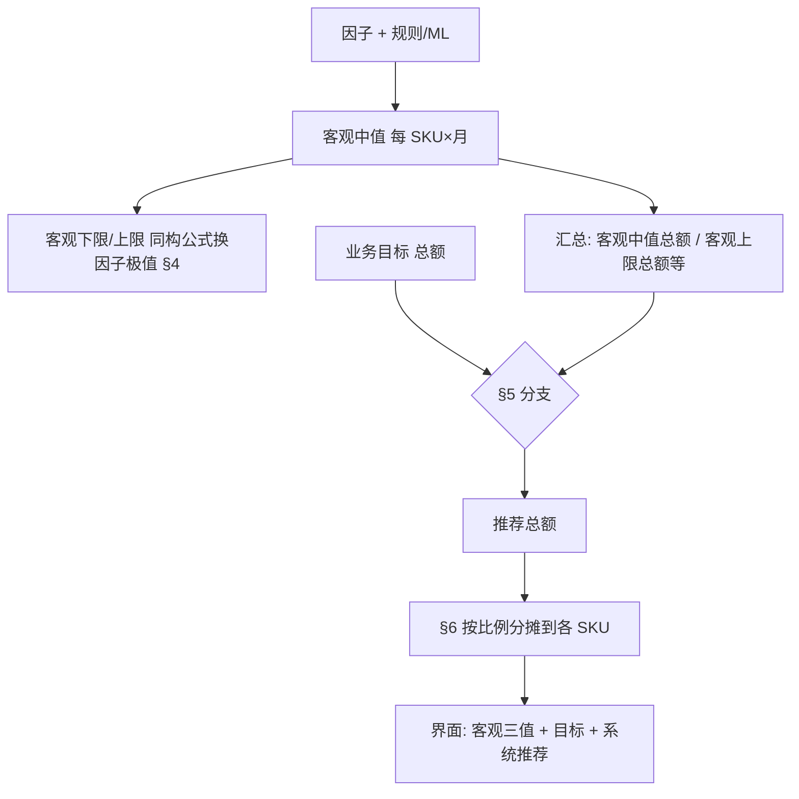

# 产品需求文档（PRD）：客观销量带与系统推荐（原《预测销量上下限规则》）

> **关联文档**：[基于规则的销量预测设计说明.md](../基于规则的销量预测设计说明.md)、[销量预测管理-PRD.md](./销量预测管理-PRD.md)（**目标助手 · 主工作台**）  
> **适用范围**：**客观下限、客观中值、客观上限** 三条客观销量线的定义与合成；**系统推荐值** 与 **销售目标（BP/业务目标）** 的对齐规则见本文 **§5**；与主工作台列表、图表、详情**同源**。（隶属 **目标助手**。）  
> **会议依据：需求逻辑调整会**（客观三线与目标、推荐解耦；废止「目标×1.05」等突破客观顶的推荐逻辑）。  
> **文档版本**：v2.0  
> **状态**：草案  
> **最后更新**：2026-04-17

---

## 1. 背景与目标

### 1.1 背景

业务需要同时看清三类信息：（1）在**纯客观因子**（流量、价格、促销安排等）假设下能支撑的销量**下/中/上**界；（2）业务下达的**目标**；（3）系统在**不突破客观约束**的前提下给出的**推荐值**。  
**会议依据：需求逻辑调整会**——客观带与目标必须可分开展示与计算；**禁止**用目标系数把推荐抬到高于**客观上限**。

### 1.2 目标

| 目标 | 说明 | 验收要点 |
|------|------|----------|
| **口径统一** | 客观下限/中值/上限仅来自因子情景与销量合成公式；与规则/ML 输出对齐。 | 任意 SKU× 月，可列出三客观值与因子取值或等价元数据。 |
| **与目标解耦** | 销售目标、BP **不参与**客观下限/上限的数值修正。 | 改目标不重算客观三值；仅重算推荐。 |
| **推荐可审计** | 系统推荐 = 汇总层分支 + 分摊到 SKU；可追溯。 | 详情或导出可看到「汇总判断 + 分摊系数」。 |

### 1.3 非目标

- 具体接口字段名、调度频率、存储表结构（由接口/技术设计补全）。  
- 全渠道排期、PSI 联动（不在本文范围）。

### 1.4 单位（与财务对齐）

| 项 | 说明 | 验收要点 |
|----|------|----------|
| **主口径** | 默认与主工作台一致：**销量（数量）**；若组织以**销售额**为滚动目标，须定义「价×量」或统一折算后再做汇总与分摊，**禁止**额与量直接相加。 | PRD 与接口字典中声明 `qty` / `amount` 及换算表。 |

---

## 2. 名词与范围

| 名词 | 定义 |
|------|------|
| **客观中值** | 规则引擎或 ML 在**未施加销售目标约束**下，对应该月、该 SKU 的**主点预测**（与《基于规则的销量预测设计说明》中「点预测」同源，**不再**称为「融合 BP 后的 P」）。 |
| **客观下限 / 客观上限** | 在与客观中值**同构的销量合成公式**中，仅将 §4 五类因子替换为悲观/乐观极值得到的销量边界。 |
| **目标（T）** | 业务侧拆解到同粒度的销售目标（可与 BP 同源展示名「BP 目标」，**语义上**为「目标」）。 |
| **系统推荐值** | 在**专员负责 SKU 集合的汇总层**，比较目标总额与客观中值总额、客观上限总额等后，按 **§5** 分支得到**推荐总额**，再按 **§6** 分摊到各 SKU 的展示值。 |
| **预测流量 / 去年同期流量 / 近 3 个月 / 近 1 年** | 与 v1.x §2 定义一致，用于 §4 因子极值窗口。 |

**粒度约定**：同一 **MSKU（或 ASIN+渠道最小粒度）× 自然月** 计算客观三值；**汇总层**为专员所选范围内该月 **SKU 集合** 的加总（加总口径与 §1.4 一致）。

---

## 3. 计算顺序（总览）

**会议依据：需求逻辑调整会**——先客观、再对比目标、最后推荐。



| 步骤 | 输出 | 验收要点 |
|------|------|----------|
| 1 | 每 SKU 客观中值 | 与预测任务主输出一致，无目标参与。 |
| 2 | 每 SKU 客观下限/上限 | 仅 §4 因子变化；**不**读目标字段。 |
| 3 | 汇总行 | 与表格勾选/筛选范围一致。 |
| 4 | 推荐总额 + 分摊 | 单 SKU 推荐 ≤ 该 SKU **客观上限**（见 §5.1）；汇总推荐 ≤ 汇总**客观上限**（同会议）。 |

---

## 4. 功能需求：因子取值规则（客观下限 / 客观上限）

**原则**：在**与客观中值相同的销量合成公式**中，仅替换下表五类因子；**客观下限（悲观）**各因子取不利销量一侧极值，**客观上限（乐观）**取有利一侧；**其余因子与客观中值一致**。

| 因子 | 客观下限（悲观） | 客观上限（乐观） | 窗口与聚合 |
|------|------------------|------------------|------------|
| **流量** | `min(去年同期流量, 客观中值所用预测流量)` | `max(同上两项)` | 同粒度、与预测月对齐 |
| **转化率** | 近 3 个月各月代表值的 **min** | 近 3 个月各月代表值的 **max** | 不含目标月 |
| **竞争力** | 近 3 个月月代表值的 **min**（方向以字典为准） | 近 3 个月月代表值的 **max** | 同上 |
| **价格** | 近 1 年各月 **月均价** 的 **max**（价高偏悲观） | 近 1 年各月 **月均价** 的 **min**（价低偏乐观） | 不含目标月 |
| **广告花费** | 近 3 个月月代表值的 **min** | 近 3 个月月代表值的 **max** | 与客观中值币种/口径一致 |

**缺失与边界**：与 v1.10 §3 一致——历史不足、无同比流量、竞争力反号等处理规则不变。

**序关系**：原则上 **客观下限 ≤ 客观中值 ≤ 客观上限**；非线性导致不成立时单调修正并记日志。

---

## 5. 系统推荐值：汇总层分支（可验收 if-else）

以下变量均为**同一自然月、同一专员负责 SKU 集合**、且与 §1.4 **单位一致**后的加总：

- `SumMid` = Σ 客观中值  
- `SumLo` = Σ 客观下限  
- `SumHi` = Σ 客观上限  
- `Tsum` = Σ 目标（无目标则推荐路径仅展示客观三值，推荐总额 = `SumMid` 或产品另定「无目标」策略，须写死）

### 5.1 分支表（会议口径 + 可验收）

| # | 条件（汇总层） | 推荐总额 `Rsum` | 提示/告警 | 验收要点 |
|---|----------------|-----------------|-----------|----------|
| A | `Tsum` 为空 | `Rsum = SumMid`（或「不可算」策略，须与主 PRD 一致） | — | 改目标从空到有值时，推荐应随之从 Mid 规则切换到有目标分支。 |
| B | `Tsum > SumHi` | `Rsum = SumHi` | **必须**提示：目标超出客观可达成上限（会议：客观告诉最大多少，勿用目标×系数抬高） | **禁止**出现 `Rsum > SumHi` 或单 SKU 推荐 > 该 SKU 客观上限。 |
| C | `SumMid < Tsum ≤ SumHi` | `Rsum = Tsum` | 可选提示：目标在客观带内 | 分摊 §6 后各 SKU 推荐之和 = `Tsum`（允许四舍五入误差≤1 单位）。 |
| D | `SumLo ≤ Tsum ≤ SumMid` | `Rsum = Tsum`（与会议「在中间则以计划为准」一致） | — | 同 C。 |
| E | `Tsum < SumMid`（会议倾向「偏小以客观为锚」） | **默认** `Rsum = SumMid`（推荐总额取客观中值总额；**不**使用已废止的 1.05 或目标乘系数突破中值） | 可选轻提示：目标低于客观中值汇总 | 若业务坚持 `Rsum=Tsum`，须单独签批并改本表，**不得**与 B 条冲突。 |

**单 SKU 约束**：对每个 SKU `i`，推荐 `R_i` 须满足 **`Lo_i ≤ R_i ≤ Hi_i`**；若分摊后出现越界，按产品既定规则**缩放或压边界**并记日志（验收：抽查越界率 0）。

### 5.2 伪代码（汇总 → 分摊）

```
// 会议依据：需求逻辑调整会
Rsum = branch(Tsum, SumLo, SumMid, SumHi)  // 见上表
k = Rsum / SumMid   // 分摊系数；若 SumMid==0 走兜底策略（须定义）
for each SKU i:
  R_i = round(Mid_i * k)
// 再执行边界修正：clamp(R_i, Lo_i, Hi_i) 且必要时二次缩放使 sum(R_i)≈Rsum
```

---

## 6. 分摊到 SKU

| 规则 | 说明 | 验收要点 |
|------|------|----------|
| **主公式** | 先 `R_i = Mid_i * (Rsum / SumMid)`，再 **clamp 到 [Lo_i, Hi_i]**。 | 任抽 3 SKU，手算与系统差在约定误差内。 |
| **二次缩放** | 若 clamp 后总额偏离 `Rsum`，在不超过各 `Hi_i` 前提下做比例微调（算法细节由技术设计补）。 | 总额与 `Rsum` 误差 ≤ 约定阈值。 |

---

## 7. 展示与交互（与主 PRD 对齐）

| 位置 | 需求 | 验收要点 |
|------|------|----------|
| 列表单元格 | 主数字：**客观中值**；可附 **客观下限～客观上限**；另列或次行 **目标**、**系统推荐**。 | 不出现「仅一列却混写已融合 BP 的点预测」而无客观带说明。 |
| 图表 | **客观中值**柱 + 浅色带表示客观下～上；**目标**、**系统推荐**为点值或柱，**无**「目标区间带」；**系统推荐** Tooltip **不**附客观区间（区间仅属于客观中值）。 | 与 §5 分支试算一致。 |
| 详情 | 按月：客观中值、客观下限、客观上限、目标、系统推荐、因子对照。 | **无**「BP目标融合权重 α 参与客观带」字段；若配置中心仍存 α，须标注**仅历史/他途**或移除。 |
| 汇总行 | 必有；展示 `SumLo/SumMid/SumHi/Tsum/Rsum` 及分摊系数 `k`（若适用）。 | 与 §5 表同一试算可复现。 |

---

## 8. 销量合成（客观三值如何得到）

1. **客观中值**：规则/ML 主输出，**不**读目标。  
2. **客观下限/上限**：与客观中值**同构公式** + **§4** 因子悲观/乐观向量。  
3. **系统推荐**：**§5 + §6**，**不**回写客观三值。

---

## 9. 非功能需求（摘要）

| 类别 | 要求 |
|------|------|
| **性能** | 区间与客观中值同次请求返回（继承主 PRD SLA）。 |
| **审计** | 保存 `SumMid/SumHi/Tsum/Rsum/k` 及版本号。 |
| **权限** | 与预测一致；无价格权限则隐藏相关因子或区间（策略二选一）。 |

---

## 10. 待确认清单

1. §5.E：目标低于 `SumMid` 时，**固定** `Rsum=SumMid` 是否业务最终拍板（会议倾向）？  
2. 单 SKU 分摊二次缩放的误差上限。  
3. v1.x 已列的同比月、MTD、多币种等因子窗口问题（继承原 §7 议题，评审时合并确认）。

---

## 11. 废止说明（相对 v1.10）

| 废止项 | 原 v1.x 表述 | 原因（会议依据：需求逻辑调整会） |
|--------|--------------|-----------------------------------|
| **预测销量 P = T×1.05**（M≤T） | §2.1 分支 2 | 会把推荐抬到可能**高于客观最大**，与「客观封顶」矛盾。 |
| **上下限随 P（含 BP 融合后）同构** | §2.3 表 2「T 非空时以 P 代入」 | 客观上下限须**独立于目标**；融合仅发生在**推荐层**。 |
| **BP目标融合权重 α 参与点预测再出带** | §2.1～§2.3 | α 若保留，**不得**再参与客观三值；仅可配置与**推荐层**其他策略相关（或整体下线，由产品决策）。 |

---

## 12. 变更记录

| 版本 | 日期 | 作者 | 摘要 |
|------|------|------|------|
| v1.0～v1.10 | 2026-04-15～16 | 产品 | 见历史版本；含 M/T/α/P 与上下限关系。 |
| **v2.0** | **2026-04-17** | 产品 | **会议依据：需求逻辑调整会**：客观三线与目标、推荐分层；§5 汇总分支 + §6 分摊；废止 T×1.05 及客观带随 BP 融合；增 mermaid 与单位节。 |
