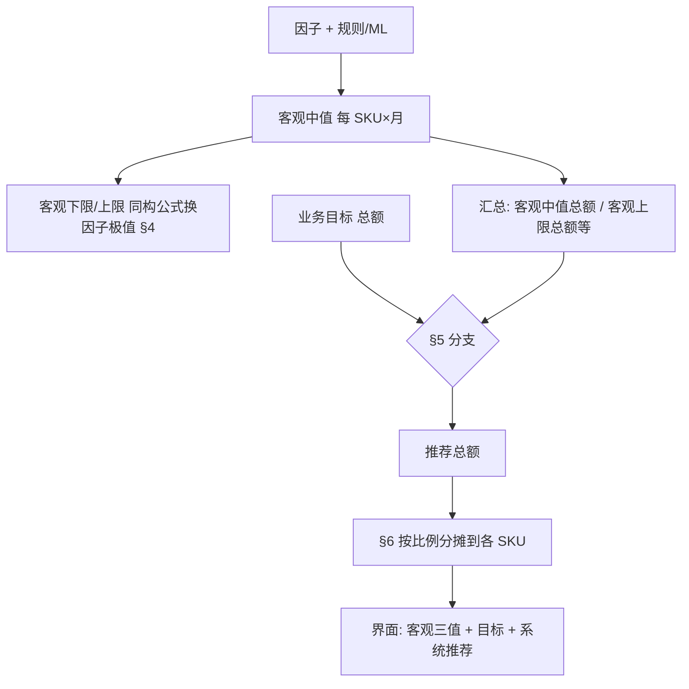

# 产品需求文档（PRD）：客观销量带与系统推荐（原《预测销量上下限规则》）

> **关联文档**：[基于规则的销量预测设计说明.md](../基于规则的销量预测设计说明.md)、[销量预测管理-PRD.md](./销量预测管理-PRD.md)（**目标助手 · 主工作台**）  
> **适用范围**：**客观下限、客观中值、客观上限** 三条客观销量线的定义与合成；**系统推荐值** 与 **销售目标（BP/业务目标）** 的对齐规则见本文 **§5**；与主工作台列表、图表、详情**同源**。（隶属 **目标助手**。）  
> **会议依据**：需求逻辑调整会（客观三线与目标、推荐解耦；推荐不得突破客观上限）。  
> **文档版本**：v2.3  
> **状态**：草案  
> **最后更新**：2026-04-20

---

## 1. 背景与目标

### 1.1 背景

业务需要同时看清三类信息：（1）在**纯客观因子**（流量、价格、促销安排等）假设下能支撑的销量**下/中/上**界；（2）业务下达的**目标**；（3）系统在**不突破客观约束**的前提下给出的**推荐值**。  
客观带与目标必须可分开展示与计算；**禁止**将系统推荐抬到高于**客观上限**。

### 1.2 目标

| 目标 | 说明 | 验收要点 |
|------|------|----------|
| **口径统一** | 客观下限/中值/上限仅来自因子情景与销量合成公式；与规则/ML 输出对齐。 | 任意 SKU× 月，可列出三客观值与因子取值或等价元数据。 |
| **与目标解耦** | 销售目标、BP **不参与**客观下限/上限的数值修正。 | 改目标不重算客观三值；仅重算推荐。 |
| **推荐可审计** | 系统推荐 = 汇总层分支 + 分摊到 SKU；可追溯。 | 详情或导出可看到「汇总判断 + 分摊系数」。 |

### 1.3 非目标

- 具体接口字段名、调度频率、存储表结构（由接口/技术设计补全）。  
- 全渠道排期、PSI 联动（不在本文范围）。

### 1.4 单位（与财务对齐）

| 项 | 说明 | 验收要点 |
|----|------|----------|
| **主口径** | 默认与主工作台一致：**销量（数量）**；若组织以**销售额**为滚动目标，须定义「价×量」或统一折算后再做汇总与分摊，**禁止**额与量直接相加。 | PRD 与接口字典中声明 `qty` / `amount` 及换算表。 |

---

## 2. 名词与范围

| 名词 | 定义 |
|------|------|
| **客观中值** | 规则引擎或 ML 在**未施加销售目标约束**下，对应该月、该 SKU 的**主点预测**（与《基于规则的销量预测设计说明》中「点预测」同源）。 |
| **客观下限 / 客观上限** | 在与客观中值**同构的销量合成公式**中，仅将 §4 五类因子替换为悲观/乐观极值得到的销量边界。 |
| **目标（T）** | 业务侧拆解到同粒度的销售目标（可与 BP 同源展示名「BP 目标」，**语义上**为「目标」）。 |
| **系统推荐值** | 在**专员负责 SKU 集合的汇总层**，比较目标总额与客观中值总额、客观上限总额等后，按 **§5** 分支得到**推荐总额**，再按 **§6** 分摊到各 SKU 的展示值。 |
| **预测流量** | 与客观中值销量合成公式中所用、**同 MSKU×月、同聚合粒度**的预测流量一致。 |
| **近 3 个月 / 近 1 年** | 用于 §4 中非流量因子的极值窗口；**不含目标月**的以表内说明为准。 |

**粒度约定**：同一 **MSKU（或 ASIN+渠道最小粒度）× 自然月** 计算客观三值；**汇总层**为专员所选范围内该月 **SKU 集合** 的加总（加总口径与 §1.4 一致）。

---

## 3. 计算顺序（总览）

计算顺序：**先客观** → **再对比目标** → **最后推荐**。



| 步骤 | 输出 | 验收要点 |
|------|------|----------|
| 1 | 每 SKU 客观中值 | 与预测任务主输出一致，无目标参与。 |
| 2 | 每 SKU 客观下限/上限 | 仅 §4 因子变化；**不**读目标字段。 |
| 3 | 汇总行 | 与表格勾选/筛选范围一致。 |
| 4 | 推荐总额 + 分摊 | 单 SKU 推荐 ≤ 该 SKU **客观上限**（见 §5.1）；汇总推荐 ≤ 汇总**客观上限**。 |

---

## 4. 功能需求：因子取值规则（客观下限 / 客观上限）

**原则**：在**与客观中值相同的销量合成公式**中，仅替换下表五类因子；**客观下限（悲观）**各因子取不利销量一侧极值，**客观上限（乐观）**取有利一侧；**其余因子与客观中值一致**。

| 因子 | 客观下限（悲观） | 客观上限（乐观） | 窗口与聚合 |
|------|------------------|------------------|------------|
| **流量** | `预测流量 × 0.5` | `预测流量 × 2` | 同粒度、与预测月对齐 |
| **转化率** | 近 3 个月各月代表值的 **min** | 近 3 个月各月代表值的 **max** | 不含目标月 |
| **竞争力** | 近 3 个月月代表值的 **min**（方向以字典为准） | 近 3 个月月代表值的 **max** | 同上 |
| **价格** | 近 1 年各月 **月均价** 的 **max**（价高偏悲观） | 近 1 年各月 **月均价** 的 **min**（价低偏乐观） | 不含目标月 |
| **广告花费** | 近 3 个月月代表值的 **min** | 近 3 个月月代表值的 **max** | 与客观中值币种/口径一致 |

表内 **预测流量** 与客观中值路径下所用预测流量**同源**；客观下限、客观上限仅在合成时将该因子替换为上表悲观/乐观取值，其余因子规则不变。

**缺失与边界（摘要）**：历史窗口不足、竞争力方向与字典不一致、价格/广告权限缺失等场景，按统一兜底策略取值或标记不可算，并在审计日志中记录原因；**预测流量缺失或为 0** 时，该因子不执行 `×0.5` / `×2` 外推，按与技术设计一致的兜底枚举处理（须保证客观三线仍可解释、不推荐突破客观上界）。

### 4.1 数据示例：流量因子

以下数值仅说明 **流量因子** 在客观下限 / 客观上限两条线上的取值，**不包含**转化率、价格等其它因子的替换；客观销量边界须将全表因子按规则代入**同构销量公式**后得到。

| 场景 | 预测流量（与客观中值同源，某 MSKU×月） | 客观下限侧取值（悲观） | 客观上限侧取值（乐观） |
|------|----------------------------------------|-------------------------|-------------------------|
| A | 10,000 | `10,000 × 0.5` = **5,000** | `10,000 × 2` = **20,000** |
| B | 800 | `800 × 0.5` = **400** | `800 × 2` = **1,600** |

**说明**：客观中值路径下该月流量因子仍为 **预测流量** 本身（如 A 为 10,000）；代入公式时仅客观下限、客观上限路径将流量分别换为 **5,000** 与 **20,000**，其它因子仍按 §4 各行规则取悲观/乐观极值或与中值一致。

**序关系**：原则上 **客观下限 ≤ 客观中值 ≤ 客观上限**；非线性导致不成立时单调修正并记日志。

---

## 5. 系统推荐值：汇总层分支（可验收 if-else）

以下变量均为**同一自然月、同一专员负责 SKU 集合**、且与 §1.4 **单位一致**后的加总：

- `SumMid` = Σ 客观中值  
- `SumLo` = Σ 客观下限  
- `SumHi` = Σ 客观上限  
- `Tsum` = Σ 目标（无目标则推荐路径仅展示客观三值，推荐总额 = `SumMid` 或产品另定「无目标」策略，须写死）

### 5.1 分支表（可验收）

| # | 条件（汇总层） | 推荐总额 `Rsum` | 验收要点 |
|---|----------------|-----------------|----------|
| A | `Tsum` 为空 | `Rsum = SumMid`（或「不可算」策略，须与主 PRD 一致） | 改目标从空到有值时，推荐应随之从 Mid 规则切换到有目标分支。 |
| B | `Tsum > SumHi` | `Rsum = SumHi` | **禁止**出现 `Rsum > SumHi` 或单 SKU 推荐 > 该 SKU 客观上限。 |
| C | `SumMid < Tsum ≤ SumHi` | `Rsum = Tsum` | 分摊 §6 后各 SKU 推荐之和 = `Tsum`（允许四舍五入误差≤1 单位）。 |
| D | `SumLo ≤ Tsum ≤ SumMid` | `Rsum = Tsum`（目标落在客观中值以下、客观下限以上时，以计划目标为推荐总额） | 同 C。 |
| E | `Tsum < SumMid` | **默认** `Rsum = SumMid`（推荐总额取客观中值总额；**不**用目标乘系数将推荐抬至高于客观中值） | 若业务坚持 `Rsum=Tsum`，须单独签批并改本表，**不得**与 B 条冲突。 |

**单 SKU 约束**：对每个 SKU `i`，推荐 `R_i` 须满足 **`Lo_i ≤ R_i ≤ Hi_i`**；若分摊后出现越界，按产品既定规则**缩放或压边界**并记日志（验收：抽查越界率 0）。

### 5.2 伪代码（汇总 → 分摊）

```
Rsum = branch(Tsum, SumLo, SumMid, SumHi)  // 见上表
k = Rsum / SumMid   // 分摊系数；若 SumMid==0 走兜底策略（须定义）
for each SKU i:
  R_i = round(Mid_i * k)
// 再执行边界修正：clamp(R_i, Lo_i, Hi_i) 且必要时二次缩放使 sum(R_i)≈Rsum
```

---

## 6. 分摊到 SKU

| 规则 | 说明 | 验收要点 |
|------|------|----------|
| **主公式** | 先 `R_i = Mid_i * (Rsum / SumMid)`，再 **clamp 到 [Lo_i, Hi_i]**。 | 任抽 3 SKU，手算与系统差在约定误差内。 |
| **二次缩放** | 若 clamp 后总额偏离 `Rsum`，在不超过各 `Hi_i` 前提下做比例微调（算法细节由技术设计补）。 | 总额与 `Rsum` 误差 ≤ 约定阈值。 |

### 6.1 数值示例：三 SKU 从因子到推荐（含推荐允许区间）

以下为一个**可手算复现**的示意算例：目标月 **2026-05**，专员勾选 **SKU-A / SKU-B / SKU-C**。生产环境以规则/ML **同构销量公式**为准；本例为突出 **§4 → 客观三值 → §5 分支 → §6 分摊**，对销量采用简化 toy 公式（与 §4 中流量倍率、近 3 月转化率 min/max 对齐）：

`Q = ROUND(流量路径 × 转化率路径 × 5)`（件数取整）

其中 **流量路径**：客观中值用 **预测流量**；客观下限用 **预测流量×0.5**；客观上限用 **预测流量×2**。  
**转化率路径**：客观中值用目标月代表转化率（与点预测一致）；客观下限用近 3 月（不含 5 月）代表值的 **min**；客观上限用 **max**。  
**价格、竞争力、广告**：本例在三条路径上均取与客观中值相同的常数倍率 **1**（表中仍列出 5 月占位，便于对照「全因子入模」；未进入 toy 乘式）。

#### 步骤 1：各 SKU 分月因子（节选）

**SKU-A**

| 月（2026） | 预测流量 | 转化率（代表值） | 月均价（示意） | 广告花费（示意） |
|------------|----------|------------------|----------------|------------------|
| 02 | — | 8.0% | 12.0 | 200 |
| 03 | — | 10.0% | 11.8 | 220 |
| 04 | — | 9.0% | 12.2 | 210 |
| **05（目标月）** | **400** | **9.0%**（中值） | 12.0 | 230 |

近 3 月（2–4 月）转化率 min = **8.0%**，max = **10.0%**。

**SKU-B**

| 月 | 预测流量 | 转化率 | 月均价 | 广告花费 |
|----|----------|--------|--------|----------|
| 02 | — | 12.0% | 15.0 | 300 |
| 03 | — | 11.0% | 15.2 | 280 |
| 04 | — | 13.0% | 14.9 | 310 |
| **05** | **600** | **12.0%** | 15.0 | 300 |

近 3 月转化率 min = **11.0%**，max = **13.0%**。

**SKU-C**

| 月 | 预测流量 | 转化率 | 月均价 | 广告花费 |
|----|----------|--------|--------|----------|
| 02 | — | 5.0% | 20.0 | 100 |
| 03 | — | 5.0% | 19.8 | 105 |
| 04 | — | 6.0% | 20.1 | 98 |
| **05** | **200** | **5.5%** | 20.0 | 100 |

近 3 月转化率 min = **5.0%**，max = **6.0%**。

#### 步骤 2：目标月（5 月）各 SKU 客观三值（toy 与 §4 对齐）

| SKU | 客观中值 `Mid`（流量×中值转化×5） | 客观下限 `Lo`（流量×0.5 × min转化×5） | 客观上限 `Hi`（流量×2 × max转化×5） |
|-----|-------------------------------------|----------------------------------------|--------------------------------------|
| A | ROUND(400×9%×5)=**180** | ROUND(200×8%×5)=**80** | ROUND(800×10%×5)=**4,000** |
| B | ROUND(600×12%×5)=**360** | ROUND(300×11%×5)=**165** | ROUND(1,200×13%×5)=**7,800** |
| C | ROUND(200×5.5%×5)=**55** | ROUND(100×5%×5)=**25** | ROUND(400×6%×5)=**120** |

#### 步骤 3：汇总与目标

| 汇总量 | 计算 | 结果 |
|--------|------|------|
| `SumMid` | 180+360+55 | **595** |
| `SumLo` | 80+165+25 | **270** |
| `SumHi` | 4000+7800+120 | **11,920** |

各 SKU **目标**（仅 5 月）：A **170**，B **300**，C **80** → `Tsum` = **550**。

#### 步骤 4：§5.1 分支定 `Rsum`

判定：`SumLo`(270) ≤ `Tsum`(550) ≤ `SumMid`(595) → 命中 **D**，故 **`Rsum = Tsum = 550`**。

#### 步骤 5：§6 分摊系数与初算推荐

`k = Rsum / SumMid = 550 / 595 = 110/119 ≈ 0.92437`

`R_i = ROUND(Mid_i × k)`

| SKU | `Mid_i × k` | 初算 `R_i`（四舍五入到整数件） |
|-----|-------------|--------------------------------|
| A | 180×550/595 | **166** |
| B | 360×550/595 | **333** |
| C | 55×550/595 | **51** |

校验加总：166+333+51 = **550** = `Rsum`（本例无需二次缩放）。

#### 步骤 6：压客观边界（clamp）与「推荐允许区间」

单 SKU 推荐须满足 **`Lo_i ≤ R_i ≤ Hi_i`**。本例：

| SKU | `Lo_i` | `R_i`（系统推荐） | `Hi_i` | 是否越界 |
|-----|--------|-------------------|--------|----------|
| A | 80 | 166 | 4,000 | 否 |
| B | 165 | 333 | 7,800 | 否 |
| C | 25 | 51 | 120 | 否 |

**推荐允许区间**：与客观带一致，即每个 SKU 展示为 **`[Lo_i , Hi_i]`**（本例 A 为 `[80, 4000]`，B 为 `[165, 7800]`，C 为 `[25, 120]`）。**系统推荐 `R_i`** 必须落在该区间内；若初算越界，先 **clamp** 到边界，再按 §6 **二次缩放**使 Σ`R_i` 与 `Rsum` 在允许误差内对齐（算法见技术设计）。

---

## 7. 展示与交互（与主 PRD 对齐）

| 位置 | 需求 | 验收要点 |
|------|------|----------|
| 列表单元格 | 主数字：**客观中值**；可附 **客观下限～客观上限**；另列或次行 **目标**、**系统推荐**。 | 客观三值、目标、系统推荐**分列或分语义**展示，避免单列混写导致无法对账。 |
| 图表 | **客观中值**柱 + 浅色带表示客观下～上；**目标**、**系统推荐**为点值或柱，**无**「目标区间带」；**系统推荐** Tooltip **不**附客观区间（区间仅属于客观中值）。 | 与 §5 分支试算一致。 |
| 详情 | 按月：客观中值、客观下限、客观上限、目标、系统推荐、因子对照。 | 客观带仅来自 §4 因子规则与 §5/§6 推荐逻辑，与目标字段解耦展示。 |
| 汇总行 | 必有；展示 `SumLo/SumMid/SumHi/Tsum/Rsum` 及分摊系数 `k`（若适用）。 | 与 §5 表同一试算可复现。 |

---

## 8. 销量合成（客观三值如何得到）

1. **客观中值**：规则/ML 主输出，**不**读目标。  
2. **客观下限/上限**：与客观中值**同构公式** + **§4** 因子悲观/乐观向量。  
3. **系统推荐**：**§5 + §6**，**不**回写客观三值。

---

## 9. 非功能需求（摘要）

| 类别 | 要求 |
|------|------|
| **性能** | 区间与客观中值同次请求返回（继承主 PRD SLA）。 |
| **审计** | 保存 `SumMid/SumHi/Tsum/Rsum/k` 及版本号。 |
| **权限** | 与预测一致；无价格权限则隐藏相关因子或区间（策略二选一）。 |

---

## 10. 待确认清单

1. §5.E：目标低于 `SumMid` 时，**固定** `Rsum=SumMid` 是否业务最终拍板？  
2. 单 SKU 分摊二次缩放的误差上限。  
3. 同比月、MTD、多币种等因子窗口边界 case 评审时合并确认。

---

## 11. 变更记录

| 版本 | 日期 | 作者 | 摘要 |
|------|------|------|------|
| **v2.3** | **2026-04-20** | 产品 | 与主工作台/预测配置对齐：**不再**定义「BP 与点预测融合权重」参与点预测；客观中值名词表仅保留点预测定义。 |
| **v2.2** | **2026-04-20** | 产品 | §5.1 去掉「提示/告警」列；§6.1 增补三 SKU 多月因子 → 客观三值 → 分支 → 分摊 → clamp 与推荐允许区间 \[Lo,Hi\] 的完整算例。 |
| **v2.1** | **2026-04-20** | 产品 | §4 **流量**：客观下限改为 `预测流量×0.5`、客观上限改为 `预测流量×2`；增 §4.1 数据示例；全文收敛为当前有效逻辑表述。 |
| **v2.0** | **2026-04-17** | 产品 | 客观三线与目标、推荐分层；§5 汇总分支 + §6 分摊；增 mermaid 与单位节。 |
