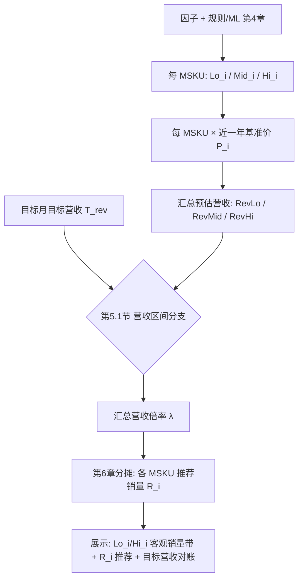

# 产品需求文档（PRD）：客观销量带与系统推荐（原《预测销量上下限规则》）

> **关联文档**：[基于规则的销量预测设计说明.md](../基于规则的销量预测设计说明.md)、[销量预测管理-PRD.md](./销量预测管理-PRD.md)（**目标助手 · 主工作台**）  
> **适用范围**：**客观下限、客观中值、客观上限** 三条客观销量线的定义与合成（第 4 章）；**近一年基准价**折算后的 **预估营收下/中/上** 与 **目标月目标营收 `T_rev`** 的比较及 **汇总倍率 `λ`**（第 5 章）；各 MSKU **推荐销量 `R_i`** 与展示口径（第 6 章）；与主工作台列表、图表、详情**同源**。（隶属 **目标助手**。）  
> **会议依据**：需求逻辑调整会（客观三线与目标、推荐解耦；推荐不得突破客观上限）。  
> **文档版本**：v2.6  
> **状态**：草案  
> **最后更新**：2026-04-21

---

## 阅读顺序（本文怎么读）

1. **第 1～2 章**：背景、名词（知道「客观三线 / 目标 / 推荐 / 基准价」各指什么）。  
2. **第 3 章**：**整体计算方式**（先建立心智模型：先算销量三线 → 折成营收三线 → 用目标营收定一个倍率 → 分摊到各 MSKU）。  
3. **第 4～6 章**：按实现顺序展开的**规则细节**；**第 6 章末**有一条贯穿的**数值示例**（仅 **预测目标月 2026 年 5 月**，不按月份铺表）。  
4. **第 7 章及以后**：展示、非功能、待确认、变更记录。

---

## 1. 背景与目标

### 1.1 背景

业务需要同时看清三类信息：（1）在**纯客观因子**（流量、价格、促销安排等）假设下能支撑的销量**下/中/上**界；（2）业务下达的**目标**；（3）系统在**不突破客观约束**的前提下给出的**推荐值**。  
客观带与目标必须可分开展示与计算；**禁止**将系统推荐抬到高于**客观上限**。

### 1.2 目标

| 目标 | 说明 | 验收要点 |
|------|------|----------|
| **口径统一** | 客观下限/中值/上限仅来自因子情景与销量合成公式；与规则/ML 输出对齐。 | 任意 MSKU× 月，可列出三客观值与因子取值或等价元数据。 |
| **与目标解耦** | 销售目标、BP **不参与** `Lo_i/Mid_i/Hi_i` 的数值修正。 | 改 **`T_rev`（或仅目标销量展示）** 不重算客观三值与 `Rev*`；仅重算 **`λ` 与 `R_i`**。 |
| **推荐可审计** | 系统推荐 = **营收分支（`T_rev` vs `RevLo/RevMid/RevHi`）定 `λ`** + **`Mid_i×λ` 分摊到 MSKU**；可追溯。 | 详情或导出可看到 **`λ`、分支枚举、`Rev*`、可选 `T_rev,i`**。 |

### 1.3 非目标

- 具体接口字段名、调度频率、存储表结构（由接口/技术设计补全）。  
- 全渠道排期、PSI 联动（不在本文范围）。

### 1.4 单位（与财务对齐）

| 项 | 说明 | 验收要点 |
|----|------|----------|
| **主口径** | 默认与主工作台一致：**销量（数量）**；若组织以**销售额**为滚动目标，须定义「价×量」或统一折算后再做汇总与分摊，**禁止**额与量直接相加。 | PRD 与接口字典中声明 `qty` / `amount` 及换算表。 |

---

## 2. 名词与范围

| 名词 | 定义 |
|------|------|
| **客观中值** | 规则引擎或 ML 在**未施加销售目标约束**下，对应该月、该 SKU 的**主点预测**（与《基于规则的销量预测设计说明》中「点预测」同源）。 |
| **客观下限 / 客观上限** | 在与客观中值**同构的销量合成公式**中，仅将第 4 章五类因子替换为悲观/乐观极值得到的销量边界。 |
| **目标（T）** | 业务侧拆解到同粒度的销售目标（可与 BP 同源展示名「BP 目标」，**语义上**为「目标」）；本文第 5 章以 **`T_rev`（目标营收总额）** 为主驱动，**目标销量**仅作辅助展示或经价折算后接入。 |
| **系统推荐值** | 在**专员负责 MSKU 全集（默认范围）的汇总层**，先得到销量 **下限/中值/上限**（中值路径为**未调目标前的基准推荐销量**），经 **近一年基准价** 转为 **预估营收下/中/上** 后与 **目标月目标营收** 比较，按 **第 5 章** 得到汇总倍率 **λ**，再按 **第 6 章** 分摊到各 MSKU 的推荐销量；**客观上下限销量**不因目标改写，仅推荐销量可调。 |
| **近一年基准价 `P_i`** | 与财务对齐的 **MSKU 级**滚动均价（如近 12 个自然月**月均价**的均值或加权均值，**不含目标月**）；用于把销量三线折算为 **预估营收三线**，**禁止**与第 4 章悲观/乐观路径中的「价因子极值」混用口径（后者仅进入销量合成）。 |
| **目标月目标营收 `T_rev`** | 组织在目标月下达的 **目标营收总额**（可再按 MSKU 拆解为 `T_rev,i` 仅作展示/对账，**不**参与客观三线计算）。 |
| **预估营收下/中/上** | 汇总层：`RevLo=Σ(Lo_i×P_i)`，`RevMid=Σ(Mid_i×P_i)`，`RevHi=Σ(Hi_i×P_i)`；与 `T_rev` 的比较在 **第 5.1 节** 完成。 |
| **预测流量** | 与客观中值销量合成公式中所用、**同 MSKU×月、同聚合粒度**的预测流量一致。 |
| **近 3 个月 / 近 1 年** | 用于第 4 章中非流量因子的极值窗口；**不含目标月**的以表内说明为准。 |

**粒度与范围约定**：同一 **MSKU（或 ASIN+渠道最小粒度）× 自然月** 计算客观三值。**汇总层范围**：**默认**取当前登录**销售专员在权限内负责的全部 MSKU**（主数据/组织关系维护），**无需、也不依赖**工作台勾选；若产品提供「筛选子集」能力，则仅当用户显式筛选时才以筛选结果为汇总范围（须在界面标注「子集」以免与默认全集对账混淆）。加总口径与第 1.4 节一致（额、量分列）。

---

## 3. 整体计算方式（先建立心智模型）

系统做三件事，**顺序固定**：

1. **算「客观销量」三条线（件）**  
   对每个 MSKU、每个自然月，在同一套销量合成公式下，分别得到 **下限 `Lo_i`、中值 `Mid_i`、上限 `Hi_i`**。  
   - **中值**：规则/ML 的主预测，**不读销售目标**。  
   - **下限 / 上限**：公式结构与中值相同，只把第 4 章里的五类因子换成「悲观一侧极值 / 乐观一侧极值」（例如流量下界为预测流量×0.5，上界为×2；转化率、**竞争力（近 3 个月同比增长率等代表口径）**、价格、广告在近窗内取 min/max，详见第 4 章主表）。

2. **把销量三线折成「预估营收」三条线（元）**  
   每个 MSKU 用 **近一年基准价 `P_i`**（与第 4 章「价因子极值」不是同一口径）做乘法，再在汇总层求和：  
   `RevLo = Σ(Lo_i×P_i)`，`RevMid = Σ(Mid_i×P_i)`，`RevHi = Σ(Hi_i×P_i)`。

3. **用目标营收定一个汇总倍率 `λ`，再分摊成各 MSKU 推荐销量 `R_i`**  
   - 读入组织在该月的 **`T_rev`**，与 `RevLo～RevHi` 比较，按 **第 5.1 节** 在汇总层只定 **一个标量 `λ`**。  
   - 各 MSKU：**`R_i = ROUND(Mid_i × λ)`**，再 **`clamp` 到 `[Lo_i, Hi_i]`**；若四舍五入与 clamp 导致汇总营收与路径不一致，按 **第 6 章** 在合法区间内二次缩放并留痕。

一句话：**客观三线只跟因子有关；`λ` 和 `R_i` 只把「中值形状」往目标营收方向推，且推荐销量不允许超过客观上限销量。**



| 步骤 | 输出 | 验收要点 |
|------|------|----------|
| 1 | 每 MSKU **`Lo_i` / `Mid_i` / `Hi_i`（件）** | `Mid_i` 与预测主输出一致；Lo/Hi 仅第 4 章因子极值；**不**读目标。 |
| 2 | 每 MSKU **`P_i`**、汇总 **`RevLo`/`RevMid`/`RevHi`（额）** | 价口径与财务字典一致；**禁止**额与量直接相加，须显式 `×P_i`。 |
| 3 | **`T_rev`**（及可选 `T_rev,i` 展示） | 与 BP/管报同源字段可对账。 |
| 4 | **`λ` + `R_i`** | **单倍率**在汇总层确定后再分摊；**`Lo_i ≤ R_i ≤ Hi_i`**；若 clamp 后偏离总额，二次缩放（第 6 章）。 |
| 5 | 汇总范围 | **默认**专员负责 **MSKU 全集**；非默认子集须在 UI 标注。 |

---

## 4. 功能需求：因子取值规则（客观下限 / 客观上限）

**原则**：在**与客观中值相同的销量合成公式**中，仅替换下表五类因子；**客观下限（悲观）**各因子取不利销量一侧极值，**客观上限（乐观）**取有利一侧；**其余因子与客观中值一致**。

| 因子 | 客观下限（悲观） | 客观上限（乐观） | 窗口与聚合 |
|------|------------------|------------------|------------|
| **流量** | `预测流量 × 0.5` | `预测流量 × 2` | 同粒度、与预测月对齐 |
| **转化率** | 近 3 个月各月代表值的 **min** | 近 3 个月各月代表值的 **max** | 不含目标月 |
| **竞争力** | 近 3 个月**竞争力代表值**的 **min** | 近 3 个月**竞争力代表值**的 **max** | 不含目标月；代表值口径由字典统一（示例与下文算例采用 **月同比增长率**，如 **-2.5%**、**+14%**） |
| **价格** | 近 1 年各月 **月均价** 的 **max**（价高偏悲观） | 近 1 年各月 **月均价** 的 **min**（价低偏乐观） | 不含目标月 |
| **广告花费** | 近 3 个月月代表值的 **min** | 近 3 个月月代表值的 **max** | 与客观中值币种/口径一致 |

表内 **预测流量** 与客观中值路径下所用预测流量**同源**；客观下限、客观上限仅在合成时将该因子替换为上表悲观/乐观取值，其余因子规则不变。

**缺失与边界（摘要）**：历史窗口不足、竞争力方向与字典不一致、价格/广告权限缺失等场景，按统一兜底策略取值或标记不可算，并在审计日志中记录原因；**预测流量缺失或为 0** 时，该因子不执行 `×0.5` / `×2` 外推，按与技术设计一致的兜底枚举处理（须保证客观三线仍可解释、不推荐突破客观上界）。

### 4.1 目标月因子示例（仅预测目标月一张表）

以下仅展示 **预测目标月 2026-05**、**同一行** 上的代表因子与 **折算用基准价**（用于第 3 步营收汇总，**不等于**第 4 章「价因子悲观/乐观极值」）。  
**转化率 / 竞争力 / 价格 / 广告** 在客观下、上限路径上的具体取值，由系统在**不含目标月**的历史窗口内按上表取 min/max 推导；验收须能追溯到「目标月代表值 + 历史极值规则」，**本文算例不按月铺明细**。

**竞争力**在示例中一律用 **近 3 个月同比增长率** 表达（可为正或负，如 **+14%**、**-2.5%**）；**中值路径**下的竞争力取值与规则/ML 主预测一致，**下/上限路径**分别取近 3 个月增长率序列的 **最小值 / 最大值** 进入合成。

| MSKU | 预测流量（中值路径） | 转化率（中值路径代表值） | 竞争力：近 3 个月增长率（中值路径代表值，示意） | 广告花费（代表值，示意） | **近一年基准价 `P_i`（元/件）** |
|------|----------------------|--------------------------|--------------------------------------------------|---------------------------|----------------------------------|
| A | **400** | 9.0% | +2.0%（同 SKU 近 3 月增长率区间示例：**-2.5% ～ +14%**） | 230 | **12.0** |
| B | **600** | 12.0% | +3.5% | 300 | **15.0** |
| C | **200** | 5.5% | +0.8% | 100 | **20.0** |

**流量在客观下/上限路径上的替换（与上表对照）**

| MSKU | 中值路径流量 | 客观下限路径流量（×0.5） | 客观上限路径流量（×2） |
|------|--------------|---------------------------|------------------------|
| A | 400 | **200** | **800** |
| B | 600 | **300** | **1,200** |
| C | 200 | **100** | **400** |

---

## 5. 系统推荐值：汇总层分支（可验收 if-else，营收区间版）

以下变量均为**同一自然月、同一专员负责 MSKU 全集（或显式筛选子集）**、且与第 1.4 节 **额/量分列**后的汇总：

**销量侧（件）**

- `Lo_i / Mid_i / Hi_i`：各 MSKU 客观下限 / 中值 / 上限销量（第 4 章）。  
- `SumLo = Σ Lo_i`，`SumMid = Σ Mid_i`，`SumHi = Σ Hi_i`。

**价格侧（折算专用）**

- `P_i`：**近一年基准价**（第 2 章），与第 4 章「价因子」口径区分。  

**营收侧（元）**

- `RevLo = Σ (Lo_i × P_i)`，`RevMid = Σ (Mid_i × P_i)`，`RevHi = Σ (Hi_i × P_i)`。  
- `T_rev`：**目标月组织目标营收总额**（无则空）。可选维护 `T_rev,i`（MSKU 目标营收）用于展示，由 BP/管报拆解或按历史目标营收占比分摊，**不参与** `Lo_i/Mid_i/Hi_i` 计算。

### 5.1 分支表（可验收）：目标营收 vs 预估营收带

先在汇总层确定**单一营收倍率** `λ`（**单标量**），再进入第 6 章映射到各 MSKU 推荐销量。**直觉**：`λ` 把「以中值销量为基准」的总预估营收 **对齐** 到「目标可达的营收位置」；当目标超出乐观上沿或低于悲观下沿时，分别用 **`RevHi/RevMid`**、**`RevLo/RevMid`** 作为倍率，使推荐营收**顶格/托底**在预估营收上/下沿。

| # | 条件（汇总层，营收） | 汇总营收倍率 `λ` | 验收要点 |
|---|----------------------|-------------------|----------|
| A | `T_rev` 无有效值 | **`λ = 1`** | 各 MSKU **`R_i = Mid_i`**（或产品与主 PRD 约定的「不可算」策略）；从空到有值时切换分支。 |
| B | **`T_rev > RevHi`** | **`λ = RevHi / RevMid`**（`RevMid=0` 时走兜底，须定义） | 推荐侧营收**不超过**乐观上沿；**禁止**通过提高 `λ` 使 `Σ(R_i×P_i)` 实质超过 `RevHi`（四舍五入误差按阈值）。 |
| C | **`RevLo ≤ T_rev ≤ RevHi`** | **`λ = T_rev / RevMid`** | 目标落在预估营收带内；倍率由**目标营收 / 中值营收**单点决定。 |
| D | **`T_rev < RevLo`** | **`λ = RevLo / RevMid`** | 目标低于悲观下沿时，推荐营收**托底**至 `RevLo`，避免按比例跟到过低的不可执行目标。 |

若组织仅以 **目标销量** 下达、无可靠 `T_rev`，可经 **`T_rev ≈ Σ(T_qty,i × P_i)`** 等价接入本表，须在数据字典中声明近似误差责任方。

**单 MSKU 约束**：对每个 MSKU `i`，推荐销量 **`R_i` 须满足 `Lo_i ≤ R_i ≤ Hi_i`**；若 `ROUND(Mid_i×λ)` 越界，**clamp** 后按第 6 章 **二次缩放**在仍有 headroom 的 MSKU 间消化差额（验收：越界率 0，总额误差 ≤ 约定阈值）。

### 5.2 伪代码（汇总倍率 → 分摊）

```
(RevLo, RevMid, RevHi) = sum_i(Lo_i*P_i, Mid_i*P_i, Hi_i*P_i)
lambda = branch_rev(T_rev, RevLo, RevMid, RevHi)   // 见第 5.1 节
for each MSKU i:
  R_i = round(Mid_i * lambda)
  R_i = clamp(R_i, Lo_i, Hi_i)
// 若 sum(R_i*P_i) 与目标营收路径不一致，按第 6 章在合法区间内二次缩放并记日志
```

---

## 6. 分摊到 MSKU

| 规则 | 说明 | 验收要点 |
|------|------|----------|
| **主公式** | **`R_i = ROUND(Mid_i × λ)`**，再 **`clamp(R_i, Lo_i, Hi_i)`**；`λ` 为第 5.1 节在汇总层一次性确定的**营收倍率**（**单标量**）。 | 任抽 3 个 MSKU，手算与系统差在约定误差内。 |
| **形状保持** | 未 clamp 前，各 MSKU 推荐与中值同比例，**分摊权重**与 **`Mid_i`** 一致；若需按营收权重微调，仅在 **二次缩放** 阶段、且**不破坏** `Lo_i/Hi_i` 约束时启用（技术设计细化）。 | 详情可展示 `λ` 与（可选）`Mid_i×P_i / RevMid`。 |
| **二次缩放** | 若 clamp 后 **`Σ(R_i×P_i)`** 与第 5.1 节选定路径对应的**目标折算营收**偏离超过阈值，在 **各 `R_i` 可调且仍满足 `Lo_i≤R_i≤Hi_i`** 的前提下做整数或比例微调（算法由技术设计补）。 | 偏离 ≤ 约定阈值；审计记录缩放原因。 |
| **上下限展示** | 每个 MSKU 的 **销量下限/上限** 恒为 **`Lo_i`/`Hi_i`**；**推荐销量**为 **`R_i`**。 | 列表/详情 **三列**：下限、推荐、上限（+ 目标营收对账列）。 |

### 6.1 贯穿示例：仅预测目标月 **2026-05**（MSKU：A / B / C）

**说明**：生产环境以规则/ML **同构销量公式**为准。本例使用 **示意公式**（竞争力 `g` 为**小数**，由近 3 个月同比增长率换算，如 **+14% → +0.14**，**-2.5% → -0.025**）：

`Q = ROUND(流量路径 × 转化率路径 × (1 + g) × 5)`

客观下/上限路径下，`流量路径 / 转化率路径 / g` 分别按第 4 章取悲观或乐观极值；**下表只给出已算好的目标月三线结果**，便于对照第 3～6 章流程（不在此展开每月历史表）。

#### 步骤 1：得到目标月客观销量三线（件）

| MSKU | 客观中值 `Mid_i`（推荐基准） | 客观下限 `Lo_i` | 客观上限 `Hi_i` |
|------|------------------------------|-----------------|-----------------|
| A | **184** | **79** | **413** |
| B | **373** | **168** | **830** |
| C | **55** | **25** | **121** |

汇总：`SumLo = 272`，`SumMid = 612`，`SumHi = 1,364`（件）。

#### 步骤 2：`P_i` → 预估营收三线（元）

与第 4.1 节一致：`P_A=12.0`，`P_B=15.0`，`P_C=20.0`（元/件）。

| 汇总量 | 计算式 | 结果（元） |
|--------|--------|------------|
| **`RevMid`** | `184×12 + 373×15 + 55×20` | **8,903** |
| **`RevLo`** | `79×12 + 168×15 + 25×20` | **3,968** |
| **`RevHi`** | `413×12 + 830×15 + 121×20` | **19,826** |

#### 步骤 3：`T_rev` 与可选 `T_rev,i`（仅展示，不参与客观三线）

组织下达 **`T_rev`**。下表用**历史目标营收占比**把 `T_rev` 拆成 `T_rev,i`（**仅展示/对账**）：

| MSKU | 历史参考：近 3 个月目标营收合计（元） | 占比 | 当 **`T_rev=12,000`** 时 `T_rev,i`（四舍五入） |
|------|---------------------------------------|------|-----------------------------------------------|
| A | 315,000 | 21/71 | **3,549** |
| B | 600,000 | 40/71 | **6,761** |
| C | 150,000 | 10/71 | **1,690** |

（`3,549+6,761+1,690=12,000`。）

#### 步骤 4：第 5.1 节分支 → `λ` → `R_i`（示意）

**分支 A：无 `T_rev`**：`λ=1`，`R_i=Mid_i` → **184 / 373 / 55**。

**分支 B：`T_rev > RevHi`（例：`T_rev=25,000`）**  
- 判定：`25,000 > 19,826` → 命中第 5.1 节 **#B**。  
- `λ = RevHi / RevMid = 19,826 / 8,903 ≈ 2.22498`。  
- 初算 `R_i = ROUND(Mid_i×λ)` → 约 **409 / 830 / 122**；**122 > `Hi_C=121`** 须 **clamp** 并按第 6 章 **二次缩放**闭合（验收：**`R_i ≤ Hi_i`**）。

**分支 C：`RevLo ≤ T_rev ≤ RevHi`（例：`T_rev=12,000`）**  
- 判定：`3,968 ≤ 12,000 ≤ 19,826` → 命中第 5.1 节 **#C**。  
- `λ = 12,000 / 8,903 ≈ 1.34786`。  
- `R_i`：**248 / 503 / 74**（均在 `[Lo_i, Hi_i]` 内，本例无需二次缩放）。

**分支 D：`T_rev < RevLo`（例：`T_rev=3,000`）**  
- 判定：`3,000 < 3,968` → 命中第 5.1 节 **#D**。  
- `λ = RevLo / RevMid ≈ 0.44569`；初算 **82 / 166 / 25**；其中 **166 < `Lo_B=168`** 须 **clamp** 后按第 6 章二次缩放。

#### 步骤 5：界面三列（分支 C 时）

| MSKU | **销量下限** | **系统推荐销量** | **销量上限** |
|------|----------------|------------------|----------------|
| A | **79** | **248** | **413** |
| B | **168** | **503** | **830** |
| C | **25** | **74** | **121** |

（可选）同列展示 **`T_rev,i`** 与 **`R_i×P_i`** 供财务对账；**禁止**把额与量在同一列混写。

---

## 7. 展示与交互（与主 PRD 对齐）

| 位置 | 需求 | 验收要点 |
|------|------|----------|
| 列表单元格 | 主数字：**客观中值**；附 **客观下限～客观上限**；另列 **系统推荐**；**目标营收**（及可选 **`T_rev,i`**）单独成列。 | 额、量**分列**；与第 6.1 节手算表可对账。 |
| 图表 | **客观中值**柱 + 浅色带表示客观下～上；**目标营收**、**系统推荐**为点值或柱；**系统推荐** Tooltip **不**附客观区间（区间仅属于客观中值）。 | 与第 5.1 节 **营收分支**试算一致。 |
| 详情 | 按月：`Lo_i/Mid_i/Hi_i`、`P_i`、`RevLo/RevMid/RevHi`、`T_rev`、`λ`、`R_i`、因子对照。 | 默认汇总范围为**专员负责 MSKU 全集**；若用户筛选子集须标注。 |
| 汇总行 | 必有；展示 `SumLo/SumMid/SumHi`、`RevLo/RevMid/RevHi`、`T_rev`、`λ`；可选 `Σ(R_i×P_i)` 闭合校验。 | 与第 5.1 节同一试算可复现。 |

---

## 8. 销量合成（客观三值如何得到）

1. **客观中值**：规则/ML 主输出，**不**读目标。  
2. **客观下限/上限**：与客观中值**同构公式** + **第 4 章** 因子悲观/乐观向量。  
3. **系统推荐**：**第 5 章（营收分支定 λ）+ 第 6 章（`Mid_i×λ` 分摊与 clamp）**，**不**回写客观三值。

---

## 9. 非功能需求（摘要）

| 类别 | 要求 |
|------|------|
| **性能** | 区间与客观中值同次请求返回（继承主 PRD SLA）。 |
| **审计** | 保存 `SumLo/SumMid/SumHi`、`RevLo/RevMid/RevHi`、`T_rev`、`λ`、`Σ(R_i×P_i)`（若可算）及版本号。 |
| **权限** | 与预测一致；无价格权限则隐藏相关因子或区间（策略二选一）。 |

---

## 10. 待确认清单

1. **`P_i`（近一年基准价）** 的统计算法（简单均值 vs 销量加权 vs 财务指定滚动价）及与 **第 4 章价因子极值** 的职责边界。  
2. **`T_rev` 缺失/多币种/多组织** 时，第 5.1 节分支 A 的兜底是否与主 PRD「不可算」策略完全一致。  
3. **二次缩放**后 **`Σ(R_i×P_i)`** 与 `RevLo/RevHi/T_rev` 路径的允许偏差阈值。  
4. 同比月、MTD、多站点等因子窗口边界 case 评审时合并确认。

---

## 11. 变更记录

| 版本 | 日期 | 作者 | 摘要 |
|------|------|------|------|
| **v2.6** | **2026-04-21** | 产品 | **可读性改版**：增加「阅读顺序」与第 3 章「整体计算方式」；**第 4.1 / 6.1 节**算例仅保留**预测目标月（2026-05）**一张因子主表，**不再按月铺历史明细**；竞争力示例统一为**近 3 个月同比增长率**（如 **+14%**、**-2.5%**）；全文「§」改为「第 x 章/节」表述。 |
| **v2.5** | **2026-04-20** | 产品 | 计算链路：先 `Lo/Mid/Hi` 销量 → `P_i` 转 `RevLo/RevMid/RevHi` → 与 `T_rev` 比较定 `λ` → `R_i=ROUND(Mid_i×λ)`；第 5.1 节营收四分支；汇总范围默认专员负责 MSKU 全集。 |
| **v2.4** | **2026-04-20** | 产品 | 第 6.1 节：目标营收占比分摊 `T_rev,i`；竞争力改为增长率并入 toy 公式；第 5.1 节分支全场景示例子步骤。 |
| **v2.3** | **2026-04-20** | 产品 | 与主工作台/预测配置对齐：不再定义 BP 与点预测融合权重；客观中值名词表仅保留点预测定义。 |
| **v2.2** | **2026-04-20** | 产品 | 第 5.1 节去掉「提示/告警」列；第 6.1 节增补算例与 `[Lo,Hi]` 验收口径。 |
| **v2.1** | **2026-04-20** | 产品 | 第 4 章流量：客观下限 `×0.5`、上限 `×2`；增第 4.1 节数据示例。 |
| **v2.0** | **2026-04-17** | 产品 | 客观三线与目标、推荐分层；第 5 章汇总分支 + 第 6 章分摊；增 mermaid 与单位节。 |
