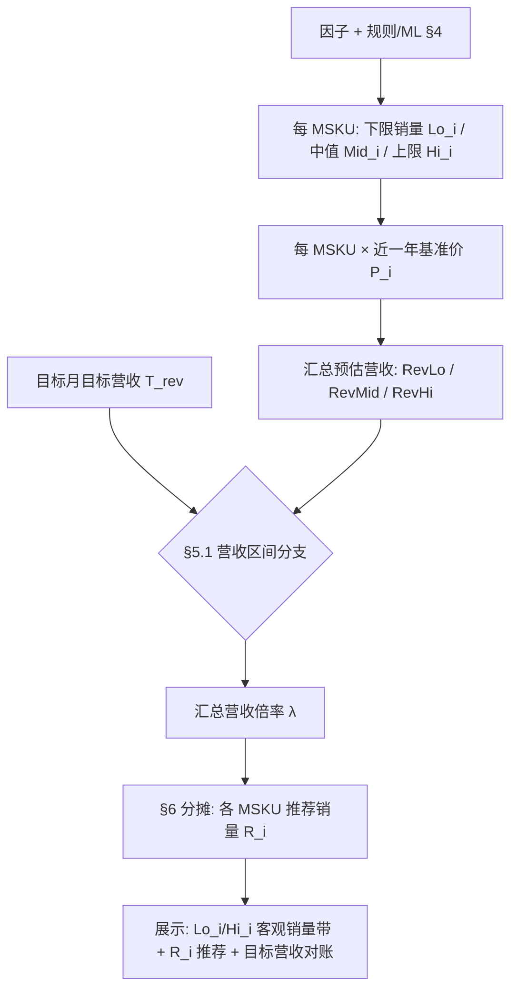

# 产品需求文档（PRD）：客观销量带与系统推荐（原《预测销量上下限规则》）

> **关联文档**：[基于规则的销量预测设计说明.md](../基于规则的销量预测设计说明.md)、[销量预测管理-PRD.md](./销量预测管理-PRD.md)（**目标助手 · 主工作台**）  
> **适用范围**：**客观下限、客观中值、客观上限** 三条客观销量线的定义与合成（§4）；**近一年基准价**折算后的 **预估营收下/中/上** 与 **目标月目标营收 `T_rev`** 的比较及 **汇总倍率 `λ`**（§5）；各 MSKU **推荐销量 `R_i`** 与展示口径（§6）；与主工作台列表、图表、详情**同源**。（隶属 **目标助手**。）  
> **会议依据**：需求逻辑调整会（客观三线与目标、推荐解耦；推荐不得突破客观上限）。  
> **文档版本**：v2.5  
> **状态**：草案  
> **最后更新**：2026-04-20

---

## 1. 背景与目标

### 1.1 背景

业务需要同时看清三类信息：（1）在**纯客观因子**（流量、价格、促销安排等）假设下能支撑的销量**下/中/上**界；（2）业务下达的**目标**；（3）系统在**不突破客观约束**的前提下给出的**推荐值**。  
客观带与目标必须可分开展示与计算；**禁止**将系统推荐抬到高于**客观上限**。

### 1.2 目标

| 目标 | 说明 | 验收要点 |
|------|------|----------|
| **口径统一** | 客观下限/中值/上限仅来自因子情景与销量合成公式；与规则/ML 输出对齐。 | 任意 MSKU× 月，可列出三客观值与因子取值或等价元数据。 |
| **与目标解耦** | 销售目标、BP **不参与** `Lo_i/Mid_i/Hi_i` 的数值修正。 | 改 **`T_rev`（或仅目标销量展示）** 不重算客观三值与 `Rev*`；仅重算 **`λ` 与 `R_i`**。 |
| **推荐可审计** | 系统推荐 = **营收分支（`T_rev` vs `RevLo/RevMid/RevHi`）定 `λ`** + **`Mid_i×λ` 分摊到 MSKU**；可追溯。 | 详情或导出可看到 **`λ`、分支枚举、`Rev*`、可选 `T_rev,i`**。 |

### 1.3 非目标

- 具体接口字段名、调度频率、存储表结构（由接口/技术设计补全）。  
- 全渠道排期、PSI 联动（不在本文范围）。

### 1.4 单位（与财务对齐）

| 项 | 说明 | 验收要点 |
|----|------|----------|
| **主口径** | 默认与主工作台一致：**销量（数量）**；若组织以**销售额**为滚动目标，须定义「价×量」或统一折算后再做汇总与分摊，**禁止**额与量直接相加。 | PRD 与接口字典中声明 `qty` / `amount` 及换算表。 |

---

## 2. 名词与范围

| 名词 | 定义 |
|------|------|
| **客观中值** | 规则引擎或 ML 在**未施加销售目标约束**下，对应该月、该 SKU 的**主点预测**（与《基于规则的销量预测设计说明》中「点预测」同源）。 |
| **客观下限 / 客观上限** | 在与客观中值**同构的销量合成公式**中，仅将 §4 五类因子替换为悲观/乐观极值得到的销量边界。 |
| **目标（T）** | 业务侧拆解到同粒度的销售目标（可与 BP 同源展示名「BP 目标」，**语义上**为「目标」）；本文 §5 以 **`T_rev`（目标营收总额）** 为主驱动，**目标销量**仅作辅助展示或经价折算后接入。 |
| **系统推荐值** | 在**专员负责 MSKU 全集（默认范围）的汇总层**，先得到销量 **下限/中值/上限**（中值路径为**未调目标前的基准推荐销量**），经 **近一年基准价** 转为 **预估营收下/中/上** 后与 **目标月目标营收** 比较，按 **§5** 得到汇总倍率 **λ**，再按 **§6** 分摊到各 MSKU 的推荐销量；**客观上下限销量**不因目标改写，仅推荐销量可调。 |
| **近一年基准价 `P_i`** | 与财务对齐的 **MSKU 级**滚动均价（如近 12 个自然月**月均价**的均值或加权均值，**不含目标月**）；用于把销量三线折算为 **预估营收三线**，**禁止**与 §4 悲观/乐观路径中的「价因子极值」混用口径（后者仅进入销量合成）。 |
| **目标月目标营收 `T_rev`** | 组织在目标月下达的 **目标营收总额**（可再按 MSKU 拆解为 `T_rev,i` 仅作展示/对账，**不**参与客观三线计算）。 |
| **预估营收下/中/上** | 汇总层：`RevLo=Σ(Lo_i×P_i)`，`RevMid=Σ(Mid_i×P_i)`，`RevHi=Σ(Hi_i×P_i)`；与 `T_rev` 的比较在 **§5.1** 完成。 |
| **预测流量** | 与客观中值销量合成公式中所用、**同 MSKU×月、同聚合粒度**的预测流量一致。 |
| **近 3 个月 / 近 1 年** | 用于 §4 中非流量因子的极值窗口；**不含目标月**的以表内说明为准。 |

**粒度与范围约定**：同一 **MSKU（或 ASIN+渠道最小粒度）× 自然月** 计算客观三值。**汇总层范围**：**默认**取当前登录**销售专员在权限内负责的全部 MSKU**（主数据/组织关系维护），**无需、也不依赖**工作台勾选；若产品提供「筛选子集」能力，则仅当用户显式筛选时才以筛选结果为汇总范围（须在界面标注「子集」以免与默认全集对账混淆）。加总口径与 §1.4 一致（额、量分列）。

---

## 3. 计算顺序（总览）

计算顺序：**先销量客观三线（含中值=基准推荐）** → **用基准价转预估营收三线** → **读入目标月目标营收并与预估营收区间比较** → **定汇总倍率 λ** → **分摊到各 MSKU 的推荐销量**（并继承该 MSKU 的客观上下限销量）。



| 步骤 | 输出 | 验收要点 |
|------|------|----------|
| 1 | 每 MSKU **Lo_i / Mid_i / Hi_i**（件） | Mid_i 与预测主输出一致；Lo/Hi 仅 §4 因子极值；**不**读目标。 |
| 2 | 每 MSKU **P_i**、汇总 **RevLo/RevMid/RevHi**（额） | 价口径与财务字典一致；**禁止**额与量直接相加，须显式 `×P_i`。 |
| 3 | **T_rev**（及可选 `T_rev,i` 展示） | 与 BP/管报同源字段可对账。 |
| 4 | **λ** + **R_i** | **单倍率**在汇总层确定后再分摊；**Lo_i ≤ R_i ≤ Hi_i**；若 clamp 后偏离总额，二次缩放（§6）。 |
| 5 | 汇总范围 | **默认**专员负责 **MSKU 全集**；非默认子集须在 UI 标注。 |

---

## 4. 功能需求：因子取值规则（客观下限 / 客观上限）

**原则**：在**与客观中值相同的销量合成公式**中，仅替换下表五类因子；**客观下限（悲观）**各因子取不利销量一侧极值，**客观上限（乐观）**取有利一侧；**其余因子与客观中值一致**。

| 因子 | 客观下限（悲观） | 客观上限（乐观） | 窗口与聚合 |
|------|------------------|------------------|------------|
| **流量** | `预测流量 × 0.5` | `预测流量 × 2` | 同粒度、与预测月对齐 |
| **转化率** | 近 3 个月各月代表值的 **min** | 近 3 个月各月代表值的 **max** | 不含目标月 |
| **竞争力** | 近 3 个月月代表值的 **min**（方向以字典为准；示例口径为**月同比增长率**，如 **-1.5%**） | 近 3 个月月代表值的 **max**（如 **6.4%**） | 同上 |
| **价格** | 近 1 年各月 **月均价** 的 **max**（价高偏悲观） | 近 1 年各月 **月均价** 的 **min**（价低偏乐观） | 不含目标月 |
| **广告花费** | 近 3 个月月代表值的 **min** | 近 3 个月月代表值的 **max** | 与客观中值币种/口径一致 |

表内 **预测流量** 与客观中值路径下所用预测流量**同源**；客观下限、客观上限仅在合成时将该因子替换为上表悲观/乐观取值，其余因子规则不变。

**缺失与边界（摘要）**：历史窗口不足、竞争力方向与字典不一致、价格/广告权限缺失等场景，按统一兜底策略取值或标记不可算，并在审计日志中记录原因；**预测流量缺失或为 0** 时，该因子不执行 `×0.5` / `×2` 外推，按与技术设计一致的兜底枚举处理（须保证客观三线仍可解释、不推荐突破客观上界）。

### 4.1 数据示例：目标月因子同表对照（流量与其余因子并列）

以下用 **同一目标月（2026-05）、同一行** 并列展示 **预测流量** 与 **转化率 / 竞争力 / 广告** 等因子，便于与 §4「五类因子」逐列核对；**客观下/上限路径**在各行因子上的替换规则仍以 §4 主表为准。  
**近一年基准价 `P_i`** 单独成列：仅用于 §3 **销量→预估营收**折算（§5），**不**等同于 §4 中「价格因子悲观/乐观极值」（后者进入销量合成）。

**目标月 2026-05（中值路径代表值 + 折算用基准价）**

| MSKU | 预测流量 | 转化率（代表值） | 竞争力（月增长率，%） | 广告花费（代表值，示意） | **近一年基准价 `P_i`（元/件）** |
|------|----------|------------------|------------------------|---------------------------|----------------------------------|
| A | **400** | 9.0% | +2.0% | 230 | **12.0** |
| B | **600** | 12.0% | +3.5% | 300 | **15.0** |
| C | **200** | 5.5% | +0.8% | 100 | **20.0** |

**同一 MSKU 在客观下/上限路径上的流量取值（与上表对照）**

| MSKU | 中值路径流量 | 客观下限路径流量（×0.5） | 客观上限路径流量（×2） |
|------|--------------|---------------------------|------------------------|
| A | 400 | **200** | **800** |
| B | 600 | **300** | **1,200** |
| C | 200 | **100** | **400** |

历史窗口（2–4 月）用于 **转化率/竞争力** 的 min、max 及 §4 **价格因子** 的极值推导时，仍按各 MSKU **分月纵向表**维护；验收时须能追溯到「本表目标月取值 + 历史 min/max」。

---

## 5. 系统推荐值：汇总层分支（可验收 if-else，营收区间版）

以下变量均为**同一自然月、同一专员负责 MSKU 全集（或显式筛选子集）**、且与 §1.4 **额/量分列**后的汇总：

**销量侧（件）**

- `Lo_i / Mid_i / Hi_i`：各 MSKU 客观下限 / 中值 / 上限销量（§4）。  
- `SumLo = Σ Lo_i`，`SumMid = Σ Mid_i`，`SumHi = Σ Hi_i`。

**价格侧（折算专用）**

- `P_i`：**近一年基准价**（§2），与 §4「价因子」口径区分。  

**营收侧（元）**

- `RevLo = Σ (Lo_i × P_i)`，`RevMid = Σ (Mid_i × P_i)`，`RevHi = Σ (Hi_i × P_i)`。  
- `T_rev`：**目标月组织目标营收总额**（无则空）。可选维护 `T_rev,i`（MSKU 目标营收）用于展示，由 BP/管报拆解或按历史目标营收占比分摊，**不参与** `Lo_i/Mid_i/Hi_i` 计算。

### 5.1 分支表（可验收）：目标营收 vs 预估营收带

先在汇总层确定**单一营收倍率** `λ`（**单标量**），再进入 §6 映射到各 MSKU 推荐销量。**直觉**：`λ` 把「以中值销量为基准」的总预估营收 **对齐** 到「目标可达的营收位置」；当目标超出乐观上沿或低于悲观下沿时，分别用 **`RevHi/RevMid`**、**`RevLo/RevMid`** 作为倍率，使推荐营收**顶格/托底**在预估营收上/下沿。

| # | 条件（汇总层，营收） | 汇总营收倍率 `λ` | 验收要点 |
|---|----------------------|-------------------|----------|
| A | `T_rev` 无有效值 | **`λ = 1`** | 各 MSKU **`R_i = Mid_i`**（或产品与主 PRD 约定的「不可算」策略）；从空到有值时切换分支。 |
| B | **`T_rev > RevHi`** | **`λ = RevHi / RevMid`**（`RevMid=0` 时走兜底，须定义） | 推荐侧营收**不超过**乐观上沿；**禁止**通过提高 `λ` 使 `Σ(R_i×P_i)` 实质超过 `RevHi`（四舍五入误差按阈值）。 |
| C | **`RevLo ≤ T_rev ≤ RevHi`** | **`λ = T_rev / RevMid`** | 目标落在预估营收带内；倍率由**目标营收 / 中值营收**单点决定。 |
| D | **`T_rev < RevLo`** | **`λ = RevLo / RevMid`** | 目标低于悲观下沿时，推荐营收**托底**至 `RevLo`，避免按比例跟到过低的不可执行目标。 |

**与旧版（纯销量比较）关系**：若组织仅以 **目标销量** 下达、无可靠 `T_rev`，可经 **`T_rev ≈ Σ(T_qty,i × P_i)`** 等价接入本表，须在数据字典中声明近似误差责任方。

**单 MSKU 约束**：对每个 MSKU `i`，推荐销量 **`R_i` 须满足 `Lo_i ≤ R_i ≤ Hi_i`**；若 `ROUND(Mid_i×λ)` 越界，**clamp** 后按 §6 **二次缩放**在仍有 headroom 的 MSKU 间消化差额（验收：越界率 0，总额误差 ≤ 约定阈值）。

### 5.2 伪代码（汇总倍率 → 分摊）

```
(RevLo, RevMid, RevHi) = sum_i(Lo_i*P_i, Mid_i*P_i, Hi_i*P_i)
lambda = branch_rev(T_rev, RevLo, RevMid, RevHi)   // 见 §5.1
for each MSKU i:
  R_i = round(Mid_i * lambda)
  R_i = clamp(R_i, Lo_i, Hi_i)
// 若 sum(R_i*P_i) 与目标营收路径不一致，按 §6 在合法区间内二次缩放并记日志
```

---

## 6. 分摊到 MSKU

| 规则 | 说明 | 验收要点 |
|------|------|----------|
| **主公式** | **`R_i = ROUND(Mid_i × λ)`**，再 **`clamp(R_i, Lo_i, Hi_i)`**；`λ` 为 §5.1 在汇总层一次性确定的**营收倍率**（**单标量**）。 | 任抽 3 个 MSKU，手算与系统差在约定误差内。 |
| **形状保持** | 未 clamp 前，各 MSKU 推荐与中值同比例，**分摊权重**与 **`Mid_i`** 一致；若需按营收权重微调，仅在 **二次缩放** 阶段、且**不破坏** `Lo_i/Hi_i` 约束时启用（技术设计细化）。 | 详情可展示 `λ` 与（可选）`Mid_i×P_i / RevMid`。 |
| **二次缩放** | 若 clamp 后 **`Σ(R_i×P_i)`** 与 §5.1 选定路径对应的**目标折算营收**偏离超过阈值，在 **各 `R_i` 可调且仍满足 `Lo_i≤R_i≤Hi_i`** 的前提下做整数或比例微调（算法由技术设计补）。 | 偏离 ≤ 约定阈值；审计记录缩放原因。 |
| **上下限展示** | 每个 MSKU 的 **销量下限/上限** 恒为 **`Lo_i`/`Hi_i`**；**推荐销量**为 **`R_i`**。 | 列表/详情 **三列**：下限、推荐、上限（+ 目标营收对账列）。 |

### 6.1 数值示例：先销量三线 → 预估营收三线 → 目标营收分支 → λ → 各 MSKU 推荐（可手算复现）

**范围**：目标月 **2026-05**；汇总范围为某销售专员负责的 **MSKU：A / B / C 全集**（**默认无需勾选**，与 §2 一致）。生产环境以规则/ML **同构销量公式**为准；本例 toy 销量公式：

`Q = ROUND(流量路径 × 转化率路径 × (1 + 竞争力增长率路径) × 5)`（竞争力小数口径，如 **-1.5% → -0.015**，**+6.4% → +0.064**）

**因子同台对照**：目标月各因子与 **§4.1** 主表一致；下表仅压缩列出 **2～4 月** 以便核对 min/max（流量在目标月才有预测值，历史月用「—」）。

| MSKU | 月 | 预测流量 | 转化率 | 竞争力（%） |
|------|----|----------|--------|-------------|
| A | 02–04 | — | 8.0% / 10.0% / 9.0% | +1.0% / **-1.5%** / +3.2% |
| B | 02–04 | — | 12.0% / 11.0% / 13.0% | **+6.4%** / +2.0% / +4.0% |
| C | 02–04 | — | 5.0% / 5.0% / 6.0% | +0.5% / **-2.0%** / +1.0% |

---

#### 步骤 1：目标月销量三线（推荐基准 = `Mid_i`）

将转化率、竞争力一律换为小数代入：`Q = ROUND(流量 × 转化率 × (1+g) × 5)`。

| MSKU | 客观中值 `Mid_i`（推荐基准） | 客观下限 `Lo_i` | 客观上限 `Hi_i` |
|------|------------------------------|-----------------|-----------------|
| A | **184** | **79** | **413** |
| B | **373** | **168** | **830** |
| C | **55** | **25** | **121** |

`SumLo=272`，`SumMid=612`，`SumHi=1,364`（件）。

---

#### 步骤 2：近一年基准价 `P_i` → 预估营收三线

与 §4.1 一致：`P_A=12.0`，`P_B=15.0`，`P_C=20.0`（元/件）。

| 汇总量 | 计算式 | 结果（元） |
|--------|--------|------------|
| **`RevMid`** | `184×12 + 373×15 + 55×20` | **8,903** |
| **`RevLo`** | `79×12 + 168×15 + 25×20` | **3,968** |
| **`RevHi`** | `413×12 + 830×15 + 121×20` | **19,826** |

---

#### 步骤 3：目标月目标营收 `T_rev` 与可选 MSKU 拆解（仅展示）

组织下达 **`T_rev`**。下表给出 **近 3 月各 MSKU 目标营收合计**（与 v2.4 历史示例同源：A **315,000**、B **600,000**、C **150,000**，总和 **1,065,000**），用于 **仅展示** `T_rev,i`（**不参与** `Lo/Mid/Hi` 计算）：

| MSKU | 近 3 月目标营收合计（元） | 占比 | 当 **`T_rev=12,000`** 时 `T_rev,i`（四舍五入） |
|------|---------------------------|------|-----------------------------------------------|
| A | 315,000 | 21/71 | **3,549** |
| B | 600,000 | 40/71 | **6,761** |
| C | 150,000 | 10/71 | **1,690** |

（`3,549+6,761+1,690=12,000`。）

---

#### 步骤 4：§5.1 分支（营收）— 全场景：`λ` → `R_i=ROUND(Mid_i×λ)` → clamp

**分支 A：无 `T_rev`**

| 子步骤 | 结果 |
|--------|------|
| `λ` | **1** |
| `R_A/R_B/R_C` | **184 / 373 / 55**（= `Mid_i`） |

**分支 B：`T_rev > RevHi`（例：`T_rev=25,000`）**

| 子步骤 | 计算 | 结果 |
|--------|------|------|
| 判定 | `25,000 > 19,826` | 命中 **§5.1 #B** |
| `λ` | `19,826 / 8,903` | **≈ 2.22498** |
| 初算 `R_i` | `ROUND(184×λ)≈409`，`ROUND(373×λ)≈830`，`ROUND(55×λ)≈122` | **409 / 830 / 122** |
| clamp | **122 > `Hi_C=121`** → `R_C=121`；须在 **仍有 headroom** 的 MSKU 上按 §6 **二次缩放**闭合总额（验收：**`R_i≤Hi_i`**） | 须二次缩放 |

**分支 C：`RevLo ≤ T_rev ≤ RevHi`（例：`T_rev=12,000`）**

| 子步骤 | 计算 | 结果 |
|--------|------|------|
| 判定 | `3,968 ≤ 12,000 ≤ 19,826` | 命中 **§5.1 #C** |
| `λ` | `12,000 / 8,903` | **≈ 1.34786** |
| `R_i` | `ROUND(184×λ)=248`，`ROUND(373×λ)=503`，`ROUND(55×λ)=74` | **248 / 503 / 74** |
| clamp | 均满足 **`Lo_i≤R_i≤Hi_i`** | 本例无需 |

**分支 D：`T_rev < RevLo`（例：`T_rev=3,000`）**

| 子步骤 | 计算 | 结果 |
|--------|------|------|
| 判定 | `3,000 < 3,968` | 命中 **§5.1 #D** |
| `λ` | `3,968 / 8,903` | **≈ 0.44569** |
| 初算 `R_i` | `82 / 166 / 25` | **82 / 166 / 25** |
| clamp | **166 < `Lo_B=168`** → 至少 **168**；随后 **二次缩放**（验收同 §6） | 须二次缩放 |

---

#### 步骤 5：每个 MSKU 展示字段（下限 / 推荐 / 上限）

| MSKU | **销量下限** | **系统推荐销量**（分支 C 示例） | **销量上限** |
|------|----------------|----------------------------------|----------------|
| A | **79** | **248** | **413** |
| B | **168** | **503** | **830** |
| C | **25** | **74** | **121** |

（可选）同列展示 **`T_rev,i`** 与 **`R_i×P_i`** 供财务对账；**禁止**把额与量在同一列混写。

---

## 7. 展示与交互（与主 PRD 对齐）

| 位置 | 需求 | 验收要点 |
|------|------|----------|
| 列表单元格 | 主数字：**客观中值**；附 **客观下限～客观上限**；另列 **系统推荐**；**目标营收**（及可选 **`T_rev,i`**）单独成列。 | 额、量**分列**；与 §6.1 手算表可对账。 |
| 图表 | **客观中值**柱 + 浅色带表示客观下～上；**目标营收**、**系统推荐**为点值或柱；**系统推荐** Tooltip **不**附客观区间（区间仅属于客观中值）。 | 与 §5.1 **营收分支**试算一致。 |
| 详情 | 按月：`Lo_i/Mid_i/Hi_i`、`P_i`、`RevLo/RevMid/RevHi`、`T_rev`、`λ`、`R_i`、因子对照。 | 默认汇总范围为**专员负责 MSKU 全集**；若用户筛选子集须标注。 |
| 汇总行 | 必有；展示 `SumLo/SumMid/SumHi`、`RevLo/RevMid/RevHi`、`T_rev`、`λ`；可选 `Σ(R_i×P_i)` 闭合校验。 | 与 §5.1 同一试算可复现。 |

---

## 8. 销量合成（客观三值如何得到）

1. **客观中值**：规则/ML 主输出，**不**读目标。  
2. **客观下限/上限**：与客观中值**同构公式** + **§4** 因子悲观/乐观向量。  
3. **系统推荐**：**§5（营收分支定 λ）+ §6（`Mid_i×λ` 分摊与 clamp）**，**不**回写客观三值。

---

## 9. 非功能需求（摘要）

| 类别 | 要求 |
|------|------|
| **性能** | 区间与客观中值同次请求返回（继承主 PRD SLA）。 |
| **审计** | 保存 `SumLo/SumMid/SumHi`、`RevLo/RevMid/RevHi`、`T_rev`、`λ`、`Σ(R_i×P_i)`（若可算）及版本号。 |
| **权限** | 与预测一致；无价格权限则隐藏相关因子或区间（策略二选一）。 |

---

## 10. 待确认清单

1. **`P_i`（近一年基准价）** 的统计算法（简单均值 vs 销量加权 vs 财务指定滚动价）及与 **§4 价因子极值** 的职责边界。  
2. **`T_rev` 缺失/多币种/多组织** 时，§5.1 分支 A 的兜底是否与主 PRD「不可算」策略完全一致。  
3. **二次缩放**后 **`Σ(R_i×P_i)`** 与 `RevLo/RevHi/T_rev` 路径的允许偏差阈值。  
4. 同比月、MTD、多站点等因子窗口边界 case 评审时合并确认。

---

## 11. 变更记录

| 版本 | 日期 | 作者 | 摘要 |
|------|------|------|------|
| **v2.5** | **2026-04-20** | 产品 | **计算链路改版**：先 `Lo/Mid/Hi` 销量 → **`P_i` 转 `RevLo/RevMid/RevHi`** → 与 **`T_rev`** 比较定 **`λ`** → **`R_i=ROUND(Mid_i×λ)`**；§5.1 改为 **营收四分支**；§4.1 **流量与其余因子同表**；汇总范围 **默认专员负责 MSKU 全集、无需勾选**。 |
| **v2.4** | **2026-04-20** | 产品 | §6.1：先列近 3 月 MSKU **目标销量+目标营收**，按 **目标营收占比** 分摊 `T_i`；竞争力改为 **增长率**（示例含 **-1.5%**、**6.4%**）并入 toy 公式；**§5.1 分支 A～E** 全部分场景给出子步骤（含分支 B 触上界后的二次缩放验收口径）。 |
| **v2.3** | **2026-04-20** | 产品 | 与主工作台/预测配置对齐：**不再**定义「BP 与点预测融合权重」参与点预测；客观中值名词表仅保留点预测定义。 |
| **v2.2** | **2026-04-20** | 产品 | §5.1 去掉「提示/告警」列；§6.1 增补三 SKU 多月因子 → 客观三值 → 分支 → 分摊 → clamp 与推荐允许区间 \[Lo,Hi\] 的完整算例。 |
| **v2.1** | **2026-04-20** | 产品 | §4 **流量**：客观下限改为 `预测流量×0.5`、客观上限改为 `预测流量×2`；增 §4.1 数据示例；全文收敛为当前有效逻辑表述。 |
| **v2.0** | **2026-04-17** | 产品 | 客观三线与目标、推荐分层；§5 汇总分支 + §6 分摊；增 mermaid 与单位节。 |
