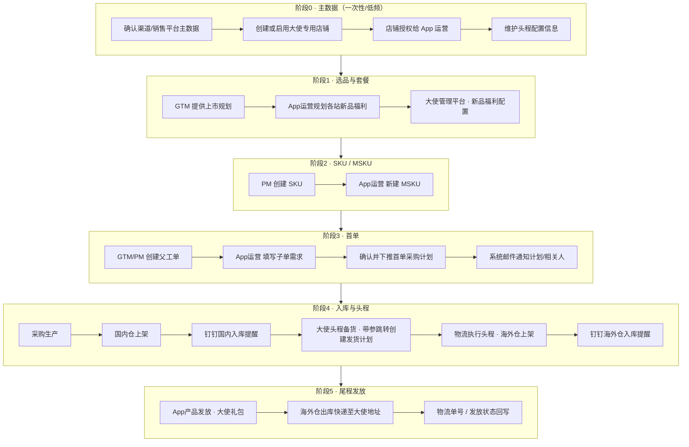

# 大使新品福利 · 全流程方案

> 版本：v1.0｜整理日期：2026-07-21  
> 依据：26-06-25 / 26-06-30 / 26-07-14 会议纪要、用户操作流程图、墨刀原型、前后端现状代码与知识库  
> 原型参考：[墨刀 · 大使方案](https://modao.cc/proto/XIF1sFzdsvd6ep9WK2IFDY/sharing?view_mode=read_only&screen=rbpVNzcvAAwVAE6lE)

---

## 1. 一句话结论

大使新品福利链路 = **主数据准备（平台/店铺）→ 选品与套餐 → 建 SKU/MSKU → 首单父子工单 → 采购入库 → 头程备货到海外仓 → 尾程 App 产品发放到大使地址**。  
尾程已打通；本期重点是 **给 App 运营开通 MSKU/子单权限，并在大使管理平台补「头程配置 + 快捷跳转创建发货计划 + 国内/海外入库钉钉提醒」**。

---

## 2. 背景与目标

| 项 | 说明 |
|----|------|
| 业务背景 | 2026 H2 社区大使从 25 人扩至 100 人，新品福利礼包体量上升，需 App 运营自行建首单、跟踪生产、头程发至海外仓后再做尾程发放 |
| 现状能力 | 用户子系统「大使管理平台」已有信息/奖品/活动/新品福利套餐配置；「App产品发放」已支持大使礼包（活动类型=9）按 AID 发海外仓；销售侧有 MSKU、创建发货计划；GTM 有新品父/子工单 |
| 主要缺口 | ① App 运营侧 MSKU 创建、子单填写需权限/入口打通；② 头程配置与一键带参创建发货计划；③ 国内仓/海外仓入库钉钉提醒；④ 套餐与供应链状态可视化（可选增强） |
| 本期目标 | 打通「下首单 → 入库感知 → 头程发运」；尾程继续复用 App 产品发放 |

---

## 3. 角色职责

| 角色 | 职责 |
|------|------|
| 产品经理（PM） | 提前创建 SKU |
| App 运营 | 维护大使信息与套餐；创建 MSKU；填写首单子需求；维护头程配置；确认头程发运；海外仓到货后做尾程发放 |
| 需求发起人（GTM/PM） | 创建首单父工单；汇总确认后下推首单采购计划（触发系统邮件） |
| 渠道 MSKU 销售负责人 | （常规渠道）填写各渠道需求；大使场景由 App 运营对大使店铺填写 |
| GTM/PM 负责人 | 审核需求汇总、确认采购计划 |
| 计划人员 | ERP 内接收采购计划并执行采购/排产 |
| 物流 | 执行头程运输与海外仓上架；承接尾程物流订单 |
| 系统 | 下推邮件通知、入库定时提醒、发货计划校验与同步 |

---

## 4. 全链路总览

---

## 5. 阶段 0：如何创建平台、如何创建店铺

> 「平台」在 ERP 中一般不是独立业务建档页，而是**销售渠道/站点主数据**；大使业务落地的关键动作是 **建大使专用店铺 + 授权 + 绑定头程默认配置**。

### 5.1 平台（渠道/站点）准备

| 步骤 | 做什么 | 系统位置 | 说明 |
|------|--------|----------|------|
| 1 | 确认大使礼包走哪条销售渠道/站点口径 | 销售主数据 / 组织配置 | 会议结论：奖品发放专用，不与常规销售渠道混用 |
| 2 | 明确站点范围（如 US / CA / EU / UK 等） | 业务约定 | 与「新品福利配置」站点枚举对齐；一店多国或一站一店需业务拍板 |
| 3 | 确认海外仓映射 | 物流海外仓主数据 | 例：美国补仓、其他站点外仓/万邑通等，由物流定仓，运营按映射选用 |

**操作要点：**

- 不需要单独「新建平台」菜单；若渠道/站点已存在，直接复用。
- 若新开业务线需新渠道码，走平台/主数据配置（管理员），再挂店铺。

### 5.2 创建 / 启用大使店铺

| 步骤 | 做什么 | 系统位置 | 路由/菜单 |
|------|--------|----------|-----------|
| 1 | 创建大使奖品发放专用店铺（或启用既有运营店铺） | 销售系统 · 店铺开通/授权体系 | 销售 → 设置 → 店铺授权（`/setting/shopAuth`）；店铺主体开通常经 SP-API/组织加店 |
| 2 | 将店铺挂到对应组织 | 平台/组织管理 | 组织加店（`addShopToOrg`） |
| 3 | 给 App 运营账号开店铺权限 | 店铺授权 | 授权用户/角色可见该店，才能建 MSKU、填子单、建发货计划 |
| 4 | 约定店铺与国家/海外仓映射 | 头程配置（本期新建） | 选店铺后，运输方式、默认发货地址、空运原因等可固定默认 |

**会议共识：**

- 大使店铺是**奖品发放专用**，一般不与其他销售共用 MSKU。
- 「一个店铺对应多国家」可行（品牌推广亦有先例）；若分多店，头程时按店选国家/仓即可。
- 此前由他人代建店铺；现已给 App 运营开权限，后续**自行建 MSKU、自行创建发运**。

### 5.3 大使管理平台侧准备

| 步骤 | 做什么 | 系统位置 |
|------|--------|----------|
| 1 | 导入/维护大使名单（AID、上岗/下岗、地址等） | 用户系统 → 运营 → 大使管理平台 → 大使信息管理（`/operate/ambassadorManage`） |
| 2 | 配置新品福利套餐（站点 + 产品组合） | 同页 Tab「新品福利配置」 |
| 3 | （本期新增）维护**头程配置信息** | 同页新增「头程配置信息」入口，见第 8 章 |

---

## 6. 阶段 1～3：选品 → SKU/MSKU → 首单（用户关注的 1～5 步）

### 6.1 步骤 1：PM 创建 SKU

| 项 | 内容 |
|----|------|
| 负责人 | 产品经理（PM） |
| 动作 | 在产品/SKU 主数据中提前创建 SKU（Model/SKU 等） |
| 前置 | 选品规划已锁定该产品进入大使福利 |
| 产出 | 可用于建 MSKU 的 SKU |

### 6.2 步骤 2：App 运营创建 MSKU（需打通）

| 项 | 内容 |
|----|------|
| 负责人 | App 运营 |
| 现有路径 | **销售系统 → 信息 → MSKU基础信息 → 新建MSKU** |
| 路由 | `/info/salesBasicInfo` |
| 关键代码 | `packages/sales/.../info/salesBasicInfo/`（含新建弹窗） |
| 关键字段（代码可确认） | model、sku、店铺、msku 后缀（自动拼 MSKU）、优先级、品线/品类、销售渠道、产品定位、销售链接、UPC/GTIN、箱规尺寸重量等 |
| 打通要求 | ① 开通 App 运营「MSKU基础信息」菜单与按钮权限；② 店铺权限含大使店；③ SOP/入口可从大使管理平台链出（建议 shortcut） |

**操作顺序：**

1. 进入 MSKU 基础信息，筛选到大使店铺。  
2. 点「新建MSKU」，选择已有 SKU/Model，绑定大使店铺，补齐后缀与渠道信息。  
3. 保存后，该 MSKU 可用于后续子单填写与发货计划。

### 6.3 步骤 3：需求发起人创建首单父工单（GTM/PM）

| 项 | 内容 |
|----|------|
| 负责人 | GTM / PM（需求发起人） |
| 路径 | **GTM 系统 → 管理 → 新品需求收集管理** |
| 路由 | `/manage/gtmMgr` |
| 动作 | 创建父需求工单，维护基础信息与截止时间，并按店铺/渠道拆出子工单（含大使店对应子单） |
| 父工单状态 | 收集中 → 部分确认 → 全部确认 → 已下单 |

### 6.4 步骤 4：App 运营创建/填写子单（需打通）

| 项 | 内容 |
|----|------|
| 负责人 | App 运营 |
| 现有路径 | **备货/GTM → 新品需求收集填写 → 找到对应店铺 → 填写需求** |
| 路由 | `/manage/gtmTodo`（列表页常展示「填写需求 / 提交工单 / 取消工单」） |
| 关键字段 | 店铺/MSKU、规格、预计 CR、计划上市时间、需求数量、截止时间、子单状态等 |
| 子单状态 | 待提交 → 已提交 → 待下单 → 已下单（可取消） |
| 打通要求 | ① 开通 `gtmTodo` 权限；② 数据范围可见大使店铺子单；③ 可从大使平台跳转到对应父/子单 |

**操作顺序：**

1. 在「新品需求收集填写」按店铺/MSKU 定位大使子单。  
2. 点「填写需求」，录入各站/该店需求数量与时间。  
3. 「提交工单」等待 GTM/PM 确认。

> 说明：界面上也有「导入MSKU大使礼包数量」类能力，可用于批量灌入大使礼包数量，具体以当前环境按钮为准。

### 6.5 步骤 5：下推首单后系统邮件通知

| 项 | 内容 |
|----|------|
| 触发 | 需求发起人确认后执行「下推首单采购计划」 |
| 效果 | 系统自动发邮件（如 `erp-support@ihoment.com`）通知计划/相关人员备料交付 |
| 邮件要素（现状样例） | 主题含 Model/SKU/日期；正文含国家、计划上市时间、渠道、店铺、MSKU、销售负责人、TL、本次下单数量、历史下单数量等 |
| 下游 | 计划人员在 ERP 接收采购计划并排产；项目侧若需建单，初期可能仍手工，后期可自动收计划单 |

---

## 7. 阶段 4：收货（入库）如何进行

「收货」在本业务分两层：**国内仓入库**与**海外仓上架**。App 运营不负责在仓库做实物收货，但需**感知入库并决策头程/尾程**。

### 7.1 国内仓入库

| 项 | 内容 |
|----|------|
| 业务含义 | 采购生产完成后，MSKU 上架到国内仓，产生「本次上架数量」与「国内仓可用总量」 |
| 运营动作 | 等待钉钉提醒；在库存/子单进度中核对是否满足头程发运 |
| 本期系统能力（07-14 会议定稿） | **国内入库钉钉提醒**：每天上午 10:00，扫描「昨日 10:00～今日 10:00」是否有大使相关 MSKU 入库；有则发送，无则不发 |

**钉钉内容建议结构：**

| 列 | 含义 |
|----|------|
| 店铺 | 大使店铺 |
| MSKU | 入库 MSKU |
| 本次入库数量 | 本统计窗口上架数量 |
| 国内仓可用数量 | 该店铺国内仓可用总量（含本车） |

**接收人规则：**

1. 优先：该 MSKU 维护的销售负责人（CS/销售）。  
2. 兜底：未维护负责人时，按**店铺**维度发给店铺对接人。

### 7.2 海外仓入库（上架）

| 项 | 内容 |
|----|------|
| 业务含义 | 头程到仓后海外仓上架，产生上架数量与可用数量 |
| 与国内差异 | 需额外标明**具体海外仓库**；国内仓可不区分仓明细、合并统计即可 |
| 本期系统能力 | **海外仓入库提醒**，规则同国内（有上架才发）；内容增加「海外仓仓库」列 |
| 现有系统能力 | 谷仓等海外仓状态机含「海外仓上架完成」；物流侧可查上架数量——需接到大使场景的钉钉推送 |

### 7.3 入库与发运决策原则（会议共识）

- **不自动强制发完所有库存**；由 App 运营判断何时发多少、发往哪国。  
- 支持分批入库：可等全部入库后再头程，也可分批确认发运（需在头程创建时按可用库存校验）。  
- 入库提醒只解决「知道货到了」；**创建头程发货计划仍须人点确认**。

---

## 8. 阶段 4：头程如何做（头程配置 + 大使头程备货）

### 8.1 业务定义

| 概念 | 定义 |
|------|------|
| 头程 | 国内仓 → 海外仓（空运为主），产生销售侧「发货计划」并由物流执行 |
| 尾程 | 海外仓 → 大使个人地址（App 产品发放 · 大使礼包），已有能力 |
| 本期边界 | **只做头程快捷配置与带参跳转**；不把尾程与头程揉进同一表单强耦合 |

### 8.2 头程配置信息（大使管理平台新增）

**入口：** 大使管理平台增加按钮/页「头程配置信息」。

**设计原则（07-14）：**

- 内容与「创建发货计划」页基本一致，但**配置侧不维护国家**（国家在真正备货时再选）。  
- 每个大使业务场景通常 **只维护一份配置**，创建发货计划时直接带这份默认值。  
- 选空运时，带出空运原因等字段（与现网发货计划一致）。

**建议配置字段（对齐创建发货计划，国家除外）：**

| 字段 | 是否配置侧维护 | 说明 |
|------|----------------|------|
| 店铺 | 是 | 大使专用店 |
| 目的仓类型 / 流程类型 | 是 | 国内发海外仓 |
| 发货地址 | 是 | 如深圳仓地址，可固定 |
| 运输方式 | 是 | 默认空运，可改 |
| 申请空运原因 | 条件必填 | 选空运时带出 |
| 其他与发货计划一致的基础项 | 是 | 与现网页面字段对齐 |
| 国家 | 否（备货时选） | 决定发往哪国/对应海外仓 |
| 仓库（若有） | 备货时选 | 有仓可选时再选 |
| MSKU / 数量 | 备货时填 | 按可用库存与当次需求 |

### 8.3 大使头程备货（带参跳转）

**入口：** 大使管理平台增加按钮「大使头程备货」（文案以最终 UI 为准）。

**交互：**

1. 点击后跳转 **销售系统 → 备货 → 创建发货计划**（`/stock/shipmentPlan`）。  
2. 自动带入头程配置中的店铺、运输方式、发货地址、空运原因等。  
3. 用户补选：**国家**（及必要仓库）、录入 **MSKU 与发货数量**。  
4. 系统校验可用库存；通过后「创建计划」，后续进入物流「发货计划管理」海外仓流程。

**物流侧后续（现有能力，无需重做）：**

- 物流 → 发货 → 发货计划管理（`/shipment/shipmentPlan`），海外仓 Tab。  
- 状态经销售确认 / TL / 计划 / 仓库 / 审批等现网流转后执行出库与干线。

### 8.4 头程操作 SOP（给 App 运营）

1. 提前在大使平台维护好「头程配置信息」（一份即可）。  
2. 收到国内入库钉钉后，确认可用数量是否够发。  
3. 点「大使头程备货」→ 创建发货计划页已预填 → 选国家/仓 → 填 MSKU 与数量 → 创建。  
4. 关注物流计划状态；到海外仓上架后收钉钉，再进入尾程。

---

## 9. 阶段 5：尾程发放（已有，如何衔接）

| 项 | 内容 |
|----|------|
| 路径 | 用户系统 → 运营 → App产品发放（`/operate/productExchange`） |
| 活动类型 | 大使礼包（代码活动类型 = 9） |
| 发货地 | 海外仓（大使礼包不支持国内仓直发该模式） |
| 关键输入 | 发放日期、SKU、大使 AID 列表（审核 AID）、店铺/仓 |
| 地址来源 | 大使管理平台已维护的地址（大使自助填写/变更） |
| 结果 | 创建物流尾程相关单据，快递至大使地址；可查发放状态与物流信息 |

**与头程关系：** 必须先保证海外仓有可用库存，再做尾程；头程不到仓则尾程无法出库。

**奖品发放说明：** 大使平台「奖品发放」侧重商城优惠券/官网礼品券；**实物新品礼包走 App 产品发放**，二者不要混用。

---

## 10. 端到端操作清单（按时间顺序）

| 序号 | 阶段 | 操作人 | 系统与菜单 | 是否本期开发 |
|------|------|--------|------------|--------------|
| 0.1 | 主数据 | 管理员/销售 | 渠道主数据 + 建店 + 店铺授权 | 配置，非开发 |
| 0.2 | 主数据 | App 运营 | 大使信息导入、套餐配置 | 已有 |
| 0.3 | 主数据 | App 运营 | 头程配置信息 | **新增** |
| 1 | 选品 | App 运营 / GTM | 线下规划 + 套餐写入 | 已有套餐 |
| 2 | SKU | PM | 产品 SKU 创建 | 已有 |
| 3 | MSKU | App 运营 | 信息 → MSKU基础信息 → 新建MSKU | **权限/入口打通** |
| 4 | 父单 | GTM/PM | 新品需求收集管理 | 已有 |
| 5 | 子单 | App 运营 | 新品需求收集填写 → 填写需求 | **权限/入口打通** |
| 6 | 下推 | GTM/PM | 下推首单采购计划 | 已有（含邮件） |
| 7 | 排产入库 | 计划 / 仓 | ERP 采购与国内上架 | 已有 |
| 8 | 入库提醒 | 系统 | 钉钉国内入库提醒 | **新增** |
| 9 | 头程 | App 运营 | 大使头程备货 → 创建发货计划 | **新增跳转+带参**；创建页已有 |
| 10 | 头程执行 | 物流 | 发货计划管理 · 海外仓 | 已有 |
| 11 | 海外上架提醒 | 系统 | 钉钉海外仓入库提醒 | **新增** |
| 12 | 尾程 | App 运营 | App产品发放 · 大使礼包 | 已有 |

---

## 11. 系统现状与打通点对照

| 能力 | 现状（代码/知识库） | 大使项目动作 |
|------|---------------------|--------------|
| 大使管理平台 | `/operate/ambassadorManage`，含信息/奖品/活动/**新品福利配置**/资料/提问 | 加头程配置、头程备货入口 |
| 新品福利配置 | 套餐 CRUD（站点 US/CA/EU/UK + 产品），**无** MSKU/供应链状态回写 | 可选增强；本期可不做全量可视化 |
| MSKU 新建 | `/info/salesBasicInfo` | 开权限 + 建议从大使平台链出 |
| 新品父/子单 | `/manage/gtmMgr`、`/manage/gtmTodo` | 开权限；子单填大使店需求 |
| 下推采购计划邮件 | 现网已有 | 复用 |
| 创建发货计划 | `/stock/shipmentPlan` | 作为头程落地页，接收预填参数 |
| 发货计划管理 | `/shipment/shipmentPlan` | 复用海外仓流程 |
| 国内入库提醒 | `InventoryRemindServiceImpl` 等已有通用提醒 | 扩展/复用为大使 MSKU 场景与接收人规则 |
| 海外仓上架 | 谷仓状态机等已有 | 接钉钉推送 |
| App 产品发放 | `/operate/productExchange` 大使礼包 | 复用尾程 |

---

## 12. 关键状态机（简表）

### 12.1 新品子工单

`待提交 → 已提交 → 待下单 → 已下单`（可取消）

### 12.2 父工单

`收集中 → 部分确认 → 全部确认 → 已下单`

### 12.3 头程发货计划（海外仓，示意）

待销售确认 / 待 TL / 待计划 / 待仓库 / 审批中 … → 物流执行 → 海外仓上架完成

### 12.4 App 产品发放

审核中 → 审核通过 / 不通过 / 作废 / 钉钉审批中 / 校验不通过 等（以现网枚举为准）

---

## 13. 本期开发范围建议（对齐 07-14）

1. **大使管理平台 · 头程配置信息**（无国家字段的配置页/弹窗，通常一份配置）。  
2. **大使头程备货按钮**：读取配置，跳转创建发货计划并预填；用户选国家/仓、填 MSKU 与数量。  
3. **国内仓入库钉钉提醒**（每日 10:00 窗口扫描，有入库才发）。  
4. **海外仓入库钉钉提醒**（同上，多仓库字段）。  
5. **权限与入口打通**：App 运营 MSKU 新建、新品需求收集填写（及必要店铺授权）。  

**明确不做（本期）：** 入库后全自动不经确认的头程建单；头程尾程强制同一页完成；重建整套物流能力。

---

## 14. 风险与待确认

| # | 待确认项 | 影响 |
|---|----------|------|
| 1 | 大使店铺：一店多国 vs 多店 | 头程选国家/仓交互与库存归属 |
| 2 | 部分入库是否允许分批头程 | 提醒文案与按钮出现条件 |
| 3 | MSKU 未维护销售负责人时的店铺兜底联系人名单 | 钉钉可达性 |
| 4 | 头程配置是否允许多套（按任期/批次） | 07-14 倾向「只有一个配置」 |
| 5 | 套餐页是否回写 MSKU/五节点状态 | 产品体验增强，非头程最小闭环必需 |
| 6 | 海外仓主数据：美补仓 vs 其他站点外仓映射表责任人 | 运营选国时是否自动带仓 |

---

## 15. 附录：会议结论索引

| 会议 | 关键结论 |
|------|----------|
| 26-06-25 | 规模扩张驱动流程线上化；App 运营自建发运；头程需配置化快捷填充；尾程已有；入库需提醒 |
| 26-06-30 | 完整链路认知：管理平台维护大使 → App 发放做尾程；缺头程备货到海外仓；本期建头程即可 |
| 26-07-14 | 落地最小改动：头程配置（无国家）+ 大使头程备货跳转带参 + 国内/海外入库钉钉；配置通常仅一份 |

---

## 16. 附录：关键代码与文档路径

| 类型 | 路径 |
|------|------|
| 大使管理平台前端 | `ERP_frontend/lanjing-erp-admin-web/packages/user/src/pages/operate/ambassadorManage/` |
| App 产品发放 | `.../pages/operate/productExchange/` |
| MSKU 基础信息 | `.../packages/sales/.../info/salesBasicInfo/` |
| 创建发货计划 | `.../packages/sales/.../stock/shipmentPlan/` |
| 新品需求填写 | `.../packages/gtm/.../gtmTodo/` |
| 知识卡 · 大使 | `.../docs/knowledge/user/operate/ambassador-manage.md` |
| 知识库 · MSKU | `ERP_product/销售系统/知识库/03-页面详情/M3-销售基础信息管理/MSKU基础信息.md` |
| 知识库 · 发货计划 | `ERP_product/销售系统/知识库/03-页面详情/M4-备货预测与发货计划/创建发货计划.md` |
| 知识库 · 新品需求 | `ERP_product/GTM系统/知识库/02-模块概要/M3-新品需求收集概要.md` |
| 场景梳理页 | `本地/方案设计/文件夹/项目/app运营大使/方案/前端页面展示/大使新品福利供应链-场景梳理.html` |

---

*本文档描述「完整业务流程 + 系统落点 + 本期改动边界」，可作为 PRD / 排期 / SOP 的统一底稿。*
