# 金蝶 AI PLM 深度竞品调研

> 调研时间：2026-08-14  
> 调研目标：让读者看懂金蝶 AI PLM 的功能框架、关键功能细节、底层实现方式，以及它与“研发知识解耦方案”的关系。  
> 主要依据：金蝶 AI PLM 官网、金蝶云产品手册、金蝶云社区公开资料。  
> 截图说明：当前产品能力图来自金蝶 AI PLM 官网；详细系统页面主要来自公开的 Cloud PLM 产品手册。后者能证明金蝶 PLM 的实现机制，但不等同于 2026 年最新版本界面。

---

## 1. 核心结论

金蝶 AI PLM 不是传统意义上只管理图纸和 BOM 的 PDM，而是试图形成由三部分组成的研发管理平台：

1. **IPD 与正向研发层**：市场洞察、产品路标、需求、系统工程、产品线、技术货架、研发项目、评审、测试、问题风险。
2. **产品数据与智能制造层**：研发物料、BOM、文档、基线、CAD、工艺、选配、工程变更和协同设计。
3. **平台与经营协同层**：苍穹 PaaS、业务对象建模、生命周期、工作流、权限、ERP/MES、供应链、研发费用和 AI。

它与“研发知识解耦方案”最接近的能力是：

- 需求、架构、BOM、测试之间的追溯关系；
- 技术货架、CBB 和成熟度管理；
- 项目任务的输入、输出、结束条件和检查项；
- 项目团队、资源负荷和角色权限；
- 对文档、BOM、项目和变更对象进行字段化、版本化和关系化管理；
- 通过工程变更把研发、供应链和制造联动起来。

但两者的根本机制不同：

- 金蝶 AI PLM 的核心是“**IPD 流程模板 + 项目计划 + 数据对象 + 工作流控制**”；
- 本方案的核心是“**解耦单元 + 主责人授权 + 组织能力按需供给 + 依赖工作网 + 灵活 JP**”。

因此，金蝶 AI PLM 更适合作为本方案的“能力组件和实现参照”，不适合直接作为协作机制的完整替代品。

---

## 2. 证据边界与可信度

### 2.1 高可信信息

以下内容由金蝶当前官方产品页直接说明：

- 产品基于 IPD、正向研发 V 模型、大规模定制理论；
- 覆盖需求、产品规划、技术货架、项目、评审、产品数据和研产一体化；
- 支持需求—架构—BOM—测试关系追溯；
- 支持 Top-Down 三维协同设计和 CAD/EDA 集成；
- 支持 EBOM 向 PBOM 转换并连接 ERP；
- 变更影响可覆盖研发、在途、在制、在库等 ERP 数据；
- 底层基于金蝶 AI 苍穹 PaaS。

### 2.2 可用于理解实现机制的信息

金蝶云产品手册公开了以下系统级细节：

- 业务类型、属性、生命周期、操作和流程可配置；
- 项目模板、甘特图、团队、资源、输入输出、检查项、看板和基线；
- 文档的文件夹视图、业务类型视图、状态转换、升版和相关对象；
- BOM 的检入检出、编辑、比较、优选、版本和 ERP 下推；
- 变更申请、影响评估、变更单、协助任务和生效下推；
- CAD 属性与 PLM 字段映射、图纸导入、物料/BOM 自动生成。

这些页面主要来自较早期 Cloud PLM 手册，适合回答“金蝶采用什么机制实现”，但不能证明当前产品所有页面仍完全一致。

### 2.3 暂无法从公开资料确认

- 最新 AI PLM 的完整菜单和租户实机页面；
- 产品路标、技术货架、RAS 追溯矩阵的完整交互；
- AI 需求解析、智能设计、智能工艺的实际准确率和可控性；
- 价格、标准实施周期、各模块是否独立收费；
- SaaS 与私有化版本的功能差异；
- 旧 Cloud PLM 客户升级至 AI PLM 的数据兼容策略。

---

## 3. 产品总体功能框架

官方能力图显示，金蝶 AI PLM 采用“应用域 + 平台域”的分层结构。

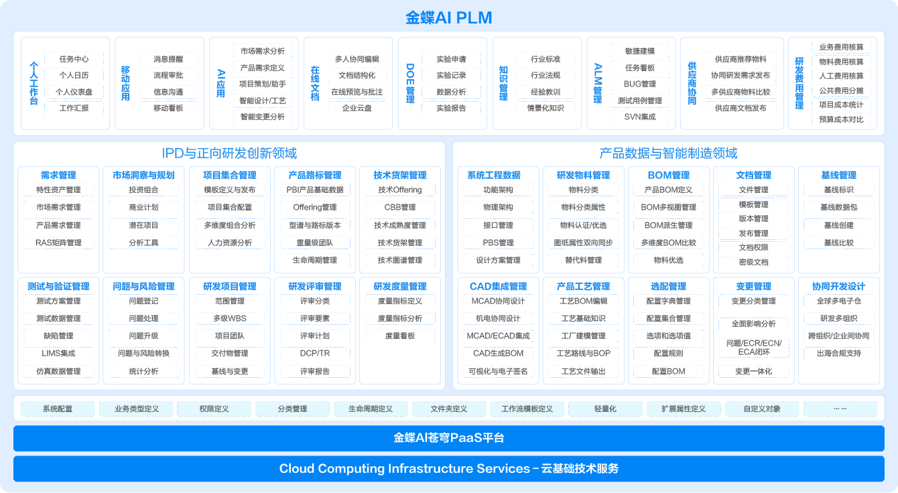

### 3.1 用户工作层

- 任务中心、个人日历、个人收藏盒、工作汇报；
- 消息提醒、流程审批、信息沟通；
- 市场洞察、需求分析、项目策划和智能评估；
- 在线文档、多人协同编辑、文档结构化；
- DOD 管理、实验申请、实验记录和数据分析；
- 行业标准、企业法规、经验教训和课程；
- 敏捷建模、任务看板、BUG、测试和 SVN 集成；
- 供应商推荐物料、协同开发需求发布和供应商物料比较；
- 研发物料、人工、公共费用和项目成本核算。

### 3.2 IPD 与正向研发域

- 需求管理；
- 市场洞察与规划；
- 项目集管理；
- 产品路标管理；
- 技术货架管理；
- 测试与验证；
- 问题与风险；
- 研发项目；
- 研发评审；
- 研发度量。

### 3.3 产品数据与智能制造域

- 系统工程数据；
- 研发物料；
- BOM；
- 文档；
- 基线；
- CAD 集成；
- 产品工艺；
- 选配；
- 变更；
- 协同开发设计。

### 3.4 平台底座

- 系统配置；
- 业务类型定义；
- 权限定义；
- 分类管理；
- 生命周期定义；
- 文件类型定义；
- 工作流模板定义；
- 轻量化；
- 扩展属性定义；
- 自定义对象；
- 金蝶 AI 苍穹 PaaS；
- 云基础技术服务。

这一结构说明金蝶的产品设计不是为每个模块写死一套系统，而是通过“业务对象 + 元数据 + 生命周期 + 工作流 + 权限”组合出不同研发应用。

---

## 4. 功能详细分析

## 4.1 市场洞察、产品规划与产品路标

### 市场规划解决的问题

- 市场信息、客户反馈和竞品信息分散；
- 产品版本规划依赖个人经验；
- 市场机会与研发项目、资源投入脱节。

### 市场规划主要功能

- 市场需求采集和分析；
- 产品需求定义；
- 项目策划助手和智能评估；
- 产品商业计划；
- 产品路标和产品版本规划；
- 产品组合、分群和优先级管理；
- 路标版本与研发项目关联。

### 实现方式判断

系统把市场机会、需求、产品版本和项目建成独立对象，再通过编码、状态、关系和流程关联。产品路标不是单纯的时间轴，而是“市场机会—产品版本—研发项目—资源”的规划结构。

### 与本方案的关系

可用于明确解耦工作的业务来源，但其出发点仍是产品组合和年度规划，不直接解决执行阶段的团队自治。

---

## 4.2 需求管理与系统工程

### 功能对象

- 市场需求；
- 产品需求；
- 系统特性；
- 功能性需求；
- 非功能性需求；
- 数据、安全、性能、升级、设计和接口需求；
- 物理架构、功能架构和接口；
- 系统架构 BOM；
- 测试用例和验证结果。

### 主要操作

- 多来源需求采集、清洗、分类和优先级分析；
- 需求拆分和层级结构管理；
- 需求版本、状态、责任人和使用状态管理；
- 从需求到架构、BOM 和测试建立关系；
- 使用 RAS 关系矩阵查看覆盖和遗漏；
- 将测试结果反向关联原始需求；
- 对比标准架构模板，生成订单或产品架构 BOM。

### 官方页面线索

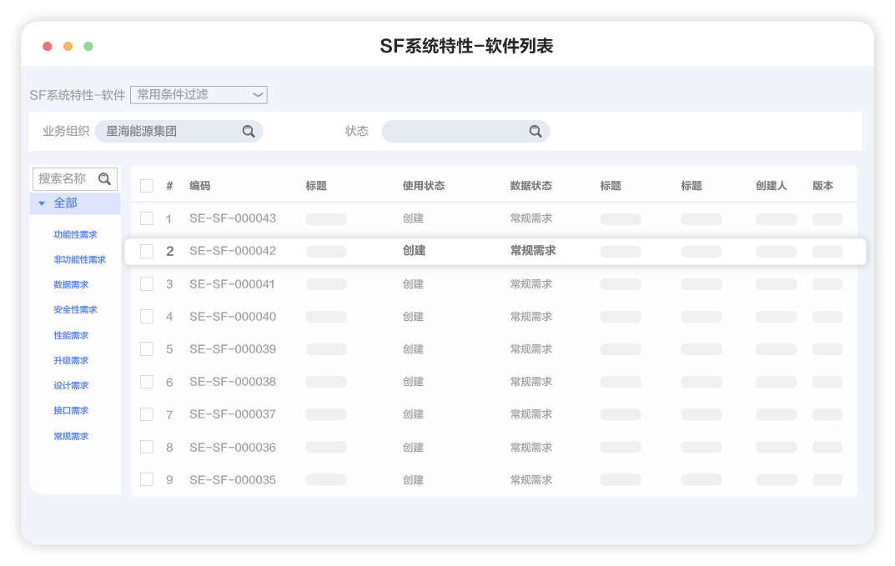

从官方页面可以看到：

- 左侧按需求类型分类；
- 列表对象具有编码、标题、使用状态、数据状态、创建人和版本；
- 需求不是文档中的段落，而是可检索、可版本化的独立记录；
- “数据状态”和“使用状态”分离，有利于区分对象是否有效和是否被产品引用。

### 需求与系统工程如何实现

1. 将每条需求建成独立业务对象；
2. 使用业务类型区分需求类别；
3. 使用父子关系实现需求拆分；
4. 使用关系对象连接架构、BOM 和测试；
5. 使用版本与生命周期控制需求变化；
6. 使用矩阵或反查能力识别未覆盖需求；
7. 使用工作流完成需求评审和基线化。

### 风险

- 若需求颗粒度过细，会产生较高维护成本；
- 公开资料没有证明 RAS 矩阵能自动理解语义关系；
- “AI 自动解析”仍需核实人工复核、错误纠正和责任机制。

---

## 4.3 技术货架与 CBB

### 技术货架解决的问题

- 技术能力散落在项目和个人电脑；
- 同类模块重复开发；
- 技术成熟度不透明；
- 技术预研与产品项目之间没有清晰供给关系。

### 技术货架主要功能

- 技术 Offering；
- CBB 通用模块；
- 技术成熟度；
- 技术路线图；
- 技术预研项目；
- 技术组件和产品 BOM 的复用关系。

### 技术货架如何实现

技术货架本质上是把“可复用技术能力”做成具有以下字段的标准对象：

- 技术编码和名称；
- 适用产品/场景；
- 输入输出和接口；
- 负责人和维护团队；
- 成熟度；
- 验证证据；
- 版本和生命周期；
- 关联项目、文档、BOM 和测试结果。

### 与组织能力供给的差异

技术货架更接近“技术资产供给”，而本方案中的组织能力供给还包括：

- 测试资源；
- 专家咨询；
- 标准规范；
- 样件和实验能力；
- 采购、制造和质量协同能力。

因此可以借鉴其“能力对象化和成熟度管理”，但需要扩展为完整的组织能力目录。

---

## 4.4 研发项目管理

金蝶项目管理是当前公开资料中实现细节最完整的模块。

### 4.4.1 项目结构

项目对象包含：

- 基本信息；
- 甘特图；
- 团队；
- 项目日历；
- 项目资源；
- 输入；
- 输出；
- 配置；
- 相关过程；
- 项目看板；
- 文件夹规划；
- 项目变更。

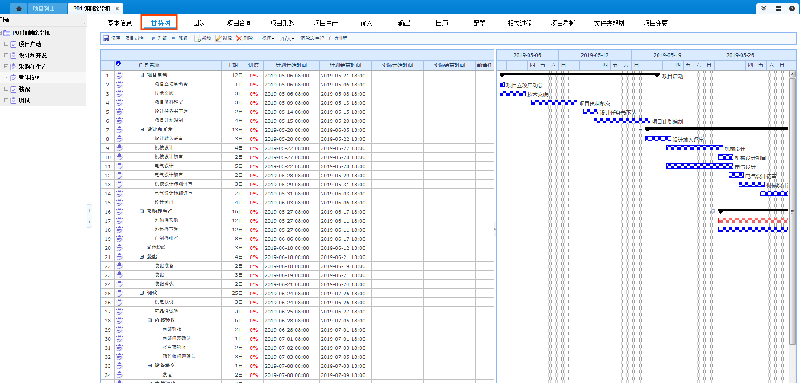

从页面可见，项目通过 WBS 将工作拆成多层任务，记录：

- 工期；
- 进度；
- 计划开始/结束；
- 实际开始/结束；
- 前置任务；
- 时间依赖关系。

### 4.4.2 项目团队与资源

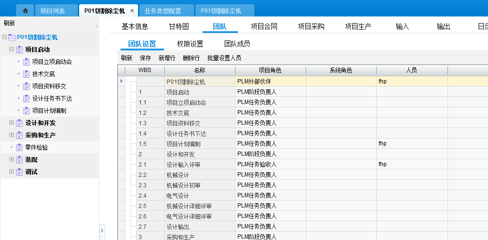

项目团队支持：

- 团队成员；
- 项目角色；
- 任务角色；
- 角色权限；
- 项目阶段权限；
- 成员访问范围；
- 资源负荷。

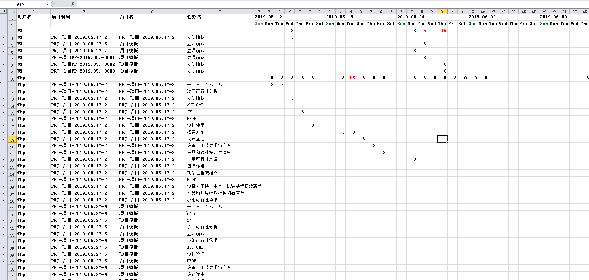

资源负荷通过项目和人员维度查看时间占用，适合项目经理进行资源调配。

### 4.4.3 输入、输出与结束条件

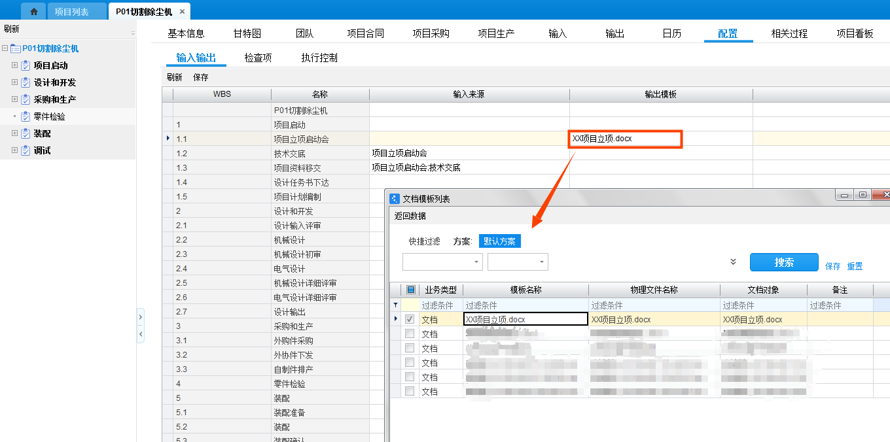

系统可为项目模板或任务定义：

- 输入对象；
- 输出对象；
- 输出业务类型；
- 输出文件夹；
- 输出成果要求；
- 输出是否为结束条件；
- 输入输出对象的访问和修改权限。

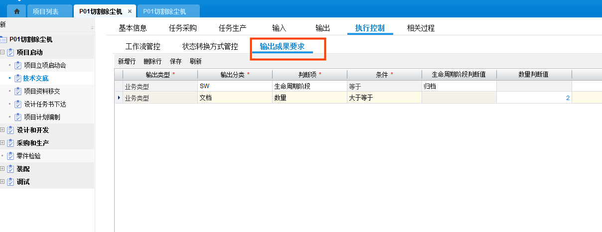

这意味着任务完成不只是“进度改成 100%”，而可以要求指定交付物已经提交、归档或满足条件。

### 4.4.4 检查项和项目看板

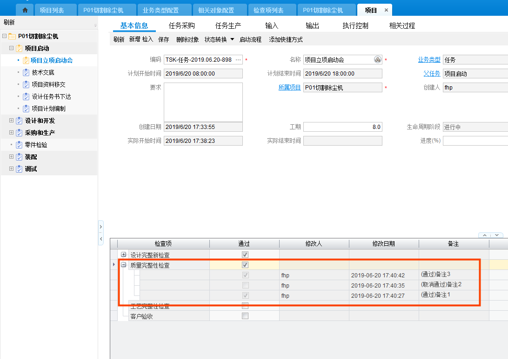

检查项可用于：

- 阶段进入和退出检查；
- 交付物齐套性检查；
- 质量规则检查；
- 任务结束前确认。

成员看板、任务统计、燃尽图和执行情况图用于过程监控。

### 4.4.5 项目变更和基线

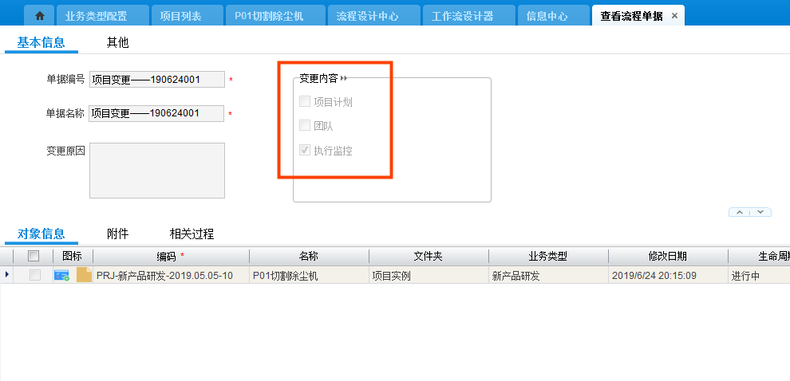

项目启动后，对计划、团队和配置的调整可以通过变更流程进行。

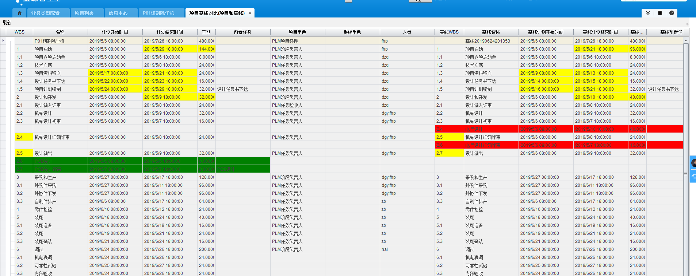

基线对比可识别项目计划前后差异，保留变化历史。

### 对本方案的启示

可直接借鉴：

- 输入、输出和结束条件；
- 任务交付物与业务对象关联；
- 检查项；
- 项目基线和变更记录；
- 项目成员与角色权限。

需要避免：

- 把自主单元重新拆成大量 WBS 任务；
- 用资源负荷和计划完成率代替业务结果；
- 由项目经理集中维护所有计划和变更；
- 所有工作都依赖模板和流程审批。

---

## 4.5 研发评审、测试、问题和风险

### 研发评审

- 评审分类；
- 评审要素；
- DCP/TR；
- 评审报告；
- 评审结论和问题闭环。

### 测试与验证

- 测试方案；
- 测试用例；
- 缺陷；
- 仿真数据；
- 需求与测试结果关联；
- 逐级验证 V 模型。

### 问题与风险

- 问题登记；
- 问题处理；
- 问题关闭；
- 风险转换；
- 问题与风险统计分析。

### 实现特点

这些对象通过项目、需求、架构和 BOM 关系串联，使评审结论、测试证据和风险不再只存在于会议纪要中。

### 与 JP 的关系

金蝶的 DCP/TR 是标准阶段评审；本方案的 JP 可以吸收其评审要素、证据和结论结构，但不应被限定为固定阶段门。

---

## 4.6 文档管理

### 主要能力

- 文件夹和业务类型双视图；
- 文档加密；
- 版本、版次和修改历史；
- 生命周期；
- 文档流程和电子签字；
- 文档与物料、BOM、项目等对象关联；
- 发布、签收和回收；
- 自动升版配置。

### 生命周期实现

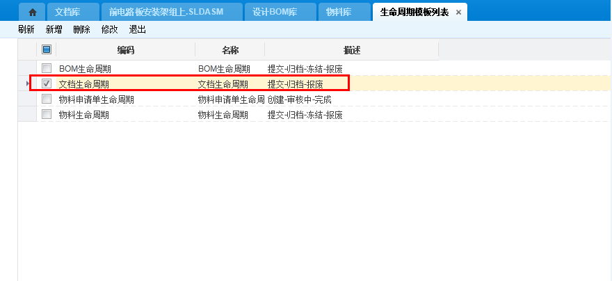

默认逻辑包括：

- 提交：个人工作和可修改阶段；
- 归档：内部定版并可被后续业务使用；
- 发布：向指定范围提供；
- 冻结/报废：控制停止使用；
- 升版：从已归档版本生成新版本并回到提交阶段。

### 文档库

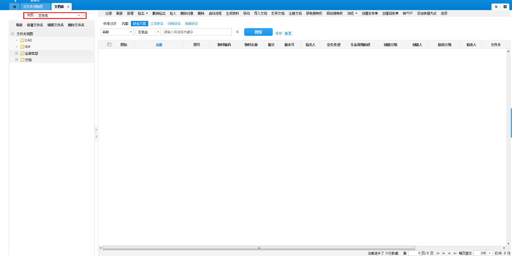

文件夹视图适合按组织习惯和资料目录浏览。

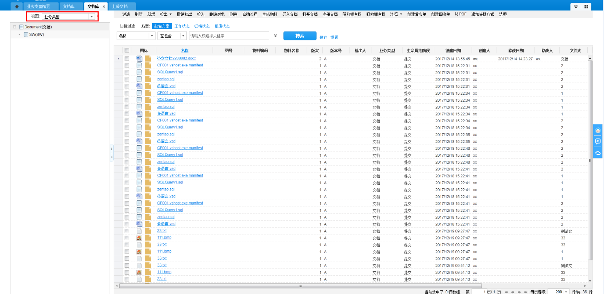

业务类型视图适合按对象类型、字段和状态检索。

### 相关对象

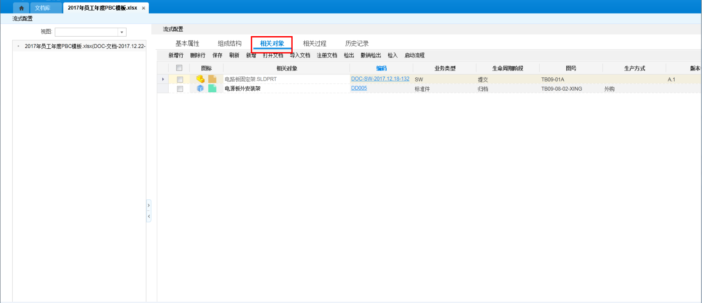

文档可以与物料、BOM、项目、流程和其他文档建立关系，从而支持影响分析和反向追溯。

### 判断

金蝶虽然仍保留文件夹，但核心并不只是文件存储。文档通过业务类型、属性、状态和对象关系进入产品数据网络，这是本方案“从文档到字段化上下文”可借鉴的部分。

---

## 4.7 研发物料和 BOM

### 研发物料

- 物料分类和属性；
- 物料认证和优选；
- 图纸与物料关联；
- 替代料；
- 低成本/优选物料库；
- 研发物料向 ERP 下推。

### BOM 类型

- 系统架构 BOM；
- EBOM；
- PBOM/工艺 BOM；
- 制造 BOM；
- 配置 BOM；
- 超级 BOM；
- 多版本和多视图 BOM。

### BOM 编辑器

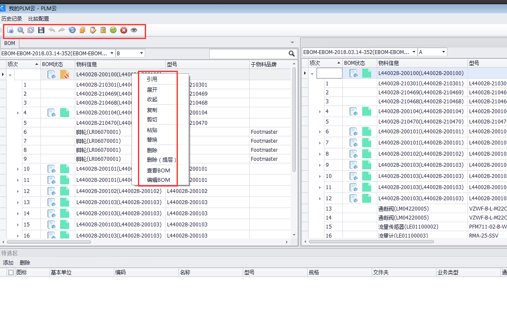

公开页面显示 BOM 编辑器支持：

- 引用；
- 展开和收起；
- 复制、剪切和粘贴；
- 替换；
- 删除和删除提层；
- 查看 BOM；
- 编辑关系属性；
- 左右结构对照。

### BOM 比较

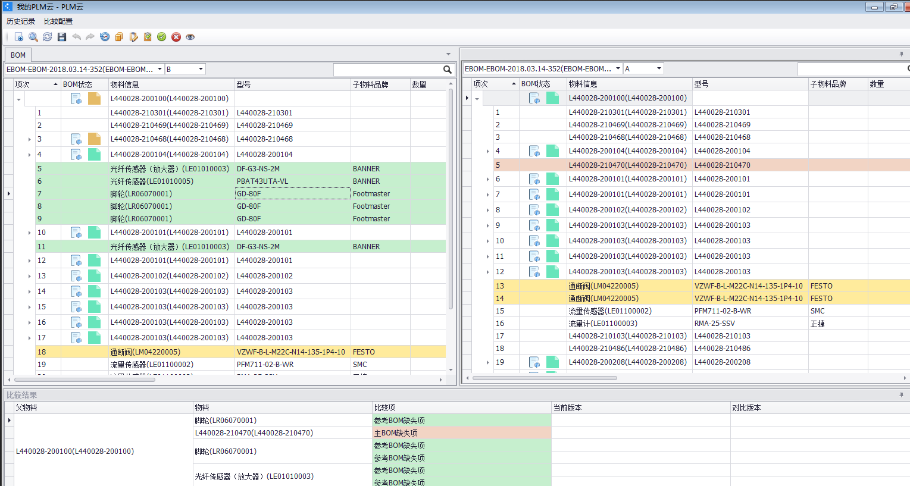

比较能力用于识别不同版本、不同视图或参考 BOM 的结构和属性差异。

### BOM 优选

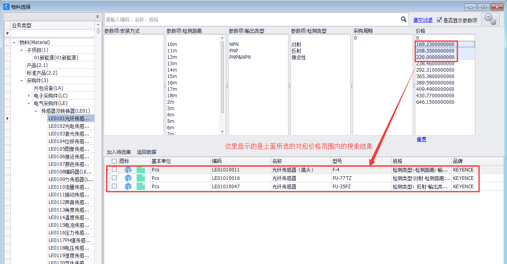

系统可以按分类、参数、价格或其他字段筛选物料，减少重复建码和非优选物料使用。

### BOM 下推

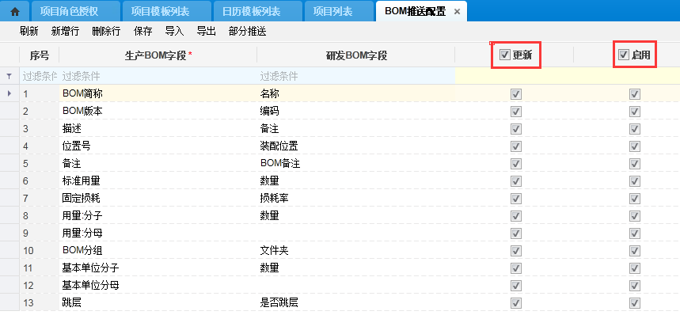

设计 BOM 可以按配置下推到制造和 ERP 领域。下推不是单纯复制文件，而是转换物料、结构和关系属性。

### BOM 如何实现

1. 物料和 BOM 均为独立业务对象；
2. BOM 行保存数量、位号、替代、有效性等关系属性；
3. 通过生命周期控制 BOM 是否允许修改；
4. 通过检入/检出避免多人冲突；
5. 通过版本、版次和基线保留历史；
6. 通过映射规则完成 EBOM/PBOM/制造 BOM 转换；
7. 通过 ERP 同平台或接口把数据传递给采购和制造。

---

## 4.8 CAD/EDA 集成与协同设计

### 支持方式

- CAD/EDA 插件；
- 文件类型配置；
- 图纸字段与 PLM 字段映射；
- 标题栏和明细栏读取；
- 图纸导入、检出和检入；
- 从图纸生成文档、物料和 BOM；
- 图纸与物料/BOM 强关联；
- PDF 自动转换；
- Top-Down 三维协同设计。

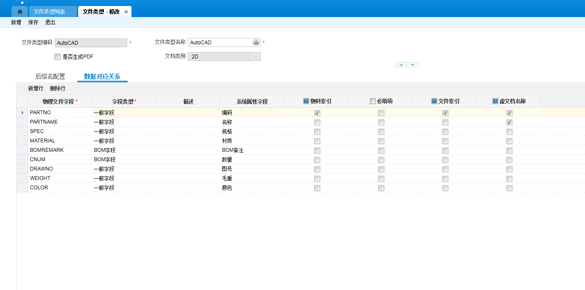

页面展示了 CAD 物理字段与 PLM 字段之间的映射，包括：

- 编码；
- 名称；
- 规格；
- 材质；
- BOM 备注；
- 数量；
- 图号；
- 重量；
- 颜色。

### 从设计工具到产品数据的实现链

1. 为 CAD 文件类型配置后缀和属性字段；
2. 为文档业务类型关联 CAD 文件类型；
3. 工程师在 CAD 中填写或提取属性；
4. 插件读取图纸结构和属性；
5. 导入 PLM 文档库；
6. 按物料索引匹配已有物料；
7. 未匹配时创建物料；
8. 根据装配结构生成 BOM；
9. 建立图纸—文档—物料—BOM 关系；
10. 后续通过检入检出和工程变更控制更新。

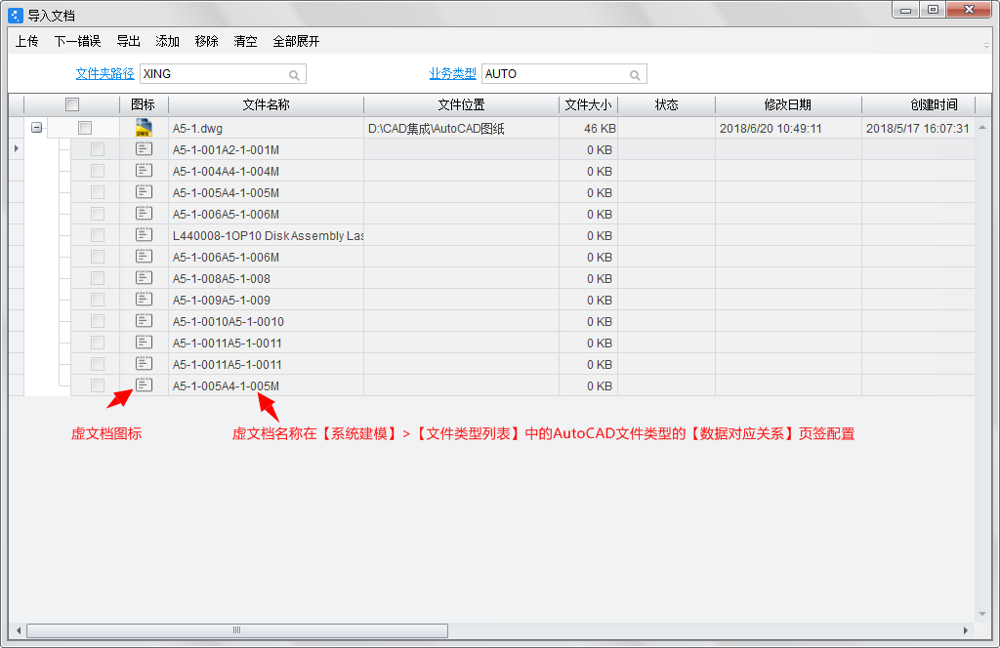

### 对本方案的价值

这是金蝶最成熟、最工程化的能力之一。本方案无需重新建设 CAD、物料和 BOM 管理，可以通过集成引用这些对象，把它们作为解耦单元的输入、输出和验收证据。

---

## 4.9 工程变更管理

### 对象模型

- PR：问题报告；
- ECR：变更申请；
- ECO：变更任务/执行；
- ECN：变更通知；
- 变更对象；
- 影响对象；
- 协助任务；
- 生效和下推记录。

### 变更申请

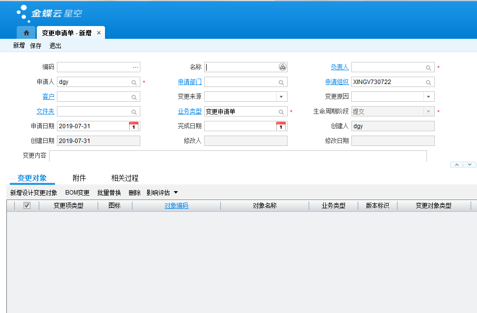

申请单包含：

- 编码和名称；
- 申请人、部门和组织；
- 负责人；
- 客户；
- 变更来源和原因；
- 生命周期阶段；
- 完成日期；
- 变更内容；
- 变更对象；
- 附件和相关过程。

### 影响评估

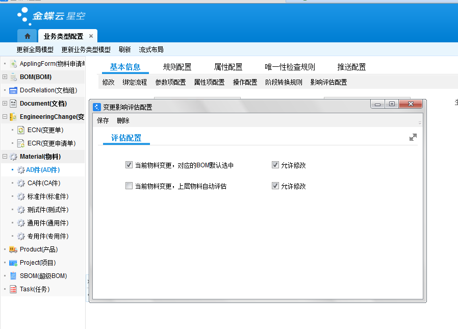

系统通过对象关系和规则反查：

- 关联文档；
- 关联物料；
- 上层 BOM；
- 下游工艺；
- ERP 中的在途、在制和库存；
- 需要升版或同步变更的对象。

### 变更执行

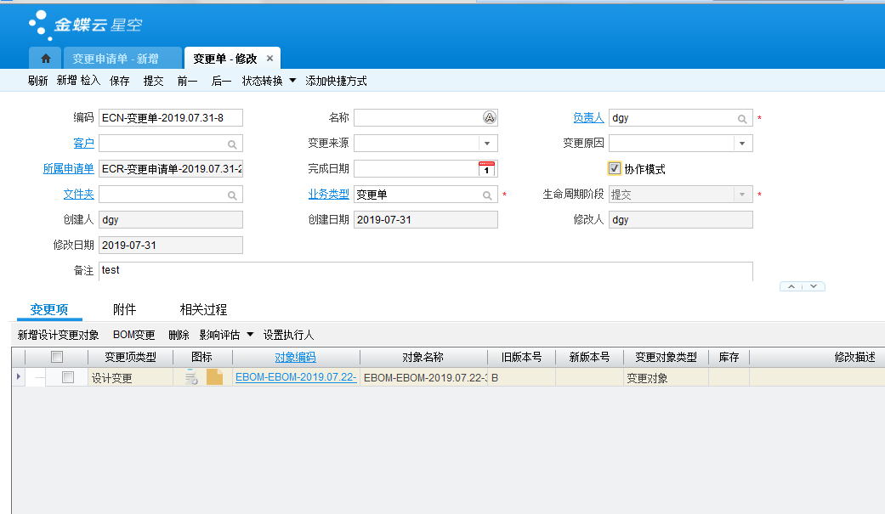

变更单用于把已批准的申请转换为可执行任务，并指定责任人、变更对象和结果。

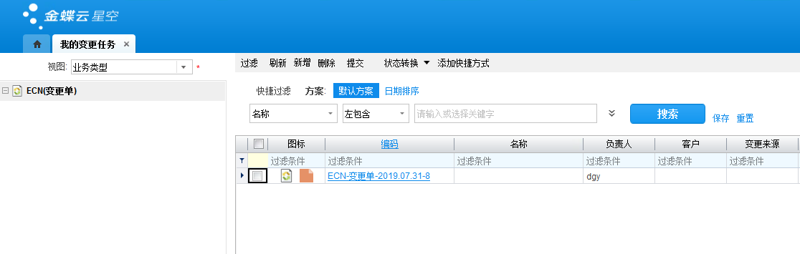

个人通过“我的变更任务”接收需要执行的对象修改。

### 生效与下推

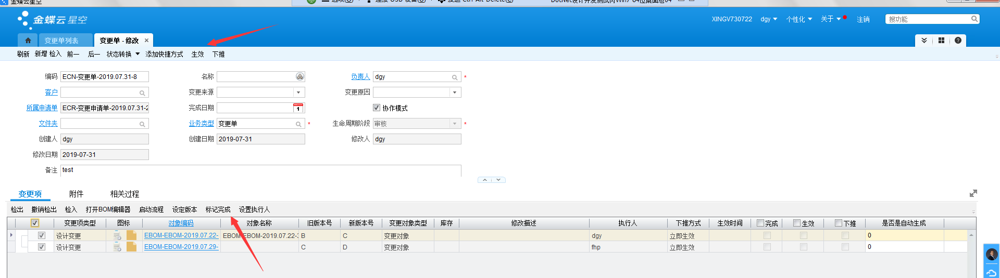

变更完成后，修改后的物料、BOM 和其他对象可以生效并向下游系统传递。

### 实现逻辑

1. ECR 记录为什么变；
2. 影响分析确定变什么、影响谁；
3. 审批决定是否执行；
4. ECO 将对象修改分配给责任人；
5. 对象检出、修改、升版并重新归档；
6. ECN 通知受影响部门；
7. 生效后下推 ERP/MES；
8. 所有过程保留审计记录。

### 工程变更与本方案的关系

金蝶的工程变更是“产品数据变更闭环”，本方案需要的是更广义的“解耦单元调整机制”。可以复用其影响分析和责任任务模型，但需覆盖范围、依赖、JP、资源和主责人变更。

---

## 4.10 基线、配置和产品变型

### 基线

- 产品基线；
- 项目基线；
- 基线数据包；
- 基线创建；
- 基线比较。

基线用于在某一时点冻结需求、计划、文档、BOM 或其他对象集合，为评审、发布和变更提供比较依据。

### 选配与超级 BOM

- 配置字典；
- 配置集合；
- 选配项；
- 配置规则；
- 配置 BOM；
- 从超级 BOM 生成具体产品 BOM。

### 与知识解耦的启示

基线可以作为 JP 的验收快照；配置规则可以支持多个解耦方案的组合，但不能替代团队对依赖和结果的业务判断。

---

## 4.11 AI 与研发知识管理

官方宣称 AI 能力覆盖：

- 市场需求提取和分析；
- 项目策划；
- 项目风险识别；
- 三维模型查重；
- 设计复用推荐；
- 研发知识问答和答案溯源；
- 智能工艺路线生成；
- 变更影响分析和供应链/成本建议。

### 实现基础

AI 并不是独立于 PLM 的聊天机器人，而是建立在以下结构化数据之上：

- 需求对象；
- 项目计划和状态；
- 文档和知识库；
- 物料和 BOM；
- 工艺路线；
- 变更历史；
- ERP 库存、采购和成本数据。

### 需要验证

- AI 输出能否定位到来源对象和版本；
- AI 建议是否参与正式审批；
- 需求拆分和影响分析的准确率；
- 企业私有数据如何隔离；
- 模型能力是内置、可选还是需要额外采购；
- AI 是否真正写回结构化字段，而不只是生成文本。

---

## 5. 关键业务流程

## 5.1 从市场需求到测试验证

市场信息 → 市场需求 → 产品需求 → 系统特性 → 功能/物理架构 → 系统架构 BOM → EBOM → 测试用例 → 测试结果 → 需求验证关闭。

系统通过对象编码、父子关系、版本、状态和 RAS 关系矩阵保持追溯。

## 5.2 从产品规划到项目交付

产品路标 → 产品版本 → 立项 → 项目模板 → WBS/甘特图 → 团队与资源 → 输入/输出 → 检查项 → TR/DCP → 基线 → 发布。

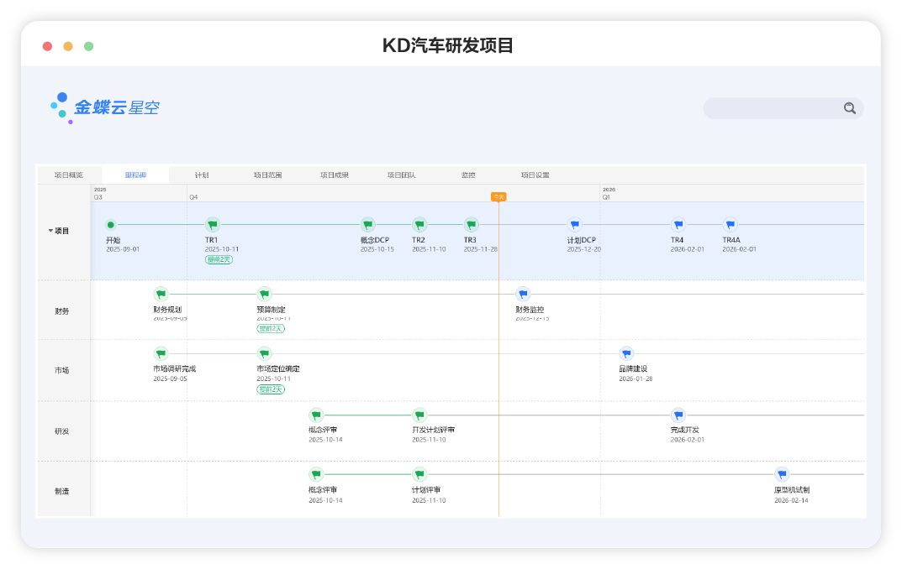

官方图显示项目按 IPD 阶段运行，并将项目、财务、市场、研发和制造角色放在同一时间轴上。

## 5.3 从 CAD 到制造

CAD/EDA 设计 → 属性提取 → 文档入库 → 物料匹配/创建 → EBOM 生成 → 工艺补充 → PBOM/制造 BOM → ERP/MES → 采购与生产。

## 5.4 从问题到变更关闭

问题/需求变化 → ECR → 影响分析 → 评审 → ECO → 对象修改与升版 → ECN → 下游生效 → 关闭。

---

## 6. 金蝶如何把功能“做出来”

金蝶 PLM 的关键不只是模块数量，而是统一实现框架。

### 6.1 业务类型

需求、文档、物料、BOM、项目和变更均可按业务类型区分。业务类型承载：

- 属性字段；
- 编码规则；
- 生命周期；
- 版本规则；
- 可执行操作；
- 工作流；
- 权限；
- 文件夹；
- 对象关系。

### 6.2 生命周期

每种业务对象可配置状态和状态转换，例如：

- 创建；
- 提交；
- 归档；
- 发布；
- 冻结；
- 报废。

不同状态决定对象是否可修改、可引用、可发布和可下推。

### 6.3 工作流

工作流负责：

- 审批；
- 状态转换；
- 任务分配；
- 消息通知；
- 电子签字；
- 生效；
- 下游推送。

### 6.4 对象关系

系统的“数字线程”主要通过关系实现：

- 需求—需求；
- 需求—架构；
- 需求—BOM；
- 需求—测试；
- 文档—物料；
- 物料—BOM；
- BOM—工艺；
- 项目—任务；
- 任务—交付物；
- 变更—影响对象。

### 6.5 权限

权限同时受以下因素控制：

- 组织；
- 用户；
- 角色；
- 项目；
- 文件夹；
- 业务类型；
- 生命周期阶段；
- 对象操作。

### 6.6 与 ERP 同源

金蝶的核心优势不是单独 PLM 功能最深，而是研发对象可与采购、库存、制造、成本和财务数据在同一平台或同一厂商体系内衔接。

---

## 7. 与研发知识解耦方案的对照

### 7.1 可直接借鉴

- 需求、架构、BOM、测试的结构化对象和关系；
- 技术货架/CBB；
- 任务输入、输出、结束条件；
- 检查项和验收证据；
- 基线与差异比较；
- 影响分析和变更闭环；
- 角色权限；
- 文档、物料和 BOM 的版本控制；
- CAD/ERP/MES 集成。

### 7.2 需要改造后借鉴

- 项目模板：改为解耦单元模板，而不是完整 WBS 模板；
- 项目角色：突出主责人的自主决策权限；
- 项目计划：由强时间排程改为依赖、承诺和 JP；
- 技术货架：扩展为组织能力货架；
- DCP/TR：允许业务按风险和依赖定义 JP；
- 项目变更：扩展为范围、依赖、资源和验收方式调整。

### 7.3 不建议照搬

- 过度依赖项目经理统一拆任务；
- 以甘特图和资源负荷作为主要控制手段；
- 通过大量审批保证协同；
- 要求所有团队采用同一颗粒度的 WBS；
- 把流程合规等同于结果有效；
- 在试点早期一次性建设完整 PLM。

### 7.4 竞争判断

金蝶 AI PLM 已经覆盖本方案大量“数字化能力”，因此本方案如果只做：

- 字段化项目知识库；
- 任务和文档关联；
- 流程、状态和看板；
- 技术知识库；

将很容易与现有 PLM 同质化。

本方案真正需要坚持的差异化是：

1. 解耦单元是可独立验收的业务结果，不是 WBS 任务；
2. 主责人拥有范围、资源、路径和验证方式的自主权；
3. 组织能力以服务形式被调用，而不是只展示人员资源；
4. 工作网由真实依赖生成，而不是由统一计划分解；
5. JP 由风险、依赖和集成需要决定，不固定为 IPD 阶段门；
6. 数字化服务于自治和上下文连续，而不是加强中心控制。

---

## 8. 建议进一步实机验证的页面

若要完成选型级调研，应向金蝶申请演示，并要求现场操作以下场景，而不是只看 PPT：

1. 从一条市场需求创建产品需求并拆分系统需求；
2. 查看需求—架构—BOM—测试 RAS 矩阵；
3. 将一个技术组件发布到技术货架并标记成熟度；
4. 从技术货架复用 CBB 到新产品；
5. 建立项目并配置跨职能团队；
6. 为任务设置输入、输出和结束条件；
7. 不依赖项目经理，由任务负责人修改执行路径；
8. 通过 CAD 图纸生成物料和 EBOM；
9. 将 EBOM 转换为 PBOM 并下推 ERP；
10. 发起 ECR 并查看对在途、在制、库存的影响；
11. 完成 ECO 后查看所有对象升版和通知记录；
12. 通过 AI 解析需求并检查来源、置信度和人工修正；
13. 对项目建立基线并比较变更前后差异；
14. 查看多组织、多产品线和供应商协作权限；
15. 展示移动端和个人任务工作台。

---

## 9. 最终判断

金蝶 AI PLM 的优势：

- 功能覆盖面广，已从 PDM 延伸到 IPD 和系统工程；
- 项目、文档、物料、BOM、变更的数据对象完整；
- 与金蝶 ERP、供应链、制造、成本和财务连接较强；
- 元数据和工作流配置能力成熟；
- CAD/EDA、BOM 和工程变更具备较具体的落地机制；
- 技术货架、系统工程和 AI 方向与研发知识解耦高度相关。

金蝶 AI PLM 的局限：

- 核心仍是流程驱动和中心化项目治理；
- 项目执行依赖 WBS、甘特图、资源和权限配置；
- 对“团队如何获得自主权”缺少明确机制；
- 组织能力主要表现为资源、知识和系统模块，不是可按需调用的服务；
- 公开资料中的新一代功能远多于可观察的最新实机证据；
- 全量实施复杂度和治理成本可能较高。

对本方案最合理的策略不是与金蝶全面竞争，而是：

- 将金蝶视为产品数据、BOM、CAD、ERP 和变更底座；
- 在其上层或旁路建设解耦单元、主责人自治、组织能力服务、工作网和灵活 JP；
- 通过接口引用金蝶对象和状态，避免重复建设成熟 PLM 能力；
- 在 PD 试点中先验证协作机制，再决定是否深度集成。

---

## 10. 资料来源

### 当前产品资料

- [金蝶 AI PLM 官方产品页](https://www.kingdee.com/products/galaxy_plm.html)
- [金蝶全球 PLM 产品页](https://www.kingdee.com/sg/zh-hans/product/plm/)
- [金蝶 PLM 平台构建指南](https://www.kingdee.com/resources/articles/1433117299120022529)
- [金蝶 RASIC 矩阵说明](https://www.kingdee.com/resources/articles/1409916648697243777)

### 官方产品手册

- [项目管理](https://help.open.kingdee.com/dokuwiki_std/doku.php?id=%E9%A1%B9%E7%9B%AE%E7%AE%A1%E7%90%86)
- [文档管理](https://help.open.kingdee.com/dokuwiki_std/doku.php?id=%E6%96%87%E6%A1%A3%E7%AE%A1%E7%90%86)
- [设计 BOM 管理](https://help.open.kingdee.com/dokuwiki_std/doku.php?id=%E8%AE%BE%E8%AE%A1bom%E7%AE%A1%E7%90%86)
- [设计变更管理](https://help.open.kingdee.com/dokuwiki_std/doku.php?id=%E8%AE%BE%E8%AE%A1%E5%8F%98%E6%9B%B4%E7%AE%A1%E7%90%86)
- [AutoCAD 集成](https://help.open.kingdee.com/dokuwiki_std/doku.php?id=autocad%E9%9B%86%E6%88%90)
- [SolidWorks 集成](https://help.open.kingdee.com/dokuwiki_std/doku.php?id=solidworks%E9%9B%86%E6%88%90)
- [超级 BOM 管理](https://help.open.kingdee.com/dokuwiki_std/doku.php?id=%E8%B6%85%E7%BA%A7bom%E7%AE%A1%E7%90%86)

### 社区与补充资料

- [金蝶云星空 PLM 产品培训汇总](https://vip.kingdee.com/article/8768)
- [金蝶云星空 PLM 常见业务流程](https://vip.kingdee.com/article/202809624695450368)

> 注意：金蝶云社区部分详细内容需要登录。本报告未使用需要账号登录后才能获取的非公开页面。
